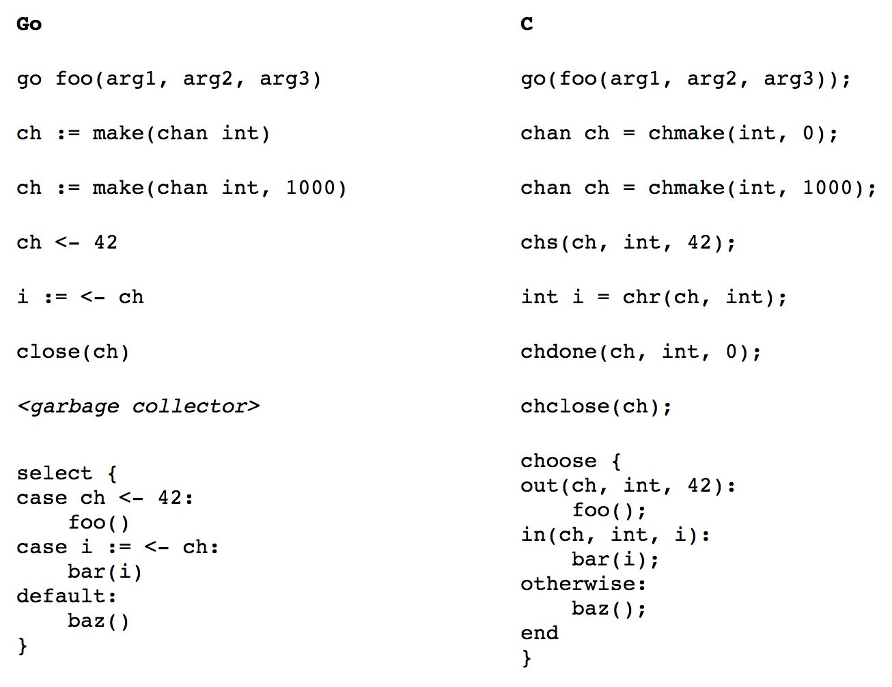

### 1 libmill简介

**libmill**是一个面向c语言的协程库，其下载地址、文档可以在这里找到：[libmill](http://libmill.org/)， 其源代码托管在github上，点击这里查看：[libmill-source](https://github.com/sustrik/libmill)。

### 2 libmill vs goroutine

libmill协程库是基于goroutine移植的，libmill的api友好，与golang中的api非常接近，如下图所示。

虽然二者api比较一致，但是在实现上还是有较大区别，所以这里说“**libmill是goroutine风格的协程库**”只是api上接近。

- 在libmill里面所有的协程调度都是在当前线程中的
也就是说一个单线程程序使用了libmill实现的协程，并且协程执行过程中使用了阻塞的系统调用，这样会阻塞整个进程。
- goroutine中创建的协程会被分摊到多个物理线程上去执行
goroutine中创建的协程，一个协程中使用了阻塞的系统调用只会阻塞当前线程，并不会阻塞进程中的其他线程运行。

    >备注：这里需要注意下，linux下的线程库有两个，比较早的是LinuxThreads线程库，现在用的一般都是Native POSIX Threads Library（nptl），也就是pthread线程库。其中LinuxThreads是用户级线程库，创建的线程内核无感知，调度也是用户态线程调度器自己实现的；而pthread线程库创建的线程都是一个LWP进程，它使用sys_clone()并传递CLONE_THREAD选项来创建一个线程（本质上还是LWP）并且线程所属进程id相同。

### 3 libmill源码分析

下面是libmill的工程结构，结合libmill中包含的文件进行详细描述。

|目录结构|描述|
|:---------|:-----|
|libmill/|
|==作者、版权、配置、构建脚本==|
|├── AUTHORS|作者信息|
|├── README.md|工程介绍|
|├── COPYING|版权信息|
|├── abi_version.sh|[ABI](https://en.wikipedia.org/wiki/ABI)版本信息|
|├── package_version.sh|工程版本信息|
|├── autogen.sh|自动化构建脚本|
|├── CMakeLists.txt ├── cmake │   └── Config.cmake.in|CMake配置文件|
|├── Makefile.am|Automake配置文件|
|├── configure.ac|Autoconf配置文件|
|├── m4|M4配置文件|
|├── libmill.pc.in|
|==核心代码==|
|├── libmill.h|libmill头文件|
|├── debug.c ├── debug.h|调试函数|
|├── chan.c ├── chan.h|channel|
|├── cr.c ├── cr.h|协程coroutine|
|├── file.c|
|├── ip.c ├── ip.h|
|├── poller.c ├── poller.h ├── kqueue.inc ├── epoll.inc ├── poll.inc|io多路复用|
|├── mfork.c|协程创建|
|├── tcp.c ├── udp.c ├── unix.c|tcp、udp、unix套接字|
|├── timer.c ├── timer.h|定时器|
|├── utils.h|常用工具方法|
|├── ssl.c|ssl支持|
|├── dns │   ├── dns.c │   └── dns.h|dns解析|
|==链表、栈等数据结构==|
|├── slist.c ├── slist.h|单向链表|
|├── list.c ├── list.h|双向链表|
|├── stack.c ├── stack.h|栈|
|==以下为测试代码==|
|├── tests │   ├── cert.pem │   ├── chan.c │   ├── choose.c │   ├── cls.c │   ├── example.c │   ├── fdwait.c │   ├── file.c │   ├── go.c │   ├── ip.c │   ├── key.pem │   ├── mfork1.c │   ├── mfork2.c │   ├── mfork3.c │   ├── overload.c │   ├── signals.c │   ├── sleep.c │   ├── ssl.c │   ├── tcp.c │   ├── udp.c │   └── unix.c|工程测试代码|
|├── perf │   ├── c10k.c │   ├── chan.c │   ├── chr.c │   ├── chs.c │   ├── ctxswitch.c │   ├── go.c │   └── whispers.c|工程性能测试代码|
|├── tutorial │   ├── cert.pem │   ├── key.pem │   ├── step1.c │   ├── step2.c │   ├── step3.c │   ├── step4.c │   ├── step5.c │   ├── step6.c │   ├── step7.c └   └── step8.c|工程示例代码|

### 4 总结

上面是libmill的简单介绍，下面开始详细介绍了。

