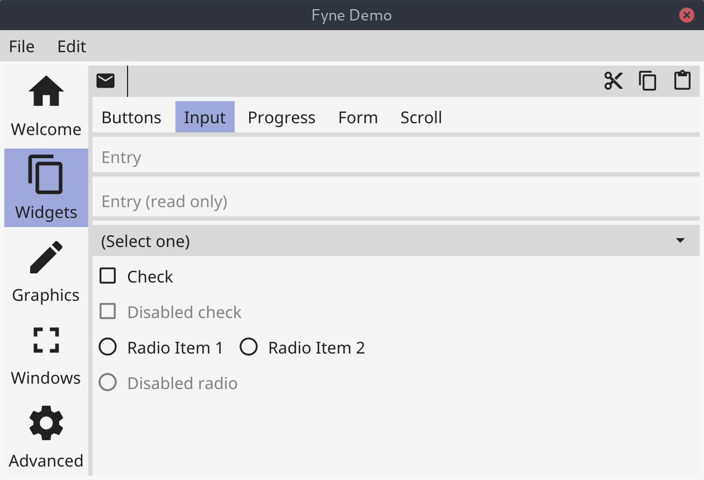

fyne，是基于golang开发的gui库，它使用go-gl和go-glfw进行图像绘制，已在不同的平台上绘制一样的图形效果。

fyne，目前release最新版本是1.1，现在已经支持了不少的组件、效果、主题、事件操作等，基本可用，是目前为止看到的最符合个人需求的go gui库。

下面是fyne项目释放出的两个效果图，对应的代码也在项目demo中有提供，详见：https://github.com/fyne-io/fyne/cmd/fyne-demo。

除了官方提供的demo以外，有不少开发者也分享了基于fyne构建的一些应用程序，详见：https://github.com/fyne-io/examples，供自己学习、参考也非常不错。