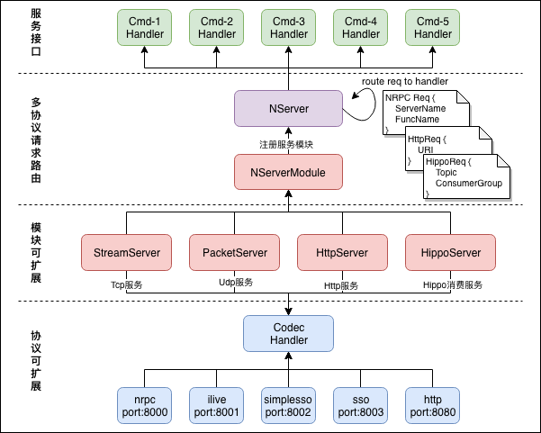

# GoNeat Design

GoNeat，追求“小而美”的设计，是基于golang开发的面向后台开发的微服务框架，旨在提升后台开发效率，让大家摆脱各种琐碎的细节，转而更加专注于服务质量本身。Simple but Powerful，是GoNeat的不懈追求，也是我们始终追求的设计理念。

本文从整体上介绍GoNeat的设计，希望能让大家从全局上认识GoNeat是如何运行的，运行期间涉及到哪些处理流程，处理读者对某部分感兴趣，可以自行阅读对应部分的源码，或者与我们开发者交流，都是可以的。

## GoNeat整体架构

下图展示了GoNeat的整体架构设计，为了能简单直观地介绍GoNeat的整体工作流程，在下图中省略了部分细节。省略掉的部分细节也是比较重要的，我会提到它们，篇幅原因不会过多描述。



GoNeat整体架构设计中，包括如下核心组成部分:

- NServer，代表一个GoNeat服务，一个NServer可以插入多个NServerModule；
- NServerModule，代表一个服务模块，其实现包括StreamServer、PacketServer、HttpServer、HippoServer；
- Codec Handler，代表一个协议Handler，其实现包括nrpc、ilive、simplesso、sso、http等编码的协议Handler；
- 不同port上可以分别提供不同协议的服务，如8000端口提供tcp/udp的nrpc服务，而8080提供http服务；
- 不同port上到达的请求，经协议Handler解析出请求报文，并根据请求报文中的命令字，找到注册的CmdHandler；
- NServer将请求以函数参数的形式递交给注册的CmdHandler处理，处理完毕返回结果给调用方；

介绍完框架的核心组件及作用之后，下面结合一个示例服务的执行流程，介绍下服务启动、处理请求、服务退出的详细流程及设计细节。

## GoNeat服务示例

我们仍然使用“*test_nrpc.proto*”作为示例服务pb：

```protobuf
	syntax = "proto2";
	package test_nrpc;

	// BuyApple
	message BuyAppleReq {
			optional uint32 num = 1;
	};

	message BuyAppleRsp {
			optional uint32 errcode = 1;   
			optional string errmsg = 2;
	};

	// SellApple
	message SellAppleReq {
			optional uint32 num = 1;
	};

	message SellAppleRsp {
			optional uint32 errcode = 1;   
			optional string errmsg = 2;
	};

	// service test_nrpc
	service test_nrpc {
			rpc BuyApple(BuyAppleReq) returns(BuyAppleRsp);     // CMD_BuyApple
			rpc SellApple(SellAppleReq) returns(SellAppleRsp);  // CMD_SellApple
	}
```

使用gogen来创建一个新的go-neat服务：

```bash
gogen create -protocol=nrpc -protofile=test_nrpc.proto -httpon
```

与“*Program Your Next Server in GoNeat*”一问不同的是，这里多加了一个参数“*-httpon*”，目的是介绍多协议的处理细节。运行上述命令后，应生成如下目录结构的服务模板。

```bash
test_nrpc
├── Makefile
├── README.md
├── client
│   └── test_nrpc_client.go
├── conf
│   ├── log.ini
│   ├── monitor.ini
│   ├── service.ini
│   └── trace.ini
├── deploy.ini
├── log
└── src
    ├── exec
    │   ├── exec_test_nrpc.go
    │   ├── exec_test_nrpc_impl.go
    │   └── exec_test_nrpc_init.go
    └── test_nrpc.go

5 directories, 12 files

```

## GoNeat设计细节

### 服务初始化

#### 初始化：配置加载

GoNeat框架读取的配置文件，包括：

1. service.ini，包括框架核心配置项，以及rpc相关配置项，也添加自定义配置项：

   **[service]** 框架核心配置项：

   - 日志相关：日志级别，保留日志文件数量，单日志文件的大小；

   - 性能相关：允许的最大入tcp连接数，允许的最大并发请求数，

   - 内存调优：workerpool允许创建最大协程数，udp收包buffer大小；

   - 服务质量：服务接口的超时时间，处理请求时进行全局超时控制；

   - 服务名称：分布式跟踪时用于追踪span节点；

     ```ini
     [service]
     name = test_nrpc               			 #服务名称
     
     log.level = 1                        #框架日志级别,0:DEBUG,1:INFO,2:WARN,3:ERROR
     log.size = 64MB                      #日志文件大小,默认64MB,可以指定单位B/KB/MB/GB
     log.num = 10                         #日志文件数量,默认10个
     
     limit.reqs = 100000                  #服务允许最大qps
     limit.conns = 100000                 #允许最大入连接数
     
     workerpool.size = 20000              #worker数量
     udp.buffer.size = 4096               #udp接收缓冲大小(B),默认1KB,请注意收发包尺寸
     
     BuyApple.cmd.timeout = 5000          #服务接口BuyApple超时时间(ms)
     SellApple.cmd.timeout = 5000         #服务接口SellApple超时时间(ms)
     ```

   **[habo]** 哈勃监控配置项：

    -  是否启用哈勃监控；

    -  申请的dcid，dc上报数据同步到habo；

    -  dc上报测试环境，还是线上环境；

       ```ini
       [habo]
       enabled = true                       #是否开启模调上报
       caller = content_strike_svr          #主调服务名称
       dcid = dc04125                       #罗盘id
       env = 0                              #0:现网(入库tdw), 1:测试(不入库tdw)
       ```

   **[nrpc-service]** 协议handler配置项：

    -  nrpc协议handler监听的tcp端口；

    -  nrpc协议handler监听的udp端口；

       ```ini
       [nrpc-service]
       tcp.port = 8000                      #tcp监听端口
       udp.port = 8000                      #udp监听端口
       ```

   **[http-service]** 协议http配置项：

   - http协议监听的端口；

   - http请求URL前缀；

     ```ini
     [http-service]
     http.port = 8080                     #监听http端口
     http.prefix = /cgi-bin/web           #httpUrl前缀
     ```

   **[rpc-test_nrpc]** rpc配置项：

    -  rpc调用地址，支持ip://ip:port、l5://mid:cid、cmlb://appid（服务发现能力正在开发验证中）

    -  传输模式，支持UDP、UDP全双工、TCP短连接、TCP长连接、TCP全双工，TCP/UDP SendOnly

    -  rpc超时时间，包括默认的timeout以及细化到各个接口的超时时间；

    -  rpc监控monitorid，包括总请求、成功、失败、耗时分布monitor id；

       ```ini
       [rpc-test_nrpc]
       addr = ip://127.0.0.1:8000           #rpc调用地址
       proto = 3                            #网络传输模式,
                                            #1:UDP,
                                            #2:TCP_SHORT,
                                            #3:TCP_KEEPALIVE,
                                            #4:TCP_FULL_DUPLEX,
                                            #5:UDP_FULL_DUPLEX,
                                            #6:UDP_WITHOUT_RECV
       timeout = 1000                       #rpc全局默认timeout
       BuyApple.timeout = 1000              #rpc-BuyApple超时时间(ms)
       SellApple.timeout = 1000             #rpc-SellApple超时时间(ms)
       
       monitor.BuyApple.timecost10 		= 10001 		#耗时<10ms
       monitor.BuyApple.timecost20 		= 10002			#耗时<20ms
       monitor.BuyApple.timecost50 		= 10003			#耗时<50ms
       monitor.BuyApple.timecost100 		= 10004			#耗时<100ms
       ...
       monitor.BuyApple.timecost2000 		= 10005		#耗时<2000ms
       monitor.BuyApple.timecostover2000 = 10006		#耗时>=2000ms
       ...
       ```

2. monitor.ini，用于监控服务接口本身的总请求量、处理成功、处理失败量，以及处理耗时分布情况：

   **[test_nrpc]** 服务接口本身监控打点monitor id：

   ```ini
   [test_nrpc]
   
   #服务接口-BuyApple
   monitor.BuyApple.timecost10=0                #接口BuyApple延时10ms
   monitor.BuyApple.timecost20=0                #接口BuyApple延时20ms
   monitor.BuyApple.timecost50=0                #接口BuyApple延时50ms
   ...
   monitor.BuyApple.timecost2000=0              #接口BuyApple延时2000ms
   monitor.BuyApple.timecost3000=0              #接口BuyApple延时3000ms
   monitor.BuyApple.timecostover3000=0          #接口BuyApple延时>3000ms
   
   
   #服务接口-SellApple
   monitor.SellApple.timecost10=0                #接口SellApple延时10ms
   monitor.SellApple.timecost20=0                #接口SellApple延时20ms
   monitor.SellApple.timecost50=0                #接口SellApple延时50ms
   ...
   monitor.SellApple.timecost2000=0              #接口SellApple延时2000ms
   monitor.SellApple.timecost3000=0              #接口SellApple延时3000ms
   monitor.SellApple.timecostover3000=0          #接口SellApple延时>3000ms
   ```

3. log.ini，代替service.ini中logging相关配置，用来支持工厂模式获取logger：

   这里默认配置了三个logger：

   - 框架处理日志log，go_neat_frame.log，最多保留5个日志文件，单文件上限100MB，写满则滚动；
   - 框架请求流水log，go_neat_access.log，最多保留5个日志文件，单文件无上限，按天滚动；
   - 默认log，default.log，最多保留5个日志文件，单文件上限100MB，写满则滚动；

   ```ini
   #框架内部日志
   [log-go_neat_frame]
   level = 1                       #日志级别,0:DEBUG,1:INFO,2:WARN,3:ERROR
   logwrite = rolling
   logFileAndLine = 1
   rolling.filename = go_neat_frame.log
   rolling.type = size
   rolling.filesize = 100m
   rolling.lognum = 5
   
   #框架流水日志
   [log-go_neat_access]
   level = 1                      #日志级别,0:DEBUG,1:INFO,2:WARN,3:ERROR)
   logwrite = rolling
   logFileAndLine = 0
   rolling.filename = go_neat_access.log
   rolling.type = daily
   rolling.lognum = 5
   
   #服务默认日志
   [log-default]
   level = 1                     #日志级别,0:DEBUG,1:INFO,2:WARN,3:ERROR)
   logwrite = rolling
   logFileAndLine = 0
   rolling.filename = default.log
   rolling.type = size
   rolling.filesize = 100m
   rolling.lognum = 5
   ```

4. trace.ini，用于分布式跟踪相关的配置：

   GoNeat框架通过opentracing api支持分布式跟踪，支持三种backend实现，zipkin、jaeger、天机阁：

   - **[zipkin]** 配置

     ```ini
     [zipkin]
     enabled = true                                              #是否启用zipkin trace
     service.name = test_nrpc                                    #当前服务名称(span endpoint)
     service.addr = *:8000                                       #当前服务地址(span endpoint)
     collector.addr = http://9.24.146.130:8080/api/v1/spans      #zipkin collector接口地址
     traceId128bits = true                                       #是否启用128bits traceId
     ```

   - **[jaeger]** 配置

     ```ini
     [jaeger]
     enabled = false                                             #是否启用jaeger trace(暂未验证兼容性)
     service.name = test_nrpc                                    #当前服务名称(span endpoint)
     service.addr = *:8000                                       #当前服务地址(span endpoint)
     collector.addr = http://9.24.146.130:8080/api/v1/spans      #jaeger collector接口地址
     traceId128bits = true                                       #是否启用128bits traceId
     ```

   - **[天机阁]** 配置

     ```ini
     [tianjige]
     enabled = false                                             #是否启用天机阁 trace
     service.name = test_nrpc                                    #当前服务名称(span endpoint)
     service.addr = *:8000                                       #当前服务地址(span endpoint)
     collector.addr = 10.101.192.79:9092                         #天机阁 collector接口地址
     traceId128bits = true                                       #是否启用128bits traceId
     appid = ${your_applied_appid}                               #天机阁申请的appid
     ```

#### 初始化：logging

#### 初始化：tracing

#### 初始化：协议handler

### 服务启动

### 服务怠速

### 请求处理

### 监控上报

### 平滑退出

## 其他

