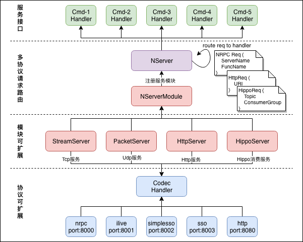
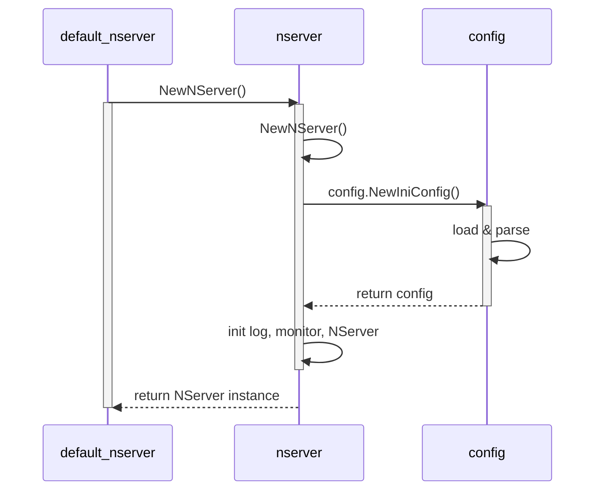
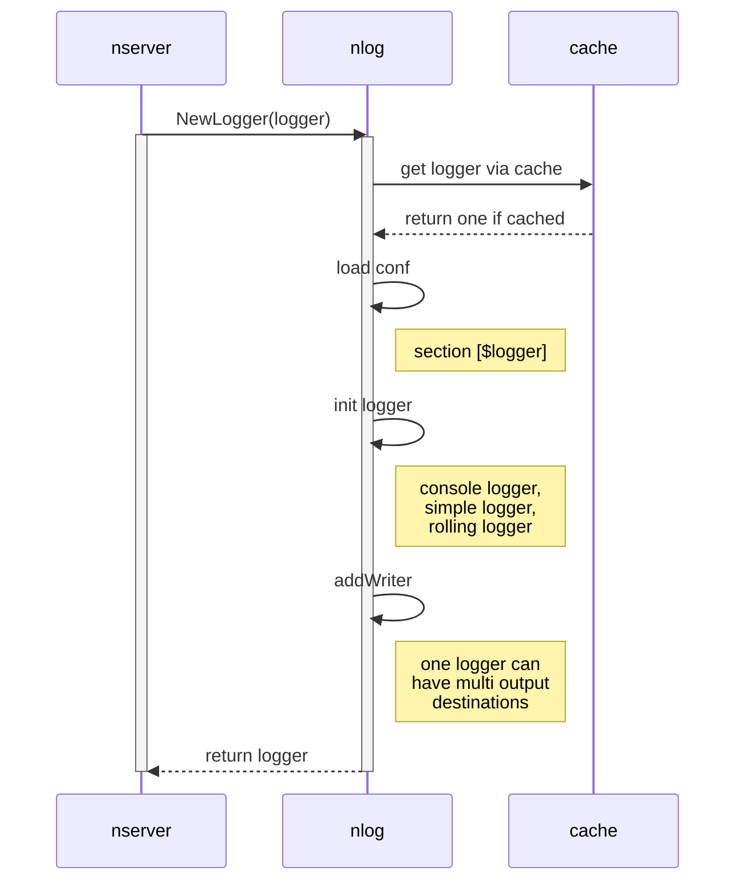
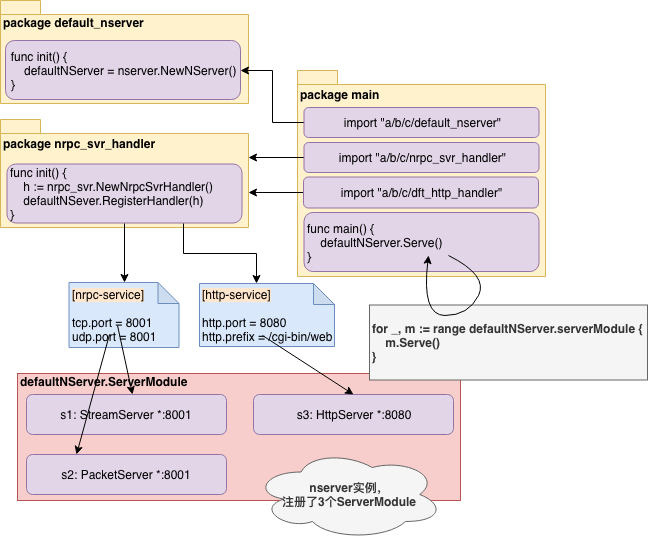

# GoNeat Design

GoNeat，追求“小而美”的设计，是基于golang开发的面向后台开发的微服务框架，旨在提升后台开发效率，让大家摆脱各种琐碎的细节，转而更加专注于服务质量本身。Simple & Powerful，是我们始终追求的设计理念。

本文从整体上介绍GoNeat的设计，GoNeat包括哪些核心部件，它们又是是如何协作的，服务运行期间涉及到哪些处理流程，等等。如果读者想更深入地了解，可以在本文基础上再阅读相关源码，或与我们开发者交流。

## GoNeat 整体架构

下图展示了GoNeat的整体架构设计，包括其核心组成部分，以及不同组成部分之间的交互：



GoNeat包括如下核心组成部分：

- NServer，代表一个服务实例，一个NServer可以插入多个NServerModule；

- NServerModule，代表一个服务模块，实现包括StreamServer、PacketServer、HttpServer、HippoServer；

- NHandler，即Codec Handler，代表一个协议Handler，实现包括nrpc、ilive、sso、http等协议Handler；

  - 不同port上可以分别提供不同协议的服务，如8000端口提供tcp/udp的nrpc服务，而8080提供http服务；

  - 不同port上到达的请求，经协议Handler解析出请求，并根据请求中的命令字，找到注册的CmdHandler；

- NServer将请求以函数参数的形式递交给注册的CmdHandler处理，处理完毕返回结果给调用方；

介绍完框架的核心组件之后，下面结合一个服务示例，介绍下服务启动、请求处理、服务退出的详细流程及设计细节。

## GoNeat 服务示例

我们仍然使用“*test_nrpc.proto*”作为示例服务pb（您可以在 [go-neat/demo/quickstart](https://git.code.oa.com/go-neat/demo/tree/master/quickstart) 中找到该示例）：

***file: test_nrpc.proto***

```protobuf
	syntax = "proto2";
	package test_nrpc;

	// BuyApple
	message BuyAppleReq {
			optional uint32 num = 1;
	};

	message BuyAppleRsp {
			optional uint32 errcode = 1;   
			optional string errmsg = 2;
	};

	// SellApple
	message SellAppleReq {
			optional uint32 num = 1;
	};

	message SellAppleRsp {
			optional uint32 errcode = 1;   
			optional string errmsg = 2;
	};

	// service test_nrpc
	service test_nrpc {
			rpc BuyApple(BuyAppleReq) returns(BuyAppleRsp);     // CMD_BuyApple
			rpc SellApple(SellAppleReq) returns(SellAppleRsp);  // CMD_SellApple
	}
```

使用goneat命令行工具来创建一个新的go-neat服务：

```bash
goneat create -protocol=nrpc -protofile=test_nrpc.proto -httpon
```

与“*Program Your Next Server in GoNeat*”章节不同的是，这里额外加了一个参数“*-httpon*”，目的是介绍支持多协议的相关处理。运行上述命令后，应生成如下目录结构的服务模板。

```bash
test_nrpc
├── Makefile
├── README.md
├── client
│   └── test_nrpc_client.go
├── conf
│   ├── log.ini
│   ├── monitor.ini
│   ├── service.ini
│   └── trace.ini
├── deploy.ini
├── log
└── src
    ├── exec
    │   ├── exec_test_nrpc.go
    │   ├── exec_test_nrpc_impl.go
    │   └── exec_test_nrpc_init.go
    └── test_nrpc.go

5 directories, 12 files

```

## GoNeat 内部设计

一直没想清楚，该以什么样的方式来描述GoNeat的内部设计，想了两种叙述方式：

- 按照核心组件单独拎出来挨个介绍下？

  这种方式比较容易介绍，但是读者不容易理解这玩意在哪些场景下用、怎么用。因为核心组件可能功能比较多，大而全地介绍反而有点虚，一次性介绍完不光读者头大，介绍的人也头大。

- 按照执行流程中涉及到的组件逐个介绍？

  这种方式比较容易让读者明白什么场景下用到了什么组件，对组件的介绍也可以适可而止，但是同一个组件可能在多个不同的流程中被提到，需要读者适当地对思路进行下梳理。不过GoNeat框架内组件实现一般都比较简单。

综合考虑以后，决定用第二种方式进行叙述，既方便读者理解，介绍过程本身也不至于过于枯燥。

GoNeat框架是按照如下方式进行组织的，相关子工程托管在[git.code.oa.com/groups/go-neat]()：

- core，是核心框架逻辑，负责框架整体流程处理，即某些通用能力的抽象，如监控、分布式跟踪、日志能力；
- tencent，提供了公司常用中间件，如ckv、hippo、monitor、tnm、dc、habo、l5、cmlb等等；
- common，提供了框架中一些常用的工具类实现，如共享内存操作等等；
- tool，提供了GoNeat开发所需要的一些外围工具，如代码生成工具、monitor监控打点工具等；

为大家方便使用第三方组件，也创建了components方便大家在goneat服务开发中使用：

- components，提供了第三方的一些支持，如etcd、zookeeper等等；

此外，为了方便大家理解GoNeat框架的设计，以及快速上手开发，也提供了wiki和demo：

- wiki，也就是您正在看的这份文档，所有的文档都在这里维护，如果对文档有疑问或建议，也可在此提issue；
- demo，提供了一些示例代码，助力大家快速上手goneat开发；

> 为方便大家在公司内网体验GoNeat，减少解决外部依赖所需要的时间（如访问github可能要申请外网访问权限等），我们也维护了go-neat/deps来维护框架的依赖（库+版本），install.sh搭建的时候会自动拉取这里的依赖。
>
> 我们建议您使用go module对依赖进行管理，goneat相关依赖已经补充在go.mod，请知悉。

## GoNeat - 初始化

### 初始化：配置说明

GoNeat框架读取的配置文件，主要包括：

- test_nrpc/conf/service.ini，包含服务的核心配置；

- test_nrpc/conf/monitor.ini，包含服务不同接口的耗时分布的monitorid；
- test_nrpc/conf/log.ini，包含日志文件滚动方式、日志级别的相关定义；
- test_nrpc/conf/trace.ini，包含分布式跟踪相关backend的定义；

如果您已经对GoNeat配置项很熟悉，可以选择跳过该小节，当然我们还是建议通读一下以尽可能全面地了解不同的配置项，当后续您有需求要对框架做出约束或者改变的时候，有助于判断现有框架能力能否满足您的需要。

下面对各个日志文件中的配置项进行介绍：

1. ***test_nrpc/conf/service.ini***，包括框架核心配置项，以及habo、业务协议、rpc相关配置项：

   **[service]** 框架核心配置项：

   - 日志相关：日志级别，保留日志文件数量，单日志文件的大小；

   - 性能相关：允许的最大入tcp连接数，允许的最大并发请求数，

   - 内存调优：workerpool允许创建最大协程数，udp收包buffer大小；

   - 服务质量：服务接口的超时时间，处理请求时进行全局超时控制；

   - 服务名称：分布式跟踪时用于追踪span节点；

     ```ini
     [service]
     name = test_nrpc               			 #服务名称
     
     log.level = 1                        #框架日志级别,0:DEBUG,1:INFO,2:WARN,3:ERROR
     log.size = 64MB                      #日志文件大小,默认64MB,可以指定单位B/KB/MB/GB
     log.num = 10                         #日志文件数量,默认10个
     
     limit.reqs = 100000                  #服务允许最大qps
     limit.conns = 100000                 #允许最大入连接数
     
     workerpool.size = 20000              #worker数量
     udp.buffer.size = 4096               #udp接收缓冲大小(B),默认1KB,请注意收发包尺寸
     
     BuyApple.cmd.timeout = 5000          #服务接口BuyApple超时时间(ms)
     SellApple.cmd.timeout = 5000         #服务接口SellApple超时时间(ms)
     ```

   **[habo]** 哈勃监控配置项：

    -  是否启用哈勃监控；

    -  申请的dcid，dc上报数据同步到habo；

    -  dc上报测试环境，还是线上环境；

       ```ini
       [habo]
       enabled = true                       #是否开启模调上报
       caller = content_strike_svr          #主调服务名称
       dcid = dc04125                       #罗盘id
       env = 0                              #0:现网(入库tdw), 1:测试(不入库tdw)
       ```

   **[nrpc-service]** 协议handler配置项：

    -  nrpc协议handler监听的tcp端口；

    -  nrpc协议handler监听的udp端口；

       ```ini
       [nrpc-service]
       tcp.port = 8000                      #tcp监听端口
       udp.port = 8000                      #udp监听端口
       ```

   **[http-service]** 协议http配置项：

   - http协议监听的端口；

   - http请求URL前缀；

     ```ini
     [http-service]
     http.port = 8080                     #监听http端口
     http.prefix = /cgi-bin/web           #httpUrl前缀
     ```

   **[rpc-test_nrpc]** rpc配置项：

    -  rpc调用地址，支持ip://ip:port、l5://mid:cid、cmlb://appid（“***服务发现***”正在开发验证中）

    -  传输模式，支持UDP、UDP全双工、TCP短连接、TCP长连接、TCP全双工，TCP/UDP SendOnly

    -  rpc超时时间，包括默认的timeout以及细化到各个接口的超时时间；

    -  rpc监控monitorid，包括总请求、成功、失败、耗时分布monitor id；

       ```ini
       [rpc-test_nrpc]
       addr = ip://127.0.0.1:8000           #rpc调用地址
       proto = 3                            #网络传输模式,
                                            #1:UDP,
                                            #2:TCP_SHORT,
                                            #3:TCP_KEEPALIVE,
                                            #4:TCP_FULL_DUPLEX,
                                            #5:UDP_FULL_DUPLEX,
                                            #6:UDP_WITHOUT_RECV
       timeout = 1000                       #rpc全局默认timeout
       BuyApple.timeout = 1000              #rpc-BuyApple超时时间(ms)
       SellApple.timeout = 1000             #rpc-SellApple超时时间(ms)
       
       monitor.BuyApple.timecost10 		= 10001 		#耗时<10ms
       monitor.BuyApple.timecost20 		= 10002			#耗时<20ms
       monitor.BuyApple.timecost50 		= 10003			#耗时<50ms
       ...
       monitor.BuyApple.timecost2000 		= 10005		#耗时<2000ms
       monitor.BuyApple.timecostover2000 = 10006		#耗时>=2000ms
       ...
       ```
   
2. ***test_nrpc/conf/monitor.ini***，用于监控服务接口本身的总请求量、处理成功、处理失败量，以及处理耗时分布情况：

   **[test_nrpc]** 服务接口本身监控打点monitor id：

   ```ini
   [test_nrpc]
   
   //服务接口-BuyApple
   monitor.BuyApple.timecost10=0                #接口BuyApple延时10ms
   monitor.BuyApple.timecost20=0                #接口BuyApple延时20ms
   monitor.BuyApple.timecost50=0                #接口BuyApple延时50ms
   ...
   monitor.BuyApple.timecost3000=0              #接口BuyApple延时3000ms
   monitor.BuyApple.timecostover3000=0          #接口BuyApple延时>3000ms
   
   //	服务接口-SellApple
   monitor.SellApple.timecost10=0                #接口SellApple延时10ms
   monitor.SellApple.timecost20=0                #接口SellApple延时20ms
   monitor.SellApple.timecost50=0                #接口SellApple延时50ms
   ...
   monitor.SellApple.timecost3000=0              #接口SellApple延时3000ms
   monitor.SellApple.timecostover3000=0          #接口SellApple延时>3000ms
   ```
   
3. ***test_nrpc/conf/log.ini***，代替service.ini中logging相关配置，用来支持工厂模式获取logger：

   这里默认配置了三个logger：

   - 框架处理日志log，go_neat_frame.log，最多保留5个日志文件，单文件上限100MB，写满则滚动；
   - 框架请求流水log，go_neat_access.log，最多保留5个日志文件，单文件无上限，按天滚动；
   - 默认log，default.log，最多保留5个日志文件，单文件上限100MB，写满则滚动；

   ```ini
   #框架内部日志
   [log-go_neat_frame]
   level = 1                       #日志级别,0:DEBUG,1:INFO,2:WARN,3:ERROR
   logwrite = rolling
   logFileAndLine = 1
   rolling.filename = go_neat_frame.log
   rolling.type = size
   rolling.filesize = 100m
   rolling.lognum = 5
   
   #框架流水日志
   [log-go_neat_access]
   level = 1                      #日志级别,0:DEBUG,1:INFO,2:WARN,3:ERROR)
   logwrite = rolling
   logFileAndLine = 0
   rolling.filename = go_neat_access.log
   rolling.type = daily
   rolling.lognum = 5
   
   #服务默认日志
   [log-default]
   level = 1                     #日志级别,0:DEBUG,1:INFO,2:WARN,3:ERROR)
   logwrite = rolling
   logFileAndLine = 0
   rolling.filename = default.log
   rolling.type = size
   rolling.filesize = 100m
   rolling.lognum = 5
   ```

4. ***test_nrpc/conf/trace*.ini**，用于分布式跟踪相关的配置：

   GoNeat框架通过opentracing api支持分布式跟踪，支持三种backend实现，zipkin、jaeger、天机阁：

   - **[zipkin]** 配置

     ```ini
     [zipkin]
     enabled = true                                              #是否启用zipkin trace
     service.name = test_nrpc                                    #当前服务名称(span endpoint)
     service.addr = *:8000                                       #当前服务地址(span endpoint)
     collector.addr = http://9.24.146.130:8080/api/v1/spans      #zipkin collector接口地址
     traceId128bits = true                                       #是否启用128bits traceId
     ```

   - **[jaeger]** 配置

     ```ini
     [jaeger]
     enabled = false                                             #是否启用jaeger trace(暂未验证兼容性)
     service.name = test_nrpc                                    #当前服务名称(span endpoint)
     service.addr = *:8000                                       #当前服务地址(span endpoint)
     collector.addr = http://9.24.146.130:8080/api/v1/spans      #jaeger collector接口地址
     traceId128bits = true                                       #是否启用128bits traceId
     ```

   - **[天机阁]** 配置

     ```ini
     [tianjige]
     enabled = false                                             #是否启用天机阁 trace
     service.name = test_nrpc                                    #当前服务名称(span endpoint)
     service.addr = *:8000                                       #当前服务地址(span endpoint)
     collector.addr = 10.101.192.79:9092                         #天机阁 collector接口地址
     traceId128bits = true                                       #是否启用128bits traceId
     appid = ${your_applied_appid}                               #天机阁申请的appid
     ```

### 初始化：配置加载

在介绍了GoNeat依赖的配置文件及各个配置项之后，继续介绍下GoNeat的配置解析、加载过程。

GoNeat支持两种格式的配置文件:

- 一种是“*ini格式*”的配置文件，
- 一种是“json格式”的配置文件。

配置加载，发生在NServer实例化过程中，**default_nserver.NewNServer()**，此时会加载service.ini、monitor.ini、log.ini，并根据配置信息完成NServer实例化。



### 初始化：logging

NServer实例化过程中，会创建三个logger对象：

- go_neat_frame，框架处理逻辑日志，对应log.ini中的[go_neat_frame]；
- go_neat_access，框架请求流水日志，对应log.ini中的[go_neat_access]；
- default，框架默认日志，对应log.ini中的[default]；

每个logger对象的创建都是按照如下流程去执行的，**nlog.GetLogger(logger)**，会首先检查loggerCache中key=$logger的logger对象是否已经存在，如果存在则直接返回，反之，加载log.ini中的配置[\$logger]，检查logwrite配置项，logwrite指定了日志输出的目的地，如：

- console，输出到控制台；
- simple，普通日志文件，不支持滚动；
- rolling，支持滚动的日志文件，包括按照日期滚动、文件大小滚动；

logwrite允许逗号分隔多个输出，如`logwrite = console, rolling`，那么此时logger.Info(…)输出的信息将同时输出到控制台和滚动日志文件，详细可参考**nlog.MultiWriterLogWriter**实现。

> **nlog.MultiWriterLogWriter**可以进一步重构，如支持将日志信息上报到elasticsearch、天机阁等其他远程日志系统，现在的实现稍作修改就可以支持第三方日志组件实现，elasticsearch、天机阁等远程日志组件只要实现nlog.NLog接口并完成该实现的注册即可。



### 初始化：tracing

分布式调用链对GoNeat框架来说是可插拔的，回想一下trace.ini，我们支持三种调用链backend实现，包括zipkin、jaeger以及公司内部的天机阁，如果希望在服务中使用tracing：

- 使用zipkin，那么在程序中`import _ “git.code.oa.com/go-neat/core/depmod/trace/zipkin`即可；
- 使用jaeger，那么在程序中`import _ “git.code.oa.com/go-neat/core/depmod/trace/jaeger`即可；
- 使用天机阁，那么在程序中`import _ “git.code.oa.com/go-neat/core/depmod/trace/tianjige`即可；

当然除了import对应的调用链实现，也要对配置文件做调整：

- 使用zipkin，trace.ini里面设置zipkin.enabled = true；
- 使用jaeger，trace.ini里面设置jaeger.enabled = true;
- 使用天机阁，trace.ini里面设置tianjige.enabled = true;

> 如果后续想要扩展tracing backend，只需要提供对应的tracer初始化方法就可以了，类似于zipkin、jaeger、天机阁初始化方式。如果要在项目中使用该tracing实现，通过import对应实现+配置文件激活就可以。import对应的tracing backend初始化，并添加对应的初始化配置，that’s it!

### 初始化：协议handler

不同的业务协议，其字段定义、编解码方式可能不同，协议handler就是对业务协议的编解码进行处理。目前，GoNeat框架支持公司内大多数业务协议，如nrpc、sso、simplesso、ilive、qconn、taf等等。

#### 协议处理方面的亮点？

GoNeat框架支持在单个进程中同时支持多种业务协议，如：

- 在port 8000提供nrpc服务；
- 在port 8001提供ilive协议；
- 在port 8080提供http服务；

同一份业务处理代码，可以通过不同的业务协议对外提供服务，在涉及到多端、多业务方交互的时候会很方便。

#### 服务中如何支持nrpc协议？

以提供nrpc服务为例，只需要做3件事情，包括：

- 配置文件service.ini中增加[nrpc-service]配置项，指明业务协议nrpc绑定的端口，如`tcp.port = 8000`；
- 代码中引入对应协议handler，如`import _ "git.code.oa.com/go-neat/core/proto/nrpc/nprc_svr/default_nrpc_handler"`；
- 代码注册nrpc命令字及处理方法，如`default_nserver.AddExec(“BuyApple”, BuyApple)`；

如果要在此基础上继续支持http服务呢，一样的三件事，包括：

- 配置文件service.ini中增加[http-service]配置项，指明要绑定的端口及url前缀，如：

  ```ini
  [http-service]
  http.port = 8080
  http.prefix = /cgi-bin/web
  ```

- 代码引入协议handler，如`import _ “git.code.oa.com/go-neat/core/proto/http/dft_httpsvr”`；

- 代码注册http uri，如`default_nserver.AddExec(“/BuyApple”, BuyApple)`；

That’s all！GoNeat要支持常用的业务协议，只需要做上述修改即可，是不是看上去还挺简单方便！

> 还记得写一个spp服务同时支持多种协议，需要在spp_handle_input里面区分端口来源，然后再调用对应的解包函数，判断请求命令字，转给对应的函数处理，每次有这种需要都需要写一堆这样的代码，好啰嗦！

#### 框架做了什么？

读者是否注意到前文中`AddExec(cmd,BuyApple)`，nrpc命令字`BuyApple`，http请求`$host:8080/cgi-bin/web/BuyApple`，这两种不同的请求最终是被路由到了相同的方法`BuyApple`进行处理，意味着开发人员无需针对不同的协议做任何其他处理，GoNeat框架帮你搞定这一切，业务代码零侵入。

真的业务代码零侵入吗？http请求参数Get、POST方式呢？nrpc协议是protbuf格式呢？同一份业务代码如何兼容？

GoNeat对不同的业务协议抽象为如下几层：

- 协议定义，如nrpc、ilive、simplesso、http包格式；
- 协议handler，完成协议的编码、解码操作（接口由NHandler定义）；
- 会话session，维持客户端请求、会话信息（接口由NSession定义）；

当希望扩展GoNeat的协议时，需要提供协议的包结构定义、协议的编解码实现、协议会话实现，nrpc协议对应的会话实现为NRPCSession、http协议对应的会话实现时HttpSession。

好，现在介绍下GoNeat中同一份代码`func BuyApple(ctx context.Context, session nsession.NSession) (interface{}, error)`如何支持多种业务协议。

***file: test_nrpc/src/exec/test_nrpc.go：***

```go
func BuyApple(ctx context.Context, session nsession.NSession) (interface{}, error) {
  req := &test_nrpc.BuyAppleReq{}
  err := session.ParseRequestBody(req)
  ...

  rsp := &test_nrpc.BuyAppleRsp{}
  err = BuyAppleImpl(ctx, session, req, rsp)
  ...
  return rsp, nil
}
```

***file: test_nrpc/src/exec/test_nrpc_impl.go：***

```go
func BuyAppleImpl(ctx context.Context, session nsession.NSession, req *test_nrpc.BuyAppleReq, rsp *test_nrpc.BuyAppleRsp) error {
  // business logic
  return nil
}

```

从上面的代码中 ***test_nrpc.go*** 不难看出，秘密在于不同协议会话对`NSession.ParseRequestBody(…)`的实现：

- 如果是pb协议，session里面会直接通过`proto.Unmarshal(data []byte, v interface{})`来实现请求解析；
- 如果是http协议，session里面会多做些工作：
  - 如果是`POST`方法，且`Content-Type=“application/json”`，则读取请求体然后`json.Unmarshal(...)`接口；
- 其他情况下，读取GET/POST请求参数转成map[param]=value，编码为json再反序列化为目标结构体；
  

Google Protocol Buffer是一种具有自描述性的消息格式，凭借良好的编码、解码速度以及数据压缩效果，越来越多的开发团队选择使用pb来作为服务间通信的消息格式，GoNeat框架也推荐使用pb作为首选的消息格式。

由于其自描述性，pb文件被用来描述一个后台服务是再合适不过了，基于此也衍生出一些周边工具，如自动化代码生成工具goneat（由gogen重命名而来）用来快速生成服务模板、client测试程序等等。

## GoNeat - 服务启动

前面零零散散地介绍了不少东西，配置文件、配置加载、logging初始化、tracing集成、协议handler注册，了解了这些之后，现在我们从整体上来认识下GoNeat服务的启动过程。

说是从整体上来认识启动流程，并不意味着这里没有新的细节要引入。中间还是会涉及到一些比较细节的问题，如tcp、udp监听如何处理的，为什么要支持端口重用，为支持平滑退出需要做哪些准备等等。这里章节划分的可能不太科学，希望按照一个GoNeat服务的生命周期来叙述，能尽可能多地覆盖到那些必要的设计和细节。

### 启动：实例化NServer

一个GoNeat服务对应着一个NServer实例，为了方便快速裸写一个GoNeat服务，go-neat/core内部提供了一个package `default_nserver`，代码中只需要添加如下两行代码就可以快速启动一个GoNeat服务：

```go
package main
import (
  “git.code.oa.com/go-neat/core/nserver/default_nserver”
)

func main() {
  default_nserver.Serve()
}
```

当然，该NServer实例会直接退出，因为该实例没有注册要处理的业务协议，需要注册协议handler服务才能工作。当我们创建一个pb文件，并通过命令`goneat -protofile=*.proto -protocol=nrpc`创建工程时，`goneat`自动在生成代码中包含了nrpc协议对应的协议handler，这里的协议handler做了什么呢？或者说import这个协议handler时，发生了什么呢？

```go
import (
  _ "git.code.oa.com/go-neat/core/proto/nrpc/nrpc_svr/default_nrpc_handler"
)
```

> NServer实例化过程中，会涉及到配置加载、logger实例化相关的操作，这里在***GoNeat - 初始化***一节中已有提及，这里相关内容不再赘述。

### 启动：加入协议handler

以nrpc协议handler为例：

***file: go-neat/core/proto/nrpc/nrpc_svr/default_nrpc_handler/nrpc_svr_init.go***

```go
package default_nrpc_handler

import (
	"git.code.oa.com/go-neat/core/nserver/default_nserver"
	"git.code.oa.com/go-neat/core/proto/nrpc/nrpc_svr"
)

func init() {
	default_nserver.RegisterHandler(nrpc_svr.NewNRPCHandler())
}
```

当import default_nrpc_handler时，`func init()`会自动执行，它会向上述NServer实例中注册协议handler，注册过程中发生了什么呢？可参考如下简化版的代码，它主要做这些事情：

- 读取service.ini中的配置`[nrpc-service]`section下的tcp.port，如果大于0创建一个StreamServer；
- 读取service.ini中的配置`[nrpc-service]`section下的udp.port，如果大于0创建一个PacketServer；
- 将上述新创建的StreamServer和PacketServer添加到NServer实例的ServerModule集合中；

***file: go-neat/core/nserver/neat_svr.go***

```go
func (svr *NServer) RegisterHandler(handler NHandler) {
	...
  moduleNode := handler.GetProto() + "-service"
	
	if svr.config.ReadInt32(moduleNode, "tcp.port", 0) > 0 {
    nserverModule := &StreamServer{protoHandler: handler}
		svr.serverModule = append(svr.serverModule, nserverModule)
	}
  
	if svr.config.ReadInt32(moduleNode, "udp.port", 0) > 0 {
    nserverModule := &PacketServer{protoHandler: handler}
		svr.serverModule = append(svr.serverModule, nserverModule)
	}
  ...
}
```

***file: test_nrpc/conf/service.ini***

```ini
[nrpc-service]
tcp.port = 8000                      #tcp监听端口
udp.port = 8000                      #udp监听端口
```

### 启动：NServer启动

`default_nserver.Serve()`发起了NServer实例的启动，NServer实例会遍历其上注册的所有ServerModule，然后逐一启动各个ServerModule，如tcp服务模块StreamServer、udp服务模块PacketServer。

***file: test_nrpc/src/test_nrpc.go***

```go
package main

import (
	"git.code.oa.com/go-neat/core/nserver/default_nserver"
	_ "git.code.oa.com/go-neat/core/proto/nrpc/nrpc_svr/default_nrpc_handler"
	_ "git.code.oa.com/go-neat/core/proto/http/dft_httpsvr"
	_ "exec"
)

func main() {
	default_nserver.Serve()
}
```

***file: go-neat/core/nserver/neat_svr.go***

```go
func (svr *NServer) Serve() {
	...
	for _, serverModule := range svr.serverModule {

		if e := serverModule.Serve(); e != nil {
      ...
    }
	}
  ...
}
```

以下是NServer实例启动过程图解：

- package default_nserver实例化了一个NServer实例，package main只需要import这个包即可完成实例化；
- package main中import对应的协议handler，协议handler将向默认NServer实例注册handler；
- 每个协议handler又有协议之分，如支持tcp、udp、http，要为不同的协议创建ServerModule并注册到NServer；
- NServer实例调用Serve()开始启动，该方法逐一启动已注册的所有ServerModule；



下面介绍下框架中实现的几个ServerModule，了解下它们的设计细节。

### 启动：NServerModule

NServer允许插入多个NServerModule实现，来扩展NServer的能力，如支持不同协议的NServerModule实现：tcp（StreamServer）、udp（PacketServer）、http（HttpServer）。

**file: go-neat/core/nserver/neat_svr.go**

```go
type NServer struct {
   serverName     string
   serverModule   []NServerModule
   ...
}
```
**file: go-neat/core/nserver/neat_comm.go**

```go
type NServerModule interface {
	Init(nserver *NServer, module string, cfg *config.Ini, log *nlog.NLog) error
	SetHandler(requestHandler RequestHandler)
	GetProto() string
	Serve() error
	Close()
}
```

### Module：StreamServer

StreamServer是GoNeat封装的面向字节流（SOCK_STREAM）的服务模块，支持tcp和unix服务。

StreamServer的创建时刻，我们在前面描述“***服务启动***”的部分已有提及，这里描述其启动的过程。

#### 启动监听，处理入连接请求

```go
func (svr *StreamServer) Serve() error {
	tcpListener, err := net.Listen(svr.Network, svr.Addr)
	if nil != err {
		panic(fmt.Errorf("listen tcp error %s", err.Error()))
	}
  
	svr.ctx, svr.cancel = context.WithCancel(context.Background())
	if nil != tcpListener {
		go svr.tcpAccept(svr.protoHandler, tcpListener)
	}

	return nil
}
```

StreamServer启动的逻辑简单明了，它监听svr.Addr（传输层协议svr.Network）创建一个监听套接字，然后为该svr.ctx创建一个CancelContext，然后启动一个协程负责执行svr.tcpAccept(…)，处理tcp入连接请求。

#### 广播事件，支持平滑退出

这里提一下svr.ctx, svr.cancel，服务有自己的生命周期，有启动也有停止，服务停止的时候，存在某些未完结的任务需要清理，如HippoServer中可能拉取了一批消息但是还未处理完成，服务重启会造成消息丢失。**类似这样的场景的存在，要求框架必须有能力对服务停止事件进行广播，广播给服务内的所有组件，各个组件根据需要自行执行清理动作**，如HippoServer可能会选择停止继续收消息、处理完收取消息后退出。

这里的svr.ctx, svr.cancel就是负责对服务停止事件进行广播的，当NServer实例停止时，会遍历其上注册的所有ServerModule并调用其Close()方法，以StreamServer为例：

```go
// Close shutdown StreamServer
func (svr *StreamServer) Close() {
	if svr.cancel != nil {
		svr.cancel()
	}
}
```

StreamServer.Close()调用了svr.cancel()来取消svr.ctx的所有child context，因为svr.ctx是整个tcp服务处理的root context，所有后续的请求处理的context都是派生自svr.ctx，当执行svr.cancel()的时候，所有派生出来的请求处理，都可以通过各个child context的Done()方法来检测StreamServer是否已经准备停止，从而采取必要的清理动作。

这里的设计，也为GoNeat服务能够优雅地“***实现平滑退出***”打下了基石。

#### 建立连接，全双工处理

```go
func (svr *StreamServer) tcpAccept(handler NHandler, listener net.Listener) {
	defer listener.Close()
  
	ctx := svr.ctx
	for {
		select {
		case <-ctx.Done():	//服务停止，不再接受入连接请求
			return
		default:						//建立新连接，并处理
			conn, ex := listener.Accept()
			if ex != nil {
				log.Error("accept error:%s", ex)
			} else {
				if svr.connLimiter.TakeTicket() { //自我防护，对入连接数量进行限制

					if tcpConn, ok := conn.(*net.TCPConn); ok {
						tcpConn.SetKeepAlive(true)
						tcpConn.SetKeepAlivePeriod(10 * time.Second)
					}
					endpoint := newEndPoint(svr, conn)
          
					go endpoint.tcpReader()				//全双工模式处理，收包、处理、回包以并发的方式进行
					go endpoint.tcpWriter()				//充分发挥tcp全双工的特点和优势

				} else {
					conn.Close()									//入连接数量超过上限，关闭连接
				}
			}
		}
	}
}
```

对于创建好的tcp连接，StreamServer充分发挥了tcp全双工的特点和优势：

- 启动一个goroutine专门负责收包
- 启动一个goroutine专门负责回包
- 针对连接上到达的请求包，则通过协程池进行处理
- 同一个连接上的收包、处理、回包是并发的

回想下我们写C++服务端的经历，通过epoll监听每个连接套接字上的读写就绪事件，read-ready的时候要及时从连接中取出数据放到请求队列中，write-ready的时候如果请求处理完就回包。单进程多线程模型，往往有专门的io线程来进行数据包的收发，逻辑处理线程从请求队列中取走请求赶紧处理并准备好回包数据，io线程取走回包执行响应动作；如果是单进程单线程模型，io事件未就绪的情况下就要赶紧执行逻辑处理；多进程模型，则可能会采用类似spp的架构，proxy负责io，请求放入共享内存，worker进程从共享内存获取请求并写入响应，proxy再负责回包。

使用go进行开发呢？go对阻塞型系统调用进行了完整的解剖，所有的网络io、请求处理，都显得那么简单、自然，以至于都已经淡忘了C++服务端开发中存在的不同网络模型。当然，网络模型的思想在，但已经无需关注多进程单进程、多线程单线程了，**只需要铭记 “tcp是全双工模式”，借助golang这一强大的基础设施来最优化tcp服务性能即可**。

关于 `go endpoint.tcpReader()` 和 `go endpoint.tcpWriter()` 的细节，我们在后面**服务怠速、请求处理**中介绍。

#### 过载保护，限制入连接数

StreamServer循环执行Accept()方法来建立连接，当然由于计算资源有限，服务能处理的连接数、请求数是有限的，服务需要进行一定的防护避免过载、雪崩。当`svr.connLimiter.TakeTicket()`成功时表示连接数未超限，可以继续处理，反之表示超出入连接数上限，关闭连接。

循环Accept()过程中，如果检测到StreamServer停止`ctx.Done()`，关闭监听套接字不再接受入连接请求。

#### 过载保护，限制入请求数

除了对入tcp连接数进行限制，StreamServer也对入请求数进行限制，这部分在后续“请求处理”中介绍。

### Module：PacketServer

PacketServer是GoNeat封装的面向数据报（SOCK_PACKET）的服务模块，支持udp服务。

与介绍StreamServer的方式类似，PacketServer实例化的部分前文已介绍过，这里只介绍其启动的过程。

#### 启动监听，处理入udp请求

PacketServer.Server()中调用 `reuseport.ListenPacket(...)` 或者 `net.ListenPacket(...)` 监听svr.Addr（传输层协议类型svr.Network）创建监听套接字，并从中接收udp请求、处理请求、响应，详见`svr.udpRead(…)`，我们会在后续“请求处理”小节中进行介绍。

```go
// Serve start the PacketServer
func (svr *PacketServer) Serve() error {
	svr.ctx, svr.cancel = context.WithCancel(context.Background())

	if svr.shouldReusePort() {							//如果支持重用端口，linux+darwin
		reuseNum := runtime.NumCPU()

		for i := 0; i < reuseNum; i++ {
			udpConn, err := reuseport.ListenPacket(svr.Network, svr.Addr)
			if nil != err {
				panic(fmt.Errorf("listen udp error %s", err.Error()))
			}
			if nil != udpConn {
				go svr.udpRead(svr.protoHandler, udpConn)
			}
		}
	} else {																//如果不支持端口重用，windows
		udpConn, err := net.ListenPacket(svr.Network, svr.Addr)
		if nil != err {
			panic(fmt.Errorf("listen udp error %s", err.Error()))
		}
		if nil != udpConn {
			go svr.udpRead(svr.protoHandler, udpConn)
		}
	}

	return nil
}
```

#### 端口重用，加速udp收包

阅读上述代码，您一定关注到了这么一点， `reuseport.ListenPacket(...)` 和 `net.ListenPacket(...)` 。在继续描述之前，需要对比下tcp收包和udp收包的区别。

- tcp是面向连接的，往往为每一个连接创建一个专门的goroutine进行收包；
- udp是无连接的，要分配多少个协程进行收包呢？1个或者N个？对同一个fd进行操作，开多个goroutine是没有价值的，那么1个的话呢，收包效率和tcp对比又有点低效。这就是PacketServer重用端口reuseport的由来了，借此提高udp收包的效率。

**重用端口（REUSEPORT）**和**重用地址（REUSEADDR）**，二者诞生的初衷和作用是不同的：

- TCP/UDP连接（UDP无连接但可以connect），由五元组表示：<协议类型，源ip，源端口，目的ip，目的端口>；
- **REUSEADDR解决的是监听本地任意地址*0.0.0.0:port*与另一个监听本地特定地址相同端口*a.b.c.d:port*的问题；**
- **REUSEPORT解决多个sockets（可能归属于相同或者不同的进程）是否允许bind到相同端口的问题，**

Linux下为了避免port hijack，只允许euid相同的进程bind到相同的port（bind设置socket源port，connect设置socket目的端口），同时**对于tcp listen socket、udp socket还会进行“均匀的”流量分发，也是一个轻量的负载均衡方案**。

golang标准库中暂没有提供reuseport的能力，这里是引入了第三方实现，目前支持Linux+Darwin平台下的udp reuseport，Windows暂不支持。

#### 过载保护，限制入请求数

与StreamServer类似，PacketServer也有过载保护机制，就是限制入udp请求数，我们在后续“请求处理”小节中介绍。

### Module：HttpServer

HttpServer是GoNeat在golang标准库基础上封装的http服务模块，支持与StreamServer、PacketServer一样的接口注册、接口路由、接口处理逻辑。

#### 标准库http基础上实现

从下面代码不难看出，HttpServer，该ServerModule的实现时基于标准库http package实现的，对大家来说应该都比较熟悉，但是这里也有个适配GoNeat的地方，也就是请求路由这里。

```go
// Serve start HttpServer
func (svr *HttpServer) Serve() error {
	svr.serve()
	return nil
}

// serve start HttpServer
func (svr *HttpServer) serve() {
	var h http.Handler = http.HandlerFunc(svr.doService)
	listener, err := net.Listen("tcp", fmt.Sprintf(":%d", svr.port))
	if err != nil {
		panic(err)
	}

	server := &http.Server{
		Addr:    fmt.Sprintf(":%d", svr.port),
		Handler: http.StripPrefix(svr.prefix, h),
	}

	go func() {
		err := server.Serve(listener)
		if err != nil {
			svr.log.Error("http svr start failed, err: %v", err)
		}
	}()
}
```

#### httpserver请求路由转发

借助标准库实例化 `http.Server{}` 时，指定了将请求URI Prefix为svr.prefix的请求，交由handler h处理。而h是svr.doService(…)强制类型转换成的http.HandlerFunc。

看doService的定义，可知它确实是一个http.HandlerFunc（满足HandlerFunc的定义），这样请求就递交给了doService进行处理，doService中调用`svr.requestHandler(req.Context(), httpSession)`对请求进行处理，注意这里为请求专门创建了一个HttpSession，而这里的svr.requestHandler(…)是在哪里设置呢？

svr.requestHandler字段的设置，要追溯到HttpServer这个ServerModule实例化的时候，default_nserver示例会调用`serverModule.SetHandler(nserver.process)`方法将HttpServer.requestHandler设置为`nserver.process(…)`，即：`func process(svr *NServer, ctx Context, NSession) error`才是请求处理的核心逻辑之一，涉及到鉴权、命令字路由、请求处理、tracing、耗时监控等，稍后在“请求处理”部分进行介绍。

```go
// HttpServer defines the http NServerModule implementation
type HttpServer struct {
	nserver        *NServer
	port           int32
	log            *nlog.NLog
	prefix         string
	requestHandler RequestHandler
	enableGzip     bool
	svr            *http.Server
}
...
// doService process http request `req`
func (svr *HttpServer) doService(w http.ResponseWriter, req *http.Request) {
	requestLimiter := svr.nserver.reqLimiter
	if requestLimiter.TakeTicket() {
		addr := svr.getClientAddr(req)
		defer func() {
			requestLimiter.ReleaseTicket()
		}()

		httpSession := NewHttpSession(addr, svr.log, req, w)
		ex := svr.requestHandler(req.Context(), httpSession)
		if ex != nil {
			w.WriteHeader(505)
			return
		}
		if httpSession.retcode == errCodeCmdNotFound {
			w.WriteHeader(404)
		} else {
			if len(httpSession.rspData) > 0 {
				w.Write(httpSession.rspData)
			}
		}
	} else {
		svr.log.Error("http svr req overload")
	}
}
```

#### 过载保护，限制入http请求数

HttpServer也对入请求数进行了限制，实现对自身的过载保护，采用的方式与之前tcp、udp的处理方式类似。

### Module：ScheduleServer

ScheduleServer是GoNeat为定时任务封装的一个服务模块，简化定时任务实现逻辑。

由于这里的实现逻辑比较简单、清晰，这里读者可以自己阅读代码进行了解。

### Module：HippoServer

HippoServer是针对消息驱动的业务场景封装的一个消费者服务，简化消息消费的任务处理。

由于这里的实现逻辑比较简单、清晰，这里读者可以自己阅读代码进行了解。

## GoNeat - 请求处理

前文描述了Server实例及各个ServerModule启动的过程，至此服务已经完全启动，可以进行请求处理了。

这里选择StreamServer、PacketServer、HttpServer作为重点描述对象，这几个ServerModule是日常业务开发中使用最频繁的，应该也是读者最希望了解的。~~在逐一描述之前，先介绍下用到的重要“基础设施”。~~

### 基础设施：协程池

对于操作系统而言，进程是资源分配的基本单位，线程是任务调度的基本单位。协程是相比于线程而言更加轻量的调度实体，它的轻量体现在创建、任务切换、销毁时的代价，如初始分配的栈帧大小、任务切换时保存恢复的寄存器数量等。

go官方声称可以轻松创建几百万的协程，初始协程栈大小2KB，100w的话也就是2GB，尽管当前的服务主流机器配置应该都可以支持到，但是有些问题我们却不能不去不考虑。

- 一个请求创建一个协程，请求量大时协程数大涨，会因为OOM Kill被操作系统杀死；

  请求量上涨、协程数上涨、吃内存严重，操作系统可能会判定OOM分值时将其率先列入死亡名单，进程挂掉服务不可用，这是不可接受的。服务允许出现过载、处理超时、丢弃请求自保，但是不能挂掉。

- 尽管协程的创建、销毁更加轻量，但是开销还是存在；

  协程池，预先创建一定数量的协程备用，协程从任务队列中获取请求进行处理，避免频繁创建、销毁的开销。同时，为了避免单一锁竞争，为每个协程分配单独的一个chan作为任务队列。

- 尽管协程的切换代价更小，当协程数量很多时，协程切换的代价就不能忽略了；

  io事件就绪引起协程g1被唤醒，我们期望g1继续执行处理，结果协程g2的io事件就绪又唤醒协程g2，runtime scheduler可能在某个时刻（如g1进入function prologue时）将g1切换为g2……程序执行路径类似于多重中断处理，那什么时候被中断的协程g1可以继续恢复执行呢？如果协程数量很多，上下文切换的代价就需要引起关注。

  特别是希望尽可能并发处理连接上的多个请求的时候，可能会比一个连接一个协程创建更多的协程。又想并发处理连接上的多个请求，又想降低协程数过多带来的上下文切换开销，通过协程池限制协程数量，也是一种选择。

- 其他考虑；

鉴于上述考虑，我们采用协程池来处理并发请求，而不是为每个请求创建一个协程进行处理。

### 基础设施：内存池

go自带内存管理，内存分配、逃逸分析、垃圾回收，内存分配算法如何提高分配效率、减少碎片是一个常被提及的问题，即便go在这方面基于tcmalloc和go自身特性做了优化，框架开发仍需要关注内存分配问题，此外还要关注gc。

考虑内存分配的情景，如果我们频繁在heap中申请内存（逃逸分析会决定分配在heap上还是stack上），不仅会增加内存分配的开销，也会增加gc扫描、回收时的压力。

内存分配次数增加引入额外开销不难理解，使用sync.Pool可以在两次gc cycle间隙返回已分配的内存来复用以减轻内存分配的次数，自然也会减轻gc扫描、标记、回收的压力。

每次 `gcStart(){...}` 开始新一轮gc时，会首先清理sync.Pools，清理逻辑也比较简单暴力，sync.Pools中的空闲内存块都会被清空，进入后续垃圾回收，所以内存池不适合用与连接池等有状态的对象池。

框架中我们将其用于收发包buffer内存池，用完即释放，不存在状态的问题。

### Module：StreamServer


### Module：PacketServer


### Module：HttpServer

HttpServer中有没有使用worker池（协程池）进行处理呢？该ServerModule是建立在标准库http实现之上的，GoNeat只是将请求处理的Handler传给了标准库http实现，并没有对标准库具体如何处理该请求做什么干预，比如是否采用worker池（协程池）。关于这一点，答案是否，可以查看下go标准库源码。

#### 为每个连接创建一个协程进行处理

标准库实现中，建立监听套接字之后，调用 `svr.Serve(listener)` 开始接受入连接请求，该方法循环 `Accept()` 取出建立好的tcp连接并进行处理。**标准库实现针对每一个连接都启动了一个goroutine进行处理，这与我们StreamServer的实现方式是类似的，所不同的是处理连接上并发请求的方式**。

***net/http/server.go:***

```go
// After Shutdown or Close, the returned error is ErrServerClosed.
func (srv *Server) Serve(l net.Listener) error {
	...
  for {
		rw, e := l.Accept()
		...
		c := srv.newConn(rw)
		...
		go c.serve(ctx)
	}
}
```

#### 同一连接，串行收包、处理、回包

注意 `c.Serve(ctx context.Context)` 的注释部分，其中有提到HTTP/1.x pipelining的处理局限性，一个连接上可能会有多个http请求，标准库当前实现逻辑是读取一个请求、处理一个请求、发送一个响应，然后才能继续读取下一个请求并执行处理、响应，所以多个http请求的处理是串行的。

注释中也有提到，可以收取多个请求，并发处理，然后按照pipeling请求顺序按序返回结果（http协议头并没有类似我们业务协议seqno的字段），但是当前没有这么做。

连接上请求的读取、处理、回包都是在同一个连接中完成处理的，并没有像我们StreamServer、PacketServer那样将请求递交给worker池（协程池）进行处理。

***net/http/server.go:***

```go
// Serve a new connection.
func (c *conn) serve(ctx context.Context) {
  ...

  // HTTP/1.x from here on.
	c.r = &connReader{conn: c}

	for {
    // 读取连接上的请求
		w, err := c.readRequest(ctx)

    // 读取一个请求，串行处理一个请求
    
		// HTTP cannot have multiple simultaneous active requests.[*]
		// Until the server replies to this request, it can't read another,
		// so we might as well run the handler in this goroutine.
		// [*] Not strictly true: HTTP pipelining. We could let them all process
		// in parallel even if their responses need to be serialized.
		// But we're not going to implement HTTP pipelining because it
		// was never deployed in the wild and the answer is HTTP/2.
		serverHandler{c.server}.ServeHTTP(w, w.req)
		
   	// 请求处理结束，finishRequest flush响应数据
    w.cancelCtx()
		w.finishRequest()
    ...
	}
}

func (sh serverHandler) ServeHTTP(rw ResponseWriter, req *Request) {
	handler := sh.srv.Handler
	if handler == nil {
		handler = DefaultServeMux
	}
	if req.RequestURI == "*" && req.Method == "OPTIONS" {
		handler = globalOptionsHandler{}
	}
	handler.ServeHTTP(rw, req)
}
```

sh.svr.Handler其实就是nserver.HttpServer.doService()方法。

***nserver/neat_http.go:***

```go
// doService process http request `req`
func (svr *HttpServer) doService(w http.ResponseWriter, req *http.Request) {
  ...
}
```

#### 接管标准库Request URI路由转发

HttpServer只是在标准库http实现基础上自定义了请求Handler，所有Request URI匹配http.prefix的请求将递交给doService(…)方法处理，在doService方法内再调用nserver.process()方法转入GoNeat框架内置的命令字路由逻辑，与StreamServer、PacketServer不同的是，这里的命令字不再是rpc方法名、命令字拼接字符串，而是Request URI。

process()方法内通过URI路由到对应的处理函数Exec，并完成Exec的调用，拿到处理结果，process()方法返回处理结果，doService方法负责将响应结果写入连接中，c.Serve()中w.finishRequest()负责将响应数据flush。

至此，一次http请求、处理、响应就结束了。

而关于HTTP/2中pipelining的处理情况，与之类似，读者可以自行查阅、跟进标准库实现了解相关细节，这里不再赘述。

## GoNeat - 服务怠速

前文描述了Server实例及各个ServerModule启动、请求处理的过程，当服务空闲的时候会发生什么呢？为这个阶段起了一个好听的名字”怠速”，“怠速”意味着并不是停止服务，服务依旧在空跑，那空跑阶段会发生什么呢？

GoNeat框架还是会做些事情的，比如清理、释放一些不必要的资源占用，为后续请求处理再次做好准备。


## GoNeat - 监控上报

## GoNeat - 平滑退出

## GoNeat - More

