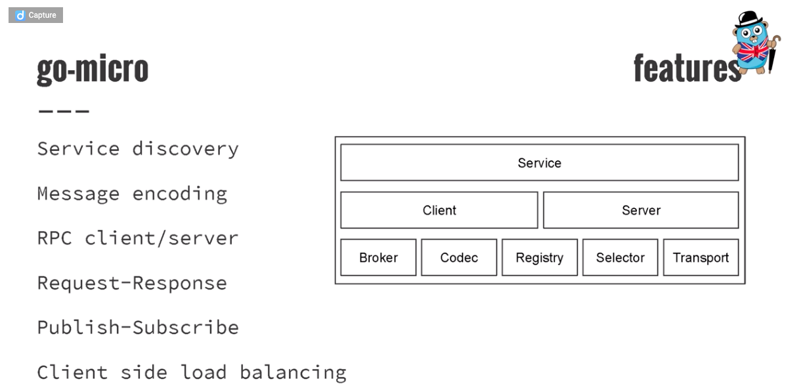
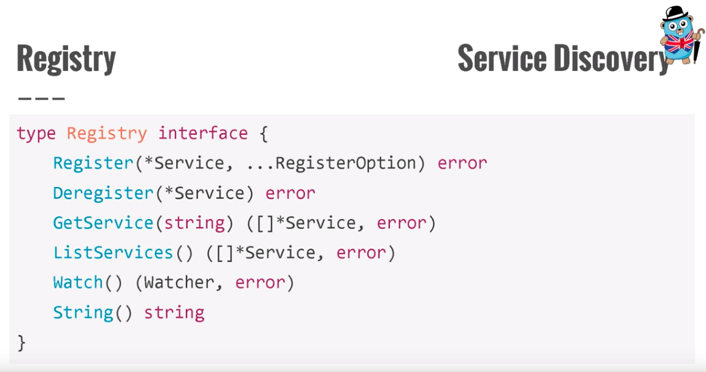
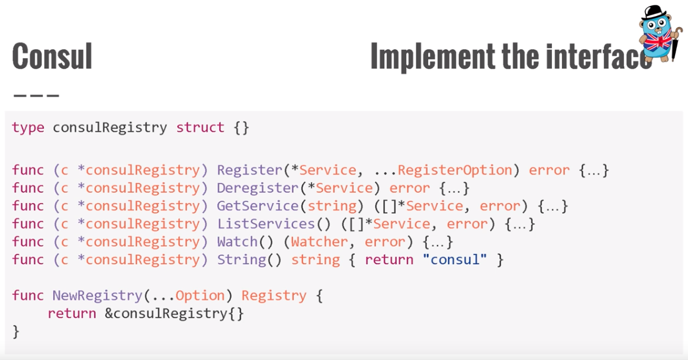
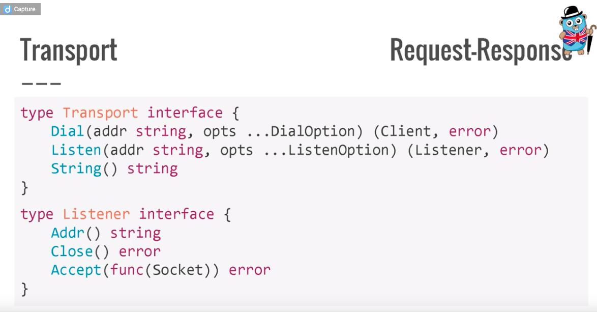
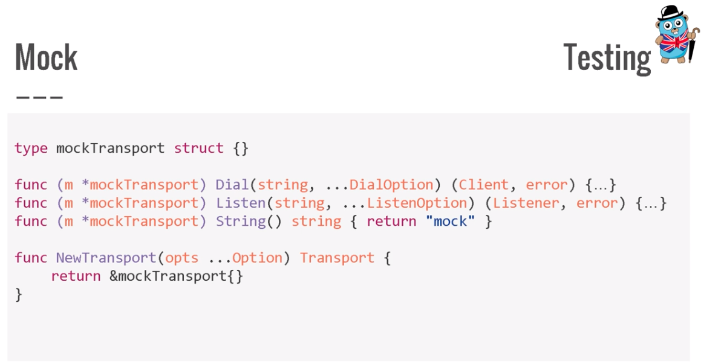
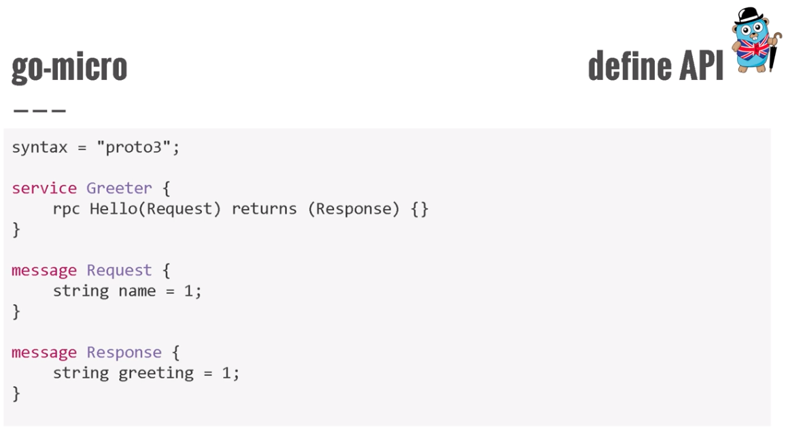
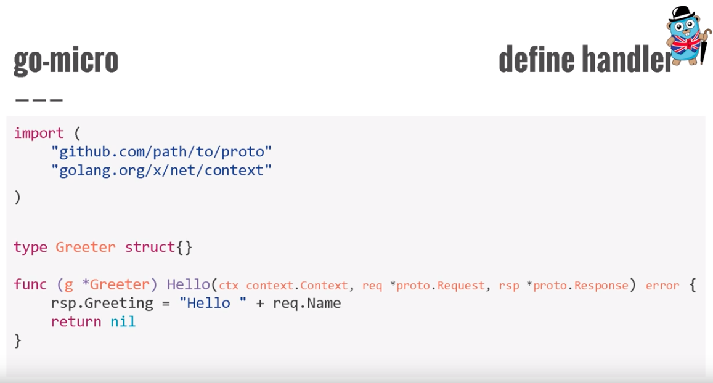
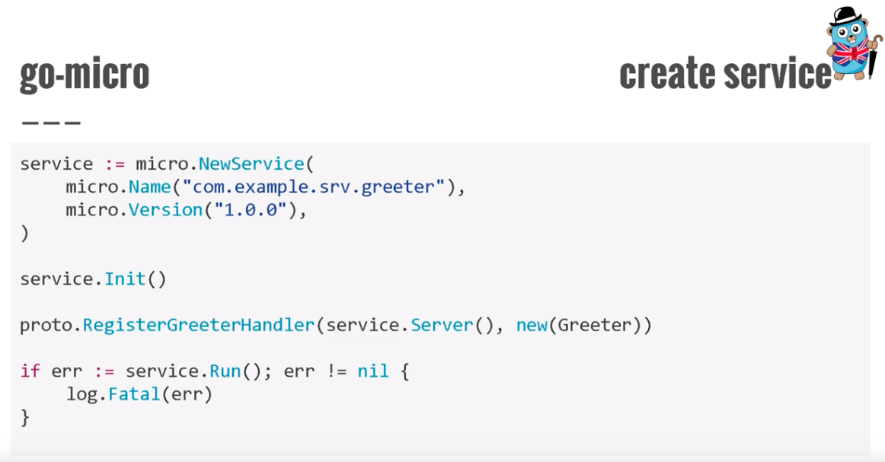

# Go-Micro架构




# Interfaces

A way to specify the behavior of an object. If something can do this, then it can be used here.


## Service Discovery






## Transport






# Develop








# 开发人员pb使用习惯

## 定义API

```go
syntax = "proto3";
package trpc;

message Req {
}

message Rsp {
}


service test_svr {
    rpc Test(Req) returns(Rsp);
    rpc TestRspStream(Req) returns(stream Rsp);
    rpc TestReqStream(stream Req) returns(Rsp);
    rpc TestBothStream(stream Req) returns(stream Rsp);
}
```

## 定义Handler（client、server stub）

- 如果只是将proto文件用作消息序列化、反序列化的手段，那么一般执行的时候：`protoc —go_out=. *.proto`

- 如果希望将proto文件用于消息序列化、反序列化，并希望将其用作IDL指导的目的：`protoc —go_out=plugins=grpc:. *.proto`，这种情况下生成了grpc的相关service、client stub
- 如果希望将proto文件用于消息序列化、反序列化，并希望将其用作IDL指导的目的，但是生成的client、server stub如果希望是自定义的，那么就要自己想办法了：
  - 二次开发protoc-gen-go插件，在其中集成子插件plugins=trpc，自己生成所需的client、server stub接口，这个方法是可行的！
  - 再次基础上同时提供命令工具，一键生成服务模板，针对生成的client、server stub提供默认实现，业务开发人员自己填充接口实现的逻辑代码即可。

> 为什么不直接实现grpc生成的client、server stub？
>
> 如果这样的话，rpc底层的一些相关操作，我们就难以灵活地按自己的需要去进行定制化处理，当然去完全理解它的代码并定制化的去开发也是可以的，但是那样的话完全理解它的逻辑应该也是比较复杂的，而且目前我们迫切需要植入一些定制化的能力，理解并修改起来可能工程量还是比较麻烦的。
>
> 当然了我们实现的时候，肯定也会吸收一些业界比较好的思想，纳入到我们的整体设计中，并不是说闭门造轮子。
>
> 而且，stream这种场景目前来看，我们大多数业务后台应该还不是那么需要，不过某些业务场景可能比较需要，这里呢，我们优先提供非stream的rpc实现，先满足大多数业务开发需要。

## 定义Service

以GoNeat框架为例，我们利用了proto文件的消息序列化、反序列化能力，也利用了它的自描述特性，提取FileDescriptor信息然后指导后续服务模板的创建，对于每个rpc我们是以AddExec(Cmdstring, Exec)的方式来注册的。这种方式没有像grpc一样生成Service接口，Exec是个普通的方法，并不是Service接口的具体实现的成员方法。

评估下GoNeat这种方式好，还是类似grpc那种方式好？

- grpc这种比较自然，pb里面有什么我就创建什么样的服务接口，业务开发提供实现，非常自然；

- goneat这种比较灵活，因为没有这里的接口约束，我可以任意指定命令字和处理方法的映射关系，比如其他业务协议ilive的\${bigcmd}_​\${subcmd}和nrpc协议的DoSomething，甚至可以将http uri也映射到相同的处理方法，可以映射到相同的方法进行处理：

  ```bash
  defaultServer.AddExec('0x1_0x2', DoSomething)
  defaultServer.AddExec('DoSomething', DoSomething)
  defaultServer.AddExec('/cgi-bin/web/DoSomething', DoSomething)
  ```

  如果一个部门有多个业务协议在使用，某个服务希望同时暴露多个协议给调用者的时候，这种方式就非常灵活了。

- 有没有两者可兼得的方法呢？client切换协议可以借助trpc工具生成不同的client stub来实现，这里主要考虑服务端如何尽可能有优雅地解决这个问题。

  ```go
  ============== protobuf ==============
  service test_svr {
    rpc DoSomething(Req) returns(Rsp);
  }
  
  ============= server stub ============
  type TestSvr interface {
    DoSomething(ctx, req) (rsp, error)
  }
  
  type TestSvrImpl struct {}
  func (s *TestSvrImpl) DoSomething(ctx, req) (rsp, error)
  
  ========== service instance ==========
  service := NewTrpcService("/trpc/app/serviceName.rpcName")
  service.Register(&TestSvr{})
  
  service.Forward("0x1_0x2", TestSvr.DoSomething)
  service.Forward("/cgi-bin/web/DoSomething", TestSvr.DoSomething)
  ```

  这对`func (s *TestSvrImpl) DoSomething(ctx, req) (rsp, error)`提出了要求，如果我要获取包头相关信息，该怎么获取呢？可以为不同的业务协议定制化一个协议Session或者协议Context，建议用session的概念，context只会用来进行全局超时控制、不传值。如果这样的话，问题就可以迎刃而解，相关的实现可以参考goneat。

  - 这里的`service.Register(&TestSvr{})`需要借助反射，将rpc以及对应的方法名全部注册上去！

  - 如果这里的业务协议是ilive、simplesso，这种靠命令字来的，代码生成工具还要自己添加Forward！

  如果是像goneat那样的话，其实也挺直观的，只是似乎感觉有点割裂了服务这个整体，这里的Forward、以及工具上的特殊逻辑又显得有点累赘，看看怎么权衡、选择。

  ## 定义Client

  rpc本身的含义就是像调用本地方法一样调用远程服务接口。从一个开发者角度来说，如果要调用其他的服务，协议肯定要先知道，假如我知道了它这里的proto文件、业务协议，那么就可以很方便地借助`trpc`工具生成对一个的client stub，以上面提到的`test_svr`为例：

  ```go
  rsp, err := TestSvr.DoSomething(context.TODO(), &req{})
  ```

  这样就应该可以完成rpc调用，但是这里有个点需要注意，就是这里的rpc在服务注册时是注册的什么呢？比如是/trpc/app/test_svr.doSomething，还是trpc.App.TestSvr.DoSomething，这个要保持一致，只能是服务注册时先通过统一的系统申请服务名，然后再进行注册，调用方也应该确认自己调用的服务名到底是什么，对吧？

  所以这里的client stub需要调整下：

  ```go
  TestSvr.NewClient("/trpc/app/TestSvr") 
  rsp, err := TestSvr.DoSomething(context.TODO, $req{})
  ```

  如果要想支持l5、cmlb、iplist怎么办呢？这里要全局考虑下如何进行抽象：

  ```go
  type Registry interface{
  }
  type Selector interface{
  }
  type Client interface{
  }
  ```

  client stub和server stub要分别生成！

  

# 总结