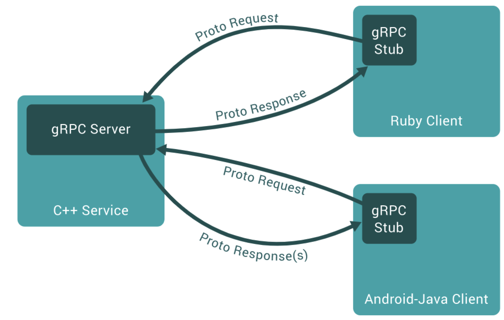

exploring http/2 with go: https://www.youtube.com/watch?v=3IHJ6gJHITw


# http2

http2里面stream相当于一个会话，针对每个会话，涉及到请求响应的处理周期；

http2里面stream上发送的每个请求、响应都可以细分为多个frame进行传送、重组；

**http1.x vs http2.x**

- http1是将整个html文档进行发送的，之后可能会在传输层进行分片。
- http2会将stream上要发送的单个请求分为多个frame进行发送，相当于将在传输层要做的分片工作提前了，如head1、header2、payload等，。
- http2会将请求对应的响应也是按照多个heder进行接收的，收完在传输层进行包的重组。

# go-micro

microservices in go using go-micro: https://www.youtube.com/watch?v=OcjMi9cXItY
                                                              https://github.com/micro/go-micro
go这个小组的初步设计，设计很大程度上参考了这个框架。


# grpc

grpc guides: https://grpc.io/docs/guides/

## what is grpc

- 使用protocol buffers作为IDL（接口描述语言），以此来描述服务、服务接口、请求、响应参数、请求方式

- grpc，rpc调用依赖基于protocol buffers生成的rpc client、server stub，像调用本地方法一样实现远程调用。

  

## grpc concepts

grpc一个常见的service定义如下所示，service里面的rpc支持4种模式：

- 发送一个请求，接收一个响应
- 发送一个请求，流式接收多个响应（考虑tcp长连接或者udp，可以收到stream结束报文之前循环收结果）
- 流式发送多个请求，接收一个响应（考虑tcp长连接或者udp，可以发送多个请求然后收到一个响应）
- 流式发送多个请求，流式接收多个响应，这个发送、接收过程本身也是双向并发的

```go
syntax = "proto3";
package "app";

message HelloRequest {
  string greeting = 1;
}

message HelloResponse {
  string reply = 1;
}

service HelloService {
    rpc SayHello1(HelloRequest) returns(HelloResponse){}
    rpc SayHello2(HelloRequest) returns(stream HelloResponse){}
    rpc SayHello3(stream HelloRequest) returns(HelloResponse){}
    rpc SayHello4(stream HelloRequest) returns(stream HelloResponse){}
}
```


## Authentication

grpc提供了内置的基于SSL/TLS的认证，也提供了基于google token的认证，当然开发者也可以自定义认证机制使用。


