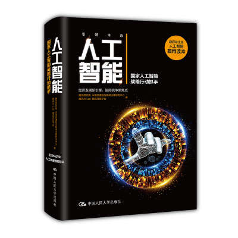
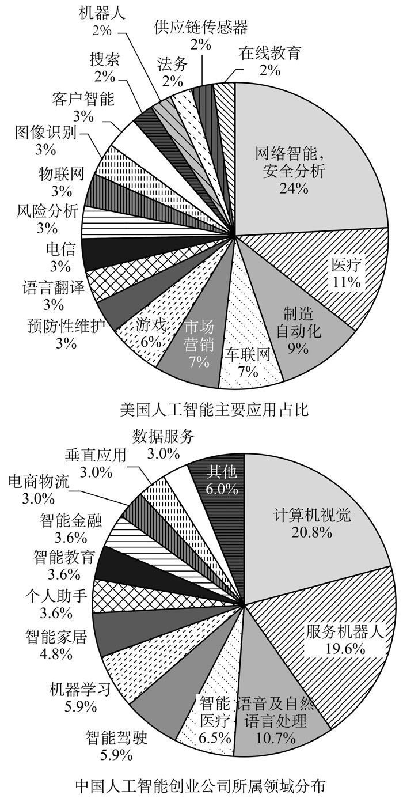

# 人工智能

《人工智能 腾讯研究院等》，人工智能从诞生之初到如今开始在各行各业中大显神通，支撑人工智能蓬勃发展的技术浪潮一波又一波，这本书针对支撑人工智能发展的突破性研究、技术演进进行了描述，并对人工智能的发展、应用现状进行了介绍，并对国内外进行了横向对比。应该说是一本比较重量级的很有参考价值的书籍。

# 序言

## 序一

第三次人工智能浪潮已经到来，这是更强大的计算能力、更先进的算法、大数据、物联网等诸多因素共同作用的结果。

人们希望通过人工智能从琐碎的工作中摆脱出来，“**决策让渡**”不可避免。可是也有另一种担忧，就以智能汽车为例，其初衷是为了减轻人类自身错误带来的安全事故，但是极端情况下，事故无法避免，是否会寻求一个全局最低损害值，哪些该牺牲，哪些该保留，做出这样的决定也确实很……

> 决策让渡将越来越普遍。背后的经济动因是，人们相信或者希望人工智能的决策、判断和行动是优于人类的，或者至少可以和人类不相伯仲，从而把人类从重复、琐碎的工作中解放出来。以自动驾驶汽车为例，在交通领域，90%的交通事故与人为的错误有关，而搭载着GPS、雷达、摄像头、各种传感器的自动驾驶汽车，被赋予了人造的眼睛、耳朵，其反应速度更快，作出的判断更优，有望彻底避免人为原因造成的交通事故。
> 但在另一个层面，正是由于人工智能在决策和行动的自主性上面正在脱离被动工具的范畴，其判断和行为一定要符合人类的真实意图和价值观、道德观，符合法律规范及伦理规范等。 

决策让渡将越来越普遍。背后的经济动因是，人们相信或者希望人工智能的决策、判断和行动是优于人类的，或者至少可以和人类不相伯仲，从而把人类从重复、琐碎的工作中解放出来。以自动驾驶汽车为例，在交通领域，90%的交通事故与人为的错误有关，而搭载着GPS、雷达、摄像头、各种传感器的自动驾驶汽车，被赋予了人造的眼睛、耳朵，其反应速度更快，作出的判断更优，有望彻底避免人为原因造成的交通事故。
但在另一个层面，正是由于人工智能在决策和行动的自主性上面正在脱离被动工具的范畴，其判断和行为一定要符合人类的真实意图和价值观、道德观，符合法律规范及伦理规范等。

## 序二

世界主要国家高度重视人工智能发展。美国白宫接连发布三份关于人工智能的政府报告，是世界上第一个将人工智能发展上升到国家战略层面的国家，人工智能的战略规划被视为美国新的阿波罗登月计划，美国希望能够在人工智能领域拥有像其在互联网时代一样的霸主地位。 

## 序四

人工智能的爆发却始于近三年，2015—2016年诞生的人工智能企业数量，超过了过去10年之和，融资额也在不断再创新高。 

# Part 1 技术篇：颠覆性技术的真相

人工智能领域由于其长达60余年的历史和涉及范围的广泛，使其拥有比一般科技领域更复杂、更丰富的概念。

 

## 第一章 认知鸿沟下的人工智能 

不同大众群体对AI的印象，本轮人工智能浪潮主要是“**深度学习**”方面的突破。

> （1）AI印象：提到“人工智能”，你首先想到什么？（见图1-2）
>
> 图1-2 AI印象图谱
> 超过半数的调查对象提到了“阿尔法狗”（AlphaGo）、“机器人”。热度高的词还包括“自动驾驶”“终结者”“Siri”“大数据”。在谈论人工智能时，人们常常把它和机器人的概念混淆起来。而本轮人工智能浪潮更多是基于大数据的深度学习算法繁荣的表现，和以往试图以机器人的形态还原人类智能和行为的智能系统的“通用型人工智能”（Artificial General Intelligence）并不能等同起来。

当前AI已经具备的部分能力及进展，这些能力也是AI当前的主要研究方向吧。

> （2）AI已经具备哪些能力？（见图1-3）
>
> 图1-3 人工智能已经具备哪些能力？
> 人工智能是一组技术的统称。要理解AI已经具备的能力，需要了解人工智能目前技术领域的发展及其能够解决的问题，而并非把“人工智能”看成是一种笼统的能力。例如，决策能力涉及强化学习。创造力是指跟创造有关的生成模型，在内容生成领域会有很好的应用。情感计算研究就是试图创建一种能感知、识别和理解人的情感，并能针对人的情感做出智能、灵敏、友好反应的计算系统，即赋予计算机像人一样的观察、理解和生成各种情感特征的能力。目前，有关研究已经在人脸表情、姿态分析、语音的情感和识别方面获得一定进展。机器了解你的喜怒哀乐，但并不意味着它会因此像人类一样引发“同理心”。

（2）AI已经具备哪些能力？（见图1-3）

图1-3 人工智能已经具备哪些能力？
**人工智能是一组技术的统称。要理解AI已经具备的能力，需要了解人工智能目前技术领域的发展及其能够解决的问题，而并非把“人工智能”看成是一种笼统的能力。例如，决策能力涉及强化学习。创造力是指跟创造有关的生成模型，在内容生成领域会有很好的应用。情感计算研究就是试图创建一种能感知、识别和理解人的情感，并能针对人的情感做出智能、灵敏、友好反应的计算系统，即赋予计算机像人一样的观察、理解和生成各种情感特征的能力。目前，有关研究已经在人脸表情、姿态分析、语音的情感和识别方面获得一定进展。机器了解你的喜怒哀乐，但并不意味着它会因此像人类一样引发“同理心”。**

如果人机交互设备也获得进一步突破，人工智能一定会更大范围普及。

> 47.8%的调查对象认为，人工智能将在10年后普及。经过进一步分析，从事行业与人工智能直接相关的受访者有更高的比例认为人工智能会在未来10年在社会普及（见图1-4）

“造人”，当然希望它能获得类似人的意识，上小学时看着《当代小学生》封面上的机器人头像，很想要一个玩啊

> 对于达到人工智能的终极目标而言，意识是一个绕不开的难题。如果未来“通用型人工智能”成为可能，一定会伴随着“机器意识”的出现。而对于本轮基于机器学习的人工智能浪潮而言，这还是一个相对遥远的研究方向。

对AI应用领域的憧憬

> （1）您希望在哪些领域使用人工智能？
> 调查结果显示，受访者最希望在**智能家居、交通运输、老年人/儿童陪护和个性化推荐领域**使用（见图1-7）。
>
> 图1-7 您希望在哪些领域使用人工智能？

绝大部分都是希望“**人工智能为主，人类监督为辅**”。

> 调查对象被要求回答在这九大场景中，多大程度上可以交给“人工智能”去完成：1）人类自己做；2）人类为主，人工智能为辅；3）人工智能为主，人类监督；4）人工智能取代人；5）不清楚。
> 调查结果如图1-8所示。
>
> 图1-8 九大领域人工智能的接受程度

 根据人们对以上问题的答案，容易得出一个符合公众想象的结论，即机械化程度越高的工作，人们越希望由人工智能来完成。而需要创作的工作，人们对于人类的能力更自信。

**对AI支持反对的声音，更多的是因为对人工智能的界定不一致。之前埃隆马斯克反对的是强人工智能，而其他大佬表示支持的是狭义的人工智能，当然不排除他们也支持强人工智能，但是专业研究人员认为2045年之前技术水平无力支撑强人工智能的出现。**

> 与马斯克的“AI威胁论”相对的是，包括扎克伯格、李开复、吴恩达等在内的多位人工智能业界和学界人士都表示人工智能对人类的生存威胁尚且遥远。双方对人工智能是否会威胁人类的最大分歧来源于对“人工智能”的不同理解。马斯克语境中的“人工智能”主要是指“强人工智能”（或“通用型人工智能”），即具备处理多种类型的任务和适应未曾预料的情形和能力。而扎克伯格所说的“人工智能”是指狭义的专业领域的人工智能能力。目前科学界对“强人工智能”何时会实现尚无定论。超过半数的科学家及技术研究者认为“强人工智能”在2045年之前不会实现，而非技术领域的群体则预测它会在更短的时间内实现

 误解4：人工智能是一项技术。
事实：**人工智能包含许多技术。在具体的语境中，如果一个系统拥有语音识别、图像识别、检索、自然语言处理、机器翻译、机器学习中的一个或几个能力，那么我们就认为它拥有一定的人工智能。**

误解5：通用型人工智能将在短期内到来。
事实：短期内，通用型人工智能不是产业界主流的研究方向。我们更有可能看到深度学习技术在各个领域深耕。

误解6：人工智能可以独立、自主地产生意识。
事实：目前的人工智能离通用型人工智能还有一段距离。工具型人工智能无法产生意识。

 基于大数据的深度学习框架已经被验证

> 人工智能再度兴起并非偶然。本轮人工智能之所以能蓬勃发展，源于我们有了足够海量的数据、强大的计算资源以及更先进的算法。新一代的变化出现了重要的特征：基于大数据的深度学习。

**人工智能再度兴起并非偶然。本轮人工智能之所以能蓬勃发展，源于我们有了足够海量的数据、强大的计算资源以及更先进的算法。新一代的变化出现了重要的特征：基于大数据的深度学习。**

## 第二章 人工智能的过去

给人工智能下个准确的定义并不容易。一般认为，人工智能是研究、开发用于模拟、延伸和扩展人的智能的理论、方法、技术及应用系统的一门新的技术科学。

人工智能层次

> 如果要结构化地表述人工智能的话，从下往上依次是“**基础设施层、算法层、技术层、应用层（见图1-16）**”。基础设施包括硬件/计算能力和大数据；算法层包括各类机器学习算法、深度学习算法等；再往上是多个技术方向，包括赋予计算机感知/分析能力的计算机视觉技术和语音技术、提供理解/思考能力的自然语言处理技术、提供决策/交互能力的规划决策系统和大数据/统计分析技术。每个技术方向下又有多个具体子技术；最顶层的是行业解决方案，目前比较成熟的包括金融、安防、交通、医疗、游戏等。

**回顾人工智能发展史，每次基础设施的发展都显著地推动了算法层和技术层的演进。从20世纪70年代的计算机兴起、80年代的计算机普及，到90年代计算机运算速度和存储量的增加、互联网兴起带来的数据电子化，均产生了较大的推动作用。而到了21世纪，这种推动效果则更为显著，互联网大规模服务集群的出现、搜索和电商业务带来的大数据积累、GPU（图形处理器）和异构/低功耗芯片兴起带来的运算力提升，促成了深度学习的诞生，点燃了人工智能的这一波爆发浪潮。**

图1-18 不同类型芯片运算能力、功耗对比

功耗比越来越大的处理器芯片，甚至是专用于AI处理的ASIC芯片，简单，不可编程，任务不可更改，简单，功耗比高！

> 图1-18 不同类型芯片运算能力、功耗对比 

**数据挖掘的范畴最大，表示从数据中挖掘出走价值的信息；如何挖掘可以靠人工，当然更希望通过算法，机器学习算法就是为了更有效地挖掘有价值的信息的；机器学习算法考虑到计算复杂度，可能会对算法进行简化，用一个经验值常量代替一个变量，或者删减变量，删减学习网络层数，简化是为了计算简单，但是这样训练出的模型可能不是最优，深度学习拥有更多的参数，训练出的模型更加“智能”。**

> 所谓“机器学习”，是指利用算法使计算机能够像人一样从数据中挖掘出信息；而“深度学习”作为“机器学习”的一个子集，相比其他学习方法，使用了更多的参数、模型也更复杂，从而使得模型对数据的理解更加深入，也更加智能。传统机器学习是分步骤来进行的，每一步的最优解不一定带来结果的最优解；另一方面，手工选取特征是一种费时费力且需要专业知识的方法，很大程度上依赖经验和运气。而深度学习是从原始特征出发，自动学习高级特征组合，整个过程是端到端的，直接保证最终输出的是最优解。但中间的隐层是一个黑箱，我们并不知道机器提取出了什么特征（见图1-19）。
>
> 图1-19 深度学习与传统机器学习的差别

**无监督学习，典型的应用场景是用户聚类、新闻聚类等。**

**监督学习典型的应用场景是推荐、预测相关的问题。**

再往后的一个标志性时间是2014年，Ian Goodfellow等学者发表论文提出题目中的“生成对抗网络”，标志着GANs的诞生，并自2016年开始成为学界、业界炙手可热的概念，它为创建无监督学习模型提供了强有力的算法框架。时至今日，神经网络经历了数次潮起潮落后，又一次站在了风口浪尖，在图像识别、语音识别、机器翻译等领域，都随处可见它的身影（见图1-23）。

深度神经网络所需的训练成本、调参复杂度等问题仍备受诟病，SVM则因其简单性占据了一席之地，在文本处理、图像处理、网页搜索、金融征信等领域仍有着广泛应用。 

AlphaGo中创造性地将强化学习和深度学习进行了结合，取得了很好的效果。

> 另一个重要领域是强化学习，这个因AlphaGo而为人所熟知的概念，从60年代诞生以来，一直不温不火地发展着，直到在AlphaGo中与深度学习的创造性结合让它重获新生。

在全球最权威的计算机视觉竞赛ILSVR（ImageNet Large Scale Visual Recognition Competition）上，千类物体识别Top-5错误率在2010年和2011年时分别为28.2%和25.8%，从2012年引入深度学习之后，后续4年分别为16.4%、11.7%、6.7%、3.7%，出现了显著突破。

进入2010年以后，基于大数据和浅层、深层学习技术，自然语言处理的效果得到了进一步优化。机器翻译的效果进一步提升，出现了专门的智能翻译产品。对话交互能力被应用在客服机器人、智能助手等产品中。这一时期的一个重要里程碑事件是IBM研发的Watson系统参加综艺问答节目Jeopardy。比赛中Watson没有联网，但依靠4TB磁盘内200万页结构化和非结构化的信息，成功战胜了人类选手取得冠军，向世界展现了自然语言处理技术的实力

谷歌推出的神经网络机器翻译（GNMT）相比传统的基于词组的机器翻译（PBMT），英语到西班牙语的错误率下降了87%，英文到中文的错误率下降了58%，取得了非常强劲的提升（见图1-32）。

很有画面感，🌝

> 人工智能规划决策系统的发展，一度是以棋类游戏为载体的。最早在18世纪的时候，就出现过一台能下棋的机器，击败了当时几乎所有的人类棋手，包括拿破仑和富兰克林等。不过最终被发现机器里藏着一个人类高手，通过复杂的机器结构以混淆观众的视线，只是一场骗局而已。

决策树算法中，剪枝是很重要的一步

> 人们也意识到，只有尽可能减少计算复杂度，才可能与人类一决高下。于是，“剪枝法”被应用到了估值函数中，通过剔除掉低可能性的走法，优化最终的估值函数计算。在“剪枝法”的作用下，西北大学开发的象棋程序Chess4.5在1976年首次击败了顶尖人类棋手。

人们也意识到，只有尽可能减少计算复杂度，才可能与人类一决高下。于是，“剪枝法”被应用到了估值函数中，通过剔除掉低可能性的走法，优化最终的估值函数计算。在“剪枝法”的作用下，西北大学开发的象棋程序Chess4.5在1976年首次击败了顶尖人类棋手。

到了2016年，硬件层面出现了基于GPU、TPU的并行计算，算法层面出现了蒙特卡洛决策树与深度神经网络的结合。4∶1战胜李世石；在野狐围棋对战顶尖棋手60连胜；3∶0战胜世界排名第一的围棋选手柯洁，随着棋类游戏最后的堡垒——围棋也被AlphaGo所攻克，人类在完美信息博弈的游戏中已彻底输给机器，只能在不完美信息的德州扑克和麻将中苟延残喘。

## 第三章 人工智能的现在与未来

完整的语音处理系统包括哪些部分：

> **一个完整的语音处理系统，包括前端的信号处理、中间的语音语义识别和对话管理（更多涉及自然语言处理），以及后期的语音合成。**

说话人声检测，比较困难地是选厂拾音，近厂中不存在的或者比较小的问题，如环境噪音、回音，在远厂环境下就会被放大。需要做一些降噪、消除回音、人声信号增强等处理。

> **说话人声检测：**
>
> - 有效地检测说话人声开始和结束时刻，区分说话人声与背景声；
>
> - 回声消除：当音箱在播放音乐时，为了不暂停音乐而进行有效的语音识别，需要消除来自扬声器的音乐干扰；
>
> - 唤醒词识别：人类与机器交流的触发方式，就像日常生活中需要与其他人说话时，你会先喊一下那个人的名字；
>
> - 麦克风阵列处理：对声源进行定位，增强说话人方向的信号、抑制其他方向的噪音信号；
>
> - 语音增强：对说话人语音区域进一步增强、环境噪声区域进一步抑制，有效降低远场语音的衰减。
>
>   除了手持设备是近场交互外，其他许多场景——车载、智能家居等——都是远场环境。在远场环境下，声音传达到麦克风时会衰减得非常厉害，导致一些在近场环境下不值一提的问题被显著放大。这就需要前端处理技术能够克服噪声、混响、回声等问题，较好地实现远场拾音；同时，也需要更多远场环境下的训练数据，持续对模型进行优化，提升效果。

语音识别，不仅要将人声从复杂声音环境中提取出来，还要考虑解决类似追踪多人语音信号将每个人的语音信号进行分离提取的问题。

> **语音识别的过程需要经历“特征提取、模型自适应、声学模型、语言模型、动态解码”等多个过程**。除了前面提到的远场识别问题之外，还有许多前沿研究集中于解决“鸡尾酒会问题”（见图1-35）。“**鸡尾酒会问题**”显示的是人类的一种听觉能力，**能在多人场景的语音/噪声混合中，追踪并识别至少一个声音**，在嘈杂环境下也不会影响正常交流。
>
> 这种能力体现在两种场景下：
>
> - 一是人们将注意力集中在某个声音上时，比如在鸡尾酒会上与朋友交谈时，即使周围环境非常嘈杂、音量甚至超过了朋友的声音，我们也能清晰地听到朋友说的内容；
>
> - 二是人们的听觉器官突然受到某个刺激的时候，比如远处突然有人喊了自己的名字，或者在非母语环境下突然听到母语的时候，即使声音出现在远处、音量很小，我们的耳朵也能立刻捕捉到。
>
>   而机器就缺乏这种能力，虽然当前的语音技术在识别一个人所讲的内容时能够体现出较高的精度，当说话人数为两人或两人以上时，识别精度就会大打折扣。如果用技术的语言来描述，问题的本质其实是给定多人混合语音信号，一个简单的任务是如何从中分离出特定说话人的信号和其他噪音，而复杂的任务则是分离出同时说话的每个人的独立语音信号。在这些任务上，研究者已经提出了一些方案，但还需要更多训练数据的积累、训练过程的打磨，逐渐取得突破，最终解决“鸡尾酒会问题”。  

语音合成现在可以听清楚，但是机器感十足，体验不是很好。感觉Google Assistant体验不错，语音流畅。

> 考虑到语义识别和对话管理环节更多是属于自然语言处理的范畴，剩下的就是语音合成环节。**语音合成的几个步骤包括：文本分析、语言学分析、音长估算、发音参数估计等**。基于现有技术合成的语音在清晰度和可懂度上已经达到了较好的水平，但机器口音还是比较明显。**目前的几个研究方向包括：如何使合成语音听起来更自然；如何使合成语音的表现力更丰富；如何实现自然流畅的多语言混合合成**。只有在这些方向上有所突破，才能使合成的语音真正与人类声音无异。

计算机视觉包含的研究方向

> **计算机视觉的研究方向，按技术难度的从易到难、商业化程度的从高到低，依次是处理、识别检测、分析理解**。图像处理是指不涉及高层语义，仅针对底层像素的处理；图像识别检测则包含了语音信息的简单探索；图像理解更上一层楼，包含了更丰富、更广泛、更深层次的语义探索。目前在处理和识别检测层面，机器的表现已经可以让人满意，但在理解层面，还有许多值得研究的地方。

图像理解本质上是图像与文本间的交互，可用来执行基于文本的图像搜索、图像描述生成、图像问答（给定图像和问题，输出答案）等。

自然语言处理包含的研究方向：

> **自然语言处理的几个核心环节包括知识的获取与表达、自然语言理解、自然语言生成等等，也相应出现了知识图谱、对话管理、机器翻译等研究方向，与前述的处理环节形成多对多的映射关系。由于自然语言处理要求机器具备的是比“感知”更难的“理解”能力，因此其中的许多问题直到今天也未能得到较好的解决。 **

知识图谱是基于语义层面对知识进行组织后得到的结构化结果，可以用来回答简单事实类的问题， 

语义理解是自然语言处理中的最大难题，这个难题的核心问题是如何从形式与意义的多对多映射中，根据当前语境找到一种最合适的映射。 

语义理解可能的解决方案是利用知识进行约束，来破解多对多映射的困局，通过知识图谱来补充机器的知识。然而，即使克服了语义理解上的困难，距离让机器显得不那么智障还是远远不够的，还需要在对话管理上有所突破。 

**自然语言处理一般是基于分词**。

> 历史上自然语言生成的典型应用一直是机器翻译。传统方法是一种名为Phrased-Based Machine Translation（PBMT）的方法：先将完整的一句话打散成若干个词组，对这些词组分别进行翻译，然后再按照语法规则进行调序，恢复成一句通顺的译文。整个过程看起来并不复杂，但其中涉及多个自然语言处理算法，包括“**中文分词、词性标注、句法结构**”等等，环环相扣，其中任一环节出现的差错都会传导下去，影响最终结果。而深度学习则依靠大量的训练数据，通过端到端的学习方式，直接建立源语言与目标语言之间的映射关系，跳过了中间复杂的特征选择、人工调参等步骤。 

# Part 2 产业篇：人工智能发展全貌

**从产业发展成熟度来看，交通、医疗、金融、娱乐可能成为人工智能最先落地的领域。** 

## 第四章 人工智能产业发展概况 

美国人才梯队完整，中国参差不齐！
AI产业的竞争，说到底是人才和知识储备的竞争。只有投入更多的科研人员，不断加强基础研究，才会获得更多的智能技术。
美国研究者更关注基础研究，人工智能人才培养体系扎实，研究型人才优势显著。具体来看，在基础学科建设、专利及论文发表、高端研发人才、创业投资和领军企业等关键环节上，美国形成了能够持久领军世界的格局。 

## 第五章 自动驾驶 

IBM宣布其科学家获得了一项机器学习系统的专利，可以在潜在的紧急情况下动态地改变人类驾驶员和车辆控制处理器之间的自主车辆控制权，从而预防事故的发生 。

国内智能汽车研发现状：

> **从我国来看，百度公司于2016年9月获得了在美国加州的测试许可，11月在浙江乌镇开展普通开放道路的无人车试运营。其总裁兼首席运营官陆奇更是于2017年4月发布了“Apollo”计划，计划将公司掌握的自动驾驶技术向业界开放，将开放环境感知、路径规划、车辆控制、车载操作系统等功能的代码或能力，并且提供完整的开发测试工具，目的是进一步降低无人车的研发门槛，促进技术的快速普及。腾讯于2016年下半年成立自动驾驶实验室，依托360°环视、高精度地图、点云信息处理以及融合定位等方面的技术积累，聚焦自动驾驶核心技术研发。阿里、乐视等也纷纷与上汽等车企合作开发互联网汽车。** 

## 第六章 智能机器人

服务机器人定义：

> **服务机器人是一种半自主或全自主工作的机器人，它能完成有益于人类健康的服务工作，但不包括从事生产的设备。**

2015年以来，我国经济下行压力进一步加大，企业面临超出预期的困难和挑战。受国内外经济的综合影响，同时随着我国劳动力成本的快速上涨，人口红利逐渐消失，工业企业对包括工业机器人在内的自动化、智能化装备需求快速上升。 

**服务机器人在国内发展的阻力远远小于工业机器人：**

- 一方面是因为服务机器人是中国公司和国外公司差距较小的领域。这是由于服务机器人往往要针对特定市场进行开发，可以发挥中国本土公司与行业紧密结合的优势，从而在与国外公司竞争中占据优势地位；

- 另一方面，国外服务机器人也属于新兴行业，目前比较大的服务机器人公司产业化历史也多在5～10年，大量公司仍处于前期研发阶段，这也在时间上客观给予中国公司缩小差距的机会。再者，服务机器人更靠近消费端，市场空间非常广阔。在人口老龄化加剧以及劳动力成本急剧上升等刚性因素的驱动下，服务机器人产业必将迎来大发展的春天。

随着国内劳动力人口增长趋缓，劳动力占总人口的比例也在迅速下滑，未来将面临劳动力短缺的状况，人口红利也将随之消失。目前最有效的方法就是进行制造业的自动化升级改造。在政府的大力扶持和传统产业转型升级的拉动下，机器人概念或将持续火爆，市场参与热度继续上升。

## 第七章 智能医疗

智能外骨骼：

> 一是**智能外骨骼**。俄罗斯ExoAtlet公司生产了两款“智能外骨骼”产品：ExoAtletⅠ和ExoAtlet Pro。前者适用于家庭，后者适用于医院。ExoAtletⅠ适用于下半身瘫痪的患者，只要上肢功能基本完整，它能帮助患者完成基本的行走、爬楼梯及一些特殊的训练动作。ExoAtlet Pro在ExoAtletⅠ的基础上包括了更多功能，如测量脉搏、电刺激、设定既定的行走模式等。 

达芬奇手术系统：

> 二是**手术机器人**。世界上最有代表性的做手术的机器人就是达·芬奇手术系统。“达·芬奇手术系统分为两部分：手术室的手术台和医生可以在远程操控的终端。

IBM Watson智能医疗

> 在智能诊疗的应用中，IBM Watson是目前最成熟的案例。IBM Watson可以在17秒内阅读3469本医学专著、248000篇论文、69种治疗方案、61540次试验数据、106000份临床报告。2012年Watson通过了美国职业医师资格考试，并部署在美国多家医院提供辅助诊疗的服务。目前Watson提供诊治服务的病种包括乳腺癌、肺癌、结肠癌、前列腺癌、膀胱癌、卵巢癌、子宫癌等多种癌症。Watson实质是融合了自然语言处理、认知技术、自动推理、机器学习、信息检索等技术，并给予假设认知和大规模的证据搜集、分析、评价的人工智能系统。

## 第八章 智能投顾

维基百科将智能投顾定义为财务顾问（Financial Adviser）的一种类型，是以线上方式提供理财建议或投资组合管理服务，通过算法实现对客户资产的配置、管理和优化，从而使人为干预因素降至最低程度。

## 第九章 虚拟现实和增强现实

现阶段，我国VR产业发展正在由用户、技术、硬件、内容、开发者、渠道、资本等力量共同推进，一个良性VR产业生态圈已初步建立，并正在形成一条包括工具设备、行业应用、内容制作、分发平台、相关服务在内的全产业链。
从产业格局上看，形成了地域以一线城市为主，厂商以初创小公司为主，变现方式以线下体验馆为主的发展态势。 

相较国外科技巨头高投入、长周期的VR开发模式，国内大部分小规模初创企业的VR开发具有投入较少、周期较短、技术含量相对较低等特征，产品主要面向国内市场。

目前国内的VR产业发展集中在硬件设备领域，而与之相对应的是内容的极度缺失。当前VR内容多为小型团队进行开发，游戏策划、对战数值等都有着各种问题，使得整个VR内容处于无亮点的重复开发，内容的乏善可陈，大大降低了用户的黏性

**增强现实（Augmented Reality, AR），是在虚拟现实的基础上发展起来的新技术，是通过计算机系统提供的信息增加用户对现实世界感知的技术，将虚拟的信息应用到真实世界，并将计算机生成的虚拟物体、场景或系统提示信息叠加到真实场景中，从而实现对现实的增强。**

**增强现实的呈现形式，按照距离眼睛从近到远分别为手持式（Hand held）、空间展示（Spatial）、可穿戴式（Head-Attached）这几种：**

- 手持式

  即用手机或任何移动终端的摄像头获取现实世界的图像，并在移动终端的现实世界图片、视频中叠加虚拟信息。当前基于手机端的AR游戏、大量的AR卡均是采取这种形式。手持式的呈现方式由于门槛低，大量简单的AR呈现可以采取这种方式。手持式采取的显示原理与下文中的“视频式”相同。另外还有如透明手持式AR展示设备（Optical See-Through Hand-Held Devices）等，但当前并不常见。

- 空间展示

  只要是通过非手持、非头戴的AR展示，都归类为Spatial，包括用显示器展示AR、演唱会、商业展示、博物馆、游乐园等通过AR技术进行公共的虚拟形象的展示，或以其他屏幕呈现增强现实信息。

- 可穿戴式，需要通过佩戴AR眼镜类设备进行呈现。可以分为如下几种：

  - 光场显示或其他视网膜显示技术（Retinal Displays）

    这种技术原理在于设备将虚拟光线直接投射到用户的视网膜上，从而形成以假乱真的效果。光场式被称为AR显示的终极形式。这种显示技术不需要屏幕做载体，通过光场呈现物体全方位深度的图像，用户观察近景或远景均可以实现不同景深的切换。这种显示技术是最为仿真视觉呈现原理的一种显示技术。

  - 头戴式显示技术（Head-Mounted Displays）

    视频式：这种显示方式的原理为设备通过外置的摄像头获取真实世界的信息，并根据机器视觉等技术同时叠加虚拟信息，使得用户通过配置在其眼前的AMOLED屏等显示屏幕看到真实世界和虚拟叠加信息。在视频式的显示技术中，用户看到的均为从设备摄像头所获取的图像，也就是说真实世界的光源是通过设备的摄像头，再通过设备的屏幕呈现给用户的。

    光学式：这种显示技术的原理在于，用户通过人眼前的透镜看到真实世界，而计算机生成的虚拟信息则通过一系列的光学系统投射到人眼中，从而实现在真实世界的光源下叠加虚拟信息的效果。这种显示技术的优点在于真实世界的信息真实、分辨率高、相对轻便，缺点在于虚拟信息的显示效果容易受环境光源强弱的变化。 

AR比VR更容易收到投资者青睐，从用户体验上来说AR要比VR更好，从应用前景来看也是！

> 在市场估值上，AR的估值比VR高。从技术层面来讲，AR和VR是包含和被包含关系，属于计算机图形图像研究范畴。AR的本质在于适应现实、保留现实，真正可以面向千变万化的真实世界，与各行业场景紧密联系；正因为保留现实，才能够做到选择性信息化增强，降低技术应用的时间成本和制作成本，实现高效的认知和交互。总而言之，AR能做的事“想象空间极大”。这是AR估值高于VR的原因。
> 在用户体验上，AR更能够满足用户的体验感。从佩戴舒适感及用户使用便捷性而言，可以完全独立使用，无须线缆连接，也无须同步电脑或智能手机。反观VR设备，虽然吸引了大部分用户的目光，但是当用户真正体验过后，表示当前市场上的大部分VR头戴设备过于沉重，需要连接线缆，限制了用户的使用空间。另外一点体现在交互性及趣味性上，AR能够满足用户的体验感，既增强了用户使用的趣味性，又保证了使用者与技术之间的互动性。
> 在社交方面，AR不会把使用者与真实世界隔开。虽然VR能够给人们的生活带来更大的便捷，可以让人们在虚拟环境中进行面对面的交流，然而当下只能带给用户一个虚幻的世界，让用户独处在同一空间。AR看上去则更具普及性，注重与周围人员的互动，包括对方眼神、神情。
> 在生活应用中，AR未来的发展前景比VR更广阔。AR涉及的技术深度和广度相比VR都要大一些。AR最大的特点就是可以产生虚构与现实事物相混合的环境，具有真实感强、建模工作量小的优点，因而也就更容易与传统的商业业态结合在一起。
> 当前，AR技术取得了很大的发展，但是仍存在很多难题。目前来看，市场需求是很大的，但供应方面却略显不足，尤其是拥有核心知识产权、专利产品及服务质量过硬的企业并不多，行业整体缺乏品牌效应。在需求旺盛的阶段，行业需求巨大，发展前景好，这是毋庸置疑的。但如何保持行业的健康、稳定且可持续发展，需要业内企业的共同努力。 

## 第十章 智能家居 

智能家居现在已经不是停留在概念层面了，各大厂商均已推出自己的智能家居中枢。我们国内的不少厂商也在大力发展智能家居，如小米公司在这方面已经深耕多年了！

> **Facebook发布人工智能管家Jarvis**
> 2016年12月，扎克伯格向公众展示了该公司最新研发的人工智能管家“贾维斯”（Jarvis），这个管家不仅可以调节室内环境、安排会议行程、定时做早餐、自动洗衣服、辨别并招待访客，甚至可以教扎克伯格的女儿说中文。
> **谷歌发布Google-Home与重组Nest**
> 2016年5月19日，谷歌在2016年Google I/O开发者大会上推出了全新的Google-Home智能音箱。同年8月底，智能家居公司Nest Labs的整个平台团队成为谷歌的一部分，以便发力智能家居产业。
> **微软推出Home-Hub智能家庭中枢**
> 2016年12月初，微软推出Home-Hub智能家庭中枢。它实际上是Windows10中的一项功能，主要服务于家庭用户。核心服务是与搭载Cortana（中文名：小娜）助手的PC相结合，面向家庭用户提供家用智能集成服务，能够为用户提供日历、表格、音乐等多种功能的使用和文件信息查询。
> **亚马逊的爆红单品Echo**
> 2014年底，亚马逊在智能家居领域推出一款智能蓝牙喇叭Echo，结合语音助手服务Alexa作为智能家居中枢。Echo接收用户的语音指令后，经过Alexa处理，就能进行控制家电产品、联络优步，或在电商平台采购等操作。对智能家电的第三方厂商，亚马逊持开放态度，吸引智能家居品牌Vivint、idevice、Belkin、Philips Hue等第三方厂商接入其智能家居产品和系统。Echo推出后获得广泛好评，迅速爆红。
> **苹果公司发布Apple HomeKit**
> 苹果在2014年的全球开发者大会（WWDC）上首次发布HomeKit，这一平台是全球最具规模的智能家居生态系统之一。苹果目前通过装置上的“Home”APP加上Siri来控制各种设备，实现了各种设备的互联互通，提升用户智慧生活体验。
> 从我国情况看，当前智能家居市场的竞争格局逐渐明朗，市场上大致存在着四种竞争力量：第一种为传统的家电厂商，代表为美的、海尔等公司，在原有产品上进行智能化改造，并推出了相关智能家电产品和平台产

## 第十一章 无人飞行器

目前，亚洲水稻种植区已有2300多架无人飞行器被用来喷洒农药和肥料。而日本90%的此类工作都由无人飞行器完成。未来农业领域无人飞行器市场将更宽广。

**2016年10月，中国注册的无人飞行器相关企业达到6000多家，其中生产农业无人飞行器的企业就有300多家。 **

在2010年以前，中国民用无人飞行器市场规模小，增长速度慢，主要应用在灾害救援、地图测绘等市场。2011年以后，以大疆为代表的中国消费级民用无人飞行器市场迅速崛起。近年来，无人飞行器在航拍、物流等领域被广泛应用，无人飞行器送货和热门真人秀采用无人飞行器进行航拍，使得民用无人飞行器被广泛关注。中国消费级无人飞行器已处于国际前列，在市场份额、研发制造能力、应用广度深度方面均具有一定优势。

**极飞公司主攻物流无人飞行器、农业无人飞行器；零度智控公司更关注大中型无人飞行器、治安监控无人飞行器。 **

需求方大头竟然是军方和警方，不是民用。

> 在需求方面，国内无人飞行器市场需求90%来自军方和警方，其他方向需求仅占10%，机型以无人靶机和带有电子光学/红外线侦察平台的无人侦察机为主。

在需求方面，国内无人飞行器市场需求90%来自军方和警方，其他方向需求仅占10%，机型以无人靶机和带有电子光学/红外线侦察平台的无人侦察机为主。

10w台？

> 顺丰正在珠三角地区大量测试无人飞行器的配送效果，收集飞行数据，为将来整体运营、调试系统的搭建提供数据支撑。目前，顺丰投资购入的10万台无人飞行器已经到位，即将正式商用。 

## 第十二章 人工智能创业 

中美AI创业领域对比

人工智能作为新时代备受关注的技术，其本质是科技进步对所有产业的提升，而并非单独一个新兴行业，只有当人工智能技术在中国真正普遍地应用于传统行业，而不仅仅属于科技巨头时，其经济潜力才会充分彰显。

