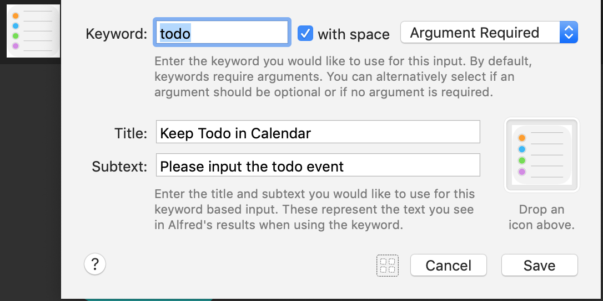
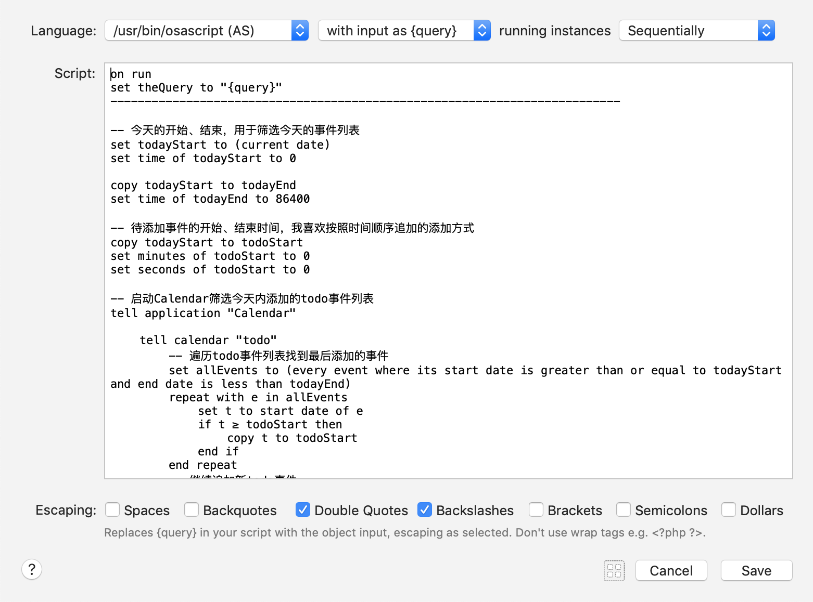

# 高效 “Todo”

Apple设备上有一个非常好的效率工具“**Calendar.app（日历）**”，在日历中可以添加待办事项，并且支持按天、周、月、年视图进行快速浏览，是我工作、学习的好帮手。经常需要将一闪而过的灵感、同事的问题、用户的反馈等快速记录下来，每次唤醒日历进行手动添加效率还是有点低效，能不能实现更高效地“Todo”呢？


结合Alfred+AppleScript编写了一个Workflow，现在方便多了，实现了如下效果。快捷键快速呼出Alfred交互输入框，然后键入“**todo 待办事项描述信息**，然后键入“**回车**”，此时就可以自动添加一条新的待办事项到日历中。想象一下手动打开日历，定位到今天，滑动到下方找一个合适的时间点添加待办事项，输入描述信息再回到原来的工作，好麻烦！再回头看看我的做法，是不是方便多了！


执行上述操作之后：

- 如果日历程序没有启动，添加成功会启动日历程序并提到前台，展示当前添加的待办事项；
- 如果日历程序已经启动，添加成功不会再将日历程序提到前台，在通知中心发一条添加成功的通知；


我理想的高效“Todo”就是近似这样的，目前的方式很好地解决了自己对效率的不懈追求。

这里的实现方式是，打开Alfred->Preferences->Workflows，新建一个Blank Flow，然后配置如下：


workflow中todo节点获取输入的待办事项，并将输入信息通过脚本参数的形式传递给后续的osacript进行处理，该脚本负责添加待办事项到日历。workflow中两个节点的配置如下所示：





完整的脚本代码如下：

```javascript
on run
set theQuery to "{query}"
--------------------------------------------------------------------------

-- 今天的开始、结束，用于筛选今天的事件列表
set todayStart to (current date)
set time of todayStart to 0

copy todayStart to todayEnd
set time of todayEnd to 86400

-- 待添加事件的开始、结束时间，我喜欢按照时间顺序追加的添加方式
copy todayStart to todoStart
set minutes of todoStart to 0
set seconds of todoStart to 0

-- 启动Calendar筛选今天内添加的todo事件列表
tell application "Calendar"
	
	tell calendar "todo"
		-- 遍历todo事件列表找到最后添加的事件
		set allEvents to (every event where its start date is greater than or equal to todayStart and end date is less than todayEnd)
		repeat with e in allEvents
			set t to start date of e
			if t ≥ todoStart then
				copy t to todoStart
			end if
		end repeat
		-- 继续追加新todo事件
		if hours of todoStart is equal to 0 then
			set hours of todoStart to 8
		else
			set todoStart to todoStart + (1 * hours)
		end if
		set todoEnd to todoStart + (1 * hours)
		make new event with properties {summary:theQuery, start date:todoStart, end date:todoEnd}
	end tell
	
	-- 启动Calendar显示
	if not running then
		run
		delay 0.25
		activate
	else
		set msg to "添加成功：" & theQuery
		display notification msg
	end if
	
	
end tell

----------------------------------------------------------------------

return theQuery
end run
```

希望对大家有帮助！