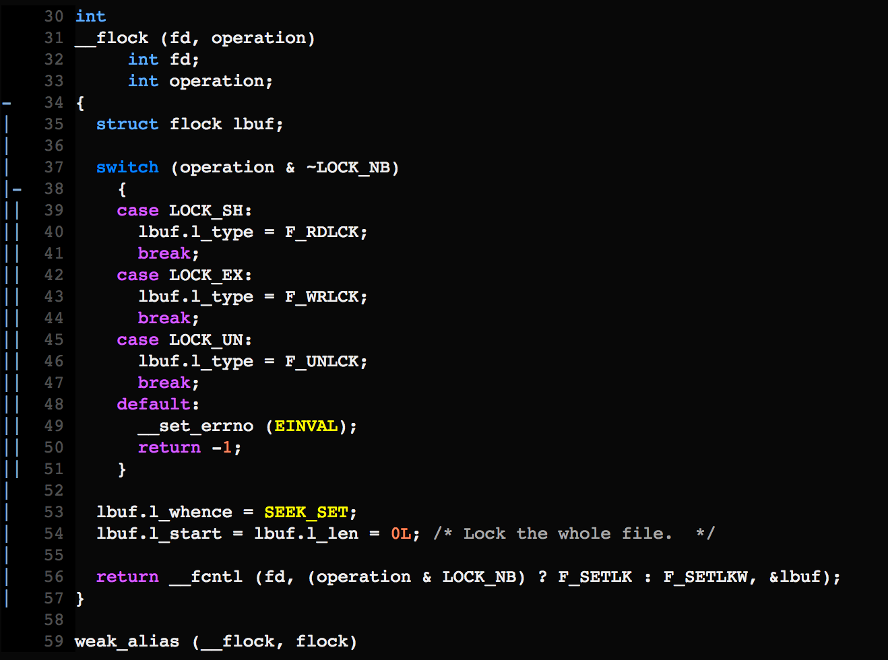

基于`flock`实现的文件锁工具类，benchmark结果：每秒支持100w次lock/unlock操作！

flock更多地是停留在内核对内存做的一些操作，比如对file table entry加锁、解锁，但是这些操作不会像open O_CREAT|O_EXCL一样最终落到文件系统、磁盘驱动层面上，理论上性能会好很多，测试结果也表明了这点。

posix/flock.c提供了一个__flock的实现：


```c
#ifndef _FILELOCKV2_H
#define _FILELOCKV2_H 

#include <sys/types.h>
#include <sys/stat.h>
#include <sys/file.h>
#include <errno.h>
#include <fcntl.h>
#include <unistd.h>
#include <iostream>

#define LOCKFILE "filelockv2.lock"

namespace LinuxExUtils {
    /**
     * 文件锁工具类
     */
    class FileLockV2 {
        public:
            static int lock_fd;

            static int init()
            {
                int fd = open(LOCKFILE, O_CREAT|O_RDWR|O_EXCL, S_IRUSR|S_IWUSR);
                if(fd < 0)
                {
                    printf("failed to create lockfile.\n");
                    return -1;
                }
                return 0;
            }
            
            static int lock()
            {
                lock_fd = open(LOCKFILE, O_RDONLY);
                flock(lock_fd, LOCK_EX);
                return 0;
            }
            
            static int unlock()
            {
                flock(lock_fd, LOCK_UN);
                close(lock_fd);
                return 0;
            }

            static int fini()
            {
               int ret = unlink(LOCKFILE); 
               if(ret<0)
               {
                   printf("failed to unlink lockfile.\n");
                   return -1;
               }
               return 0;
            }
    };
    
    int FileLockV2::lock_fd = 0;
}

#endif
```

