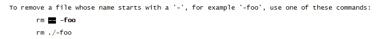

[TOC]

# 常用命令

## 0 基础知识

### 0.1 停止解析命令行选项“--”
一般Linux下命令行参数可以通过两种方式来指定，一种是短选项“-?”，一种是长选项“--？”，当希望停止解析命令行参数，将后续参数全部当做文件名来处理时，可以添加“--”来告诉shell停止解析命令行参数。



### 0.2 tail & grep查看日志

tail选项-f，即--follow，会跟踪日志文件中后续追加的内容；
grep选项--line-buffered会使得grep工作在行缓冲模式，虽然有点性能低下，但是查看日志确实比较有效，能够立即输出打印的日志；
grep选项```--color```可以对grep到的字符串进行高亮显示；
grep选项```-E```可以开启正则表达式搜索，例如一次搜索中要匹配多个uin，可以通过-E 'uin1 | uin2 '来完成；
grep选项```-A、-B、-C```可以控制显示匹配行的上下区域范围，以显示更多关联的事件信息；
grep选项```-n```可以显示匹配行在日志文件中的行号，方便打开日志文件定位到具体的行；

### 0.3 find命令
find命令不仅可以支持搜索，而且可以对搜索到的结果执行某些动作！例如搜索到之后直接执行删除动作：find -iname pattern -delete。
find命令在执行搜索过程中，搜索的pattern使用的是shell中默认的匹配模式，?代表任意单个字符，而*代表任意数量的字符！
find命令在执行搜索的过程中，还可以指定是否跟踪符号链接，-P、-L、-H。 

### 0.4 单引号&双引号变量替换问题

```
val=123
echo '$val'     $val    单引号变量不替换
echo "$val"     123     双引号变量替换
echo '"$val"'   "$val"  单引号内即便有双引号也不替换，双引号作为普通字符展示
echo "'$val'"   '123'   双引号内即便有单引号也执行替换，单引号作为普通字符展示
echo ''$val''   123     单引号内又有单引号，执行变量替换，内部嵌套的单引号不展示
echo ""$val""   123     双引号内又有双引号，执行变量替换，内部嵌套的双引号不展示
```
### 0.5 df、du查看磁盘占用情况

查看各个分区占用情况：```df -h```，加参数```-s```查看所有分区汇总的占用情况；

查看指定目录下文件、文件夹磁盘占用情况，并按照大小进行排序：```du -h --max-depth=1 | sort -rh```。

### 0.6 测试端口是否打开
telnet host port
如果connected成功，则表示远程主机开放了这个端口;

### 0.7 pwd
pwd打印当前工作目录的路径，但是默认不解析符号链接，-L表示逻辑路径，-P表示物理路径，-P会解析符号链接。

### 0.8 echo
echo -e "xxxx"，-e参数会解析后面字符串中的转义字符，例如使用\xxx表示的颜色值等等！

## 1 用户相关

## 2 时间相关

- 将指定时间戳转为指定格式的日期时间，```date -d @unix_ts [format]```；
- 将指定格式的日期时间转为unix时间戳，```date -d "yyyy-MM-dd hh:mm:ss" +%s```，将当前时间转为unix时间戳```date +%s```；

## 3 文件相关

### 3.1 查看日志文件
- 查看日志文件中正持续写入的日志信息，```tail -f ${logfile}```或者```tailf ${logfile}```；
- 查看历史日志文件、日志刷新频率太快的日志信息，可以直接使用vim进行查看，指定```vim -u NONE```可以让vim忽略很多额外的配置项，加载日志文件更快；

查看日志时可能只希望显示遵循特定pattern的部分，这时可以结合 **grep** 来使用，例如：```tail -f ${logfile} | grep <keyword> --color -C 5```。

### 3.2 查看文件大小
- 查看当前目录下各个文件大小，```ls -l -h```或```ll -h```，如果希望排序可以使用```ll -hS```；
ls命令不会对文件夹占用的总的空间大小进行统计，如果要统计文件夹的空间大小需要使用```du```。
- 查看当前文件夹的大小，```du -hs .```；
- 查看当前目录下所有文件夹的大小并排序，```du -h --max-depth=1 . | sort -rh```；

### 3.3 搜索文件
- 按名字进行搜索，```find <dir> -iname <pattern>```，```-iname```表示文件名忽略大小写；
- 按尺寸进行搜索，```find <dir> -size +20M```，搜索目录dir下尺寸大于20M的所有文件；

对于搜索出的文件，find提供了几个选项可以执行删除或者自定义的操作：
- 执行搜索并删除，如```find -name "*.log" -delete```；
- 执行自定义操作，如搜索并查看，```find -name "*.log" -exec cat {} +```；

### 3.4 删除特殊文件

ll -i，可以看到某些编码显示存在问题的文件，这些文件的文件名我们可能无法正常输入，可以通过find -inum <inode> | xargs rm来搜索到指定的文件后删除。

```
root@10.129.132.170:/data/java/webapps/cgi_qqlove_admin # ll -i
12339539 drwxrwxrwx  8 root root     4096 Apr 19 18:52 cgi_qqlove_admin/
 8569475 -rw-r--r--  1 root root 57233999 Apr 19 17:45 cgi_qqlove_admin-bin.zip
 8585490 lrwxrwxrwx  1 root root       32 Feb  5 19:53 logs -> /data/logs/java/cgi_qqlove_admin/
 8569470 -rwxr-xr-x  1 root root      626 Dec 17  2015 refresh.py
 8585495 -rwxr-xr-x  1 root root      478 Aug 19  2016 restart.sh
 9175051 drwxr-xr-x  2 root root     4096 Apr  7 17:13 sync_whitelist_tool/
 8585493 -rwxr-xr-x  1 root root       61 Aug 18  2016 tail.sh
 8569474 -rw-r--r--  1 root root       40 Apr 19 16:30 ?{??Ao???F8?????]24?$??????7e?9????

root@10.129.132.170:/data/java/webapps/cgi_qqlove_admin # find -inum 8569474 | xargs rm
```

### 3.5 搜索文件内容
#### 3.5.1 grep

grep参数-A表示显示匹配行及其后面多少行，-B表示显示匹配行及其前面多少行，也可以直接使用-C代替-A和-B的组合。

```
grep <pattern> file -A num -B num
```

## 4 进程相关

- 查找打开文件的进程
fuser命令可以用于查找打开指定文件的进程，例如查看打开tcp端口8080的进程id，可以通过```fuser 8080/tcp```进行查询。如果想杀死该进程还可以指定参数```-k```，即```fuser -k 8080/tcp```。如果该文件不是当前用户的进程打开的，fuser命令则无法查询到对应的进程。
    
- 查看进程打开的文件
lsof命令

## 5 cpu相关

- top命令

## 6 内存相关

- 查看剩余内存容量（以MB为单位），```free -m```；
- 强制释放文件page cache占用的内存空间，```echo 3 > /proc/sys/vm/drop_caches```；

## 7 网络相关

### 7.1 netstat

netstat可以用于对系统网络状态进行统计，也是网络程序开发中的调试利器，例如借助它可以更有效地跟踪tcp连接状态的变化以发现代码中可能存在的bug等。
常用命令```netstat -nlp```，```-n```不转换端口数值为名称，```-l```只显示处于监听状态的端口，```-p```显示打开该socket的进程pid、进程名称。如果指定```-a```参数，则显示处于监听、非监听状态的socket。

### 7.2 telnet
网络程序开发中，访问对应服务前需要检测一下服务端是否可访问，假如服务端是以tcp方式工作的，可以通过```telnet server-ip server-port```来检测网络连通性。服务端一般是以tcp、udp两种形式同时监听同一个端口的。
但是也不排除这种情况，即一个后台服务值监听udp端口，而不监听tcp端口，udp端口的连通性测试可以借助```tcpdump```或者```iperf```、```nc```来测试。

- tcpdump观察客户端、服务端之间的udp报文可以辅助确定目的udp端口是否被监听；
- iperf、nc也可以借助数据发送来测试目的udp端口是否被监听，参考链接：https://support.asperasoft.com/hc/en-us/articles/216126068-UDP-connectivity-testing。

### 7.3 rz、sz、md5sum
文件上传、下载可以借助于rz、sz来实现，为了保证文件的完整性需要对文件进行md5校验。文件上传之前需要先借助md5sum对文件校验和进行计算，然后借助rz开始上传。上传完成之后需要通过md5sum重新计算校验和并与上传之前的校验和进行对比，二者一致表明文件数据一致。下载文件时也需要对校验和进行比较。

>备注：
>一些支持下载的站点除了提供要下载的软件包之外，往往都会这个软件包的md5值，以便于用户文件下载完成后对数据完整性进行校验。平时生活中自己可能不在乎这个，但是在工作中必须要重视这点，尤其是要在生产环境中发布软件包的时候。

### 7.4 tcpdump

在Linux后台开发过程中，某些场景下需要对网络流量进行    分析，tcpdump是一款抓包工具，某些情况下可以直接对其输出进行分析，更加复杂的场景下可以将tcpdump抓取的包存储到文件中以供其他更加复杂的流量分析工具进一步分析。掌握tcpdump的实用技巧是至关重要的。

本周末我对tcpdump进行了一定的学习，参考下面的帖子：https://danielmiessler.com/study/tcpdump/#gs.tCza_9c。

### 7.5 dns

#### 7.5.1 dig
```dig @ns-server domain -t type +options```

#### 7.5.2 nslooup

#### 7.5.3 nscd
清空dns缓存信息：
- ```nscd -i hosts```
- ```service nscd restart```
- ```systemctl restart nscd.service```

## 8 http相关

### 8.1 ab

使用ab（apache benchmark）进行压测的常用命令选项：

- -n 请求总数量
- -c 并发请求数量
- -r 收到socket错误时ab不退出
- -k keepAlive
- -T 内容类型
- -H 指定头部信息，例如cookie、referer字段等(例如需要qq登录态鉴权的话指定cookie就可以了)；
- -X 指定http代理ip:port

压测命令：```ab -n <总请求数> -r -k -c <并发请求数> -H <header> -T <content-type> -X <proxy> <url>```

命令示例：

```
ab -n 100 -r -k -c 100 \
-T "application/x-www-form-urlencoded" \
-H "Referer:http://now.qq.com" \
-H "Cookie:pac_uid=1_1194606858; _supWebp=1; RK=hmlLEzC2HK; pgv_pvi=456501248; pgv_si=s2696879104; ptui_loginuin=1194606858; pt2gguin=o1194606858; uin=o1194606858; skey=@ZbscQC5SL; ptisp=ctc; ptcz=8c2c8564667f2162e1f009ae31f05402574782766400ed09dee6b137ceabde42; pgv_info=ssid=s6830408540; pgv_pvid=4280629932; o_cookie=1194606858" 
-X localhost:80 \
http://now.qq.com/cgi-bin/now/web/discover/get_whitelist_subject_detail?topic=knknkn
```

### 8.2 curl

如果只需要简单测试一下cgi请求、响应数据是否正常而非性能测试的话，可以使用curl。

curl命令格式为：```curl -e <referer> -b <cookie> <url>```

### 9 定时任务

#### 9.1 周期性定时任务：crontab

crontab中添加定时任务的方式主要有两种：
1）通过指定配置文件的方式，让crond加载新配置，之前的配置会丢失：```crontab crontab.file```；
2）通过crontab -e对现有的定时任务进行编辑，可以添加新的定时任务，也可以删除，保存退出后crond会自动加载最新的配置信息；

下图是crontab配置文件的格式：


#### 9.2 执行一次的定时任务：atd

at……略


