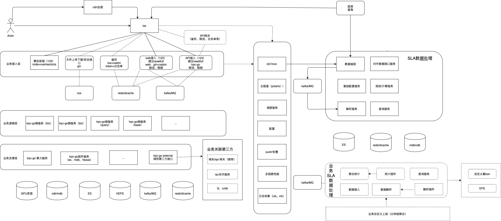

# 应用通用架构及sla

- 应用架构

​        \* 统一业务入口

​        \* 统一协议 http、trpc

​        \* 部署平台（推荐123）

​        \* 日志收集（uls、cls）、链路监控（atta、鹰眼）

​        \* 配置服务（tconf、七彩石）

​         

- SLA数据收集及处理（讨论）

​       \* 运维指标

​            \* tps/qps

​            \* rt

​            \* 接口成功率（核心业务99.9%）

​            \* 故障 （工单、根因分析）/ 每季度故障数

​      \* 业务指标

​           \* 影响自身业务数据（用户数、使用量）

​           \* 给服务业务造成影响（服务不可用时间、影响服务业务量）

总结：

这里的应用通用架构及sla重点关注的是，接口级的成功率等质量属性。整体架构如上图所示，应用在API接入层统一通过007监控进行监控数据上报，007监控底层有打通数据通道，以供后续sla相关的数据抽取、解析、查询。

这里是通过两个维度来对sla进行数据统计：

- 真实的线上流量数据，触发的监控数据上报
- 用户配置的用例，定时通过拨测的形式来触发、上报

对于整体提升sla还是很有必要的，不敢说bg层面是否有必要要求所有产品接入统一的应用通用架构及sla，但是bg层面提供这种能力是有必要的，产品自身角度来说更应该重视。