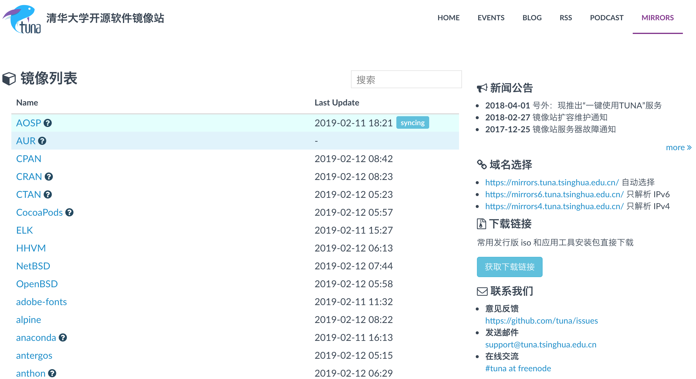

不同Linux发行版采用的软件安装包格式不同，Debian系的都是基于deb格式的，采用dpkg或者apt作为包管理工具，而RHEL系的多采用rpm格式的，采用rpm或者yum或者dnf作为包管理工具。

Linux软件源中维护了一系列的软件安装包列表，为了加速不同地域的用户访问软件源，也存在很多的软件源镜像Mirror，[如清华大学软件源镜像](https://mirror.tuna.tsinghua.edu.cn)。这个镜像网站做的非常好，已经远远超出了Linux发行版镜像的范围，它也维护BSD、Homebrew、ELK等其他软件安装包。

如果我们使用的是CentOS，想把软件园切换到清华大学维护的软件源镜像地址，只需参考对应的[CentOS更换软件源帮助信息](https://mirrors.tuna.tsinghua.edu.cn/help/centos/)即可。如果我们使用的是Ubuntu，想更换Ubuntu的源，只需参考对应的[Ubuntu更换软件源帮助信息](https://mirrors.tuna.tsinghua.edu.cn/help/ubuntu/)即可。