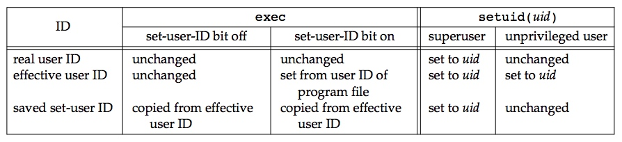

在APUE上对 **real uid、effective uid、saved setuid** 之间的关系以及修改做了总结，如下图所示。



下面给出一个简单的示例，以加深自己对real uid、effective uid、saved uid的理解。

```c
// main.c
int main(int argc, char *argv[])
{
    uid_t uid;
    uid_t euid;
    uid_t suid;

    setuid(0);
    getresuid(&uid, &euid, &suid);
    printf("%d %d %d\n", uid, euid, suid);

    setuid(1000);
    getresuid(&uid, &euid, &suid);
    printf("%d %d %d\n", uid, euid, suid);

    return 0;
}
```

```bash
$ gcc -o main main.c
$ sudo chown lightdm:lightdm main <= lightdm id:108
$ sudo chmod u+s a.out            <= set uid
$ whoami
$ zhangjie
$ ./main
$ 1000 108 108
$ 1000 1000 108
```

1）第一行输出1000 108 108
这是运行main时是以用户1000运行的，是普通用户，程序运行过程中，real uid不会发生变化；
由于main属主是lightdm，其id是108，并且在main 上设置了设置用户id，因此程序执行该程序时会将effective uid设置为main的属主的id ，即108；
saved setuid从effective uid复制过来，即108。

执行main的过程，首先是shell fork一下，然后判断main的权限，并调用setuid改变进程的有效用户id，然后调用exec执行main程序，试想假如main程序中又调用了其他程序 ，比如一个root用户的、设置了设置用户id的程序，那么权限最高可以提升到root，必须有一种方式可以让进程的权限恢复到嵌套调用之前的权限？saved setuid就是用来恢复进程执行exec之前的effective uid的。

2）第二行输出1000 1000 108
是因为普通用户1000执行过程中调用了setuid(1000)， 对于普通用户来说，setuid可以将effective uid设置为real uid或者saved setuid，在 我们的上述示例程序中，将effective uid设置为了real uid，将euid设置为与suid相同的情况多为权限恢复时使用。

这里也可以参考下wiki：[User Identifier](https://en.wikipedia.org/wiki/User_identifier#Saved_user_ID)
