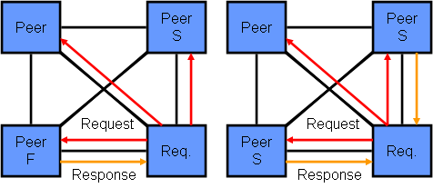

参考文献：[intel cache一致性协议演进](https://www.realworldtech.com/common-system-interface/5/)

intel之前是用的MESI这种cache一致性协议，MESI就是一种典型的强一致算法，intel使用MESI也优雅地实现了强一致。但是，intel现在不用MESI了，而是MESIF。

intel认为MESI中一个core发出请求时广播给多个core，多个core都会响应，这个没必要，太多的rsp浪费带宽也降低了整体的吞吐量。intel额外增加了一个状态F（Foward），仅可以有一个core处于F状态，调整了之前S状态扮演的角色。MESI中S状态接收到req会进行响应，现在S状态的core不再rsp，只有F状态发送rsp。

下图是MESIF与MESI的对比。

除了intel，那么amd怎么做的呢？MOESI（O，Owner）。

MOESI做的改进是，可以用来共享处于dirty状态的cache line给其他core，如core 1已经处于M状态，core 2请求同一个内存地址时，core 1会将处于M状态的cache line的数据返回给core 1，这个时候core 1从状态M变为O。