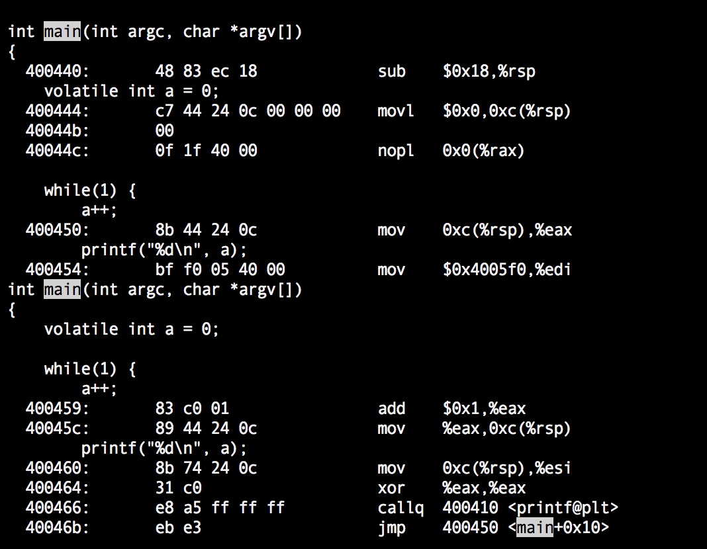

# volatile

volatile字面意思是“**不稳定的、易失的**”，volatile修饰的变量在语义上表示程序执行期间可能会被外部的线程修改，volatile一般会要求编译器对**变量修改的内存可见性**做出保证，即在**多处理器、多核**条件下，假如一个全局变量被多个跑在不同处理器或者核心上的线程访问，其中一个线程对变量进行了修改的话，编译器不管如何优化代码应该保证线程对该volatile变量的修改操作对其他线程可见。

## 1 diff btw java\c\c++

在Java中语言规范明确指出了volatile对应的明确语义，即volatile保证内存可见性，遵从happens-before规则阻止处理器指令重排序（volatile语句前后的语句对应的指令不会被指令重排序到volatile之后或者之前）。JVM中JMM存在“**本地内存**”的概念，多个线程对内存中共享变量的访问都是先加载到本地内存，后续写操作再同步回主存。volatile可以保证一个线程的写操作对其他线程立即可见，实现是借助处理器lock指令使各个线程的本地内存中cache的变量失效，各个线程重新从内存加载变量值。

但是在C、C++规范里面并没有明确指出volatile的语义，具体如何处理volatile的工作就交给了编译器来处理。其实gcc中对volatile也是可以保证内存可见性的，其操作方式就是在gcc开优化（如-O2）的时候不对volatile变量做优化，读写volatile变量都是读内存的而非寄存器从而保证了内存可见性。但是gcc并没有对阻止指令重排序做更多操作。

## 2 how gcc handle volatile

这里可以简单的测试一下：

```c
#include <stdio.h>

int main() {
    // volatile int a = 0;
    int a = 0;
    while(1) {
        a++;
        printf("%d\n", a);
    }

    return 0;
}
```

不开优化的话，有没有volatile gcc生成的代码基本是一致的，并没有特殊处理volatile变量。这里我们开```gcc -O2```优化对比下处理的区别。

**1）不加volatile ：```gcc -g -O2 -o main main.c```**


这里重点看下对变量a的操作，xor %ebx,%ebx将寄存器%ebx设为0，也就是将变量a=0存储到了%ebx，nopl不做任何操作，然后循环体里面每次读取a的值都是直接在%ebx+1，加完之后也没有写会内存。假如有个变量是全局多个线程共享的，并且没有加volatile，多个线程访问这个变量的时候就是用的物理线程跑的处理器核心寄存器中的数据，是无法保证内存可见性的。

**2）加volatile：```gcc -g -O2 -o main main.c```**



这里变量a的值首先被设置到了0xc(%rsp)中，nopl空操作，然后a++时是将内存中的值移动到了寄存器%eax中，然后执行%eax+1再写会内存0xc(%rsp)中，while循环中每次循环执行都是先从内存里面取值用完再写会内存，可以保证内存可见性。因此加了volatile之后即便是在多线程环境中也可以保证内存可见性。

## 3 howto

**另外x86平台处理器是典型的强一致性CPU，这也是x86厉害的地方，即便是多处理器、多核情况下也能保证内存变量在多个处理器、多核上的一致性，即便没有volatile修饰也可以保证这一点。我们单纯地从汇编指令看不加volatile好像会有问题，但是x86处理器在架构、指令集设计上可以保证强一致性。**但是为了更好地跨平台，必须也“更加正确”的代码，volatile还是要用的，否则将来代码移植到非x86机器上不就出问题了。

## 4 why mention this

之所以翻出来说这个问题，是因为之前对c、c++里面volatile有误，原因是有篇内核文档（[why the "volatile" class should not be used](http://static.lwn.net/kerneldoc/process/volatile-considered-harmful.html?highlight=volatile)）没有完全看懂，误以为volatile在C、C++中是无效的，其实作者主要强调的是：**在内核、嵌入式编程中，由于硬件平台的复杂性，volatile虽然能够保证内存可见性，但是volatile毕竟不是原子的，不假思索地使用volatile很有可能会带来bug。**

之前并不是很明白作者的意图，看了下stackoverflow上以为朋友的回答瞬间茅塞顿开，他描述的同时也举了个一个错误使用volatile导致的bug，(stackoverflow volatile issue)[https://stackoverflow.com/questions/27777140/volatile-and-its-harmful-implications/27778390#27778390]。

```c
uint32_t volatile i;

ISR(TIMER0_OVF_vect) {
    ++i;
}

void some_function_in_the_main_loop(void) {
    for(;;) {
        do_something_with(i); // This is thoroughly broken.
    }
}
```

简言之就是do_something_with(i)的函数参数是32位的，但是AVR只有8位寄存器，指令集最多支持一次移动16位数据，所以参数i的传递实际上需要两条move指令。但是在两条move指令之间很可能出现中断会中断两条move指令的连续执行，比如时钟中断到达的时候程序要对变量值+1，这样的话第二条move指令就可能会读取到修改后的值。相当于参数i的高16位、低16位是i修改前后的各一部分，do_something_with()接收到的参数实际上是一个错误的参数，后面的逻辑当然也就出错误了。

## 5 summary

在编程的时候特别是并发程序设计的时候，要考虑下是否有共享变量要保证内存可见性（共享变量一般都要保证），是的话一般要考虑用volatile，然后要看是否要求原子，对应的平台上是否能原生支持该变量类型的原子性操作，如果能则可以用volatile，如果不能那就要考虑用锁来保护。


