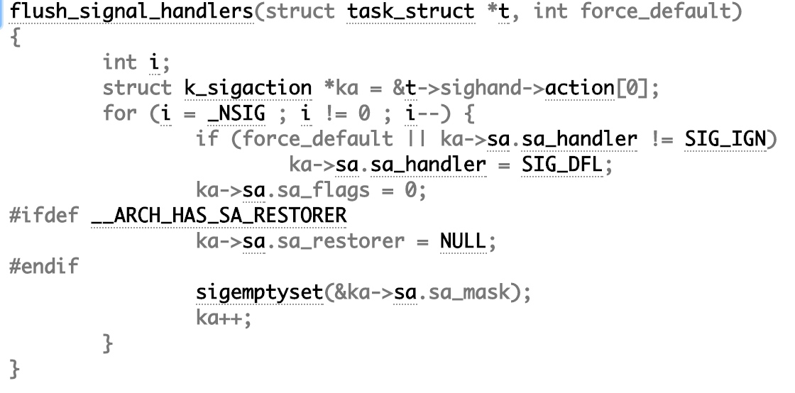
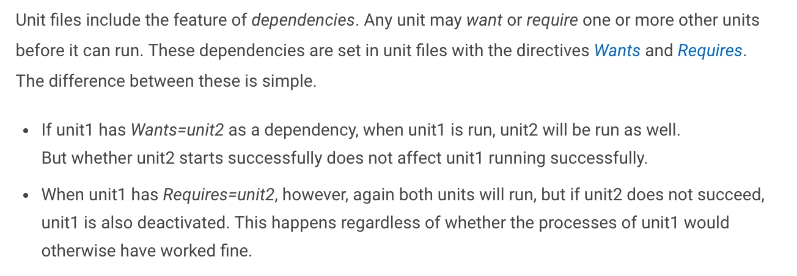

锁、信号量、无锁编程等几种线程同步方式的性能对比：
https://attractivechaos.wordpress.com/2011/10/06/multi-threaded-programming-efficiency-of-locking/ 
透过Linux内核看无锁编程：
https://www.ibm.com/developerworks/cn/linux/l-cn-lockfree/

posix共享内存操作示例：
http://www.cse.psu.edu/~deh25/cmpsc473/notes/OSC/Processes/shm.html

进程间通信：
http://www.ibm.com/developerworks/cn/aix/library/au-spunix_sharedmemory/

Kasan，Linux内核内存检测工具（内存按8字节分组，通过额外的影子结构标识分组中哪些地址是可寻址的，浪费1/9的内存）：
http://www.ibm.com/developerworks/cn/linux/1608_tengr_kasan/index.html

进程管理（ctrl+z，fg，bg，非常实用；后台任务才是作业，jobs -l显示作业；nohup让作业持续后台运行，忽略interrupt\quit\sighup信号，但是仍然保留着与控制终端的联系，一般这样自信 nohup &prog &，实际它只是nohup启动的时候设置信号屏蔽位，然后exec重新加载新程序的代码段、数据段等修改进程管理结构、页表、线性地址映射再执行的过程）：
http://www.ibm.com/developerworks/cn/linux/l-lpic1-103-5/index.html
补充说明一下nohup是怎么实现的：
linux 0.11内核里面讲的是do_execvp会将所有信号的sa.sa_handler重置为0，但是新版内核里面不这么搞，do_execve（http://lxr.free-electrons.com/source/fs/exec.c）里面调的是flush_signal_handlers（源代码路径为kernel/signal.c），如果进程一开始设置了sa.sa_handler=SIG_IGN，那么不会重置信号为SIG_DFL或者跟旧内核一样改为0，这样就可以理解nohup是怎么工作的了，nohup里面屏蔽型号SIGHUP，execve再执行其他程序的时候就可以正常忽略SIGHUP信号。

新学习到的一些好命令：
jobs -l、jobs -p
ps $(jobs -p)、ps -f、ps -j，ps --forest，这个好，可以显示出进程树！
ps可以根据指定的输出列字段进行排序（前提是输出了对应的列），例如：ps aux --sort -uid,+cmd，会按照uid降序、cmd升序排列，这里可排序的字段名是小写的，实际输出展示出来的字段名是大写的，切记！
pgrep可以搜索进程，常用选项-a、-f。
top命令这里学习了一下，以前都没怎么系统学习过top命令：

- f对字段进行设置，包括想显示那些字段（space控制），s可以设置排序字段，Shift+R可以控制升序、降序进行排列；
- z可以设置top显示颜色；
- Shift+V可以按照tree视图进行显示；
- k可以指定进程pid和signal发送指定信号给指定的进程；
- r可以指定进程pid和新的nice值执行renice操作（另一种调整优先级的策略）；

新学习到的信号：
SIGHUP：这个？反正不处理进程就会退出！
SIGINT：这个是相当于ctrl+c，终止进程；
SIGSTP：这个是相当于执行fg，将作业放到前台执行；
SIGCONT：这个是相当于执行bg，相当于ctrl+z，将作业放到后台执行；
SIGTERM：kill如果不指定信号类型，会发送SIGTERM，基本上与SIGINT等效；
SIGKILL & SIGSTOP：进程的信号处理函数无法捕获SIGKILL和SIGSTOP，这个信号一般用于无条件终止进程；
kill -l可以显示出所有可用的信号类型；
kill -s $signal $pid：向指定进程发送信号；

killall $prog，杀死所有进程名为$prog的进程；
pkill $prog，杀死进程名为$prog的所有进程，类似于killall；

上面的文章中提到了screen，我跟喜欢tmux配合byobu！哈哈！

linux下常用的文本流操作和过滤器：
http://www.ibm.com/developerworks/cn/linux/l-lpic1-103-2/index.html

共享库的相关知识ldd：
http://www.ibm.com/developerworks/cn/linux/l-lpic1-102-3/index.html
ldd可以告诉我们一个程序是不是动态链接程序，如果是会告诉我们这个程序运行时依赖的动态链接库都有哪些！
学习到一个新东西：linux虚拟动态贡献对象（linux-vdso.so.1，位于每个程序的地址空间中，为系统调用加速！）。

使用C++11编写多线程程序，本质上新增加的类库还是对pthread线程库的封装：
http://www.ibm.com/developerworks/cn/linux/1412_zhupx_thread/index.html

浅析Linux初始化系统init：
http://www.ibm.com/developerworks/cn/linux/1407_liuming_init1/index.html
浅析Linux初始化系统upstart：
http://www.ibm.com/developerworks/cn/linux/1407_liuming_init2/index.html
浅析Linux初始化系统systemd：
http://www.ibm.com/developerworks/cn/linux/1407_liuming_init3/index.html
简要总结一下：
init是一次性启动所有可能用到的服务，占资源、启动慢（串行启动），还是比较流行的一个初始化系统。但是init对当前桌面设备、移动设备这种频繁需要热插拔（还有重启）的设备而言并不适用。
应该对ubuntu手机有印象吧？因此ubuntu发展出了upstart基于udev通过设备事件event触发相应的jobs，job可以是一个task也可以是一个service/daemon，按需启动的方式减少了对资源的占用、加快了启动速度（不存在依赖关系的job可以并发执行）。
systemd是什么鬼？systemd与ubuntu开发的upstart是竞争对手，目前新版的rhel\fedora\ubuntu已经全部是systemd的天下，systemd的设计理念借鉴了OSX的launchd（苹果粉可以稍稍自豪一下），但是launchd专用于苹果系统，长期以来未能得到足够关注，systemd的强大之处在于对SysVinit和LSBinit脚本的兼容（为了减小旧服务向systemd的迁移成本），并且采用了更激进的基于socket/D-Bus activation等技术启动服务的方式，效果就是更快的启动速度（按需启动+即使存在依赖也并发启动，how-to？看下图）!

另外systemd使用cgroups以一种更加clean的方式来计算两次fork之后的daemon进程pid，而upstart使用expect脚本来获取，脚本一旦写错？呵呵，影响系统整体运行，作为OS的重要初始化系统怎么能允许这种隐患存在？systemd跟牛逼一点！还可以对当前系统做快照、日志……systemd一统江湖！

这里详细参考笔记《Linux线程实现机制分析》，这篇笔记摘自ibm developWorks！
原文链接地址如下：https://www.ibm.com/developerworks/cn/linux/kernel/l-thread/。

4.学习、总结Linux对线程的支持，其实Linux中没有从内核级支持线程，而是以轻量级进程LWP的方式为用户级线程库的实现提供了支持，例如pthread这个用户级线程库，就是利用了一对一的线程模型，即一个用户级线程对应一个内核级轻量级进程，利用内核轻量级进程实现对用户级线程的调度；
5.Linux内核里面进程分为进程、轻量级进程，轻量级进程之所以称之为轻量级进程，是因为进程在被创建出来的时候（通过clone()来创建，fork也是用这个），为clone传入了特殊的参数，指定该进程与父进程共享一些相同的资源，例如文件描述符、信号等等，内核并没有为这些轻量级进程重新分配新的资源，而只是增加了轻量级进程所属父进程中的资源的引用计数！
6.轻量级进程本质上是进程，它有自己的进程id，它被用于调度pthread线程库中的用户级线程，pthread线程库管理线程id的分配工作；
7.pthread创建用户级线程的时候，用户级线程的线程栈是通过mmap映射到进程地址空间中的，另外有个特殊的线程，称之为pthread manager线程，它是通过malloc在堆中分配的栈；
8.关于用户级线程库进行线程切换过程中做了哪些工作，这个还需要继续进行学习！fixme！！！！！可能是通过jmpbuf\setjmp\longjmp来实现的；
