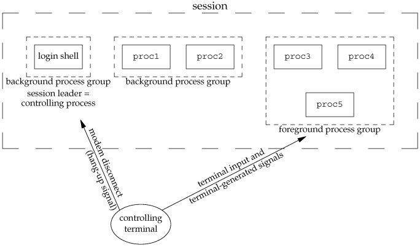

服务以daemon方式运行，是我们经常要实现的一种能力，两次`fork`是大家熟悉的，但是有些可能是大家没了解过的。

# 为什么要以Daemon方式运行？

程序启动后以daemon方式运行，其实是想达到如下目的：

- 可以脱离控制终端，在终端会话关闭的时候服务程序可以继续在后台运行；
- 关闭标准输入、输出、错误，终端的输入不会影响到服务端，服务端输出也不会影响终端；
- 屏蔽某些信号，如SIGHUP、SIGINT、SIGPIPE等（SIGKILL和SIGTERM不能被捕获、阻塞或忽略）；

# 如何实现Daemon方式运行？

首先来明白几个进程管理相关的概念：

- 会话，是一个或者多个进程组的集合。会话中创建的第一个进程称为会话首进程，会话首进程可以通过调用`open("/dev/tty", ...)`来获取对控制终端的控制。会话，包含一个前台进程组和若干后台进程组，终端产生的中断、退出信号将传递给前台进程组中所有进程；调制解调器的挂断信号，则会发送给会话的控制进程（会话首进程），其实往往就是bash程序。
- 进程组，通常管道线可以用来将前后的几个进程编入一个进程组中，例如proc1 | proc2 &将创建
  一个包含进程proc1和proc2的进程组，并且是后台进程组。进程组中的首进程，称为进程组组长，非组长进程可以通过调用`setsid(void)`来创建一个新的会话，并且此时的非组长进程将变为会话的首进程，并且没有控制终端；

下图展示了常见的Unix/Linux环境下的控制终端、控制进程（会话首进程）、前台进程组、后台进程组的关系，这里的login可以理解为`bash --login`，当在shell中执行一个程序时（如我们的服务P），此时会bash会fork并执行exec(P,...)，fork的时候已经完成了stdin\stdout\stderr的相关设置，它们被关联到了控制终端。



也就是说进程P一开始是有控制控端的，它有对控制终端的读写权限，并且会接受控制终端相关的信号，如SIGINT。现在想将让其脱离控制控端，如何实现呢？通过创建“**会话非首进程**”，可以创建daemon进程，要执行fork-setsid-fork：

- P需要先离开当前会话才可以脱离控制终端，它可以创建一个新会话，但是现在它是进程组组长，不能执行setsid。P需要先执行一次fork生成子进程P’，变成非进程组组长，此时就可以执行setsid创建新会话了；
- 子进程P’现在调用setsid创建新会话，P‘成为新会话的首进程，新进程组的组长，并且没有控制终端，这样看来似乎已经ok了。但是考虑到不同系统的兼容性，在某些遵循System V Rules的系统上，因为其是会话首进程，仍有可能调用open("dev/tty",...)`重新获取控制终端；
- 因此，建议子进程P’再fork一次生成子进程P‘’，P’‘变为会话非首进程，此时P’‘将彻底失去对控制终端的控制。意味着P’‘不会再受到控制终端输入、信号的影响，服务输出也不会影响到控制终端。

# 可能大家对fork不了解的地方？

系统调用fork会复制进程地址空间，但是并不会继承所有的线程，只有调用fork()的线程能够得到继承，child process里面只有调用fork()的那个线程的副本，其他线程的副本是不存在的。详见后面的“**fork测试**”部分。

那如果一个多线程程序要支持平滑重启怎么办呢？可以实现，只是比较复杂，而我们见到的很多支持平滑重启的软件产品，不少是单线程多进程架构的，如Nginx！

不需要考虑fork时线程复制的问题，如果硬要实现，那就要把线程上下文信息保存起来，等fork之后再根据保存的上下文信息还原出当时的多线程状态，如何还原？可能要还原可能不需要还原，根据场景来看。比如某些场景下，可能只是需要保存当前的请求以及处理状态就可以了，这种就比较简单；如果要100%还原当时的线程状态那就很困难，可能无法实现。

# golang如何实现daemon？

建议借助外部工具daemonize或操作系统工具systemd、upstart、launchd，来实现go服务daemon方式运行，不建议自己实现：go程序天然是多线程程序，不能确定编程人员在何处启动goroutine（引入新线程）。github上有个实现：<https://github.com/sevlyar/go-daemon>，可以了解下，但是不建议goneat框架层实现或者集成。另外golang官方也有一个相关的issue讨论过这个问题：https://github.com/golang/go/issues/227。

# 附录：fork测试

```c
#include <stdio.h>
#include <stdlib.h>
#include <pthread.h>
#include <unistd.h>
#include <sys/types.h>

void* tfunc1(void *args) {
    printf("tfunc1, get pid:%u, tid:%u\n", getpid(), pthread_self());
    sleep(60);
}

void* tfunc2(void *args) {
    printf("tfunc2, get pid:%u, tid:%u\n", getpid(), pthread_self());
    sleep(60);
}

int main(int argc, char *argv[])
{
    int ret;
    pthread_t t1, t2;

    ret = pthread_create(&t1, NULL, tfunc1, NULL);
    ret = pthread_create(&t2, NULL, tfunc2, NULL);

    pid_t pid = fork();
    if (pid != 0) { // parent process
        printf("create process, pid:%u\n", pid);
    } else { // child process
        sleep(60); // hold to check how many threads has been copied from parent process
    }

    sleep(60);

    return 0;
}
```

```bash
[root@VM_1_34_centos ~]# ./main
tfunc2, get pid:2672, tid:397674240
tfunc1, get pid:2672, tid:406066944
create process, pid:2675
```

```bash
top -H -p 2675

Threads:   1 total,   0 running,   1 sleeping,   0 stopped,   0 zombie
%Cpu(s):  0.1 us,  0.1 sy,  0.0 ni, 99.8 id,  0.0 wa,  0.0 hi,  0.0 si,  0.0 st
KiB Mem : 16171652 total,  3413496 free,   450324 used, 12307832 buff/cache
KiB Swap:        0 total,        0 free,        0 used. 15009260 avail Mem

  PID USER      PR  NI    VIRT    RES    SHR S %CPU %MEM     TIME+ COMMAND
 2675 root      20   0   25968    140      0 S  0.0  0.0   0:00.00 main
```