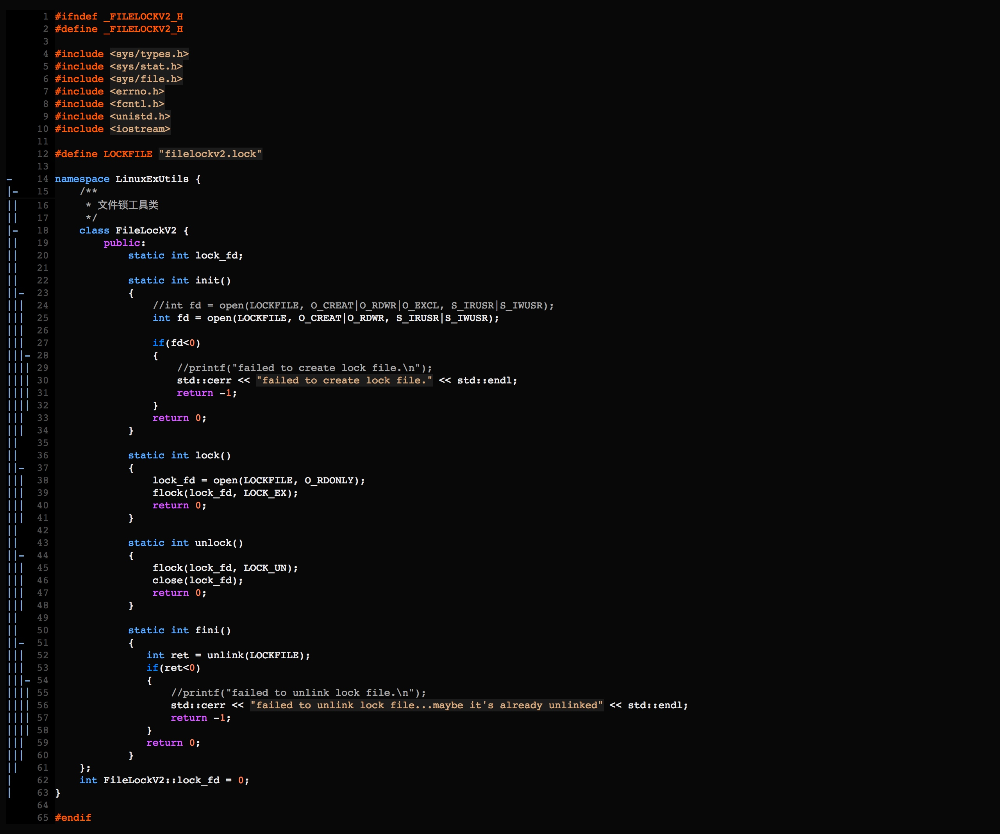

### 进程获取锁阻塞，依然可以响应信号！

如果文件锁被另一个进程持有，尝试获取文件锁的进程将会被阻塞，但是呢？内核只会进程状态修改为**可中断等待**状态，并不是**不可中断等待**状态，这意味着进程在没有**信号**到达的时候将无法参与进程调度，但是一旦**有信号到达且未被进程屏蔽**，内核会立即将进程的状态修改为**可运行**状态使进程参与到进程调度中去，从而使得进程再次获得可运行的能力。

通过下面的示例代码，可以验证进程尝试获取文件锁由**running**状态转变为**interruptable waiting**状态、然后收到信号后继续切换为**running**状态的过程。

文件锁工具类：LinuxExtUtils::FileLockV2

测试代码：获取文件锁阻塞 & 响应信号

编译g++ -o main main.cpp，然后先运行一个./main让这个进程占有文件锁，然后再运行一次./main，注意10s内这个进程获取不到文件锁，这个时候按ctrl+c测试它能不能接收并处理这个信号，实际运行效果如下：

这验证了进程在获取不到文件锁时内核只是将进程状态修改为“**可中断等待状态**”，进程仍能够正常接收并响应信号。

