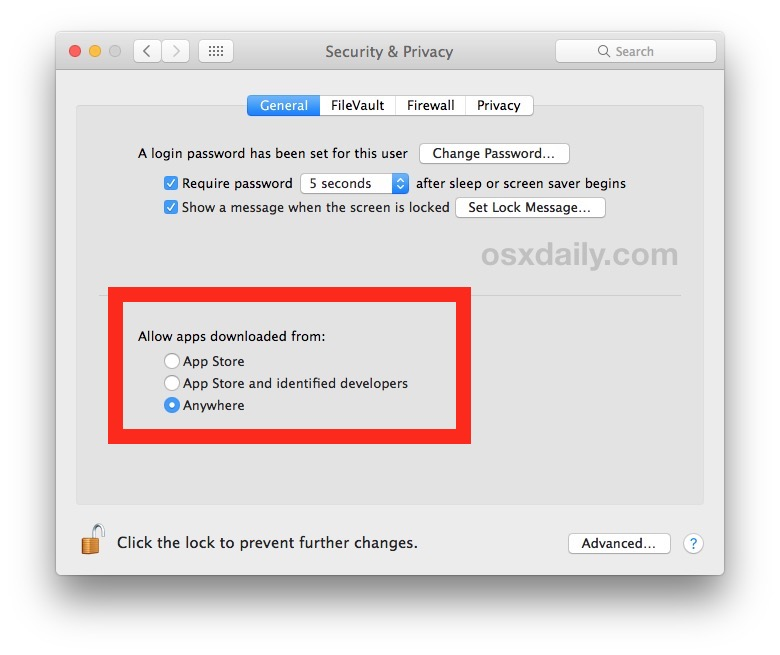

原来Security & Privacy中，允许有一个选项可以允许运行Anywhere下载安装的软件，但是新版本系统中处于安全性方面的考虑，默认禁用了Anywhere这个选项。




如果想恢复这个选项，可以运行下面的命令：


```bash
sudo spctl --master-disable
```


如果想再次禁用这个选项，可以运行下面的命令：

```bash
sudo spctl --master-enable
```


进行了上述操作后，某些极端情况下，仍然会打不开。可能是因为操作顺序的原因，导致OS X系统已经为Application.app打上了某种属性标签，如是从哪里下载的等属性信息、是否打开失败等，这个时候可以运行命令移除所有属性。

```bash
xattr -cr /path/to/application.app

-c: 移除文件上的所有属性
-r: 递归处理所有的文件
```

这样执行完之后，应该可以打开了，该`xattr`操作参考文章 [xattr](http://osxdaily.com/2019/02/13/fix-app-damaged-cant-be-opened-trash-error-mac/)。