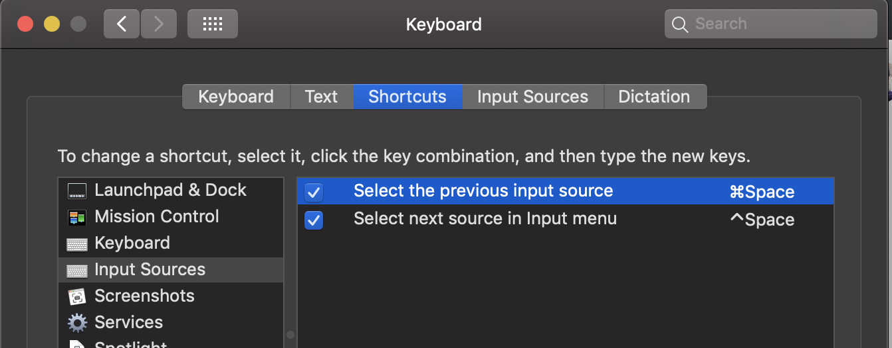

常用输入法为英文输入和搜狗输入，英文输入法这个适合长时间输入英文，如写代码，搜狗适合长时间输入中文和短时间的英文输入。

在实际输入体验中，从搜狗临时切换为英文进行输入后，shift切换为英文，后续一段时间不输入就忘记了当前所处的桩体了，我不喜欢输入的时候抬头看输入法状态。这个时候经常碰到输入的时候想输入中文，但是却输入了英文的情况，这个时候就会切换到前一个输入法，这时为英文，再输入发现还是英文，继续切换到搜狗，搜狗这个时候也是英文，就有点烦躁了……

其实希望执行输入法切换(非shift在搜狗中英文模式下切换)时，希望搜狗一直为中文输入法模式。其实也是可以支持到的，像下面这样设置就可以了。

用cmd+space切换到搜狗时保证是中文输入法模式。

