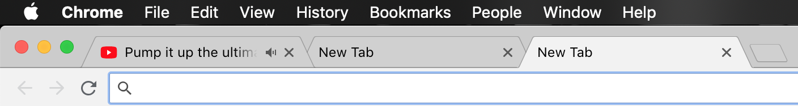
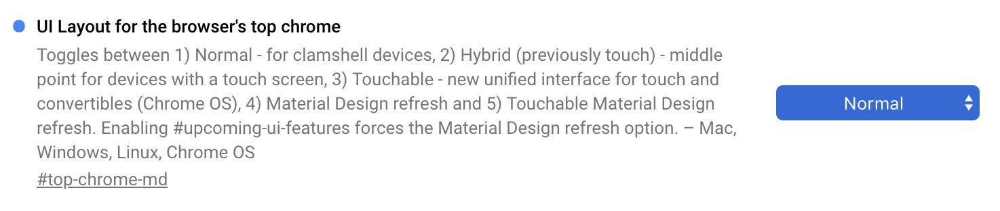

chrome新版本v71+开始启用了新版本的标签外观，乍一看还是挺好看的，但是对于一个恋旧的人，我还是难以喜欢上这样的界面风格。

如果仍然想保持下面这种风格的tab风格，目前chrome版本必须使用v71及以下版本。

v71的话，可以在地址栏输入chrome://flags进行进行如下设置项的修改，从Default修改为Normal，重启即可。

v71以上版本，已经删除了该设置项，意味着只能使用新风格的tab，不能回退到上述风格。