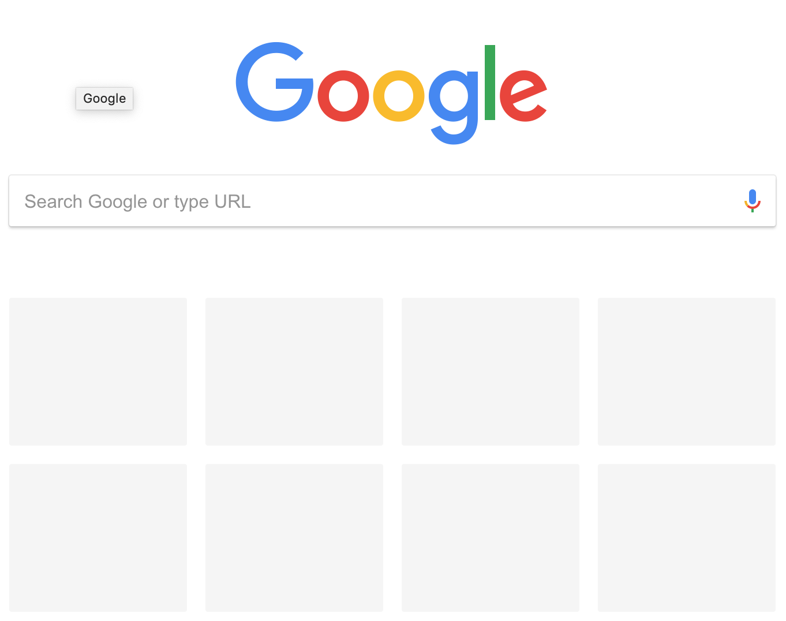
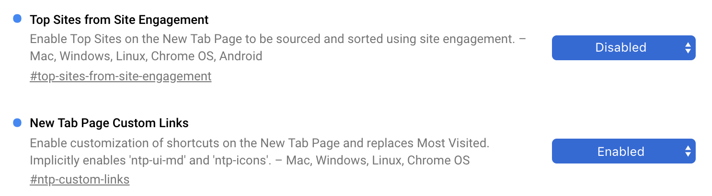

chrome里面创建新的标签页之后，或者访问chrome://newtab之后，页面显示如下。默认情况下chrome会根据用户最近的访问记录，在搜索输入框下面展示most visited websites。如果只是展示用户最近常访问的websites也还好，但是如果你经常访问一些私密性比较高的网站，不小心被谷歌展示出来，就糟糕了！可能会让你颜面尽失！

如果你想chrome stay silence，不要捅娄子，让页面保持如下这样清爽，那就看下去吧。

最开始有些人写js脚本将chrome://newtab页面中的
标签直接删除，或者css隐藏，chrome store以及tampermonkey中有不少这样的脚本，但是这些脚本都统统失效了，为什么呢？因为chrome新版本中加了安全限制，不再允许在chrome://newtab页面中注入第三方脚本。

也有些人为创建新标签页操作hook了页面重定向功能，但是重定向要冲顶到哪里去呢？google页面，如果断网的时候，会直接显示offline，页面比较丑陋。重定向到其他页面？没有比google默认搜索页面更让我神往了。

上述方法统统不管用，怎么办？自己解决呗，了解了下chrome浏览器中提供的一些flags设置项，可以实现该功能的。

- 全新安装一遍chrome（我一直用chromev71，高版本启用了“丑陋”的新标签外观）；

- 由于不想chrome自动更新，直接取消下面两个目录的读写权限，/Library/Google/GoogleSoftwareUpdate，chmod a-rw ~/Library/Google/GoogleSoftwareUpdate，这样chrome就无法下载更新包了；

- 打开chrome浏览器，地址栏输入chrome://flags，完成如下设置：

  

- Done；

继续体验Chrome带来的美好生活吧！不用再担心chrome://newtab页面泄露你个人隐私的问题了！