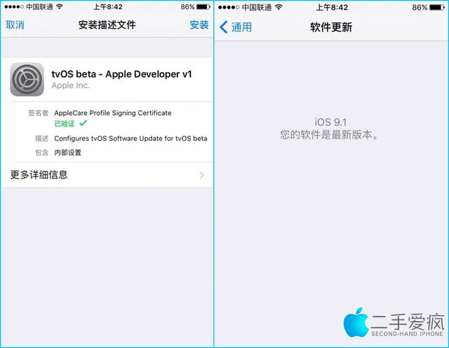

不管是频繁升级不喜欢，还是不喜欢新版本的设计，还是手机配置低，总有很多人不喜欢更新到新版本系统，我就是其中之一，我的手机是5s，更新到10略微吃力，而且也不喜欢10的设计，个人认为很多槽点，于是想办法关掉系统更新。

执行下述方法前，最好先还原到出厂设置，这样可以获得一个更加干净的系统，特别是那些已经弹出“小红点”的手机，如果不想看到小红点，还是还原到出厂设置后再执行这里介绍的方法。

1 首先打开设置->通用->存储空间与icloud用量->管理储存空间，删除已下载的iOS10系统文件；

2 打开网址：<http://www.2ifeng.com/static/NOOTA9.mobileconfig>，根据提示安装描述文件，根据提示安装即可，安装完成之后检查系统更新会提示**“您的软件是最新版本”，**如下图所示：

3 安装完成后会提示重启手机，桌面上会多出一个feedback图标，表示安装成功，可以将其移动到不常用的文件夹里；

该方法屏蔽系统更新的原理，是利用了Apple tvos描述文件屏蔽了系统更新，不影响手机正常使用，想要升级系统的时候直接删除描述文件即可。