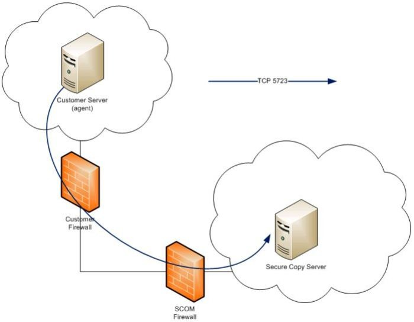
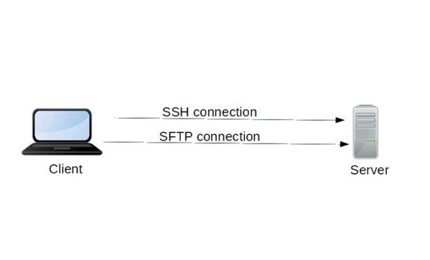

# **SCP vs SFTP: 选择哪个进行文件传输呢？**

By [Elsie Biage](https://www.maketecheasier.com/author/elsiebiage/) – Posted on Mar 13, 2019 in [Linux](https://www.maketecheasier.com/category/linux-tips/)

SCP (Secure Copy Protocol) 和 SFTP (Secure File Transfer Protocol) 都是 FTP (File Transfer Protocol) 的变体，三者都是用来完成文件拷贝的工作，通过网络将一台主机上的文件拷贝到另外一个主机上。然而, FTP 是以明文的形式发送数据，数据未经过加密, 缺乏安全性，SCP 和 SFTP 则是通过SSH (Secure Shell) 来进行通信，对数据进行了加密处理，更加安全。

## **SCP 和 SFTP 是什么呢？**

### SCP (Secure Copy Protocol)

SCP是一个非交互式的文件传输协议，借助ssh操作来安全地将文件在两台计算机之前进行传输，SCP是之前RCP的安全增强版。FTP呢也将ssh操作引入进来，形成了自己的安全增强版本SFTP。虽然从覆盖的功能来看，SFTP的能力比SCP更多，但是在通过脚本来进行文件传输时，SCP通常是一个更常用的选择。

SCP可以将本地主机的文件拷贝到远程主机，也可以从远程主机拷贝文件到本地。SCP其实是将待拷贝文件的数据以字节流的形式写入到ssh隧道中，ssh隧道负责将数据送达远程目的主机或者本地目的主机。而ssh呢还可以负责完成完整性校验、数据压缩等更加负责的处理。

SCP传输文件的时候可以使用shell的通配符来匹配多个文件。

SCP可以在本地主机和远程主机之间互相拷贝文件，也可以在远程两台主机之间拷贝文件。

**Related**: [Transfer Files Securely Using SCP in Linux](https://www.maketecheasier.com/transfer-files-securely-using-scp/)

### SFTP (Secure File Transfer Protocol)

**SCP是非交互式的，而SFTP是交互式的，SFTP可以在在一个ssh加密后的控制信道中传输多种操作命令。

SFTP有几个特色，如支持数据压缩、公钥认证，允许连接和登录特定的主机，并交互式地输入控制命令执行对应操作。

SFTP 容易让人联想到 Simple File Transfer Protocol 或者 SSH File Transfer Protocol，后者是设计用来和ssh协作实现安全文件传输，前者是一个轻量级的ftp实现，构建在tftp之上，运行在端口115上，已废弃。

SFTP如果使用了非交互式认证方式的话，也可以自动接收文件（从远程拷贝到本地），如果使用了交互式认证的话，认证成功后才可以接收文件。

尽管SFTP支持多种协议认证，但是最常用的还是使用SSH来进行相关的认证。

**Note:** SFTP并不是一个构建在SSH之上的协议，它是一个新协议（内置了SSH的能力）。

Related**: [How to Use SFTP to Transfer Files to/from Linux Servers](https://www.maketecheasier.com/use-sftp-transfer-files-linux-servers/)

## **SCP 和 SFTP 之间的区别**

SCP和SFTP之间存在一些相似性，如都是用tcp端口22，都运行ssh协议来保证安全性。

它们也都支持数据加密、公钥认证，另外，也都支持大文件的传输，因为它们都没有文件大小限制。

二者最主要的不同，还是它们的设计目标和实际功能。

### **功能不同**

SCP主要关注数据传输过程中避免数据被拦截、窃取，SFTP呢主要是关注与访问数据、传输数据、管理数据。

SCP的设计，不难看出其更适合于那种网络主机上一次性的文件传输场景，而SFTP除了文件传输还有支持一些管理数据的能力，如查看文件列表、删除文件等。

### **操作不同**

SCP不能执行查看目录文件列表、删除文件的操作，只能传输文件，但是SFTP可以。

SFTP提供了一个GUI工具来执行远程文件管理，更像是一个远程文件系统，SCP并不提供类似能力。

### **文件传输速率**

SCP比SFTP区分接收到的数据分组更加高效，SFTP需要对每个很小的包进行确认，这在高负载网络环境下性能影响比较突出。

SCP的其他优势还包括，它采用了一个更加高效的文件传输算法。

### **文件传输中断后的恢复**

SCP不支持文件传输中断后再恢复，SFTP支持。

### **命令行**

SCP是非交互式的，不能够读取用户命令，要拷贝的文件这些都要事先写好。SFTP呢，是交互型的，它可以随时键入操作命令，或者从其他文件读取命令。

## **应该选择哪个进行文件传输呢？**

SCP和SFTP有相似性，也有不同，说哪一个比哪一个更优是很片面的做法，在传输安全性方面，它们最终的效果都类似于跑在加密后的ssh隧道中传输数据，安全特征是类似的。实际选择哪个工具进行文件传输，还是要结合自己的场景、环境来决定：传播速度的要求、操作功能的要求、安全性要求等。