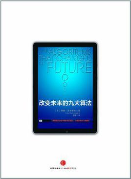

# 改变未来的九大算法

《改变未来的九大算法 约翰·麦考密克》，作者好像在一片嘈杂的it书籍中拓荒一样，从用户日常生活中应用最广泛却又发热于无形的众多算法中挑出了一些堪称伟大的经典算法。计算机领域里面不只是搬砖的码农，也不只是有形形色色的编程语言和组件……我比较喜欢了解“发展”的历程，这样就不会因为过多的细节懵逼，也能避免因为精致却琐碎的细节失去兴趣。应该算是本好书，推荐:thumbsup:

本书的时候是在“**微信读书**”中阅读的，阅读过程中做了不少笔记，这里着重对感兴趣的一些点的笔记进行了整理，如果后续发现回忆不起相关的要点，可以回到微信读书中查看相关内容细节。

# No.1 PageRank

## 1.1 随机访问者模型

pagerank算法的几个关键点，链入链接数量，链入网页的质量（权重，也是基于链入链接数计算），网页是否因为链入链出构成环形依赖，这三点都可以通过随机访问模型来一锅端了，通过随机访问模型来对网页质量进行评分。当多个网页匹配搜索的关键字时，将按照随机访问模型计算的网页评分对网页排序，然后再返回给用户。

> **随机访问者模型**，天生能同时和超链接把戏及权重把戏相配合。
> 前文炒蛋例中各网页的访问者权重值。伯特的菜谱网页和欧尼的菜谱网页都只有一个链入链接传入权重，但伯特的网页在网络搜索查询“scrambled eggs”（炒蛋）时排名会更高。
> 换句话说，每个网页链入链接的质量和数量都会被纳入考虑范围。网页B就展示了这些：网页B的访问者权重值相对较高（10%），得益于三个链入链接所在的网页拥有适中的访问者权重值，从4%到7%不等。
> 随机访问者把戏的美妙之处在于，和权重把戏不同，不管超链接有没有形成循环，随机访问者把戏都能完美地运作。回到早前的炒蛋例子，我们能轻易地运行一次随机访问者模拟。在数百万次访问之后，我的模拟产生了如上图所示的访问者权重值。
>
> 早前超链接循环例子（此图）的访问者权重值。随机访问者把戏在计算合理的分值上没有问题，尽管存在一个循环（A-B-E-A）
> 请留意，和之前使用权重把戏进行的计算一样，伯特的网页访问者权重值要比欧尼的网页高很多（28%VS1%）——尽管这两个网页都只有一个链入链接。因此，伯特的网页在网络搜索查询“scrambled eggs”（炒蛋）中排名更高。
> 现在让我们再转向前文中更困难的例子：对于最初的权重把戏而言，由于超链接循环的存在，这张图产生了一个不可解的问题。和前面一样，运行一次随机访问者的计算机模拟很容易，于是产生了如上图所示的访问者权重值。由这一模拟判定的访问者权重值给出了网页的最终排名，这些排名会被搜索引擎在返回结果时使用：网页A排名最高，之后是B和E，C和D的排名同列最后一名。

## 1.2 现实中的PageRank

搜索引擎算法也是在不断进化的，将垃圾网页干掉是必须要做的，垃圾就该待在垃圾桶里。

> 搜索引擎和网络垃圾制造者在进行一场军备竞赛。搜索引擎不断尝试完善算法，以便返回真实排名。在完善PageRank算法的驱动下，孕育了大量针对其他使用互联网超链接结构进行网页排名的算法的学术和行业研究。这类算法通常被称为基于链接的排名算法（link-based ranking algorithms）。
> 另一个复杂因素与PageRank计算的高效性有关。访问者权重值是通过运行随机模拟来计算的，但在整个互联网上运行这类模拟耗时太长，不能进行实际运用。因此，搜索引擎并非通过模拟随机访问者来计算PageRank值：它们使用能像随机访问者模拟一样给出相同答案的数学技巧，但计算成本要低很多。我们研究访问者模拟技术是因为它直观的吸引力，也因为它描述了搜索引擎计算什么，而非如何计算。
> 另外，值得一提的还有，商业搜索引擎中用来判定排名的算法，要比PageRank这类基于链接的排名算法多得多。即便是在他们于1998年发表的描述谷歌的原始论文中，谷歌的联合创始人也提到了多种对搜索结果排名有贡献的功能。正如你所想的，这项技术已经进步了：在写作本书时，谷歌官网上声明“有超过200个信号”被用于评估一个网页的重要性。
> 除了现代搜索引擎的众多复杂性之外，PageRank核心的优美思想——权威性网页通过超链接向其他网页传输权重——仍然有效。正是这一思想帮助谷歌击败了AltaVista，让谷歌从一家小型创业企业几年后成长为搜索之王。没有PageRank的核心思想，绝大多数搜索引擎查询都将被成千上万命中但不相关的网页海洋所淹没。PageRank的确是一块算法瑰宝，能让针毫不费力地冒到草垛的顶端。

# No.2 公钥加密

有两种经常使用的密钥体制，分别是公开密钥体制和共享密钥体制，这两种密钥体制各有优缺点，在现实世界中往往需要结合起来使用，后面会介绍如何使用。

- **公开密钥体制**，又称为“**非对称密钥体制**”，意思是说加密和解密使用的是两个不同的密码。
- **共享秘钥体制**，又称为“**对称加密体制**”，意思是说加密和解密使用的是相同的密码。

## 2.1 共享密钥体制

### 2.1.1 分组加密

分组加密，将秘钥和原始信息更紧密地混合在一起，减少被统计分析攻破的可能。

> 首先，长消息被分解成固定大小（通常是10～15个字母）的小“块”。其次，和简单地将一块消息与钥匙相加不同的是，每个块都会根据一系列固定规则转换数次。这些规则类似于加法，但会让消息和钥匙更紧密地混合在一起。比如，规则可以是“将钥匙的前半部分和这块消息的后半部分相加，倒置结果，再将钥匙的第二部分和这块消息的前半部分相加”——不过在现实中，这些规则要更加复杂一些。现代分块密码基本上会进行10“轮”或更多类似操作，即操作列表会被反复应用。在转换的轮数足够多时，原始消息会真正地混合好，并能抵御统计攻击，但任何知道钥匙的人都能用相反的步骤运行所有操作，以获得最初的解密的消息。

## 2.2 公开密钥体制

## 2.3 现实中的公钥加密 

非对称加密比对称加密安全，但是运算速度慢。通信数据传输之前需要加密处理，但是并不是直接用非对称加密进行加密处理，它还是通过对称加密进行加密处理，只不过这里的加密用的秘钥是通过非对称加密传输给对端的。使用安全性更高的非对称加密来确保加密秘钥的安全性，然后通过这个可靠的秘钥对数据进行加密。
非对称加密的高安全性，是建立在使用的数学计算的单向性，至少在信息时效期限内不可能通过现有设备反推出秘钥，从而确保信息的安全。

> 没有公钥加密，我们每天使用的绝大部分在线交易都不可能安全地完成。RSA的发明者在20世纪70年代为自己的系统申请了专利，而他们的专利直到2000年年末才失效。在专利失效的那天晚上，美国旧金山市的美国音乐大剧院举行了一次庆祝晚会——也许是为庆祝公钥加密将永久为人们服务这一事实。

# 3 纠错码 

## 3.1 定位把戏

二维奇偶校验码，形象生动地描述了侦测错误、纠正错误的过程，计算机系统中也有应用，但是这个方法不如其他冗余技术高效，也不是那么广泛使用的，这里讲这个的目的是为了帮助读者更好的理解计算机通信过程中的纠错码技术的重要性。

> 二维奇偶校验码在一些真正的计算机系统中也有运用，但并不如其他一些冗余把戏高效。我在这里解释它的原因是，它能很容易地具化并展现在不要求复杂数学的情况下，于当今计算机系统中的流行代码背后发现并纠正错误的风味。

## 3.2 现实世界中的纠错及侦错

 额，确实兴趣广泛，真会玩，骑独轮车，轮子还是椭圆的

> 顺便说一下，香农的兴趣非常广泛。作为1956年达特茅斯人工智能大会（将在第六章末谈到）的四位主要组织者之一，他积极参与了另一领域的创立：人工智能。这还没完。他还骑单轮车，并制造了一辆令人难以置信的单轮车。这辆单轮车有一个椭圆轮子，意味着车手随着单轮车前进可以上下移动！

# 4 图形识别

## 4.1 不同类型的“最近”邻

图像数据如何作为训练样本对分类器进行训练呢，训练分类器的过程可以参考不同的分类器算法，k近邻分类器，决策树，神经网络，贝叶斯网络，或者支持向量机等等，在训练之前都要对数据进行预处理，以便用来作为训练样本对分类器进行训练。往往这些分类器的输入都是向量形式，图像数据怎么预处理呢？简单一点，如何认为两张图像比较接近呢？这里说了一个简单思路，两个图像放缩到相同大小，然后做减法，其实图像本身也是一堆一维的数据，本身可以作为输入向量，这么理解起来就简单了。实际处理过程可能要比这里的复杂些。

> 下面的图就展示了这样一种方法。
> 这一方法的基本理念是衡量数字图像之间的区别度，而非它们之间的地理距离。区别度以百分比形式衡量——区别度只有1%的图像是非常相近的邻，而区别度在99%的图像则相差很远。图中给出了具体例子。（在图形识别任务中，输入的信息会进行一些预处理步骤，这种情况很普遍。在本例中，每个数字都被调整为同一大小，并位于图像中心。）在图中最上方的一行中，我们能看到两张不同的手写2图像。通过对这些图像进行某种程度的“减法”，我们得到了右边的图像。这张图像的其余地方都是白色，只有这两张图像不同的少数地方为黑色。结果显示，这张区分度图像只有6%的地方是黑色的，因此这两个手写2图像是相对近邻。另一方面，在图中最下方的一行，我们能看到不同数字图像（一个2和一个9）削减后的结果。右边的区分度图像有众多黑像素点，因为这两张手写数字图像在很多地方不同。事实上，这张区分度图像有21%的地方是黑色的，因此这两张手写图像并非特别临近的邻。
>
> 计算两个手写数字的“距离”。在每一行，都要用第一张图减去第二张图，并得出右边的新图像，新图像中突出了这两张图中的区别。区分度图像中突出部分所占的百分比，就能被视为原始图像之间的“距离”。

##  4.2 图形识别：过去、现在和未来

人工智能，这一领域从创建到现在，我们看到了很多领域都在做这方面的尝试，比如个性化推荐、机器人、智能汽车、智能家居、人机对战游戏等等，这背后都有ai的影子，可能多年前我们认为是纯意识才能解决的问题，现如今通过对应的算法来解决也可以取得相当不错的效果，从认知上我们也扭转了态度，并可能会思考如何用人工智能来解决现如今遇到的问题。这就是人工智能的魅力所在吧，

> 因此，这些算法是图形识别系统的一些基础构件。不管你是否认为它们是真正的“智能”，你都将在未来数年中看到更多这些算法。

# 5 数据压缩

## 5.1 压缩算法的起源

 为了减少数据文件对硬盘空间的占用，减少网络传输数据的耗时，数据经常要进行压缩处理，压缩真的是无处不在……从系统启动时bootloader装载压缩后的内核映像文件，到用户使用的一些office软件对office文档的zip压缩，再到用户自身对文本、代码、图像、软件、音视频进行压缩归档，再到访问网站时网站为了减少请求耗时、带宽占用开启的gzip压缩……压缩广泛使用以至于大家可能都忽略了它的存在。

> 这名学生就是大卫·霍夫曼，他的技术——现在以霍夫曼编码来命名——则是更短符号把戏的另一个例子。霍夫曼编码仍然是一种基础压缩算法，被广泛用于通信和数据存储系统。 

# 6 数据库 

我们将了解数据库背后三种美丽的基础思想：预写日志记录（write-ahead logging）、两阶段提交（two-phase commit）和关系数据库（relational database）。这些思想让存储特定种类重要信息的数据库技术占据了绝对的主宰地位。 

事务和待办事项表把戏 

我这里说的是硬盘扇区大小＜sector size＞，通常一个扇区可以存放512个字节的信息。而闪存的相关度量单位是页大小＜page size＞，闪存每页能存储成千上万个字节的信息。） 

数据库的人性面

追求一致性的数据库，……

> 自此以后，格雷和他的船音信全无。这个悲剧故事中有一处温暖人心的转折，格雷在数据库社区的许多朋友使用格雷的工具尝试拯救格雷：旧金山附近海域最新得到的卫星照片被上传到一个数据库中，以便让朋友们和同事们搜寻这位失踪数据库先锋的线索。不幸的是，这次搜寻并不成功，计算机科学世界丧失了一位领军人物。 

# 7 数字签名

## 7.1 数字钥匙银行

我们不必在此追寻钥匙生成的细节，只需要知道，给出一个挂锁值，计算机就能通过一种名为欧几里得算法的知名数学技巧得出相对应的钥匙值。 

## 7.2 悖论解决 

数字签名，不可伪造，不可抵赖

> 这一悖论的解决方案不仅仅是个精巧美丽的思想。数字签名还起着巨大的实际作用：没有数字签名，我们所知的互联网就不会存在。数据仍可以通过加密安全交换，但要验证接收数据的来源就要困难得多。这一伟大思想和如此广泛的实际影响相结合，无疑让数字签名成为计算机科学中最伟大的成就之一。

# 8 什么可以计算

## 8.1 不可判定性和计算机使用

不可判定问题，模拟人脑来解决不可判定问题

> 事实上，邱奇比图灵早几个月发表自己的成果，但邱奇的公式更为抽象，且并未详尽提及由机器执行的计算。
> 对邱奇—图灵论题有效性的争论不断升温。但如果按照最强版本的邱奇—图灵论题所持有的观点，那么并非只有计算机向不可判定性限制俯首称臣。同样的限制不仅适用于我们指尖的精灵，而且也适用于精灵背后的精灵：我们的理智。

# 9 我们学到了什么

计算机编程语言和计算机科学主要思想之间的关系与上面的情况很相似。要应用并实验算法，计算机科学研究者需要将算法转换成计算机程序，而每个程序都由Java、C++或Python等编程语言编写。因此，编程知识是计算机科学家所必需的，但却只是前提：在见识了本书中的伟大算法以后，我希望读者们能对这一区别有更清楚的理解。

## 9.1 旅程终点 

我的主要目的是让读者有足够多和伟大算法有关的知识，让他们在一些日常计算任务时能遐想片刻——就像一名业余天文学家高度崇敬夜空一样。
