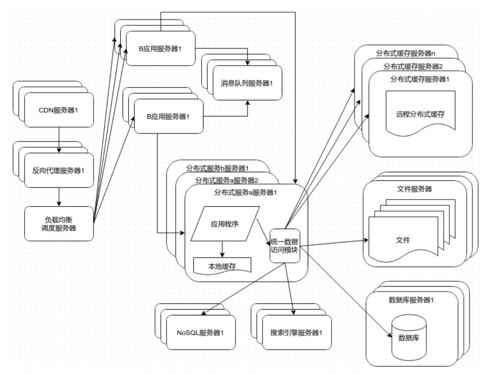
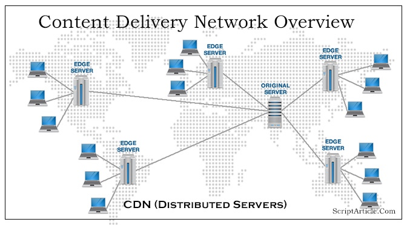
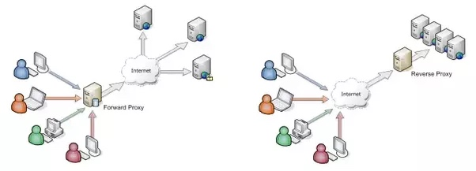
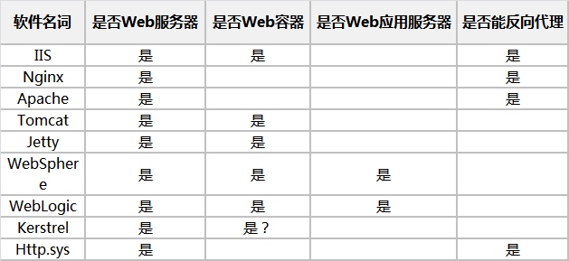
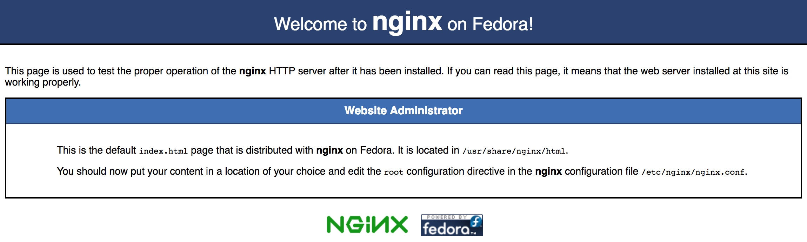

# 1 Arch概览

学习李智慧老师《大型网站架构》的时候，有幸了解了大型网站在高并发场景下的演进情况，工作之后发现书中所推荐的架构也是大多数互联网企业所采用的方案，在具体实施上可能会有某些开发语言、组件选型、部署实施上的差异，但其背后的原理都是相近的。

## 1.1 大型互联网架构



一个大型网站或者说一个能够应对高并发请求的服务架构，一般都可以通过上述架构设计予以解决，其核心主要包括如下几个组成部分：CDN、反向代理、负载均衡、集群部署、消息队列、分布式数据库、NoSQL、分布式缓存、分布式文件服务器、搜索引擎、服务监控、远程日志等等。

以前我们考虑如何解决单机支持并发连接数C10K、C100K、C1000K问题，基于epoll事件驱动的异步模型的出现早就已经不再是问题了。目前我们关注的是C10M的问题，但是这里并不是指支持的最大并发连接数，而是QPS。

## 1.2 互联网架构核心

首先对大型互联网架构中的核心组成做一个简短的总结，后续再细致地铺开。

- CDN

CDN解决不同地域、不同网络环境用户快速接入问题，常称为“**用户访问第一跳**”，也可以将静态资源信息发布到CDN加快用户访问速度，例如将html、js、css、图片资源发布至CDN可以减少用户访问“**源站**”拉取资源的时间，在直播场景中还会将音视频HLS文件发布至CDN加速用户拉流。

- 反向代理
反向代理部署在提供服务的中心机房中，逻辑上位于应用服务器前端，因此也可以充当负载均衡设备。但是反向代理的初衷是用于“**加速用户访问**”，例如可以将用户首次访问的静态资源文件缓存至反向代理服务器，以后用户再次访问该文件时请求直接由反向代理服务器响应，请求不用再落到应用服务器上。甚至某些动态资源也可以被加载至反向代理服务器来进一步加速用户访问。

- 负载均衡调度器
线上业务应该力求避免单点，另外再高性能的单一机器也无法应对持续上涨的用户请求，集群部署可以通过平行扩容实现计算能力的线性伸缩，是互联网业务中常用的架构设计。负载均衡调度器负责根据集群内机器负载情况将请求转发给集群中的某台机器进行处理。根据服务设计的差异“**有状态服务、无状态服务**”，负载均衡调度器也需要支持适配的“**有状态路由、无状态路由**”方式。负载均衡不只是存在于接入层，CGI、应用服务、后端基础服务、各中间件之间的通信也应该交由负载均衡调度实现。

- 应用服务器集群
应用服务器集群可以理解为图中的应用服务器集群a，“**应用服务器可以理解为某些CGI服务或者逻辑服务，这些服务调用后端提供的其他基础服务从而完成一次完整的逻辑处理**”。线上部署中应避免单点，至少两台机器组成一个集群，并根据用户请求量、机器负载等动态扩容、缩容，以实现服务能力的线性伸缩。应用服务器之间、应用服务器与后端服务器之间，某些场景下需要使用消息队列，以实现生产者、消费者之间的解耦，或者实现削峰等。目前RPC也是服务间通信广泛所采用的一种方式。

- 后端服务器集群
后端服务器集群可以理解为图中的分布式服务集群b，其对外提供基础服务供应用服务器集群调用。“**后端服务器可能会涉及到读写db、远程分布式缓存、本地缓存(共享内存)、NoSQL服务器、搜索引擎、文件服务器等不同数据源的操作，结合必要的业务逻辑提供对应的服务能力**”。后端逻辑服务往往是IO密集型，如何优化好服务的IO是非常重要的一点。同步IO易于编码、理解及维护，异步IO性能高但是各种callback导致编码繁琐、可维护性差，现如今协程成为后端工程师的新宠，c、c++有boost coroutine、libmill，Java有kilim、quasa而且官方也准备予以支持，golang也有goroutine。腾讯后端逻辑服务多基于微线程化的SPP同步框架进行开发，常用的后端组件包括CDB、CKV、Redis、ES、CFS等。

- 消息队列
消息驱动的服务架构中核心组件就是消息队列，消息队列可以对生产者生成的消息进行存储，消费者往往可以订阅某个队列中的消息进行消费，消费者不能及时消费的消息还可以被持久化到磁盘中，并在恰当的时候加载到内存。现在的消息队列产品有很多，例如Apache ActiveMQ、RabbitMQ、Apache Kafka等。消息队列可以将“**消息生产者、消费者解耦，便于后续业务扩展，也可以对请求进行削峰**”。腾讯内部常用消息队列组件为MsgQ、Hippo。

- 缓存服务器集群
对于热点访问数据可以使用缓存来加速数据读取的速度，缓存包括“进程内缓存、本地缓存(共享内存)、远程分布式缓存”。“**进程内缓存读取速度最快，但是进程可使用的内存容量有限；共享内存受限于机器内存，容量也很有限；远程分布式缓存增加网络IO负载，但是不受单机内存容量限制，是现在互联网服务中常用的组件**”。常见的分布式缓存产品包括Memcache、Redis等。腾讯使用的是CKV和Redis，其中CKV是基于Memcache和SSD相结合后的产物，热数据存储在内存中，冷数据沉淀到SSD。

- 数据库服务器集群
业务复杂之后，需对业务进行纵向分割并将对应的数据存储划分到不同的业务DB中，也就是所谓的“**业务分库**”。另外，为了提高数据库的数据访问效率，“**分表、分区，部署方式上一写多读**”也是常见的使用措施。“**分表主要是为了提高并发访问效率，而分区是为了尽可能压榨IO性能**”。MySQL通过binlog进行操作流水同步实现了MySQL实例的主从分离部署。搭建数据库集群部署也是很自然的做法，至少一主一备。腾讯内部使用的是CDB。

- 文件服务器集群
文件服务器，就是文件存储服务器，与普通的服务器不同，文件服务器往往是“**对存储、文件IO进行了重点优化后的专用存储服务器**”。文件服务器部署方式上“**RAID3**”比较常见，也需要重点关注数据备份，备份方式包括“**冷备和热备**”，现在流行的“**CDP（持续数据保护）**”也是比较热的一个研究和应用领域。腾讯内部使用的是CFS。

- 搜索引擎服务器集群
对用户输入的关键词信息进行检索，是目前各类应用的业界标配。搜索确实是一个非常重要的话题，如何在大量数据中有效并快速地对指定信息进行检索，也是一个非常有挑战型的问题。目前“**ElasticSearch**”使用率、口碑还是很不错的，我们Now直播用户搜索、feeds推荐等也有用到ElasticSearch。

- NoSQL服务器集群
NoSQL，其实是“**Not Only SQL**”的简称，其出现的目的就是“**实现NoSQL数据库与传统关系型数据库实现更好地互补，而不是废弃传统关系型数据库**”。传统关系型数据库存在诸多弊端，如希望扩展列字段时需要修改表定义，其他记录中可能没有该字段的值，存储上会浪费更多的空间。NoSQL其实也可以理解为“**列模式数据库**”，可以方便地添加、删除列字段。NoSQL数据库有多种分类方式，如kv cache、kv store、data-structure server、tuple store、object database、document store、wide column store，每种分类又有多种产品。

- 服务监控
“**没有完备的监控的服务就好像是在裸奔**”，在服务上线之前尽管会做详尽的测试，但是仍然不可能100%完全消除问题，上线之后仍然可能会出现各种各样的问题，如计算任务太多CPU占用过高、代码存在句柄泄露无法创建新的TCP连接、内存拷贝过多导致内存占用过高（Java的话可能频繁FullGC却仍无内存可用）、某一个处理环节存在问题导致整个逻辑处理超时……可能会有一系列的问题发生，如果没有完善的监控作为后盾，服务真的就像是在裸奔。腾讯内部使用的是monitor。

- 远程日志
**远程日志，可以收集来自不同机器上报的日志信息，并按日志时间戳进行排序后存储，还提供一定的检索能力的日志系统**。由于服务都是集群部署，逐一登录各台机器查看日志不可行，不光效率低下，还原用户请求时序处理逻辑也很困难，例如用户从搜索商品，到比价，到下订单，再到付款，可能涉及到很多用户请求，但是不同的请求落在了集群中的不同机器上，如何还原该用户的完整操作时序呢？也许远程日志是一种解决方案（可以考虑下调用链跟踪系统），但是一定程度上这种方式确实可行，也算简单有效。腾讯内部使用的是ULS。

下面将结合我在腾讯工作两年来的经验、教训、思考，对上述涉及到的各个点进行一下梳理。

# 2 CDN

## 2.0 CDN简介

内容分发网路（Content Delivery Network），被称为“**用户访问第一跳**”，**它将源站的资源分发到不同区域的各个CDN节点，解决骨干网网络拥塞问题，加快用户访问网站的速度，从技术层面解决网站接入网络带宽小、用户访问量大、网点分布不均的问题**。

## 2.1 CDN架构

一般来讲，CDN网络主要由“中心节点、边缘节点”两部分构成。




### 2.1.1 CDN中心节点

CDN中心节点，包括“**CDN网管中心、全局负载均衡DNS解析系统**”，负责整个CDN网络的内容分发及管理。

- CDN网管中心
CDN网管中心是整个CDN能够正常运转的基础保证，它不仅能对整个CDN网络中的各个子系统和设备进行实时监控，对各种故障产生相应的告警，还可以实时监测到系统中总的流量和各节点的流量，并保存在系统数据库中，使网管人员能够方便地进行进一步分析。一套完善的网管系统，允许用户按需对系统配置进行修改。

- 全局负载均衡DNS解析系统
通过一组预先定义好的策略，将当时最接近用户的Cache节点地址提供给用户，使用户能够得到快速的服务。同时，它还与分布在各地的所有CDN节点保持持续通信，搜集各节点的通信状态，确保不会将用户的请求分发到不可用、或不健康的Cache节点上。

### 2.1.2 CDN边缘节点

CDN边缘节点，主要指遍布不同区域的分发节点，由“**高速缓存服务器Cache、负载均衡设备**”两部分组成。

最简单的CDN网络只需一台负责全局负载均衡的DNS和各节点一台Cache，即可运行。DNS支持根据用户源IP地址解析不同的IP，实现就近访问。为了保证高可用性等，CDN网管中心需要监控各节点的流量、健康状况等。

- 高速缓存服务器
一个节点的单台Cache承载数量不够时，才需要多台Cache。负责存储客户网站的大量信息，就像一个靠近用户的网站服务器一样响应本地用户的访问请求。通过全局负载均衡DNS的控制，用户的请求被透明地指向离他最近的节点，节点中Cache服务器就像网站的原始服务器一样，响应终端用户的请求。因其距离用户更近，故其响应时间更快。

- 负载均衡设备
多台Cache设备同时工作时，才需要负载均衡器，使Cache集群协同工作。负载均衡设备负责每个节点中各个Cache的负载均衡，保证节点的工作效率。同时还负责收集节点与周围环境的信息，保持与全局负载均衡DNS的通信，实现整个系统的负载均衡。

## 2.2 工作原理

CDN这一能力是“**通过接管源站的DNS解析**”来实现的，下面我们来详细看下CDN是如何工作的。

```plantuml
hide footbox
actor "User-A" as user #Red
participant "LocalDNS\nshanghai" as ldns
participant "DNS" as dns
participant "CDN智能DNS\n负载均衡系统" as cdn
participant "CDN节点\n上海" as cdne
participant "Website\nqq.com" as site
participant "CDN节点\n新疆" as cdnex
participant "LocalDNS\nxinjiang" as ldnsx
actor "User-B" as userx #Red

user -> ldns : cname解析qq.com
note right: 假定用户在上海
activate ldns
ldns -> dns : cname解析qq.com
activate dns
dns --> ldns : cdn dns调度系统
deactivate dns
ldns -> cdn : a地址解析qq.com
activate cdn
cdn --> ldns : 上海CDN节点ip
deactivate cdn
ldns --> user : 上海CDN节点ip
deactivate ldns
user -> cdne : 向cdn节点请求网站资源
activate cdne
cdne -> site : 未缓存资源\n则从源站拉取
note right: 假定网站在深圳
activate site
site --> cdne
deactivate site
cdne --> user : 返回网站资源
deactivate cdne

userx -> ldnsx : dns解析qq.com
activate ldnsx
ldnsx -> dns
activate dns
dns --> ldnsx
deactivate dns
ldnsx --> userx : 新疆cdn节点ip
note left: 假定用户在新疆
deactivate ldnsx
userx -> cdnex : 向cdn节点请求网站资源
activate cdnex
cdnex --> userx : 返回网站资源
deactivate cdnex
```

在域名解析服务商处，将原本网站的A地址解析记录（指向网站本身）进行修改，修改成CNAME记录且指向CDN服务商的智能DNS负载均衡调度系统。

当用户再次请求该智能DNS负载均衡调度系统进行DNS解析时，会返回距离网站最近的一个CDN边缘节点的ip地址，之后用户就通过该CDN边缘节点拉取网站数据，如果CDN边缘节点每数据则请求回源站拉取并cache在本地，下次再有相同地域的用户请求的时候就可以直接返回资源了。

如果源站更新了资源，则要通过某种策略使众多的CDN边缘节点同步更新数据，稍后再介绍。

## 2.3 核心技术

### 2.3.1 内容路由技术

CDN智能DNS负载均衡系统，负责实现CDN的内容路由功能。它的作用是将用户的请求导向整个CDN网络中的最佳节点。最佳节点的选择可以根据多种策略，例如距离最近、节点负载最轻等等。智能DNS负载均衡系统是整个CDN服务的核心，负载均衡的准确性和效率直接决定了整个CDN的效率和性能。

CDN智能DNS负载均衡系统，它的负载均衡功能可以分为两个层次：

- 全局负载均衡（GSLB）
**GSLB（Global Server Load Balancing）在全网范围内将用户请求导向距离最近的节点或者区域，就近性判断是全局负载均衡的主要功能**。为了执行就近性判断，通常可以采用两种方式，一种是静态的配置，例如根据静态的IP地址配置表进行IP地址到CDN节点的映射，另一种方式是动态的检测，例如实时地让CDN节点探测到目标IP的距离（可以采用RTT或Hops作为度量指标），然后比较探测结果进行负载均衡。当然，静态和动态的方式可以综合起来使用。

- 本地负载均衡（SLB）
**SLB（Server Load Balancing）一般局限于一定区域范围内，在特定区域范围内寻找一台最适合的节点提供服务**。CDN节点的健康性、负载情况、支持的媒体格式、运行状态等是本地负载均衡的主要依据。为了执行有效的决策，需要实时获取CDN节点的运行状态，获取的方式一般有两种。主动探测方式，针对SLB设备和CDN节点设备没有协议交互接口的情况下，通过ping命令等主动探测并根据返回结果分析节点状态；协议交互方式，即SLB和CDN节点根据事先定义好的协议实时交换运行状态信息，以便进行负载均衡。相比较而言，协议交互方式比较准确可靠，但是目前尚没有对应的标准，各厂家的实现一般是私有协议，互通比较困难。

**cdn服务商多是依赖dns解析来实现，但是某些用户很可能不使用运营商提供的local dns而是自己手动设置**。这种情况下可能会对cdn智能调度系统造成影响，选择的cdn节点并不一定真的最佳。

**其实也有完全绕开dns的实现方案**，比如QQ、微信客户端启动时，会向固定的一批IP请求，请求返回最佳的交互服务器地址，后续客户端会对写些服务IP地址进行探测、排序，永远选择最佳的一个进行通信、交互。这种就绕开了dns。之前听说暴风影音bug导致了全国dns瘫痪，但是QQ服务正常，完全依赖dns也不足取，这种情况下需要客户端配合实现。

### 2.3.2 内容分发技术

**内容分发，指从内容源到CDN边缘节点缓存下来的过程，包括主动分发PUSH和被动分发PULL两种实现方式**。

- 主动分发PUSH
**PUSH是一种主动分发技术，分发的内容一般都是比较热点的内容**。通常，PUSH由内容管理系统发起，将内容从源站或者中心媒体资源库分发到CDN网络边缘节点进行缓存。分发的协议可以是http或ftp等。PUSH分发需要考虑的主要问题是分发策略，即在什么时候分发什么内容。一般可以由CP（内容供应商）或者CDN内容管理员人工确定，也可以根据用户访问的统计信息、预定义的内容分发规则等实现智能分发。

- 被动分发PULL
**PULL是一种被动分发技术，PULL由用户请求驱动，适用于内容访问分散的情况**。当用户请求的内容在CDN边缘节点中不存在时，则请求回源通过上级CDN节点或者源站拉取内容，并缓存在本地备用。在PULL方式下，内容的分发是按需分发。**CDN边缘节点众多，对回源的时机、回源的路径必须施加一定的策略控制，避免对源站造成冲击。一般常用的措施是在CDN边缘节点和源站之间增加中间节点，负责合并多个节点的回源请求，减轻对源站的冲击。**

实际的CDN系统中，一般都会同时支持这两种分发方式。但是从应用场景来说，PUSH适合于分发热点数据，如热点的影视流媒体内容，而PULL适合分发用户访问离散的情况。**在内容分发的过程中，关键的是要建立用户访问URL、内容在本地的存储位置、内容源URL之间的映射关系**。

另外，很多CDN服务商会对节点的tcpip协议栈进行修改，比如tcp慢启动和拥塞时指数后退策略就不适合cdn业务场景，可能会将tcp滑动窗口扩大十倍，出现网络拥塞时也力图保持一个恒定期。这样可以保证内容分发时的传输效率。

### 2.3.3 内容存储技术

数据存储，常用存储设备无非是RAM、SSD、高速硬盘、网络存储设备，访问频率高的放RAM，其次放SSD，再次丢硬盘，海量数据可能要考虑更大规模的网络存储设备。对于CDN系统而言，需要考虑两个方面的内容存储问题。一个是内容源的存储，一个是内容在CDN Cache设备中的存储。

#### 2.3.3.1 内容源的存储

对于内容源的存储，由于内容的规模比较大（通常可以达到几个GB甚至几十个TB），而且内容的吞吐量较大，因此，通常采用海量存储架构，如NAS（Network Attached Storage）。

#### 2.3.3.2 内容在Cache设备中的存储

对于在CDN边缘节点中的存储，是设计的一个关键。需要考虑的因素包括功能、性能、可靠性这几个方面。

**1 功能上的优化点**

1）多种内容格式的支持
存储系统根据不同文件格式的读写特点进行优化，提高文件内容读写效率，特别是对流媒体文件的读写。

2）部分缓存能力的支持
流媒体内容可以以不完整的方式进行存储、读取，部分缓存的需求来自用户访问行为的随机性。因为许多用户不会完整地收看流媒体节目，事实上，许多用户平均访问单个流媒体节目的时间不超过10分钟。因此，支持部分缓存能够大大提高存储空间的利用率，并有效提高用户请求的响应时间。但是部分缓存可能导致内容出现碎片问题，需进行良好的设计和控制。

**2 性能上的优化点**

1）存储容量
以视频这种大文件为例，原有SSD盘的存储容量无法保证热点文件存储在缓存中，因此SATA盘这种大容量存储被应用到了CDN边缘节点中用来缓存视频大文件，以保证CDN边缘节点的命中率。但是在进行IO读写时需要进行一定的优化以保证存储效率、IO效率。

2）吞吐率

1. 硬件层
充分发挥磁盘性能，不管是SSD盘还是SATA盘都有最小的操作单位，可能是512B、4KB、8KB，如果读写过程中不进行边界对齐，底层的硬件或者雀东就需要替代应用层来做对齐操作，并将一次读写操作分裂为多次读写操作。

2. 系统层
文件系统的元数据也有一定的IO开销，而CDN的存储引擎可以自己在用户空间进行缓存数据的管理，完全可以使用裸盘进行读写，消灭文件系统的开销，来完全解放磁盘IO性能。直接使用裸盘带来的另一个好处是可以使用内核的异步IO能力，异步IO可以解放CPU，进一步提高服务器的处理能力。

3. 应用层

- 文件分片存储  
考虑下如果存储文件时使用连续的存储空间，当需要淘汰老文件时，挪出空间来存储新文件，就需要将整个老文件从缓存中删除。对小文件这没有什么问题，但是如果为了存储一个4KB的小文件而将一个1GB的文件从缓存中删除，这明显得不偿失。因此，可以考虑将大文件分成一个个1M的数据分片进行存储，这样在淘汰时也只需要淘汰一个1M的数据分片，在需要时也只需要回源拉取1个1M的数据分片即可，这解决了淘汰大文件时引起大量回源流量的问题（参考http range）。另外分片存储也带来一个好处，就是CDN的缓存可以支持变长文件，这在客户源站支持http中的分块传输（chunked transfer encoding）这种不知道文件确切长度的情况下就十分有用了。
- 元数据与文件数据隔离  
CDN业务运营中发现，某些场景下，元数据的频繁读写会导致元数据的IO开销变得十分明显，而元数据与正常文件数据时存放在同一块磁盘中，这影响了正常文件数据的存取。因此，可以考虑将元数据与文件数据分开存储。元数据可以存储在IO能力较强的SSD盘中，而文件数据则单独存储在数据盘中。在小文件场景下，甚至可以将元数据存放在内存文件系统tmpfs中，完全规避元数据的IO开销。
- 小文件忽略缓存头部  
提高小文件的存储效率。CDN在缓存文件的同时会将和文件相关的一些信息，如HTTP头部、MIME和Host等信息，作为头部存储在缓存文件的开头。这部分数据大小为几KB。在小文件业务场景中，大量文件的长度差不多都为几KB，缓存头部文件就占据了将近一半的存储空间。部分业务不需要这些缓存信息，因此可以将这部分缓存头部省略，进一步提高存储利用率。   

**3 可靠性上的优化点**

1）RAID技术
目前大多数存储系统都采用了RAID技术进行可靠存储，但是不同设备使用的RAID方式不同。

2）单盘容灾
运营海量服务器场景下，坏盘变得频繁。如果运维收到告警后手动处理的话比较影响服务器上业务的运营，因此需要自动将坏盘从缓存剔除，这样就不会中断业务的正常运行。坏盘被剔除后，缓存会在剩余的磁盘上重新Hash分布，不影响正常文件存储。

### 2.3.4 内容管理技术

**内容管理在广义上涵盖了从内容的发布、注入、分发、调整、传递等一系列过程。在这里，内容管理重点强调内容进入CDN Cache点后的内容管理，我们称为本地内容管理。**

本地内容管理主要针对一个CDN节点进行，每个CDN节点由多个CDN Cache设备和一个SLB设备构成，Cache设备负责存储数据，SLB设备负载多台Cache设备的负载均衡。本地内容管理的主要目标是提高内容服务的效率，提高本地节点的存储利用率。**通过本地内容管理，可以在CDN节点实现基于内容感知的调度，通过内容感知的调度，可以避免将用户重定向到没有该内容的Cache设备上，从而提高负载均衡的效率**。通过本地内容管理还可以有效地实现在CDN节点内容的存储共享，提高存储空间的利用率。

在实现上，本地内容管理主要包括如下几个方面：

- 本地内容索引
本地内容管理首先依赖于对本地内容的了解。包括每个Cache设备上内容的名称、URL、更新时间、内容信息等。本地内容索引是实现基于内容感知的调度的关键。

- 本地内容拷贝
通常，为了提高存储效率，同一个内容在一个CDN节点中仅存储一份，即仅存储在某个特定的Cache上。但是一旦对该内容的访问超过该Cache的服务提供能力，就需要在本地（而不是通过PUSL的方式）实现内容的分发。这样可以大大提高效率。

- 本地内容访问状态信息收集
搜集各个Cache设备上各个内容访问的统计信息，Cache设备的可用服务提供能力及内容变化的情况。

**可以看出，通过本地内容管理，可以将内容的管理从原来的Cache设备这一级，提高到CDN节点这一级，从而大大增加了CDN的可扩展性和综合能力。**

综上所述，CDN目前已经基本成熟，具备了广泛应用的能力。

# 3 反向代理

## 3.0 内容简介

反向代理（Reverse Proxy），是指以代理服务器来接受Internet上的请求，然后将请求转发给内部网络上的服务器，并将从内部服务器上得到的结果返回给请求的客户端，此时反向代理服务器对外表现就是一个真实的内容服务器，请求方并不知道内部网络、服务器的存在。

## 3.1 工作原理

有反向代理就有正向代理，通常说的代理，一般指正向代理。两种代理服务器示意图如下所示。




- 正向代理（Forward Proxy）
正向代理，也称前向代理，一般用于代理客户机或者内部网络发起对Internet的请求，客户机必须指定代理服务器（如通过http_proxy=a.b.c.c:8080指定），并将本来要直接发送到Web服务器上的http请求先发送到代理服务器中，然后带服务器负责转发请求到目的Web服务器并将获取到的结果返回给客户机。

- 反向代理（Reverse Proxy）
反向代理，与正向代理服务器相反，它将外部网络上的主机发送来的请求代理到内部网络的服务器，并将获取到的结果返回给请求方。而从请求发起方的视角来看，要请求的Web服务器就是反向代理服务器，他们并不了解内部网络是否存在。

下面是描述反向代理工作过程的一个状态转换示意图。

```plantuml
(*top) -down-> [0] client request
partition 逆向代理 {
    -down-> [1] "收client request"
    -down-> [2] 匹配被代理服务器
    -down-> [3] 应用负载均衡策略
    -right-> [4] "预处理：\n解密，安全，\n会话，解压等"
    -up-> [5] 生成转发报文
}
partition 内部服务 {
    -right-> [6] 接收request
    -right-> [7] 执行处理逻辑
    -right-> [8] 构造response
    -up-> [9] 生成转发报文
}
-left-> [10] client request
```

1. 用户域名访问某web服务的请求，该域名被DNS服务器解析为反向代理服务器的IP地址；
2. 反向代理服务器接受用户的请求；
3. 反向代理服务器在本地缓存中查找请求的内容，找到后直接把内容发送给用户；
4. 如果本地缓存里没有用户所请求的内容信息，反向代理服务器会代替用户向源服务器请求同样的内容信息，并把信息内容发给用户，如果内容信息是可以缓存的还会把它保存到缓存中。

## 3.3 应用优势

使用反向代理的好处，包括如下几点：

- 本地负载均衡（SLB，Server Load Balancing）
一个拥有上百万用户的网站和服务仅靠一台机器很难完全抗的住用户的所有请求，这个时候就需要多机部署，然后借助负载均衡将用户请求分发到这多台机器上，从而避免单台机器过载。如果某台机器宕机了，其他机器还可以正常提供服务。

- 保护免受攻击
部署了反向代理之后，被代理的服务器或者内部网络可以对用户隐藏真实的IP地址，这样可以使得攻击者对源站的攻击门槛更高，如DDoS，攻击者只能对反向代理发起攻击，如CloudFlare CDN，它有更好的安全防护措施和资源来击退攻击者。CDN工作方式上类似于反向代理，是反向代理能力的延伸。

- 全局负载均衡（GSLB，Global Server Load Balancing）
在全球范围内实现负载均衡，反向代理会将用户请求导向离用户距离最近的服务器节点，减少了因为距离因素导致的用户请求、响应耗时问题。

- 缓存
反向代理也可以缓存源站返回的内容，加速用户请求、响应。如用户A通过反向代理访问了某网站，访问过程中的某些资源（如html、js、css、图片）等被缓存在了反向代理服务器，当后续有其他用户B访问该网站时，反向代理就可以将缓存的内容返回给用户B，加快了访问速度。

- SSL加解密
加密、解密（SSL或TLS）对于源站来说计算代价是比较高的，密码学相关的计算比较耗CPU，大量的用户请求可能导致CPU占用过高影响到正常的服务逻辑。利用反向代理对所有用户请求进行解密操作，对所有的响应进行加密操作，可以释放源站的计算能力以便进行更多的服务逻辑处理。

## 3.4 代表产品

下表对常用的Web服务器软件是否支持反向代理进行了说明。



部署反向代理，可以选择合适的支持反向代理的Web服务器软件安装部署，也可以自行开发反向代理，但是成本可能比较高（开发成本、硬件成本、时间成本等），最简单的方式就是购买、注册成熟可靠的CDN服务来快速获取反向代理的能力。CDN与反向代理工作原理上接近，但是CDN在全局负载均衡、地域覆盖、安全防护等方面都要更加强大。

## 3.5 Nginx

Nginx是一个高性能Web服务器和反向代理服务器，这里简单总结下Nginx的反向代理配置。

### 3.5.1 基本操作

1. 安装nginx软件，`sudo yum install nginx`；
2. 测试nginx配置文件是否合法，`sudo nginx -t`；
3. 启动nginx，`sudo nginx`；
4. 测试nginx工作是否正常，浏览器访问站点 `http://127.0.0.1:80`，正常情况下回出现如下页面。

5. nginx启动后，可以通过 `nginx -s` 给服务发送特定的信号，支持的信号包括：
    - stop, 快速关闭
    - quit, 优雅关闭
    - reload, 重新加载配置
    - reopen, 重新打开日志  
    人为修改日志后，该选项使nginx将文件写偏移量移到文件末尾，避免日志文件损坏。  

### 3.5.2 基本配置

nginx配置文件通过一些配置命令(directives)来控制nginx模块(modules)，directives可以分为simple directive和block directive两种类型。

- simple directive，就是简单的“option value;”的形式；
- block directive，它是一系列simple directives的组合，用“{...}”包括起来；
- context，它指的是内部嵌套着block directive的block directive，如events、http、server、location；  

不在任何context内的directive隶属于main context，如events和http就属于main context，而server属于http context，location属于server context。

#### 3.5.2.1 Serving Static Content

Nginx作为一个Web服务器，http请求响应静态资源（html、js、css、图片等）是其重要任务之一。

这里贴一个Serving Static Content的例子，假定在/data/www/images下面存放图片文件，在/data/www/html目录下存放html文件及其他文件，并且nginx拥有上述目录的访问权限。那么可以修改nginx.conf中的http context，如下所示。

```
http {
    server {
        listen 80 default_server;
        server_name _;

        location / {
            root /data/www/html;
        }
        location /images {
            root /data/www/images;
        }

        error_page 404 /404.html;
        error_page 500 502 503 504 /50x.html;
    }
}
```

修改后让nginx重新加载配置文件 `sudo nginx -s reload`，然后可以借助浏览器进行验证。

#### 3.5.2.2 Reverse Proxy Server

Nginx经常被用来作为反向代理服务器使用，部署一个nginx实例来代理N个内部站点也是经常有的事情。

这里贴一个配置反向代理的示例，示例在3.5.2.1中配置的基础上进行修改。假如我们还是在/data/www/images中存放图片文件，其他html、js、css等文件放/data/www/html中。这次我们起两个server，一个监听80端口负责处理html、js、css文件，一个监听8080端口负责处理图片文件。用户请求的时候还是请求到80端口，但是如果请求的是图片文件就代理到8080端口对应的server上。

修改/etc/nginx.conf，修改后配置如下：

```
http {
    server {
        listen 80 default_server;
        server_name _;

        location / {
            root /data/www/html;
        }
        location ~ \.jpg|png|gif$ {
            proxy_pass http://127.0.0.1:8080;
        }
        error_page 404 /404.html;
        error_page 500 502 503 504 /50x.html;
    }

    server {
        listen 8080;

        location / {
            root /data/www/;
        }
    }
}
```

修改后让nginx重新加载配置文件 `sudo nginx -s reload`，然后可以借助浏览器进行验证。

### 3.5.3 配置实例

这里举个例子，假定在路径/root/wiki下是一个gitbook工程，在该目录下运行`gitbook serve`将启动web阅读器，可以在浏览器中通过地址`http://ip:4000`阅读book，对于一些开源项目这是非常好的一种文档提供方式。

但是遇到个问题：

- 已经分配了一个域名goneat.oa.com；
- 希望用户可以通过goneat.oa.com/wiki进行访问，而不再是goneat.oa.com:4000或者goneat.oa.com；
- 不大可能直接将gitbook serve监听端口80，因为同机器上希望通过nginx代理多个web服务；
- 希望借助nginx反向代理能力，将goneat.oa.com/wiki指向gitbook地址，goneat.oa.com/xxx指向其他web服务；

ngin中可用的方式：

- rewrite url，将goneat.oa.com/wiki，指向goneat.oa.com:4000，这种方式需要暴露4000端口给外部，而且这种访问方式比较诡异，本来是80端口突然变为8080了，不专业，也不安全；
- 多种方式结合：
  - rewrite，将/wiki来的url重写，删除/wiki，然后proxy_pass转给gitbook serve；
  - gitbook生成的html、依赖的gitbook插件js、css在html中是相对路径引用的，需要sub_filter（ngx_http_sub_module）来修改返回给浏览器的html页面，进行字符串替换，这里就是修改相对路径为绝对路径。
  - 修改html、js、css的存储位置root，指向gitbook serve生成的临时目录/root/wiki/\_book_！

修改完后/etc/nginx/nginx.conf配置如下，nginx -t检查下配置是否ok：

```
   http {    
       server {
           listen       80 default_server;
           #listen       [::]:80 default_server;
           server_name  _;
           root         /usr/share/nginx/html;

           # Load configuration files for the default server block.
           include /etc/nginx/default.d/*.conf;

           location / {
               root   html;
               index  index.html index.htm;
           }

           ################### rewrite url的方式 ##################
           #location ~ /wiki {
           #    rewrite ^(.*) http://goneat.oa.com:4000 break;
           #}

           ################### 
           location /wiki {
               rewrite ^/wiki(.*)$ /$1 break;
               proxy_pass http://goneat.oa.com:4000;
               root /root/wiki/_book;

               sub_filter 'href="'         'href="http://goneat.oa.com/wiki/';
               sub_filter 'src="gitbook/'  'src="http://goneat.oa.com/wiki/gitbook/';
               sub_filter_once off;
           }

           error_page 404 /404.html;
               location = /40x.html {
           }

           error_page 500 502 503 504 /50x.html;
               location = /50x.html {
           }
       }
   }
```

如果报错提示有多个sub_filter指令，说明nginx版本过旧，至少要升级到1.9.4，而且这里的sub_filter指令要求启用module ngx_http_sub_module，这个是编译时构建的（构建时指定选项--with_http_sub_module），默认是没构建的。

如果nginx已安装，想查看当前nginx版本是否启用该module，可以执行nginx -V | grep --with-http_sub_module来查看，如果有则表明编译时已经启用了该模块，如果没有则需要手动编译安装。

下载nginx源码，解压，进入目录然后执行：

```bash
./configure --prefix=/usr --sbin-path=/usr/sbin/nginx --conf-path=/etc/nginx/nginx.conf --error-log-path=/var/log/nginx/error.log --pid-path=/var/run/nginx/nginx.pid --with-http_ssl_module --with-http_flv_module --with-http_stub_status_module--with-http_gzip_static_module --http-log-path=/var/log/nginx/access.log --http-client-body-temp-path=/var/tmp/nginx/client --http-proxy-temp-path=/var/tmp/nginx/proxy --http-fastcgi-temp-path=/var/tmp/nginx/fcgi --with-http_stub_status_module --with-http_sub_module

make && make install
```

此时再执行nginx -t检查配置，一切ok后，执行nginx -c /etc/nginx/nginx.conf启动，打开浏览器测试一下。

### 3.3.5 总结

Nginx是一款高性能的Web服务器和反向代理服务器，业界对Nginx的广泛使用足以证明其经得起考验，Nginx还还有很多其他配置可以了解一下，现在Nginx甚至连grpc都已经支持了，Web前端开发与基于grpc（grpc是基于http/2通信）的后台微服务开发可以更好地有机结合起来，减轻CGI开发工作量。

>grpc是基于http/2协议构建起来的rpc框架，所以nginx才能转发grpc请求给grpc服务端。
>grpc支持四种通信模式：unary rpc、streaming client rpc、streaming server rpc、bidirectional streaming rpc。这也是与http/2 stream分不开的。
>因为grpc是基于http/2构建的，这也意味着grpc框架不能支持udp。在某些延时敏感的业务场景下（如动作类网游）tcp因为存在拥塞控制策略并不是一个好的选择，基于http/2的grpc就更不行了，udp+应用层可靠性控制往。因此，grpc是否适合使用，还是要看具体的应用场景。

# 4 负载均衡调度器

# 5 应用服务器集群

# 6 后端服务器集群

# 7 消息队列

# 8 缓存服务器集群

# 9 数据库服务器集群

# 10 文件服务器集群

# 11 搜索引擎服务器集群

# 12 NoSQL服务器集群

# 13 服务监控

# 14 远程日志
