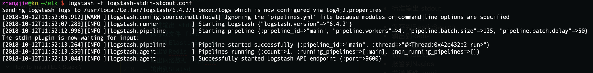
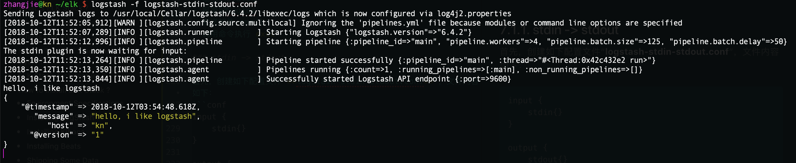
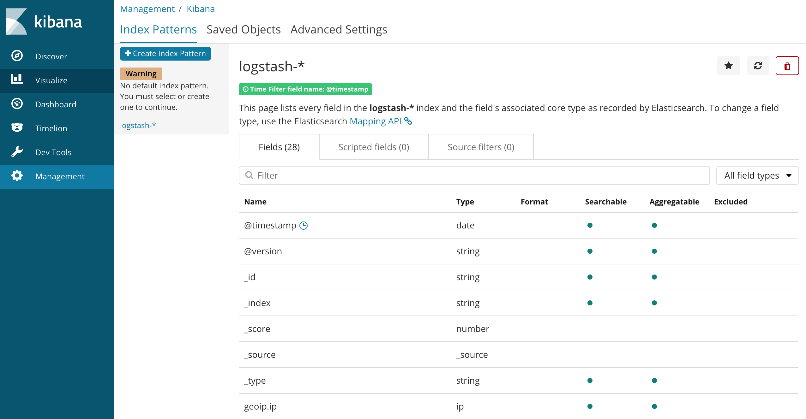
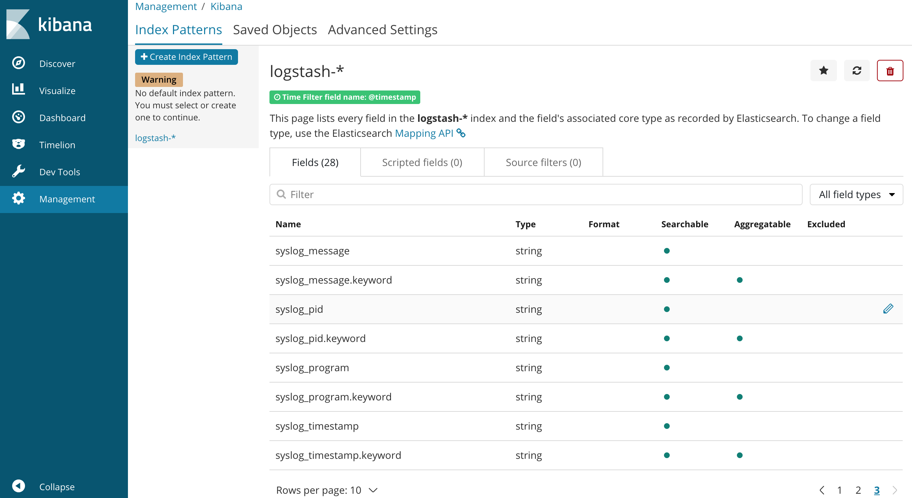
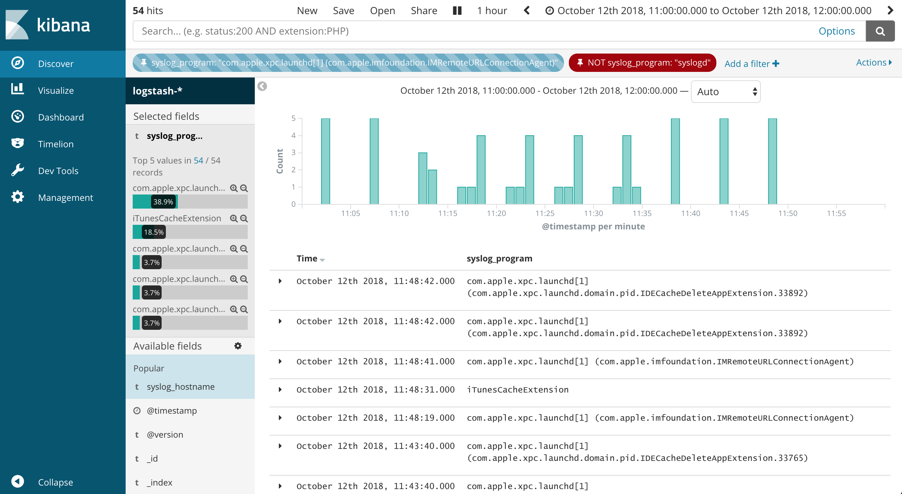
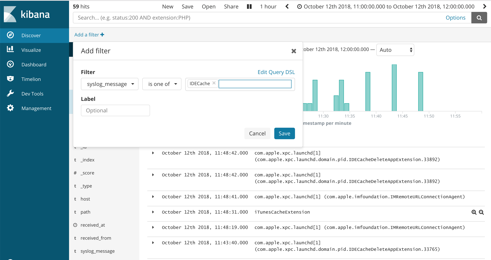

# What is ELK Stack ?

ELK Stack，包括了ElasticSearch(E)、LogStash(L)、Kibana(K)。这三个产品都是由Elastic开发、维护的，其中：

- ElasticSearch是一个基于Lucence搜索引擎构建的NoSQL数据库；
- LogStash是一个日志流水工具，它从不同的日志数据源读取日志信息、解析、转换，并导出到不同的数据接收组件，如ElasticSearch；
- Kibana是一个在ElasticSearch之上的数据可视化工具，Kibana通过查询ElasticSearch获取数据并完成可视化。

ELK Stack经常被用作集中式的日志管理工具，也可以被用于其他业务场景，这里就只从集中式日志管理来谈下。其中LogStash负责收集、解析日志，并转换成合适的形式之后导出到ElasticSearch，后者负责对日志数据进行存储并构建对应的索引。Kibana可以借助ES的强大搜索能力完成各种搜索操作，并通过数据可视化将隐藏在大量数据背后的信息以更加直观的形式展示给用户。

# Why is ELK So Popular ?

Google Trends调查了开发者对ELK的关注度，可见大家对ELK是非常认可，这是因为ELK确实很大程度上解决了分布式服务环境下日志管理方面的问题。


在腾讯工作期间，公司内其实有一个同一日志系统ULS（Unified Logging System），但是其设计局限性很明显，从其协议字段就可以看出来（比如int类型的大命令字、小命令字），而且丢log情况特别严重，经常导致服务日志不完整，难以定位问题，难以对现网问题给出可信的判断。最终导致我们放弃了ULS的使用，转而自己搭建ELK进行日志管理。

之前在日志管理这个领域，Splunk’s企业级日志管理系统一直是领头羊，但是经过这么多年，它的功能没有跟上客户对它的预期，怎么对得起它昂贵的价格呢？小公司是很难接受的，因此Splunk’s日志管理系统的客户数量越来越少，现在ELK一个月的下载量就能超过Splunk’s日志管理系统的所有客户的数量，是不是很惊人！与Splunk’s日志管理系统相比，可能ELK功能没有它丰富，但是考虑到大家平时对日志管理方面的需求而言，已经绰绰有余了！ELK足够简单、健壮、廉价，因此非常值得选择。

而且从IT行业背景来看，开源理念已经深入人心，因此相对于那些闭源软件，大家更倾向于选择开源的软件产品，因为这意味着你可以阅读、修改它的代码，做到知根知底，甚至可以定制化开发。其实很多大公司，如Netflix、Facebook、Microsoft、LinkedIn、Cisco等等也是用ELK来对服务日志进行监控。

# Why Is Log Analysis So Important ?

现在越来越多的IT基础设施都开始了云化之路，如Amazon Web Services、Microsoft Azure、Google Cloud、AliYun等等，伴随着云的诞生和普及，日志管理平台就变得越来越迫切和重要了！

在基于云的基础设施中，精确地进行性能隔离是很难做的，特别是当系统性能负载高的时候。虚拟机的性能受母机的系统负载变化、环境问题、活跃用户数等影响可能会出现很不规律的波动，集群中单一节点出现失败是很司空见惯的事情。

日志管理系统可以监视这些云设施出现的问题，也能监控操作系统日志、应用程序日志等等，如监控Nginx、IIS等服务日志以便进行更好的技术优化和Web流量分析。借助于日志管理系统，运维工程师、系统管理员、站点可靠性工程师、开发人员都可以充分利用这些日志信息来作出更合理的决策。随着大数据时代的到来，企业也竞相开启云化之路，对于分布式环境下的日志管理，其重要性更加不言自明！

# How to Use ELK Stack for Log Analysis ?

ELK Stack主要是用于进行集中式日志管理，实现、维护生产级别的ELK Stack还需要一些其他的工作、组件支持，有关安装、部署ELK的信息将在后续章节进行描述。

# ELK Stack Architecture ?

ELK Stack中包含的组件其实不止ES、LogStash、Kibana，如还有Beats，beats主要负责日志收集，并将收集到的日志在LogStash中进行汇总、处理。在设计、实现这些组件的时候，考虑到了如何减少配置并让它们相互之间更好地进行协作的问题，因此实际部署的时候也比较简单。

如何搭建、部署你的专属ELK Stack其实还是要考虑使用场景的，对于一个小规模的开发环境而言，可以采用如下经典架构：


然而，生产环境下拥有超大数据量规模的、复杂的流水线作业而言，日志管理系统架构中可能还需要引入一些额外的组件，如需要考虑伸缩性（Kafka、RabbitMQ、Redis），或者需要考虑安全（Nginx），如下图所示。


# How to Install ELK Stack ?

ELK Stack的安装方式有多种，特别是考虑到在不同的操作系统、环境下进行安装。ELK可以安装在本地，也可以在云上部署，如使用Docker或者类似Ansible、Puppet、Chef之类的配置管理系统。ELK Stack也可以通过一个安装包的压缩包解压后安装。

安装ELK Stack的步骤是基本类似的，这里就以Linux系统下的安装为例，对安装过程进行一个简单的描述，供大家参考。

## Environment Specifications

- 安装Java

  ELK Stack需要Java运行时支持，这里安装的是ElasticSearch v6，需要安装Java 8或更高版本。

- 安装ElasticSearch

  ```sh
  wget -qO - https://artifacts.elastic.co/GPG-KEY-elasticsearch | sudo apt-key add -
  sudo apt-get install apt-transport-https
  echo "deb https://artifacts.elastic.co/packages/6.x/apt stable main" | sudo tee -a /etc/apt/sources.list.d/elastic-6.x.list
  sudo apt-get update
  sudo apt-get install elasticsearch
  ```

  ElasticSearch配置文件`/etc/elasticsearch/elasticsearch.yml`允许指定一些配置项，如节点名称、es监听的ip:port、数据存储位置、占用内存大小、日志文件位置等等。下面给出了一个配置示例。

  ```sh
  sudo vim /etc/elasticsearch/elasticsearch.yml
  network.host: "localhost"
  http.port:9200
  ```

  执行以下命令启动ES：`sudo service elasticsearch start`。为了确定ES是不是真的正确运行起来了，可以使用`curl`或者`浏览器`来访问一下`http://localhost:9200`，如果ES正常运行起来了那么将返回如下格式的信息。

  ```json
  {
    "name" : "33QdmXw",
    "cluster_name" : "elasticsearch",
    "cluster_uuid" : "mTkBe_AlSZGbX-vDIe_vZQ",
    "version" : {
        "number" : "6.1.2",
        "build_hash" : "5b1fea5",
        "build_date" : "2018-01-10T02:35:59.208Z",
        "build_snapshot" : false,
        "lucene_version" : "7.1.0",
        "minimum_wire_compatibility_version" : "5.6.0",
        "minimum_index_compatibility_version" : "5.0.0"
    },
    "tagline" : "You Know, for Search"
  }
  ```

  如果要安装一个ES集群的话，安装过程会有所不同，配置也有些差异，可以参考这里的安装说明，点击查看 [ES集群部署](https://logz.io/blog/elasticsearch-cluster-tutorial/)。

## Installing LogStash

由于在安装ES的时候已经正确配置过apt repository了，这里直接借助apt命令来安装就可以了：

```sh
sudo apt-get install logstash
```

在运行LogStash之前，还需要配置一个数据流水线，我们在安装、启动Kibana之后再来配置该数据流水线。

## Installing Kibana

和安装LogStash一样，直接运行apt命令来安装Kibana就可以了：

```sh
sudo apt-get install logstash
```

现在要将Kibana与ElasticSearch结合起来，使得Kibana能访问ElasticSearch拉取数据信息，打开Kibana的配置文件`/etc/kibana/kibana.yml`，在配置文件中增加如下配置项：

```sh
server.port: 5601
elasticsearch.url: "http://localhost:9200"
```

该配置表名Kibana监听端口5601，并通过`http://localhost:9200`来访问ElasticSearch拉取数据。
现在启动Kibana：`sudo service kibana start`，并打开浏览器访问地址`http://localhost:5601`来确认一下Kibana是否正常运行，如果Kibana正常运行，浏览器中应该展示出如下界面：


## Installing Beats

现在需要继续安装Beats来进行日志收集，并配置流水线将Beat的日志收集能力与LogStash的日志聚集处理能力结合起来，然后还需要将LogStash的日志导出与ElasticSearch结合起来。

执行以下命令完成Beats的安装、启动：

```sh
sudo apt-get install metricbeat
sudo service metricbeat start
```

现在Beats就开始监视你的服务器并在ElasticSearch中创建索引，这里的索引需要我们先在ElasticSearch中进行配置。我们接下来描述如何配置Beats、LogStash流水线。

这里我们使用的是metricbeat，还有其他的一些变体，如Filebeat、Winlogbeat、Auditbeat。

## Shipping Some Data

为了展示Beats日志收集、LogStash日志汇总及处理的问题，我们准备了一点日志数据，是apache web服务的访问日志信息，点击下载 [apache-access-log.data](https://logz.io/sample-data)。

现在创建一个新的LogStash配置文件：
`sudo vim /etc/logstash/conf.d/apache-01.conf`

```sh
input {
    file {
        path => "/home/ubuntu/apache-daily-access.log"
        start_position => "beginning"
        sincedb_path => "/dev/null"
    }
}

filter {
    grok {
        match => { "message" => "%{COMBINEDAPACHELOG}" }
    }
    date {
        match => [ "timestamp" , "dd/MMM/yyyy:HH:mm:ss Z" ]
    }
    geoip {
        source => "clientip"
    }
}

output {
    elasticsearch {
        hosts => ["localhost:9200"]
    }
}
```

然后重新启动LogStash：`sudo service logstash start`。

如果一切正常的话，ElasticSearch中将会创建一个新的LogStash索引，这里的索引信息可以在Kibana中定义。

在Kibana中，点击“**Setup index patterns**”按钮，Kibana将自动识别出新创建的索引“logstash-\*”，该索引紧跟在之前创建的索引metricbeat之后。


定义为“logstash-*”并选择“@timestamp”作为Time Filter字段，该字段是LogStash收集、整理apache access log时自己添加进去的，意为收集到日志的时间。


点击“**Create index pattern**”，现在就可以分析日志数据了。现在点击“**Discover**”标签页来看下收集到的日志数据，默认只展示最近15min的，可以试着调整下时间区间（前面我们用访问日志中的字段@timestamp来用作时间区间的参考字段）。


恭喜恭喜，现在我们已经完成了第一个ELK数据流水线，在这个流水线中我们使用了ElasticSearch、LogStash、Kibana。

## Additional Installation Guide

如果要在其他环境下安装ELK Stack，这里也有一些相关的资源，供大家参考：

- [Installing ELK on Google Cloud Platform](https://logz.io/blog/elk-stack-google-cloud/)
- [Installing ELK on Azure](https://logz.io/blog/install-elk-stack-azure/)
- [Installing ELK on Windows](https://logz.io/blog/elastic-stack-windows/)
- [Installing ELK with Docker](https://logz.io/blog/elk-stack-on-docker/)
- [Installing ELK on Mac OS X](https://logz.io/blog/elk-mac/)
- [Installing ELK with Ansible](https://logz.io/blog/elk-stack-ansible/)
- [Installing ELK on RaspberryPi](https://logz.io/blog/elk-stack-raspberry-pi/)

欢迎查看本文后续内容以了解ELK Stack的更多高级话题，可以帮助大家更好地理解ElasticSearch、LogStash、Kibana、Beats的工作过程。也可以参考Elastic提供的官方手册来更全面地了解ELK Stack，点击查看 [Elastic官方手册](https://www.elastic.co/cn/)。

# How to Quickly Configure ELK Stack ?

上面描述了如何安装ELK Stack以及如何配置Pipeline的示例，这里我们针对日志管理这种场景，再详细介绍下ELK Stack的常见配置方式，方便加深认识。

## Mac下如何安装ELK Stack

我是使用的Mac，brew中也对ELK Stack相关组件进行了维护，所以可以直接运行以下命令完成安装：

```sh
brew install elasticsearch
brew install logstash
brew install kibana
```

运行上述服务也可以通过brew来完成：

```sh
brew services start elasticsearch
brew services start kibana
brew services start logstash

# 查看服务是否启动成功，成功启动的话会显示在已启动服务列表中
brew services list
```

## LogStash

LogStash是一个日志收集、处理组件，它可以从多种不同的数据源收集日志数据，再将日志解析、处理后输出到不同的目的地，如ElasticSearch等。

LogStash支持的输入类型（日志数据源）包括：

- 标准输入 stdin
- 读取文件 file
- 读取网络数据 tcp/udp
- 生成测试数据 generator
- 读取SysLog数据
- 读取Redis数据
- 读取Collectd数据

LogStash支持的输出类型类型包括：

- 标准输出 stdout
- 保存成文件 file
- 保存到ElasticSearch
- 输出到Redis
- 输出网络数据 tcp/udp
- 输出到Statsd
- 报警到Nagios
- 发送邮件 email
- 调用命令执行 exec

### stdin -> stdout

首先，创建如下配置文件“**logstash-stdin-stdout.conf**”，文件内容如下：

```conf
input {
    stdin{}
}

output {
    stdout{}
}
```

该模式下，logstash将把stdin当做日志数据源，并从stdin收集日志数据，然后将数据处理后输出到stdout。

执行如下命令启动logstash：`logstash -f logstash-stdin-stdout.conf`，程序启动需要花费几秒钟甚至更久的事件，耐心等待，直到看到如下界面：



上述截图中可以看到有一行文本“**The stdin plugin is now waiting for input:**”，意思是说logstash正在等待从stdin收集日志数据。此时可以在命令行界面输入一行文本信息进行测试，如输入“**hello world**”，logstash会将收集到的信息再输出到stdout，示例操作如下所示：



### file -> stdout

首先，还是创建一个配置文件“**logstash-file-stdout.conf**”，文件内容如下所示：

```conf
input {
    file {
        path => "/var/log/system.log"
        start_position => "beginning"
    }
}

filter {
    grok {
        match => {
            "message" => "%{SYSLOGTIMESTAMP:syslog_timestamp} %{SYSLOGHOST:syslog_hostname} %{DATA:syslog_program}(?:\[%{POSINT:syslog_pid}\])?: %{GREEDYDATA:syslog_message}"
        }
        add_field => [ "received_at", "%{@timestamp}" ]
        add_field => [ "received_from", "%{host}" ]

        remove_field => "message"
    }
    date {
        match => [ "syslog_timestamp", "MMM  d HH:mm:ss", "MMM dd HH:mm:ss" ]
    }
}

output {
    stdout {
        codec => rubydebug
    }
}
```

该模式下，logstash将读取**input.file.path**指向的单个文件system.log的内容，并且是从文件开始处开始读取，其实也可以配置同时读取多个日志文件甚至是一个目录下的所有日志文件，也可以指定从文件开头、结尾开始读取（beginning、tailing），建议参考下logstash的手册。

logstash将从日志中读取到的内容按行进行处理，对于某些多行日志，如Java异常堆栈、Protobuf Message的结构信息等，也是可以借助配置进行解析、处理的，稍后介绍。logstash将读取到的每行信息与**filter.grok.match.message**中定义的grok语法的正则表达式进行匹配，并做适当解析、转换，如将匹配的字段信息映射到某个字段名，并将字段信息解析成对应的数据类型，如将syslog_timestamp按照日期格式“MMM d HH:mm:ss或者MMM dd HH:mm:ss”解析成时间。

最后logstash将把解析、处理后的日志数据格式化输出到stdout，并且输出的时候采用rubydebug编码方式，也可以采用其他的编码方式，如json等，更多详细信息请参考logstash的配置手册。

然后，执行如下命令启动logstash：`logstash -f logstash-file-stdout.conf`，运行效果如下所示：


### file -> elasticsearch

首先，还是创建一个配置文件，与上一小结中的“file -> stdout”模式的配置文件只有一行不同，不过我们还是完整贴出来，方便大家copy/paste进行测试。创建配置文件“**logstash-file-es.conf**”,文件内容如下所示：

```conf
input {
    file {
        path => "/var/log/system.log"
        start_position => "beginning"
    }
}

filter {
    grok {
        match => {
            "message" => "%{SYSLOGTIMESTAMP:syslog_timestamp} %{SYSLOGHOST:syslog_hostname} %{DATA:syslog_program}(?:\[%{POSINT:syslog_pid}\])?: %{GREEDYDATA:syslog_message}"
        }
        add_field => [ "received_at", "%{@timestamp}" ]
        add_field => [ "received_from", "%{host}" ]

        remove_field => "message"
    }
    date {
        match => [ "syslog_timestamp", "MMM  d HH:mm:ss", "MMM dd HH:mm:ss" ]
    }
}

output {
    elasticsearch {
        hosts => ["localhost:9200"]
    }
    stdout {
        codec => rubydebug
    }
}
```

上述配置文件在“logstash-file-stdout.conf”的基础上，在output里面增加了一个输出目的地elasticsearch.hosts，意味着除了将解析、处理后的日志数据输出到stdout之外，也同时会输出到elasticsearch。

执行如下命令启动logstash：`logstash -f logstash-file-stdout.conf`。此时假定我们已经成功安装了ElasticSearch并且默认监听本地“localhost:9200”，logstash将可以正确运行，并将解析、处理后的日志数据输出到ElasticSearch进行存储。此时假定我们也已经成功安装了Kibana，但是由于我们还没有配置任何Index Pattern，Kibana中Discover Tab中还不能对查询到的数据进行可视化展示。请继续阅读后面Kibana小节的内容。

## ElasticSearch

假定ElasticSearch已经正确安装，并且监听默认地址“**http://localhost:9200**”。

## Kibana

假定Kibana已经正确安装，并且监听默认地址“**http://localhost:5601**”，此时打开浏览器访问该地址，点击Discover Tab发现没有任何数据展示，但是提示我们需要创建一个新的**Index Pattern**。此时点击“Management->Index Pattern”，然后创建一个新的Index Pattern就可以了，因为logstash将日志信息存储到ElasticSearch时会默认创建格式为“logstash-yyyy.mm.dd”的Index，为了方便我们对后续创建的Index进行检索，这里我们创建一个名为“logstash-*”的Index Pattern，并选择“**time filter**”字段为@timestamp，该字段的值是logstash收集日志时自动添加的一个字段“`add_field => [ "received_at", "%{@timestamp}"]`”。

### Create Index Pattern

ElasticSearch创建Index Pattern成功之后，点击“logstash-*”界面展示如下，从中可以看到一些ElasticSearch附加上的字段，翻页可以看到LogStash解析、存储到ElasticSearch的字段，如receive_at、receive_from、syslog_hostname、syslog_message、syslog_pid、syslog_program、syslog_timestamp。

logstash-* Index Pattern信息：



logstash-* Index Pattern信息：



### Kibana Query Filter

这里对上报的system.log日志信息进行可视化展示，看下效果，也介绍下常见的操作，现在点击Kibana的Discover Tab，我们可以选择日志上报的时间范围，这个时间范围可以在右上角进行设置，我选择的是最近1hour的范围限制，此时列出了最近1个小时的日志信息。此外，我还希望根据进程名对进程相关的日志信息进行快速查看，所以在左边栏的available fields栏中点击syslog_program右侧的add按钮，将其添加为可供快速使用的过滤条件字段，这时候就可以直接选择进程名只查看该进程相关的日志。



也可以点击上方的Add a filter按钮，添加新的检索条件，如对日志中的message字段进行检索：



Kibana利用了ElasticSearch的强大的检索、数据处理功能，然后利用自身强大的可视化能力将信息进一步展示出来方便查看。
