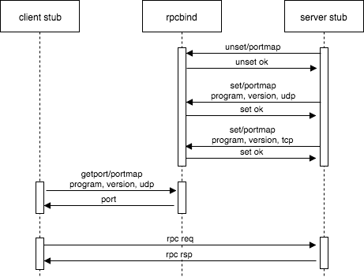

# Remote Procedure Call (RPC)

## 1 RPC简介

RPC，是Remote Procedure Call的简称，译为“**远程过程调用**”。

RPC设计初衷是想提供一种面向“**application-to-application**”（而非“host-to-host”）的通信协议，RPC使得本地程序可以像访问本地资源一样来访问其他主机上的资源。

现在所谓的各种rpc技术并不是真正意义上的rpc，wiki上列举了很多，但是跟rfc 684、rfc 707定义的rpc相去甚远，**普通的网络请求、响应的收发并不是符合rfc标准定义的rpc**！

wiki上列举了很多rpc技术，[点击j查看wiki](https://en.wikipedia.org/wiki/Remote_procedure_call)，很遗憾，感觉都不是符合标准定义的rfc。

**Steve Vinoski**，他在一次Youtube的分享中介绍了rpc演进的过程，[点击观看分享](https://www.youtube.com/watch?v=so6fNXLFixg&index=5&list=PL74sKVuaebMJipJ71p3ntfI57WWDMiVGI)。

## 2 rpcbind

rpcbind（或portmapper），[点击查看wiki](https://en.wikipedia.org/wiki/Portmap)，rpcbind才是符合rpc规范的实现，实现了面向“**application-to-application**”的目标。

基于rpcbind的rpc开发，利用rpcbind软件包提供的rpcgen以及服务描述文件，可以快速生成rpc client stub、server stub代码：```rpcgen -a -C calc.x```。印度小哥Kashif Kaularikar在Youtube上也做了个分享，[点击观看分享](https://www.youtube.com/watch?v=HbBxO5RXNhU&index=4&list=PL74sKVuaebMJipJ71p3ntfI57WWDMiVGI)。

这里也找到一篇比较详细的基于rpcgen的rpc开发教程，[点击查看教程](https://docs.oracle.com/cd/E19683-01/816-1435/rpcgenpguide-21470/index.html)。

## 3 RPC程序开发

这里描述的rpc程序开发，是基于rpcbind服务进行的。

“像访问本地资源一样来访问其他主机上的资源”，决定了在实现形式上，RPC的client、server端都需要实现服务定义的方法，只不过client、server端对该方法的实现逻辑是不同的。

- client端的方法实现，方法体内部会发起RPC相关网络请求
  - 先发起portmap请求，即向远程主机上的rpcbind（或portmapper）服务发起查询请求。查询服务program number、服务版本version number（版本中定义了不同的过程）、协议类型对应的服务监听端口port number；

  - 收到响应的端口号后，再发起rpc请求，向服务主机、端口发起网络请求，并接收响应；

    > rpc请求中要调用的远程过程以及参数信息都封装在PDU的continuation data中，rpc响应中返回的计算结果也封装在PDU的continuation data中。
- server端的方法实现，方法体内部会实现相关计算并return返回值
  - 启动时先发起portmap请求，请求rpcbind取消其program number、version number上的端口映射设置；
  - 收到响应后再分别针对不同方法、协议类型发起portmap请求，请求rpcbind重新注册program number、version number、协议类型对应的port number；

    > 因为server端启动的时候，监听套接字的时候操作系统会自动分配端口号，server端就将对应的端口号向rpcbind发起注册，由rpcbind来维护program number、version number、协议类型与port number之间的映射关系。

粗略地看了下rpcbind源码以及rpcgen生成的client、server stub源码，结合tcpdump、wireshark自己抓包看了下工作过程。感兴趣地可以结合rfc 684、rfc 707再全面地了解下。

client、server、rpcbind三者之间的时序图大致如下图：



## 总结

基于rpcbind实现rpc服务注册、查询，一次有效的rpc需要两次网络IO才能完成，一次是portmap协议getport请求、响应获取rpc服务监听端口，一次是rpc协议请求、响应。对于QPS要求比较高的服务场景，rpcbind很可能会成为网络瓶颈。

现在很多流行的所谓rpc技术并没有提供类似rpcbind的rpc服务注册、查询能力，虽然它们在实现上离rfc规范还有点距离，但是对于一个特定的服务场景而言，它们反而可能更具有优势。
