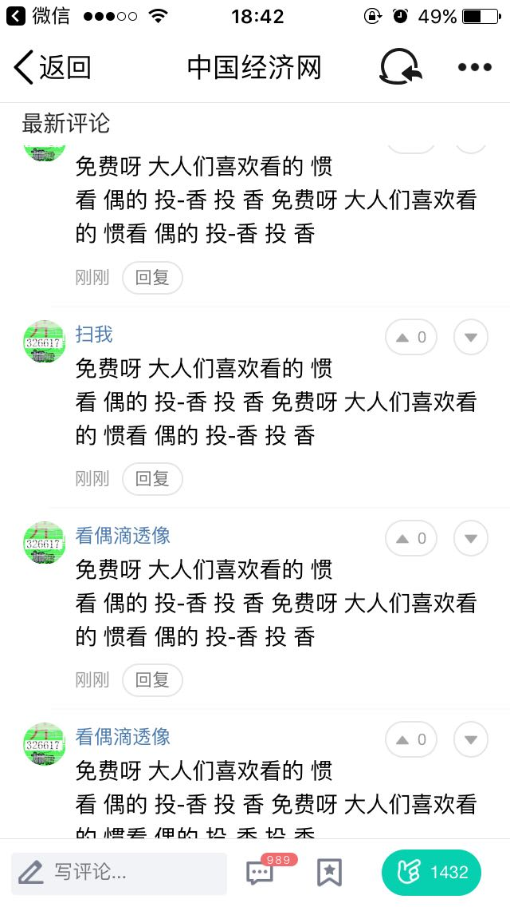
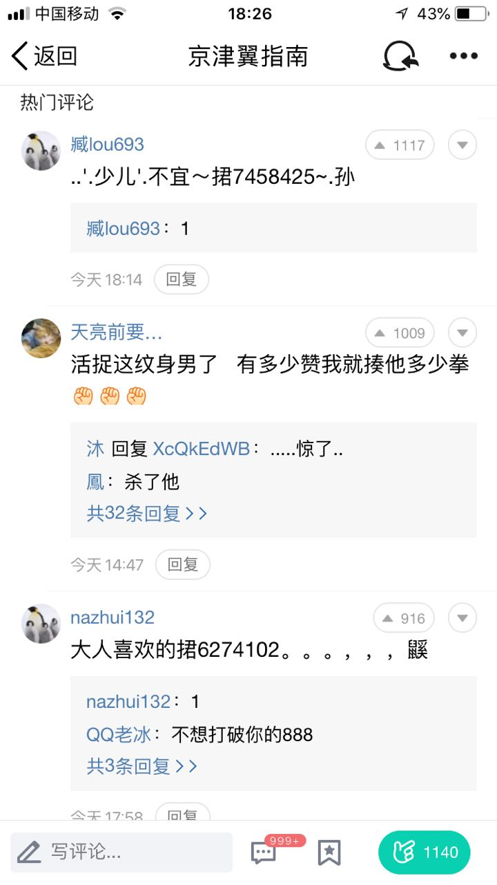
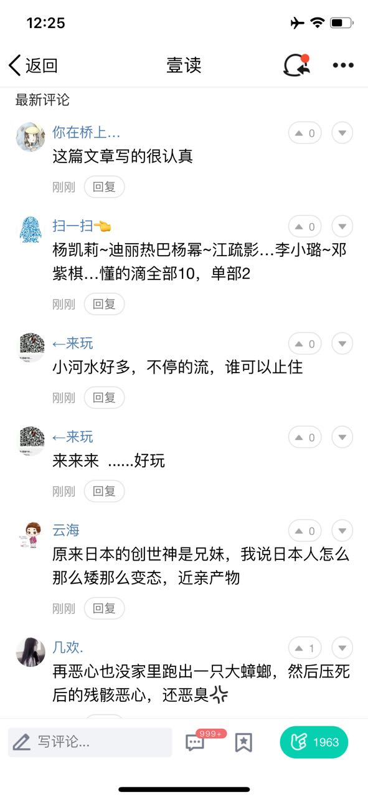
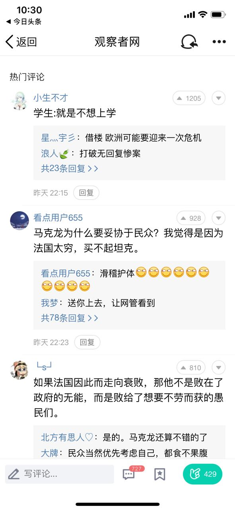
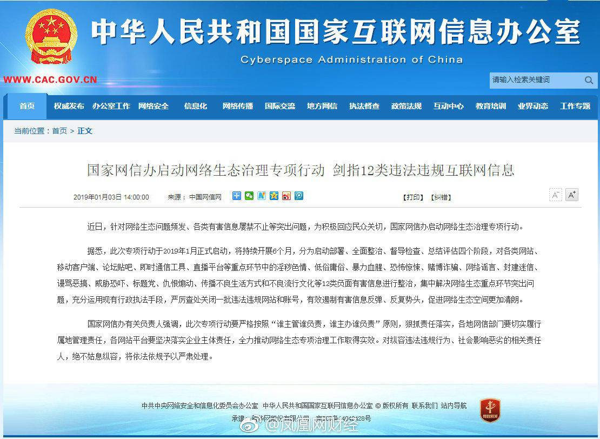
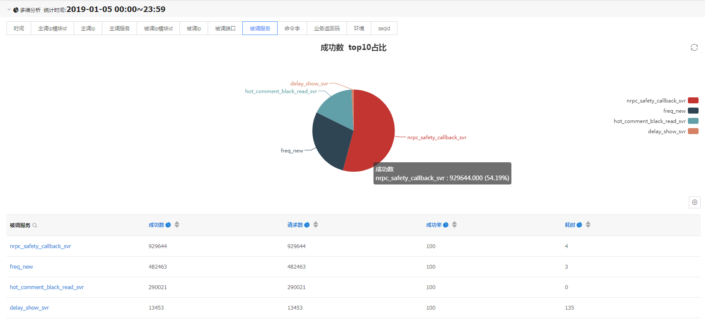
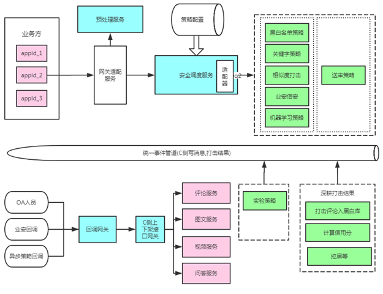

# 能力标准

## 通用能力

- 解决问题

- 项目管理

- 学习能力

- 创新能力

看点业务安全是保证看点服务质量的关键，面对**严峻的安全形势**，如何**快速**、**有效**地响应看点侧对内容安全、行为安全等维度的安全性要求是我们的生命线。

看点业务不同于QQ空间、微信朋友圈，QQ空间、微信朋友圈用户生产数据的可见性范围属于“**私域**”，而看点用户生产数据的可见性范围涵盖了“**公域**”和“**私域**”，因此其**信息传播的受众、范围更广，一旦有负面、恶意信息出现，其造成的社会负面影响更大**。

根据现网服务监控到的用户生产内容、行为数据，如用户评论、问答、biu、点赞等操作，其中存在**大量的偏负面的内容、行为**，需要及时进行拦截，避免负面信息地广泛传播造成不良影响。让问题变得更加棘手的是，除了**用户常常使用出乎意料地、不可预知的操作**来传播负面信息之外，还要准备好与**身经百战的黑产**对抗。

下面是安全打击过程中遇到的部分case，从中也可以窥探出看点侧面临的安全形势有多么严峻。

| 内容：评论涉黄 | 内容：评论相似度 | 黑产：昵称 |
| ------------ | ------------- | -------- |
|  |  |  |

| 内容：文字变体 | 头像：二维码或诱导性文字 | 内容：含沙射影 |
| ------------------ | --------------- | -------------------- |
|  |  | |

国家互联网信息办公室也高度重视网络生态治理，要求**互联网信息服务提供商必须高度重视网络生态治理**。

目前信安、业安也提供了安全相关的能力，为什么我们还要自己做安全呢？信安、业安能够提供的能力集中在“**涉黄、涉政、广告、恶意行为圈定**”，对看点侧安全起到了重要的支持。尽管如此，**面对看点业务中遇到的严峻安全形势，我们比信安、业安更加贴近业务、更加理解业务，也能够更快速地提供定制化开发**。

安全上面临的挑战以及网信办的高度重视，这都促使我们对如何快速、有效响应看点侧业务安全提出了更高的标准。

- 不同内容类型、行为类型，能支持组合使用不同的安全策略，来有效应对不同内容、行为面临的挑战；

- 针对不同的安全策略、策略组合，要能够实现灵活的策略调度

  - 策略调度支持并发、串行调度，满足业务要求的同时保证性能，如先机审后人审、机审策略并发调度；

  - 策略调度支持逻辑操作，如“逻辑与”要求所有策略全通过才通过，“逻辑或”要求只要一个策略通过就算通过；

  - 策略结果，支持多样化处理，作为打击结果返回、策略空跑验证、作为辅助决策信息返回、消息旁路；

  - 完善的立体化监控，及时感知问题事件，保证服务、安全质量。1）monitor监控不同内容、行为对应策略调度的请求量、成功量、失败量、耗时统计，2）monitor监控各个策略调度服务的请求量、成功量、失败量、耗时、打击量统计 3）habo监控各个策略调度服务的成功率、耗时分布、错误码分布，4）调用链监控每次策略调度中各个环节的耗时占比、错误。

    调用链监控链路中的各个环节（fixme)：

    habo监控各个策略服务接口质量：

  - 根据业务侧、安全策略实际情况，策略调度支持同步调度、异步调度；

  - 策略调度柔性降级，策略访问失败，旁路消息走异步策略调度处理逻辑；

  - 支持安全策略的敏捷开发、快速验证，策略调度服务通过反射实现协议适配，验证、上线新策略仅需下发配置文件，无需开发工作量；

- 深耕打击流水、打击结果，先人一步

  - 信用分，通过打击流水、打击结果，构建用户信用分。基于用户信用分实现用户分级、恶意用户圈定
    - 恶意用户写操作受限，安全打击先发制人
    - 高质量用户举报直达，也可以减轻后台人审压力，同时也有助于我们及时发现bad case完善服务策略；
  - 打击结果黑库
  - 低质用户拉黑，实现清存量、业务维度拉黑
  - ES流水加工，聚拢打击不同策略的同步、异步打击结果，方便ASN查询、回溯恶意用户打击行为；

- 法网恢恢疏而不漏，及时发现、清理漏网之鱼

  - 送审策略，支持多维度的送审控制
    - 先审后发 or 先发后审
    - 可配置化的多维度送审规则，评论敏感词、内容id、内容分类、内容标签tag、pv、uv、vv……
    - 普通用户举报，触发送审（高质量用户举报，举报直达，及时感知bad case）
    - 对于有问题内容，发现并及时添加送审配置，可在后续用户触发对该内容的点赞、biu等行为时触发再次送审，及时打掉漏网之鱼
  - 及时感知bad case，做到无懈可击
    - 高质量用户举报直达，后台人审及时感知有价值的bad case，持续完善后台安全策略；
    - 送审策略，人审及时感知有价值的bad case，持续完善后台安全策略；

- 知错能改善莫大焉，及时恢复误打击内容

  - 策略异步恢复、人审异步恢复
  - 策略打击、恢复，如何解决打击、恢复一致性问题，约束“A: [A B]”，A策略打击结果只可以被A、B策略的异步恢复结果恢复，“A:[]”，A策略打击结果不可以被任何策略打击结果恢复。

## 专业知识

- IT服务管理+规范和流程
- 安全（防止入侵+对抗恶意用户侧行为）
- 运营运维（比如机型类型）

## 专业技能

- 高性能低成本后台系统设计与实现

- 高可用系统设计与实现

- 软件架构能力

- 复杂业务系统的设计与实现

  

## 组织影响力

- 方法论建设

- 知识传播

- 人才培养

