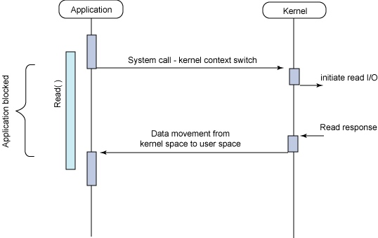
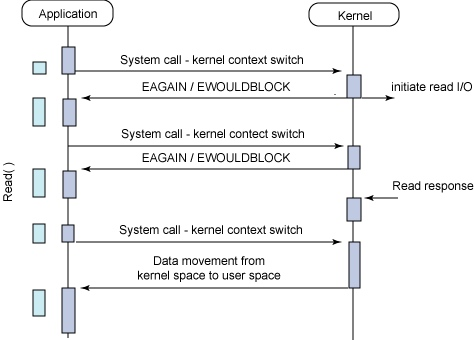
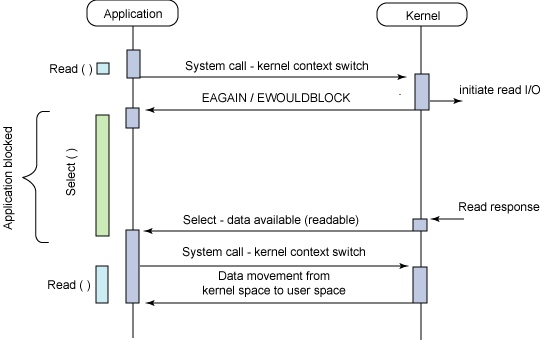
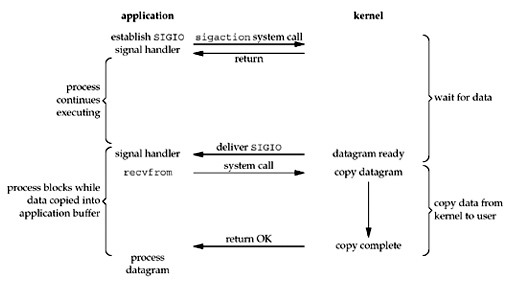
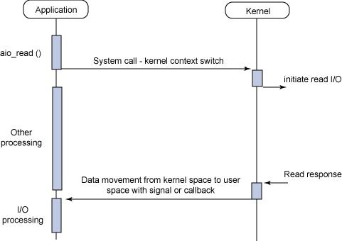

# Linux Common IO Model

## 0 目录结构

目前Linux下可用的IO模型有5种，分别为“**阻塞IO、非阻塞IO、IO多路复用、信号驱动IO、异步IO**”，其中较为成熟且高效、稳定的是IO多路复用模型，因此当前众多网络服务程序几乎都是采用这种IO操作策略。

当一个应用程序读写（以读为例）某端口数据时，选择不同IO模型的应用程序，其执行流程也将不同。下面将对选择这5种不同IO模型时的程序的执行情形进行分析，以便了解使用IO复用模型的运行情况和性能优势。

一个完整经典的应用程序的数据读取操作可以看做两步：
- 等待数据准备好；
- 将数据从内核复制到应用程序进程；

## 1. 阻塞IO模型

最流行的IO模型是阻塞IO（Blocking IO）模型，几乎所有刚开始学习IO操作的人员都是使用这个模型，虽然它存在一定的性能缺陷，但是它的确很简单。

如下图所示，是利用该模型读取IO端口数据的典型流程。在有些情况下，**当系统调用发现用户请求的IO操作不能立刻完成时（比如对IO写操作，缓冲区没有空闲空间或者空闲空间少于待写的数据量；而对于读操作，缓冲区中没有数据可读或者可读数据少于用户请求的数据量），则当前的进程会进入睡眠，也就是进程被IO读写阻塞**。但是当数据可以写出或者有数据可供读入时（其他进程或线程从缓冲区中读走了数据后或者向缓冲区写入了数据），**系统将会产生中断，唤醒在缓冲区上等待相应事件的进程继续执行**。




>备注：
有必要在这里进一步解释一下“阻塞IO”的含义。通过阻塞IO系统调用进行IO操作时，以read为例，在内核将数据拷贝到用户程序完成之前，Linux内核会对当前read请求操作的缓冲区（内存中的特殊区域）进行加锁，并且会将调用read的进程的状态设置为
**“uninterruptible wait”状态（不可中断等待状态）**，处于该状态的进程将无法参与进程调度。能够参与进程调度的进程的状态必须是处于running状态的进程或者有信号到达的处于interruptible wait状态（可中断等待状态）的进程。当read操作完成时，内核会将对应的缓冲块解锁，然后发出中断请求，内核中的中断服务程序会将阻塞在该缓冲块上的进程的状态修改为running状态以使其重新具备参与进程调度的能力。

## 2. 非阻塞IO模型

在有些时候并不希望进程在IO操作未完成时睡眠，而是希望系统调用能够立刻返回一个错误，以报告这一情况，然后进程可以根据需要在适当的时候再重新执行这个IO操作。这就是所谓的非阻塞IO模型。

如下图所示，**应用程序前几次read系统调用时都没有数据可供返回，此时内核立即返回一个EAGAIN错误代码，程序并不睡眠而是继续调用read**，当第四次调用read时数据准备好了，于是执行数据从内核到用户空间的复制操作并成功返回，应用程序接着处理数据。**这种对一个非阻塞IO端口反复调用read进行数据读取的动作称为轮询**，即应用程序持续轮询**内核数据是否准备好。这里的持续轮询操作将导致耗费大量的CPU时间，因此该模型并不推荐使用。




## 3. IO多路复用模型

前面介绍了**非阻塞IO模型的问题在于，尽管应用程序可以在当前IO操作不能完成的时候迫使系统调用立刻返回而不至于睡眠，但是却无法知道什么时候再次请求IO操作可以顺利完成，只能周期性地做很多无谓的轮询**，每隔一段时间就要重新请求一次系统调用，这种轮询策略极大浪费了CPU时间。

**IO多路复用模型就是在此之上的改进，它的好处在于使得应用程序可以同时对多个IO端口进行监控以判断其上的操作是否可以顺利（无阻塞地）完成，达到时间复用的目的**。进程阻塞在类似于select、poll或epoll这样的系统调用上，而不是阻塞在真正的IO系统调用上，意思也就是说在这些select、poll或者epoll函数内部会代替我们做非阻塞地轮询，那么它的轮询策略是怎样地呢？稍后会进行介绍。

select、poll或epoll使得进程可以在多个IO端口上等待IO事件（可读、可写、网络连接请求等）的发生，当有事件发生时再根据发生事件的类型进行适当的IO处理。不过进程在等待IO事件发生时仍然在代码执行序上处于“阻塞”状态，应用程序“阻塞”在这里照样还是无法做其他的工作（尽管可以指定轮询时等待时间的长短）。因此如果希望进程在没有IO事件要处理时还能做其他的工作，这种模型是不可行的。

下图是IO多路复用模型的示例。




IO多路复用模型主要有3种实现形式，select、poll、epoll。

### 3.1. select

```c
#include <sys/select.h>

//返回值：readfds、writefds、exceptfds中事件就绪的fd的数量
int select(int nfds,                                    // 最大文件描述符fd+1
           fd_set *restrict readfds,                    // 等待读取的fds
           fd_set *restrict writefds,                   // 等待写入的fds
           fd_set *restrict exceptfds,                  // 异常fds
           struct timeval *restrict timeout);           // 超时时间

//返回值：readfds、writefds、exceptfds中事件就绪的fd的数量
int pselect(int nfds,                                   // 最大文件描述符fd+1
            fd_set *restrict readfds,                   // 等待读取的fds
            fd_set *restrict writefds,                  // 等待写入的fds
            fd_set *restrict exceptfds,                 // 异常fds
            const struct timespec *restrict timeout,    // 超时时间
            const sigset_t *restrict sigmask);          // 信号掩码
```

>备注：
IO事件就绪的意思是，执行对应的IO操作时可以无阻塞地完成。例如读事件就绪，表明一定有数据到达，或者已经读取到了数据的结束位置EOF。

```c
#define __FD_SETSIZE 1024
typedef struct {
    /* XPG4.2 requires this member name.  Otherwise avoid the name from the global namespace.  */
    #ifdef __USE_XOPEN
        __fd_mask fds_bits[__FD_SETSIZE / __NFDBITS];
        # define __FDS_BITS(set) ((set)->fds_bits)
    #else
        __fd_mask __fds_bits[__FD_SETSIZE / __NFDBITS];
        # define __FDS_BITS(set) ((set)->__fds_bits)
    #endif
} fd_set;            
```

select和pselect基本是相同的，它们主要有3点细微的差别：
- select使用的超时时间struct timeval是微秒级的，而pselect使用的struct timespec可以精确到纳秒级；
- select会更新timeout的值，将其修改为剩余轮询时间，而pselect不会对timeout做修改；
- select无法指定轮询时的信号掩码，而pselect允许指定信号掩码，如果pselect第6个参数不为NULL，则用其先替换当前的信号掩码，然后执行与select相同的操作，返回时再还原之前的信号掩码；

fd_set只是一个普通的用于记录待监视的fd的位图，由于__FD_SETSIZE硬编码为1024，所以select最多只能监视1024个fd。

对fd_set的操作主要通过如下几个函数。

```c
#include <sys/select.h>

void FD_CLR(int fd, fd_set *fdset);                 // 从fdset中删除fd
void FD_ISSET(int fd, fd_set *fdset);               // 测试fd是否已添加到fdset中
void FD_SET(int fd, fd_set *fdset);                 // 向fdset中添加fd
void FD_ZERO(fd_set *fdset);                        // 清空fdset
```

下面对timeout相关的数据结构进行一下说明：
- 如果timeout中的两个字段均为0，则表示select立即返回；
- 如果timeout中的任意一个字段不为0，则表示select轮询时经过指定的时间后会返回；
- 如果timeout为NULL，则表示select会阻塞到有事件就绪才返回；

```c
struct timeval {
    long tv_sec;
    long tv_usec;
};

struct timespec {
    long tv_sec;
    long tv_nsec;
};

```

**在循环使用select函数时有三个地方值得注意**:
- 第一，虽然在普遍情况下，参数timeout在select函数返回时不会被修改，但是有的Linux版本却会将这个值修改成函数返回时剩余的等待秒数，因此从可移植性上考虑，在每次重新调用select函数前都得再次对参数timeout初始化。
- 第二，select函数中间的三个参数（即感兴趣的描述符集）在select函数返回时，其保存有指示哪些描述符已经进入就绪状态（此时其对应bit被设置为1，其他未就绪描述符对应bit设置为0），从而程序可以使用宏FD_ISSET来测试描述符集中的就绪描述符。因此，在每次重新调用select函数前都得再次把所有描述符集中关注的fd对应的bit设置为1。
- 第三，应注意到利用select函数监控的最大描述符收到系统FD_SETSIZE宏的限制，最多能够监视1024个描述符，在高并发情景中，select是难以胜任的。

下面是select的编程模板，可在此基础上进行改进。

```c
// 可读、可写、异常3种文件描述符集的声明和初始化
fd_set readfds, writefds, exceptfds;

FD_ZERO(&readfds);
FD_ZERO(&writefds);
FD_ZERO(&exceptfds);

int max_fd;

// socket配置和监听
int sock = socket(...);
bind(sock, ...);
listen(sock, ...);

// 对socket描述符上关心的事件进行注册，select不要求fd非阻塞
FD_SET(sock, &readfds);
max_fd = sock;

while(1) {

    int i;
    fd_set r, w, e;

    // 为了重复使用readfds、writefds、exceptionfds，将他们复制到临时变量内
    memcpy(&r, &readfds, sizeof(fd_set));
    memcpy(&w, &writefds, sizeof(fd_set));
    memcpy(&e, &exceptfds, sizeof(fd_set));

    // 利用临时变量调用select阻塞等待，等待时间为永远等待直到事件发生
    select(max_fd+1, &r, &w, &e, NULL);

    // 测试是否有客户端发起连接请求，如果有则接受并把新建的描述符加入监控
    if(FD_ISSET(sock, &r)) {
        new_sock = accept(sock, ...);

        FD_SET(new_sock, &readfds);
        FD_SET(new_sock, &writefds);

        max_fd = MAX(max_fd, new_sock);
    }

    // 对其他描述符上发生的事件进行适当处理
    // 描述符依次递增，各系统的最大值可能有所不同，一般可以通过ulimit -n进行设置
    for(i=sock+1; i<max_fd+1; ++i) {
        if(FD_ISSET(i, &r)) {
            doReadAction(i);
        }
        if(FD_ISSET(i, &w)) {
            doWriteAction(i);
        }
    }
}

```

>备注：
上述只是一个非常简单的select使用示例，在实际使用过程中需要考虑一些其他的因素，例如对端的tcp连接socket关闭时应该怎样处理，关闭又可以细分为关闭读和写两种情况。

**代码示例**：
**点击这里查看基于select实现的tcp server，[[click to see select-based-tcp-server]](https://github.com/hitzhangjie/Linux-IO-Model/tree/master/io-select)**。

### 3.2. poll

```c
#include <poll.h>

int poll(struct pollfd *fds,                        // 待监视的fd构成的struct pollfd数组
         nfds_t nfds,                               // 数组fds[]中元素数量
         int timeout);                              // 轮询时等待的最大超时时间

struct pollfd {
    int fd;                                         // 待监视的fd
    short events;                                   // 请求监视的事件
    short revents;                                  // 实际收到的事件
};

```

pollfd中可指定的event类型包括：
- POLLIN，普通数据读取；
- POLLPRI，紧急数据读取；
- POLLOUT，普通数据可写；
- POLLRDHUP，面向流的socket，对端socket关闭连接或者关闭了写半连接；
- POLLERR，错误；
- POLLHUP，挂起；
- POLLNVAL，无效请求，fd没有打开；

当如果通过宏_XOPEN_SOURCE进行条件编译时，还可指定如下event类型：
- POLLRDNORM，与POLLIN等效；
- POLLRDBAND，优先级带数据可读，在Linux上通常是无用的；
- POLLWRNORM，与POLLOUT等效；
- POLLWRBAND，优先级数据可写；

poll系统调用的第三个参数timeout指定了轮询时的等待事件，当timeout<0时永远等待直到监视的fds上有事件发生，当timeout=0时立即返回，单timeout>0时等待到指定的超时时间后返回。poll不要求监视的fd为非阻塞。

**poll与select相比具有如下优势**：  
- poll系统调用中通过第二个参数nfds来限定要监视的描述符的数量，与select相比，poll去掉了硬编码的FD_SETSIZE宏的监控fd数量上限；
- 另外poll通过pollfd中的revents来接收fd上到达的事件，events不会被修改，每次调用poll时不用像select一样每次都需要重新设置r、w、e文件描述符集，方便使用也减少数据向内核拷贝的开销。

```c
// 新建并初始化文件描述符集
struct pollfd fds[MAX_NUM_FDS];
int max_fd;

// socket配置和监听
sock = socket(...);
bind(sock, ...);
listen(sock, ...);

// 对socket描述符上关心的事件进行注册
fds[0].fd = sock;
fds[0].events = POLLIN;
max_fd = 1;

while(1) {

    int i;

    // 调用poll阻塞等待，等待时间为永远等待直到事件发生
    poll（fds, max_fd, -1);

    // 测试是否有客户端发起连接请求，如果有则接受并把新建的描述符加入监控
    if(fds[0].revents & POLLIN) {
        new_sock = accept(sock, ...);

        fds[max_fd].fd = new_sock;
        fds[max_fd].events = POLLIN | POLLOUT;

        ++ max_fd;
    }

    // 对其他描述符发生的事件进行适当处理
    for(i=1; i<max_fd+1; ++i) {
        if(fds[i].revents & POLLIN) {
            doReadAction(i);
        }
        if(fds[i].revents & POLLOUT) {
            doWriteAction(i);
        }
    }
}
```

>备注： 
>上面的代码也是只给出了一个最简单的编程示例，对于对端tcp连接关闭的情况也需要予以考虑，避免服用端占用大量的fd。
>从上面基于select/poll多路复用IO模型可以看出，在大量的并发连接中，如果空闲连接（即无事件发生的连接）较多，select/poll的性能会因为并发数的线性上升而成线型速度下降，实际上性能可能比线型下降更差。当连接数很大时，系统开销会异常大。
>另外select、poll每次返回时都需要从内核向用户空间复制大量的数据，数据复制的开销也会很大，select主要是从内核向用户空间复制readfds、writefds、exceptfds开销大，poll主要是从内核复制pollfd[]开销大。
>使用select/poll实现的多路复用IO模型是最稳定也是使用最为广泛的事件驱动IO模型，但是其固有的一些缺点（如性能低下、伸缩性不强）使得各种更为先进的替代方案出现在各种平台下。

**代码示例**：
**点击这里查看基于poll实现的tcp server，[[click to see poll-based-tcp-server]](https://github.com/hitzhangjie/Linux-IO-Model/tree/master/io-poll)**。

### 3.3. epoll

epoll作为poll的变体在Linux内核2.5中被引入，相比于select实现的多路复用IO模型，epoll的最大好处在于它不会随着监控描述符数目的增长而使效率急剧下降。在内核中的select实现是采用轮询处理的，轮询的描述符数目越多，自然耗时越多，而且在很多情况下，select最多能同时监听的描述符数目为1024个。

epoll提供了三种系统调用，如下所示。

```c
#include <sys/poll.h>

// 创建一个epfd，最多监视${size}个文件描述符
int epoll_create(int size);

int epoll_ctl(int epfd,                             // epfd
             int op,                                // 操作类型（注册、取消注册）
             int fd,                                // 待监视的fd
             struct epoll_event *event);            // 待监视的fd上的io事件

int epoll_wait(int epfd,                            // epfd
               struct epoll_event *events,          // 最终返回的就绪事件
               int maxevents,                       // 期望的就绪事件数量
               int timeout);                        // 超时时间

int epoll_wait(int epfd,                            // epfd
               struct epoll_event *events,          // 接收返回的就绪事件
               int maxevents,                       // 期望的就绪事件数量
               int timeout,                         // 超时时间
               const sigset_t *sigmask);            // 信号掩码

typedef union epoll_data {
    void *ptr;
    int fd;
    __uint32_t u32;
    __uint64_t u64;
} epoll_data_t;

struct epoll_event {
    __uint32_t events;                              // epoll events
    epoll_data_t data;                              // user data variable
};

```

epoll中可以关注的事件主要有：
- EPOLLIN，数据可读事件；
- EPOLLOUT，数据可写事件；
- EPOLLRDHUP，流socket对端关闭连接或者关闭了写半连接；
- EPOLLPRI，紧急数据读取事件；
- EPOLLERR，错误事件；
- EPOLLHUP，挂起事件，epoll总是会等待该事件，不需要显示设置；
- EPOLLET，设置epoll以边缘触发模式工作（不指定该选项则使用级别触发Level Trigger模式）；
- EPOLLONESHOT，设置epoll针对某个fd上的事件只通知一次，一旦epoll通知了某个事件，该fd上后续到达的事件将不会再发送通知，除非重新通过epoll_ctl EPOLL_CTL_MOD更新其关注的事件。

epoll事件的两种模型：

- LT，Level Triggered，译为水平触发或者级别触发，我更偏向于使用级别触发。级别触发是默认的工作方式，同时支持阻塞和非阻塞socket。在这种模式下，当描述符从未就绪变为就绪时，内核通过epoll告诉进程该描述符有事件发生，之后如果进程一直不对这个就绪状态做出任何操作，则内核会继续通知，直到事件处理完成。以LT方式调用的epoll接口就相当于一个速度比较快的poll模型。
- ET，Edge Triggered，译为边缘触发。边缘触发方式是高速工作方式，只支持非阻塞socket。在这种工作方式下，当描述符从未就绪变为就绪时，内核通过epoll告诉进程该描述符有事件发生，之后就算进程一直不对这个就绪状态做出任何操作，内核也不会再发送更多地通知，也就是说内核仅在该描述符事件到达的那个突变边缘对进程做出一次通知。
根据ET方式的特性，epoll工作在此模式时必须使用非阻塞文件描述符，以避免由于一个文件描述符的阻塞读、阻塞写操作把处理多个文件描述符的任务“饿死”。
调用ET模式epoll接口的推荐步骤如下：
1）基于非阻塞文件描述符；
2）只有当read或write返回EAGAIN（对于面向包/令牌的文件，比如数据报套接口、规范模式的终端）时，或是read/write读到/写出的数据长度小于请求的数据长度（对于面向流的文件，比如pipe、fifo、流套接口）时才需要挂起等待下一个事件。
总的来说，在大并发的系统中，边缘触发模式比级别触发模式更具有优势，但是对于程序员的要求也更高。如果对于这两种模式想要了解得更加深入，那么建议读者阅读epoll相关的源代码。

下面是epoll多路复用IO模型的一个编程模板，可以在此基础上进行改进。

```c
// 创建并初始化文件描述符集
struct epoll_event ev;
struct epoll_event events[MAX_EVENTS];

// 创建epoll句柄epfd
int epfd = epoll_create(MAX_EVENTS);

// 监听socket配置
sock = socket(...);
bind(sock, ...);
listen(sock, ...);

// 对socket描述符上关心的事件进行注册
ev.events = EPOLLIN;
ev.data.fd = sock;
epoll_ctl(epfd, EPOLL_CTL_ADD, sock, &ev);

while(1) {

    int i;

    // 调用epoll_wait阻塞等待，等待事件未永远等待直到发生事件
    int n = epoll_wait(epfd, events, MAX_EVENTS, -1);
    for(i=0; i<n; ++i) {
        // 测试是否有客户端发起连接请求，如果有则接受并把新建的描述符加入监控
        if(events[i].data.fd == sock) {
            if(events[i].events & EPOLLIN) {
                new_sock = accept(sock, ...);

                ev.events = EPOLLIN | EPOLLOUT;
                ev.data.fd = new_sock;

                epoll_ctl(epfd, EPOLL_CTL_ADD, new_sock, &ev);
            }
        }
        else {
            // 对于其他描述符上发生的事件进行适当处理
            if(events[i].events & EPOLLIN) {
                doReadAction(i);
            }
            if(events[i].events & EPOLLOUT) {
                doWriteAction(i);
            }
        }
    }
}

```

>备注：
注意上面的代码也是仅仅给出了一个编程示例，实际应用过程中也需要考虑对端tcp连接关闭时对server端套接字的处理，比如通过epoll_ctl(epfd, EPOLL_CTL_DEL, fd, NULL)取消对fd上事件的轮询，并close(fd)_。服务端如果不注意对分配的套接字fd进行回收，很有可能达到系统允许的fd上限，那时候就会出现服务瘫痪，应注意避免这种情况的发生。

**备注**：
**需要注意级别触发、边缘触发编码方式上的差别，这里首先要铭记一点，级别触发只在事件状态发生改变时通知一次，而边缘触发只要事件处于就绪状态那么就会在处理之前一直发送统治**。
**使用边缘触发方式进行编程比使用级别触发编程要稍微复杂一些，需要时刻谨记上述差异，这里说两个直观的情景便于大家理解**。

- **当通过epfd监听来自多个客户端的入连接请求时，可能一次会有大量客户端的入连接请求到达，一次epoll_wait，如果工作在边缘触发模式，就只会通知一次epfd可读事件就绪，因此在对epfd上的EPOLLIN进行事件处理时，需要通过一个while循环不停地调用accept来完成所有入连接请求的处理，而不是像上述编程示例（上例为LT触发模式）中一样一次EPOLLIN只调用一次accept，则级别触发模式下上述方式是可行的，但是边缘触发模式下会造成严重的bug**。  
- **当通过sock_conn对连接socket上到达的数据进行读取时，对于每一个socket_conn上的数据都要通过一个while循环不停读取知道再次read返回EAGAIN确保所有数据已读取完，因为这个时候不读取，以后就不会收到epoll_wait的再次通知，如果想读取基本上就退化为一个poll了，需要自己轮询或者测试是否可读，影响性能**。  
- **对于sock_conn上数据写操作的处理，与sock_conn上数据读的处理是相似的**。

**与select、poll相比，epoll具有如下优点**：

- epoll每次只返回有事件发生的文件描述符信息，这样调用者不用遍历整个文件描述符队列；
- 使用epoll使得系统不用从内核向用户空间复制数据，因为它是利用mmap使内核和用户空间贡献一块内存；
- 另外epoll可以设置不同的事件触发方式，包括边缘触发和级别触发两种，为用户使用epoll提供了灵活性。

**代码示例**：
**点击这里查看基于epoll实现的tcp server，[[click to see epoll-based-tcp-server]](https://github.com/hitzhangjie/Linux-IO-Model/tree/master/io-epoll)**。注意，这里的代码实现中包括了两个tcp server实现，一个是基于边缘触发模式(ET)，一个是基于级别触发模式(LT)。

## 4. 实时信号驱动IO模型

实时信号驱动(rtsig)IO模型使得应用程序不需要阻塞在某一个或多个IO端口上，它先利用系统调用sigaction来安装某个端口的事件信号处理函数，该系统调用sigaction执行成功后立即返回，进程继续往下工作而不被阻塞，当某个IO端口上可进行数据操作时，内核就为该进程产生一个SIGIO信号，进程收到该信号后相应地在信号处理函数里进行IO操作，因此，这种机制使得程序能够在一个更合适的时间点被通知到，被通知去执行IO事件处理，之所以说是通知的时间点更好，是因为此时进行IO需要的数据已就绪，IO处理可以保证无阻塞地完成。




实时信号驱动IO完全不是在select/poll基础上的修改，而是对传统信号驱动IO的完善，因此它是完全不同于前面介绍的几种解决方案的事件驱动IO机制。

要使用实时信号驱动IO模型相对于处理普通的信号要稍微复杂一点，除了要为SIGIO信号建立信号处理函数（在该处理函数内当然要包含对实际IO操作的系统调用）以外，还需要额外的步骤，如对IO端口做一些设置以便启用信号驱动IO功能。首先要设置描述符的所有者，这可以通过fcntl的F_SETOWN操作来完成，**fcntl(fd, F_SETOWN, (int)pid)**，接着要启用描述符的信号驱动IO模式，这个步骤一般是通过fcntl的F_SETFL来设置O_ASYNC标识来完成的，**fcntl(fd, F_SETFL, O_ASYNC\|O_NONBLOCK\|O_RDWR)**。另外，如果有必要还可以重新设置描述符可读写时要发送的信号值，这可以通过fcntl的F_SETSIG指定，**fcntl(fd, F_SETSIG, ev->signum)**。

>备注：
>要使用F_SETSIG常量值必须在其源文件开头包含宏定义“#define __USE_GNU”或者“#define _GNU_SOURCE”，当然也可以通过GCC -D来指定宏。不过推荐使用宏_GNU_SOURCE而不是__USE_GNU宏。原因是，双划线开头的宏一般是由系统中的头文件对其进行定义、扩展，而不是在普通应用程序中。

可以看到所谓的实时信号驱动IO模型就是利用了O_ASYNC来使得当描述符可读、写时发送通知信号（采用非常规可排队的POSIX实时信号）从而使得进程可以异步执行。

该模型有一些缺点：
- O_ASYNC仅能工作于socket描述符上，而不能工作于管道（pipe）或中断（tty）上；
- O_ASYNC为边缘触发方式，因此事件处理函数必须完整的完成某个事件处理动作（比如读取数据则必须读取完），否则不能保证进程可靠的再次接收到信号通知；

>备注：
>RTSIG的实现与进程怎样分派信号密切相关，对每一个发生的事件就递交一个信号通知将是十分浪费的，因此一般考虑使用sigtimedwait()函数来阻塞等待进程关心的信号，并且结合利用poll()函数实现对描述符事件的水平触发效果。

据某些开发人员测试，在一定条件下的实时信号驱动IO模型表现性能比其他基于poll的IO模型都要好，但是这种方案似乎并不可靠，很多开发人员给出的建议就是不要使用这种方式。

下面给出了一个利用RTSIG IO的编程范例。

```c
// 屏蔽不关心的信号
sigset_t all;
sigfillset(&all);
sigdelset(&all, SIGINT);
sigprocmask(SIG_SETMASK, &all, NULL);

// 新建并初始化关心的信号
sigset_t sigset;
siginfo_t siginfo;

// sigwaitinfo调用时会阻塞，除非收到wait的信号集中的某个信号
sigemptyset(&sigset);
sigaddset(&sigset, SIGRTMIN + 1);

// socket配置和监听
sock = socket(...);
bind(sock, ...);
listen(sock, ...);

// 重新设置描述符可读写时要发送的信号值
fcntl(sock, F_SETSIG, SIGRTMIN + 1);

// 对socket描述符设置所有者
fcntl(sock, F_SETOWN, getpid());

// 启用描述符的信号驱动IO模式
int flags = fcntl(sock, F_GETFL);
fcntl(sock, F_SETFL, flags|O_ASYNC|O_NONBLOCK);

while(1) {
    struct timespec ts;
    ts.tv_sec = 1;
    ts.tv_nsec = 0;

    // 调用sigtimedwait阻塞等待，等待事件1s & sigwaitinfo会一直阻塞
    // - 通过这种方式可以达到一种类似级别触发的效果，不再是边缘触发；
    // - 边缘触发效果，应该通过同一个sighandler进行处理，但是处理起来比较麻烦：
    //   - 假如不同的连接socket使用相同的信号，那么sighandler里无法区分事件就绪的fd；
    //   - 假如不同的连接socket使用不同的信号，实时信号数量有限SIGRTMIN~SIGRTMAX大约才32个！
    //sigtimedwait(&sigset, &siginfo, &ts);
    sigwaitinfo(&sigset, &siginfo);

    // 测试是否有客户端发起连接请求
    if(siginfo.si_fd == sock) {
        new_sock = accept(sock, ...);
        fcntl(new_sock, F_SETSIG, SIGRTMIN + 1);
        fcntl(new_sock, F_SETOWN, getpid() + 1);
        fcntl(new_sock, F_SETFL, O_ASYNC|O_NONBLOCK|O_RDWR);
    }
    // 对其他描述符上发生的读写事件进行处理
    else {
        doReadAction(i);
        doWriteAction(i);
    }
}
```

上面的代码看起来似乎挺简单，很多人看了之后可能还很想尝试并在实践中应用，这里要注意的是，rtsig driven io并没有那么简单、有效！且听我细细道来！

### 4.1 rtsig在udp中应用

rtsig driven io在udp server中较为简单，因为udp中只有两种情况会为fd raise一个rtsig：
1. fd上有数据到达；
2. fd上io操作有错误；

我的repo里面有一个基于rtsig实现的udp server，实现起来很简单，不需要做什么特殊处理逻辑就可以轻松实现，虽然说rtsig不怎么被看好吧，但是至少有个服务ntp还是使用的rtsig & udp来实现的，可是tcp就不同了，好像还没有一个tcp server是基于rtsig实现的，很多人都反对在tcp中应用rtsig，因为太啰嗦而且很“没用”，每个io事件都raise一个信号也是个累赘，要判断的可能的io状态太多。

**代码示例**：
**点击查看基于rtsig实现的udp server示例：[[click to see rtsig-udp-server]](https://github.com/hitzhangjie/Linux-IO-Model/tree/master/rtsig-udp)**。

### 4.2 rtsig在tcp中应用

rtsig drive io在tcp server中实现就复杂多了，因为对于一个fd有7种可能的情景会为其raise一个rtsig：
1. fd上完成了一个建立连接的请求；
2. fd上发起了一个断开连接的请求；
3. fd上完成了一个断开连接的请求；
4. fd上有数据到达；
5. fd上有数据写出；
6. fd上半连接关闭；
7. fd上有错误发生；

这么多的情景需要作很多额外的判断才能加以区分，所以很多开发人员建议在tcp中只将rtsig应用在监听套接字sock_listen上，对于连接套接字还是基于select、poll、epoll来操作，其实即便这样也是费力不讨好，因为rtsig也存在可能丢失的问题！而且它是边缘触发，对程序员要求也比较高。建议还是用epoll吧！

这里的tcp server中采用的是通过sigtimedwait/sigwaitinfo & siginfo_t.si_fd来区分收到rtsig的连接套接字、监听套接字的，然后再针对性地进行io处理！在我们的另一个基于rtsig的tcpserver实现中，我们通过同一个sighandler收到SIGIO信号时建立tcp连接并随即选择一个连接进行处理，虽然我们实现了，不过也不是一个特别clean的方法，不建议使用rtsig driven io，还是用IO多路复用来的清爽！

**代码示例**：
**点击查看基于rtsig实现的tcp server示例**：

- **示例1，基于sigtimedwait/sigwaitinfo & siginfo_t.si_fd来区分连接fd，[[click to see rtsig-tcp-server-1]](https://github.com/hitzhangjie/Linux-IO-Model/tree/master/rtsig-tcp)**；
- **示例2，基于sighandler以及一点小技巧实现的对多个连接fd进行处理，[[click to see rtsig-tcp-server-2]](https://github.com/hitzhangjie/Linux-IO-Model/tree/master/rtsig-tcp2)**；

## 5. 异步IO模型

异步IO也是属于POSIX规范的一部分，类似实时信号驱动IO的异步通知机制，这也使得异步IO模型常常与后者相混淆。与后者的区别在于，启用异步IO意味着告知内核启动某个IO操作，并让内核在整个操作（包括将数据从内核复制到用户空间的缓冲区）完成时通知我们。也就是说，**实时信号驱动IO是由内核通知我们何时可以启动一个IO操作，而在异步IO模型中，是由内核通知我们IO操作何时完成，即实际的IO操作是异步的**。




### 5.1. AIO API说明
下面的内容摘自Linux man手册，其对POSIX下的AIO接口、实现做了一个基础的介绍。在此基础上，我们将把AIO应用于后台服务中。

POSIX AIO接口允许应用程序发起一个或者多个IO操作，这些IO操作是异步执行的，即相比于当前发起IO操作的线程来说这些实际的IO操作是在“后台”运行的。IO操作完成时，可以选择多种方式来通知应用程序完成这一事件，例如：
- 传递一个信号给应用程序通知其IO操作完成；
- 在应用程序中额外实例化一个线程来对IO完成操作进行后处理；
- 也可能根本不会通知应用程序；

前面第4节讲过的rtsig driven io也可以算是异步的，从其当时使用的选项O_ASYNC就可以看出来，也可以称其为AIO（Asynchronous IO），但是呢，这里本节所提到的AIO主要指的是POSIX规范里面定义的AIO API。

#### 5.1.1. POSIX AIO API

**POSIX AIO接口包括如下几个函数**：
- aio_read(3)：入队一个read请求，它是read的异步操作版本；
- aio_write(3)：入队一个write请求，它是write的异步操作版本；
- aio_fsync(3)：入队一个sync请求（针对某个fd上的IO操作），它是fsync和fdatasync的异步版本；
- aio_error(3)：获取一个已入队的IO请求的错误状态信息；
- aio_return(3)：获取一个已完成的IO请求的返回状态信息；
- aio_suspend(3)：挂起IO请求的发起者，直到指定的一个或多个IO事件完成；
- aio_cancel(3)：尝试取消已经发起的某个特定fd上的未完成的IO请求；
- lio_listio(3)：使用这一个函数可以一次性入队多个IO请求；

#### 5.1.2. Linux AIO SysCall
**通过上面几个函数后面的“(3)”可以知道，上述几个函数都是普通的libc库函数，而不是系统调用，实际上上述这些纯用户态的库函数是基于5个系统调用来实现的，它们是**：
- io_setup(2) - **int io_setup(unsigned nr_events, aio_context_t \*ctx_idp)**
该函数在内核中为进程创建一个AIO Context，AIO Context是多个数据结构的集合，用于支持内核的AIO操作。每一个进程可以拥有多个AIO Context，每一个AIO Context都有一个唯一的标识符，AIO Context类型aio_context_t变量作为io_setup的第二个参数，内核会设置其对应的值，实际上这个aio_context_t类型仅仅是一个unsigned long类型(typedef unsigned long aio_context_t），io_setup的第一个参数表示aio_context_t变量要支持的同时发起的IO请求的数量。
- io_destroy(2) - **int io_destroy(aio_context_t ctx_id)**
该函数用于销毁AIO Context变量，销毁之前有两个操作，首先取消基于该aio_context_t发起的未完成的AIO请求，然后对于无法取消的AIO请求就阻塞当前进程等待其执行完成，最后销毁AIO Context。
- io_submit(2) - **int io_submit(aio_context_t ctx_id, long nr, struct iocb \*\*iocbpp)**
该函数将向aio_context_t ctx_id上提交nr个IO请求，每个IO请求是由一个aio control block来指示的，第三个参数struct iocb **iocbpp是一个aio控制块的指针数组。
- io_getevents(2) - **int io_getevents(aio_context_t ctx_id, long min_nr, long nr, struct io_event \*events, struct timespec \*timeout)**
等待aio_context_t ctx_id关联的aio请求已完成队列中返回最少min_nr个事件，最多nr个事件，如果指定了timeout则最多等待该指定的时间，如果timeout为NULL则至少等待min_nr个事件返回。
- io_cancel(2) - **int io_cancel(aio_context_t ctx_id, struct iocb \*iocb, struct io_event \*result)**
该函数取消之前提交到aio_context_t ctx_id的一个AIO请求，这个请求由struct iocb *iocb标识，如果这个AIO请求成功取消了，对应的事件将被拷贝到第三个参数struct io_event *result指向的内存中，而不是将其放在已完成队列中。

>备注：
上述几个内核中的函数io_setup、io_destroy、io_submit、io_getevents、io_cancel，libc中并没有提供对应的wrapper函数供我们调用，如果要使用这些函数的话，可以通过syscall(2)来调用，以调用io_setup为例：syscall(__NR_io_setup, hr, ctxp)，这也是一种发起系统调用的常见方式。
但是呢，libaio库里面提供了对应的wrapper函数，但是其参数类型与这里有点差异，而且返回值的含义也存在一些差异，不是很建议使用。

### 5.2. AIO操作示例

#### 5.2.1. Kernel AIO SysCall

下面是一个基于内核AIO系统调用的一个示例，程序打开一个本地文件，并将一段缓冲区中的数据写入到文件中。

```c
#define _GNU_SOURCE         /* syscall() is not POSIX */

#include <stdio.h>          /* for perror() */
#include <unistd.h>         /* for syscall() */
#include <sys/syscall.h>    /* for __NR_* definitions */
#include <linux/aio_abi.h>  /* for AIO types and constants */
#include <fcntl.h>          /* O_RDWR */
#include <string.h>         /* memset() */
#include <inttypes.h>       /* uint64_t */

inline int io_setup(unsigned nr, aio_context_t * ctxp)
{
    return syscall(__NR_io_setup, nr, ctxp);
}

inline int io_destroy(aio_context_t ctx)
{
    return syscall(__NR_io_destroy, ctx);
}

inline int io_submit(aio_context_t ctx, long nr, struct iocb **iocbpp)
{
    return syscall(__NR_io_submit, ctx, nr, iocbpp);
}

inline int io_getevents(aio_context_t ctx,
                        long min_nr, long max_nr,
                        struct io_event *events,
                        struct timespec *timeout)
{
    return syscall(__NR_io_getevents, ctx, min_nr, max_nr, events, timeout);
}

int main()
{
    int fd = open("./testfile", O_RDWR|O_CREAT, S_IRUSR|S_IWUSR);
    if (fd < 0) {
        perror("open error");
        return -1;
    }

    // init aio context
    aio_context_t ctx = 0;

    int ret = io_setup(128, &ctx);
    if (ret < 0) {
        perror("io_setup error");
        return -1;
    }

    // setup I/O control block
    struct iocb cb;
    memset(&cb, 0, sizeof(cb));
    cb.aio_fildes = fd;
    cb.aio_lio_opcode = IOCB_CMD_PWRITE;

    // command-specific options
    char data[4096] = "i love you, dad!\n";
    cb.aio_buf = (uint64_t) data;
    cb.aio_offset = 0;
    cb.aio_nbytes = strlen(data);

    struct iocb *cbs[1];
    cbs[0] = &cb;

    ret = io_submit(ctx, 1, cbs);
    if (ret != 1) {
        if (ret < 0)
            perror("io_submit error");
        else
            fprintf(stderr, "could not sumbit IOs");

        return -1;
    }

    // get the reply
    struct io_event events[1];
    ret = io_getevents(ctx, 1, 1, events, NULL);
    printf("%d io ops completed\n", ret);

    ret = io_destroy(ctx);
    if (ret < 0) {
        perror("io_destroy error");
        return -1;
    }

    return 0;
}
```

**代码示例**：   
**点击这里查看基于aio的fileio示例1，[[click to see aio-based-fileio]](https://github.com/hitzhangjie/Linux-IO-Model/tree/master/aio-file/aio-file.c)**。

#### 5.2.2. POSIX AIO API

POSIX AIO API实现基于上述5个AIO系统调用，下面看一下基于POSIX AIO API的示例。程序读取命令行参数中指定的文件，并读取文件中的内容，程序还会在异步IO过程中检查IO操作的错误信息、状态信息。

在5.1.1节中列出了POSIX AIO API对应的函数，其中有一个非常重要的参数类型“AIO请求控制块”类型，即struct aiocb，下面是该结构体的定义：

```c
// 异步io请求控制块
struct aiocb {
    int aio_fildes;                         // io操作对应的文件描述符
    off_t aio_offset;                       // 文件读写操作位置的偏移量
    volatile void *aio_buf;                 // 异步io操作对应的数据缓冲区
    size_t aio_nbytes;                      // aio_buf的容量
    int aio_reqprio;                        // aio操作的优先级（一般继承自发起aio操作的线程）
    struct sigevent aio_sigevent;           // aio操作完成时如何通知应用程序
    int aio_lio_opcode;                     // aio操作命令
};
```

其中aio_sigevent定义如下：
```c
// Data passed with notification
union sigval {          
    int sival_int;                          // Integer value
    void *sival_ptr;                        // Pointer value
};

struct sigevent {
    int sigev_notify;                       // Notification method
                                            // - SIGEV_NONE，不作处理
                                            // - SIGEV_SIGNAL，发送信号
                                            // - SIGEV_THREAD，实例化一个线程

    int sigev_signo;                        // Notification signal
    union sigval sigev_value;               // Data passed with notification

    // Function used for thread notification (SIGEV_THREAD)
    void (*sigev_notify_function) (union sigval);

    // Attributes for notification thread (SIGEV_THREAD)
    void *sigev_notify_attributes;

    // ID of thread to signal (SIGEV_THREAD_ID)
    pid_t sigev_notify_thread_id;
};
```

下面是示例程序的源代码：

```c
#include <fcntl.h>
#include <stdlib.h>
#include <unistd.h>
#include <stdio.h>
#include <errno.h>
#include <aio.h>
#include <signal.h>

// Size of buffers for read operations
#define BUF_SIZE 20     

#define errExit(msg) do { perror(msg); exit(EXIT_FAILURE); } while (0)
#define errMsg(msg)  do { perror(msg); } while (0)

/* Application-defined structure for tracking I/O requests */
struct ioRequest {
    int           reqNum;
    int           status;
    struct aiocb *aiocbp;
};

// On delivery of SIGQUIT, we attempt to cancel all outstanding I/O requests
static volatile sig_atomic_t gotSIGQUIT = 0;

// Handler for SIGQUIT
static void quitHandler(int sig) { gotSIGQUIT = 1; }

// Signal used to notify I/O completion
#define IO_SIGNAL SIGUSR1   

// Handler for I/O completion signal
static void aioSigHandler(int sig, siginfo_t *si, void *ucontext)
{
    if (si->si_code == SI_ASYNCIO) {
        write(STDOUT_FILENO, "I/O completion signal received\n", 31);

        // The corresponding ioRequest structure would be available as:
        //     struct ioRequest *ioReq = si->si_value.sival_ptr;
        //
        // and the file descriptor would then be available via:
        //     int fd = ioReq->aiocbp->aio_fildes;
    }
}

int main(int argc, char *argv[])
{
    if (argc < 2) {
        fprintf(stderr, "Usage: %s <pathname> <pathname>...\n", argv[0]);
        exit(EXIT_FAILURE);
    }

    int numReqs = argc - 1; // Total number of queued I/O requests, i.e, num of files listed on cmdline

    /* Allocate our arrays */
    struct ioRequest *ioList = calloc(numReqs, sizeof(struct ioRequest));
    if (ioList == NULL) errExit("calloc");

    struct aiocb *aiocbList = calloc(numReqs, sizeof(struct aiocb));
    if (aiocbList == NULL) errExit("calloc");

    // Establish handlers for SIGQUIT and the I/O completion signal
    // - SIGQUIT
    struct sigaction sa;
    sa.sa_flags = SA_RESTART;
    sigemptyset(&sa.sa_mask);
    sa.sa_handler = quitHandler;
    if (sigaction(SIGQUIT, &sa, NULL) == -1) errExit("sigaction");
    // - IO_SIGNAL, actually it's SIGUSR1
    sa.sa_flags = SA_RESTART | SA_SIGINFO;
    sa.sa_sigaction = aioSigHandler;
    if (sigaction(IO_SIGNAL, &sa, NULL) == -1) errExit("sigaction");

    // Open each file specified on the command line, and queue a read request
    // on the resulting file descriptor
    int j;
    for (j = 0; j < numReqs; j++) {
        ioList[j].reqNum = j;
        ioList[j].status = EINPROGRESS;
        ioList[j].aiocbp = &aiocbList[j];

        ioList[j].aiocbp->aio_fildes = open(argv[j + 1], O_RDONLY);
        if (ioList[j].aiocbp->aio_fildes == -1) errExit("open");
        printf("opened %s on descriptor %d\n", argv[j + 1], ioList[j].aiocbp->aio_fildes);

        ioList[j].aiocbp->aio_buf = malloc(BUF_SIZE);
        if (ioList[j].aiocbp->aio_buf == NULL) errExit("malloc");

        ioList[j].aiocbp->aio_nbytes = BUF_SIZE;
        ioList[j].aiocbp->aio_reqprio = 0;
        ioList[j].aiocbp->aio_offset = 0;
        ioList[j].aiocbp->aio_sigevent.sigev_notify = SIGEV_SIGNAL;
        ioList[j].aiocbp->aio_sigevent.sigev_signo = IO_SIGNAL;
        ioList[j].aiocbp->aio_sigevent.sigev_value.sival_ptr = &ioList[j];

        int s = aio_read(ioList[j].aiocbp);
        if (s == -1) errExit("aio_read");
    }

    // Number of requests still in progress
    int openReqs = numReqs;

    // Loop, monitoring status of I/O requests
    while (openReqs > 0) {
        sleep(3);       /* Delay between each monitoring step */

        if (gotSIGQUIT) {
            // On receipt of SIGQUIT, attempt to cancel each of the
            // outstanding I/O requests, and display status returned from the
            // cancellation requests
            printf("got SIGQUIT; canceling I/O requests: \n");

            for (j = 0; j < numReqs; j++) {
                if (ioList[j].status == EINPROGRESS) {
                    printf("Request %d on descriptor %d:", j, ioList[j].aiocbp->aio_fildes);
                    int s = aio_cancel(ioList[j].aiocbp->aio_fildes, ioList[j].aiocbp);
                    if (s == AIO_CANCELED)
                        printf("I/O canceled\n");
                    else if (s == AIO_NOTCANCELED)
                        printf("I/O not canceled\n");
                    else if (s == AIO_ALLDONE)
                        printf("I/O all done\n");
                    else
                        errMsg("aio_cancel");
                }
            }
            gotSIGQUIT = 0;
        }

        // Check the status of each I/O request that is still in progress
        printf("aio_error():\n");
        for (j = 0; j < numReqs; j++) {
            if (ioList[j].status == EINPROGRESS) {
                printf("for request %d (descriptor %d): ", j, ioList[j].aiocbp->aio_fildes);
                ioList[j].status = aio_error(ioList[j].aiocbp);

                switch (ioList[j].status) {
                    case 0:
                        printf("I/O succeeded\n");
                        break;
                    case EINPROGRESS:
                        printf("In progress\n");
                        break;
                    case ECANCELED:
                        printf("Canceled\n");
                        break;
                    default:
                        errMsg("aio_error");
                        break;
                }

                if (ioList[j].status != EINPROGRESS) openReqs--;
            }
        }
    }

    printf("All I/O requests completed\n");

    // Check status return of all I/O requests
    printf("aio_return():\n");
    for (j = 0; j < numReqs; j++) {
        ssize_t s = aio_return(ioList[j].aiocbp);
        printf("for request %d (descriptor %d): %zd\n", j, ioList[j].aiocbp->aio_fildes, s);
    }

    exit(EXIT_SUCCESS);
}
```

**代码示例**：
**点击这里查看基于aio的fileio示例2，[[click to see aio-based-fileio2]](https://github.com/hitzhangjie/Linux-IO-Model/tree/master/aio-file/aio-file2.c)**。

下面是程序的执行效果：
```
// run:
./a.out f1 f2

// result:
I/O completion signal received
I/O completion signal received
opened f1 on descriptor 3
opened f2 on descriptor 4
aio_error():
    for request 0 (descriptor 3): I/O succeeded
    for request 1 (descriptor 4): I/O succeeded
All I/O requests completed
aio_return():
    for request 0 (descriptor 3): 20
    for request 1 (descriptor 4): 20
```

### 5.3 AIO在服务端开发中的应用

Linux下的AIO，Kernel AIO是真正的异步IO，但是glibc中的AIO是在用户态中实现的，利用多开的线程来模拟异步通知，但是这个线程里面的io操作并不是真正的异步。AIO更多的被应用于file io，而不是socket io，stack overflow上曾有人提到，AIO应用到socket上并不会返回明显的错误，只是socket上的io操作仍然是按照默认的“阻塞同步”工作方式执行，并不是异步, 这一点在github上的一篇文章中也被重点提到。

>[**摘自github linux-aio**](https://github.com/littledan/linux-aio)
Blocking during io_submit on ext4, on buffered operations, network access, pipes, etc. Some operations are not well-represented by the AIO interface. **With completely unsupported operations like buffered reads, operations on a socket or pipes** ...  


Asynchronous IO模型（AIO）比事件驱动的IO模型要晚，而且事件驱动的IO模型已经非常成熟、稳定，因此如果要基于socket开发高性能server，应该首先事件驱动的IO模型，如Linux下的epoll，Mac OS X下的kqueue，Solaris下的/dev/poll。

那么既然事件驱动的IO模型已经这么成熟了，那么为什么还要设计AIO呢？设计它的目的是什么呢？这里我在stack overflow上找到了两个最具有信服力的回答，整理在此以供大家参考。

[**摘自stack overflow, 点击查看原文：**](https://stackoverflow.com/questions/87892/what-is-the-status-of-posix-asynchronous-i-o-aio/88607#88607)

原文出处：[answer-1](https://stackoverflow.com/a/88607)，译文：
>网络IO并不是AIO优先考虑的对象，现在几乎所有人编写网络服务器都是基于POSIX事件驱动模型，事件驱动模型已经非常成熟、稳定了。磁盘写一般会被缓冲、磁盘读一般会预取，还有什么不够完美的呢？要说有，那就只有Disk Direct IO这种不带缓冲形式的操作了，这是AIO最适用的地方，而Disk Direct IO仅仅被用于事务数据库或是那些趋向于自己编写线程或者进程来管理disk io的情景。所以，POSIX AIO其实没有什么多大的用途，不要用！

原文出处：[answer-2](https://stackoverflow.com/a/5307557)，译文：
>现在借助于kqueue、epoll、/dev/poll等已经可以实现非常高效的socket io操作。异步的文件IO草走是一个出现比较晚的东西（Windows的overlapped io和Solaris早期的POSIX AIO除外）。如果想实现高效的socket io操作，最好是基于上述的事件驱动机制来实现。
AIO的主要目的是为了解决异步的磁盘IO问题，以Mac OS X为例，它提供的AIO就只能作用在普通文件上而不能作用在socket上，因为已经有kqueue可以很好地完成这个工作，没必要重复造轮子。
磁盘写操作通常都会被kernel进行缓冲（将写的数据存在缓冲块中），然后在后面适当的事件将缓冲的写操作全部flush到磁盘（通常由一个额外的进程来完成，linux 0.11中是由pid=2的update进程来负责同步缓冲块数据到磁盘）。后面适当的时刻可以由内核进行选择以获得最优的效率、最少的代价，例如当磁盘的读写头经过某一个磁盘写请求对应的磁盘块时，内核可能就会将这个块对应的缓冲块的数据同步回磁盘。
但是，对于读操作，如果我们向让内核对多个磁盘读请求根据请求优先级进行排序，AIO是唯一可供选择的方式。下面是为什么让内核来作这个工作比在用户态程序中做这个工作更有优势的原因：  
- 内核可以看到所有的磁盘io请求（不止是当前某个程序的磁盘io请求）并且能够排序；
- 内核知道磁盘读写头的位置，并能根据当前读写头的位置挑选距离当前位置最近的磁盘io请求进行处理，尽量少的移动读写头；
- 内核能够利用native command queuing技术来进一步优化磁盘的读操作；
- 可以借助于lio_listio通过一个系统调用发起多个磁盘read操作，比readv方便，特别是如果我们的磁盘read操作不是逻辑上连续的时候还可以节省一点系统的负载；
- 借助于AIO程序实现可能更见简单些，因为不需要创建额外的一个线程阻塞在read、write系统调用上，完成后还要再通知其他发起io的线程io操作完成；
另外，POSIX AIO设计的接口有点尴尬，举几个例子：
- 唯一高效的、支持的比较好的事件回调机制就是通过信号，但是这在库里面应用起来不方便，因为这意味着要使用进程的全局信号名字空间。如果操作系统不支持实时信号，还意味着不得不便利所有的请求来判断到底哪一个请求完成了（Mac OS X是这样的，Linux下不是）。此外，在多线程环境中捕获信号也是一项比较有挑战性的工作，还不能直接在信号处理汉书里面对事件作出响应，不得不重新raise一个信号并将它写到管道里面或者使用signalfd（on Linux）然后再由其他线程或进程进行处理，如果在信号处理函数里面响应信号可能耗时较长导致后续信号丢失；
- lio_suspend跟select存在相同的问题，都具有最大数量限制，伸缩性差！
- lio_listio，因为实现的原因也存在提交io操作数量的限制，为了兼容性试图获取这个限制的操作是没有什么意义的，只能通过调用sysconf(_SC_AIO_LISTIO_MAX)来获取，这个系统调用可能会失败，这种情况下可以使用AIO_LISTIO_MAX宏来代替。
对于Posix AIO的真实应用情况，可以看一下lighttpd，这里面有采用基于AIO来实现server的部分实现，可以参考以下。
现在大多数POSIX平台都支持POSIX AIO了，例如Linux、BSD、Solaris、AIX等。Windwos通过它的overlapped file io来支持aio。我的理解是只有Solaris、Windows、Linux是真正的支持异步，异步文件io会落到磁盘驱动上，其他的操作系统都是在通过某种机制来模拟异步io，如借助额外的内核线程，这里Linux是个例外，它的glibc中的POSIX AIO实现是借助的一个用户态线程来辅助模拟aio的行为，但是Linux Kernel提供的AIO是真正的异步实现，所有的操作直接落到驱动，只要驱动支持异步那就是真正的异步！
我相信在不同的操作系统里面，POSIX AIO实现往往只支持普通文件fd类型而不支持socket fd，这种情况是很常见的，也是很正常的！

### 5.4 关于AIO的结论

如果是想基于socket io实现高性能server，还是采用基于事件驱动IO模型吧！别再想信号驱动的IO和AIO了！

感兴趣的读者可以进一步了解AIO的相关使用和实现细节。

## 6 本文总结

以上对阻塞IO、非阻塞IO、IO多路复用、实时信号驱动IO、异步IO这5种模型的执行流程、使用方式做了最基本的介绍。如果时间充足，后面会参考Linux内核中的相应实现进一步介绍以上IO模型的实现细节。

## 附录A. 错误码定义

这里只列出了常见的错误码，Linux中定义的错误码可以通过**man errno**进行查看。

|错误码Macro|错误码说明|
|:--------|:--------|
|EAGAIN   | Resource temporarily unavailable|

 