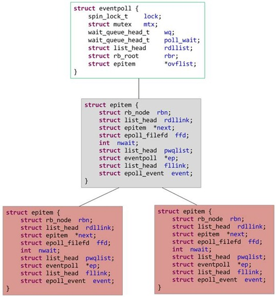
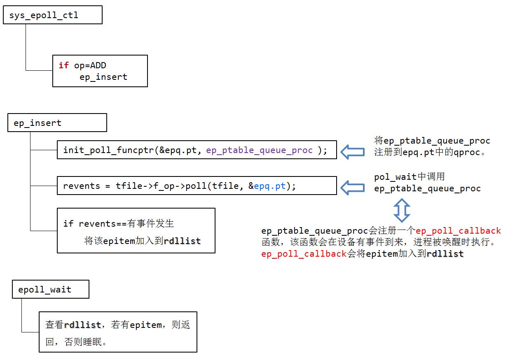

在深入探究epoll实现之前，先来回顾一下epoll的用法，以便大家看具体实现时容易建立起实现、应用之间的联系。

# epoll api回顾

先简单回顾下如何使用C库封装的3个epoll相关的系统调用。更详细的用法参见http://www.cnblogs.com/apprentice89/archive/2013/05/06/3063039.html

```c
int epoll_create(int size);
int epoll_ctl(int epfd, int op, int fd, struct epoll_event *event);
int epoll_wait(int epfd, struct epoll_event *events,int maxevents, int timeout);
```

使用起来很清晰，首先要调用epoll_create建立一个epoll fd。参数size是内核保证能够正确处理的最大文件描述符数目（现在内核使用红黑树组织epoll相关数据结构，不再使用这个参数）。
epoll_ctl可以操作上面建立的epoll fd，例如，将刚建立的socket fd加入到epoll中让其监控，或者把 epoll正在监控的某个socket fd移出epoll，不再监控它等等。
epoll_wait在调用时，在给定的timeout时间内，当在监控的这些文件描述符中的某些文件描述符上有事件发生时，就返回用户态的进程。

# epoll vs poll/select

epoll为什么高效（相比select），仅从上面的调用方式就可以看出epoll比select/poll的一个优势：
- select/poll每次调用都要传递所要监控的所有fd给select/poll系统调用（这意味着每次调用都要将fd列表从用户态拷贝到内核态，当fd数目很多时，这会造成低效）。而每次调用epoll_wait时（作用相当于调用select/poll），不需要再传递fd列表给内核，因为已经在epoll_ctl中将需要监控的fd告诉了内核（epoll_ctl不需要每次都拷贝所有的fd，只需要进行增量式操作）。所以，在调用epoll_create之后，内核已经在内核态开始准备数据结构存放要监控的fd了。每次epoll_ctl只是对这个数据结构进行简单的维护。 

- 此外，内核使用了slab机制，为epoll提供了快速的数据结构：在内核里，一切皆文件。所以，epoll向内核注册了一个文件系统，用于存储上述的被监控的fd。当你调用epoll_create时，就会在这个虚拟的epoll文件系统里创建一个file结点。当然这个file不是普通文件，它只服务于epoll。epoll在被内核初始化时（操作系统启动），同时会开辟出epoll自己的内核高速cache区，用于安置每一个我们想监控的fd，这些fd会以红黑树的形式保存在内核cache里，以支持快速的查找、插入、删除。这个内核高速cache区，就是建立连续的物理内存页，然后在之上建立slab层，简单的说，就是物理上分配好你想要的size的内存对象，每次使用时都是使用空闲的已分配好的对象。 

- epoll的第三个优势在于：当我们调用epoll_ctl往里塞入百万个fd时，epoll_wait仍然可以飞快的返回，并有效的将发生事件的fd给我们用户。这是由于我们在调用epoll_create时，内核除了帮我们在epoll文件系统里建了个file结点，在内核cache里建了个红黑树用于存储以后epoll_ctl传来的fd外，还会再建立一个list链表，用于存储准备就绪的事件，当epoll_wait调用时，仅仅观察这个list链表里有没有数据即可。有数据就返回，没有数据就sleep，等到timeout时间到后即使链表没数据也返回。所以，epoll_wait非常高效。而且，通常情况下即使我们要监控百万计的fd，大多一次也只返回很少量的准备就绪fd而已，所以，epoll_wait仅需要从内核态copy少量的fd到用户态而已。那么，这个准备就绪list链表是怎么维护的呢？当我们执行epoll_ctl时，除了把fd放到epoll文件系统里file对象对应的红黑树上之外，还会给内核中断处理程序注册一个回调函数，告诉内核，如果这个fd的中断到了，就把它放到准备就绪list链表里。所以，当一个fd（例如socket）上有数据到了，内核在把设备（例如网卡）上的数据copy到内核中后就来把fd（socket）插入到准备就绪list链表里了。 如此，一颗红黑树，一张准备就绪fd链表，少量的内核cache，就帮我们解决了大并发下的fd（socket）处理问题。

# epoll内部逻辑

1. 执行epoll_create时，创建了红黑树和就绪list链表。
2. 执行epoll_ctl时，如果增加fd（socket），则检查在红黑树中是否存在，存在立即返回，不存在则添加到红黑树上，然后向内核注册回调函数，用于当中断事件来临时向准备就绪list链表中插入数据。
3. 执行epoll_wait时立刻返回准备就绪链表里的数据即可。

 源码分析如下：

```c
static int __init eventpoll_init(void)
{
   mutex_init(&pmutex);
   ep_poll_safewake_init(&psw);
   epi_cache = kmem_cache_create("eventpoll_epi", sizeof(struct epitem), 0, SLAB_HWCACHE_ALIGN|EPI_SLAB_DEBUG|SLAB_PANIC, NULL);
   pwq_cache = kmem_cache_create("eventpoll_pwq", sizeof(struct eppoll_entry), 0, EPI_SLAB_DEBUG|SLAB_PANIC, NULL);
   return 0;
}
```
epoll用kmem_cache_create（slab分配器）分配内存用来存放struct epitem和struct eppoll_entry。

当向系统中添加一个fd时，就创建一个epitem结构体，这是内核管理epoll的基本数据结构：
```c
struct epitem {
    struct rb_node  rbn;        //用于主结构管理的红黑树
    struct list_head  rdllink;  //事件就绪队列
    struct epitem  *next;       //用于主结构体中的链表
 struct epoll_filefd  ffd;   //这个结构体对应的被监听的文件描述符信息
 int  nwait;                 //poll操作中事件的个数
    struct list_head  pwqlist;  //双向链表，保存着被监视文件的等待队列，功能类似于select/poll中的poll_table
    struct eventpoll  *ep;      //该项属于哪个主结构体（多个epitm从属于一个eventpoll）
    struct list_head  fllink;   //双向链表，用来链接被监视的文件描述符对应的struct file。因为file里有f_ep_link,用来保存所有监视这个文件的epoll节点
    struct epoll_event  event;  //注册的感兴趣的事件,也就是用户空间的epoll_event
}

而每个epoll fd（epfd）对应的主要数据结构为：
struct eventpoll {
    spin_lock_t       lock;        //对本数据结构的访问
    struct mutex      mtx;         //防止使用时被删除
    wait_queue_head_t     wq;      //sys_epoll_wait() 使用的等待队列
    wait_queue_head_t   poll_wait;       //file->poll()使用的等待队列
    struct list_head    rdllist;        //事件满足条件的链表
    struct rb_root      rbr;            //用于管理所有fd的红黑树（树根）
    struct epitem      *ovflist;       //将事件到达的fd进行链接起来发送至用户空间
}
```
```c
struct eventpoll在epoll_create时创建。
long sys_epoll_create(int size) {
    struct eventpoll *ep;
    ...
    ep_alloc(&ep); //为ep分配内存并进行初始化
/* 调用anon_inode_getfd 新建一个file instance，
也就是epoll可以看成一个文件（匿名文件）。
因此我们可以看到epoll_create会返回一个fd。
           epoll所管理的所有的fd都是放在一个大的结构eventpoll(红黑树)中，
将主结构体struct eventpoll *ep放入file->private项中进行保存（sys_epoll_ctl会取用）*/
 fd = anon_inode_getfd("[eventpoll]", &eventpoll_fops, ep, O_RDWR | (flags & O_CLOEXEC));
    return fd;
}
```

其中，ep_alloc(struct eventpoll **pep)为pep分配内存，并初始化。
其中，上面注册的操作eventpoll_fops定义如下：
```c
static const struct file_operations eventpoll_fops = {
    .release=  ep_eventpoll_release,
    .poll    =  ep_eventpoll_poll,
};
```

这样说来，内核中维护了一棵红黑树，大致的结构如下：



接着是epoll_ctl函数（省略了出错检查等代码）：
```c
 asmlinkage long sys_epoll_ctl(int epfd,int op,int fd,struct epoll_event __user *event) {
    int error;
    struct file *file,*tfile;
    struct eventpoll *ep;
    struct epoll_event epds;

    error = -FAULT;
    //判断参数的合法性，将 __user *event 复制给 epds。
    if(ep_op_has_event(op) && copy_from_user(&epds,event,sizeof(struct epoll_event)))
            goto error_return; //省略跳转到的代码

    file  = fget (epfd); // epoll fd 对应的文件对象
    tfile = fget(fd);    // fd 对应的文件对象

    //在create时存入进去的（anon_inode_getfd），现在取用。
    ep = file->private->data;

    mutex_lock(&ep->mtx);

    //防止重复添加（在ep的红黑树中查找是否已经存在这个fd）
    epi = epi_find(ep,tfile,fd);

    switch(op)
    {
       ...
        case EPOLL_CTL_ADD:  //增加监听一个fd
            if(!epi)
            {
                epds.events |= EPOLLERR | POLLHUP;     //默认包含POLLERR和POLLHUP事件
                error = ep_insert(ep,&epds,tfile,fd);  //在ep的红黑树中插入这个fd对应的epitm结构体。
            } else  //重复添加（在ep的红黑树中查找已经存在这个fd）。
                error = -EEXIST;
            break;
        ...
    }
    return error;
}
```

ep_insert的实现如下：
```c
static int ep_insert(struct eventpoll *ep, struct epoll_event *event, struct file *tfile, int fd)
{
   int error ,revents,pwake = 0;
   unsigned long flags ;
   struct epitem *epi;
   /*
      struct ep_queue{
         poll_table pt;
         struct epitem *epi;
      }   */

   struct ep_pqueue epq;

   //分配一个epitem结构体来保存每个加入的fd
   if(!(epi = kmem_cache_alloc(epi_cache,GFP_KERNEL)))
      goto error_return;
   //初始化该结构体
   ep_rb_initnode(&epi->rbn);
   INIT_LIST_HEAD(&epi->rdllink);
   INIT_LIST_HEAD(&epi->fllink);
   INIT_LIST_HEAD(&epi->pwqlist);
   epi->ep = ep;
   ep_set_ffd(&epi->ffd,tfile,fd);
   epi->event = *event;
   epi->nwait = 0;
   epi->next = EP_UNACTIVE_PTR;

   epq.epi = epi;
   //安装poll回调函数
   init_poll_funcptr(&epq.pt, ep_ptable_queue_proc );
   /* 调用poll函数来获取当前事件位，其实是利用它来调用注册函数ep_ptable_queue_proc（poll_wait中调用）。
       如果fd是套接字，f_op为socket_file_ops，poll函数是
       sock_poll()。如果是TCP套接字的话，进而会调用
       到tcp_poll()函数。此处调用poll函数查看当前
       文件描述符的状态，存储在revents中。
       在poll的处理函数(tcp_poll())中，会调用sock_poll_wait()，
       在sock_poll_wait()中会调用到epq.pt.qproc指向的函数，
       也就是ep_ptable_queue_proc()。  */ 

   revents = tfile->f_op->poll(tfile, &epq.pt);

   spin_lock(&tfile->f_ep_lock);
   list_add_tail(&epi->fllink,&tfile->f_ep_lilnks);
   spin_unlock(&tfile->f_ep_lock);

   ep_rbtree_insert(ep,epi); //将该epi插入到ep的红黑树中

   spin_lock_irqsave(&ep->lock,flags);

//  revents & event->events：刚才fop->poll的返回值中标识的事件有用户event关心的事件发生。
// !ep_is_linked(&epi->rdllink)：epi的ready队列中有数据。ep_is_linked用于判断队列是否为空。
/*  如果要监视的文件状态已经就绪并且还没有加入到就绪队列中,则将当前的
    epitem加入到就绪队列中.如果有进程正在等待该文件的状态就绪,则
    唤醒一个等待的进程。  */ 

if((revents & event->events) && !ep_is_linked(&epi->rdllink)) {
      list_add_tail(&epi->rdllink,&ep->rdllist); //将当前epi插入到ep->ready队列中。
/* 如果有进程正在等待文件的状态就绪，
也就是调用epoll_wait睡眠的进程正在等待，
则唤醒一个等待进程。
waitqueue_active(q) 等待队列q中有等待的进程返回1，否则返回0。
*/

      if(waitqueue_active(&ep->wq))
         __wake_up_locked(&ep->wq,TAKS_UNINTERRUPTIBLE | TASK_INTERRUPTIBLE);

/*  如果有进程等待eventpoll文件本身（???）的事件就绪，
           则增加临时变量pwake的值，pwake的值不为0时，
           在释放lock后，会唤醒等待进程。 */ 

      if(waitqueue_active(&ep->poll_wait))
         pwake++;
   }
   spin_unlock_irqrestore(&ep->lock,flags);


if(pwake)
      ep_poll_safewake(&psw,&ep->poll_wait);//唤醒等待eventpoll文件状态就绪的进程
   return 0;
}
```

```c
init_poll_funcptr(&epq.pt, ep_ptable_queue_proc);
revents = tfile->f_op->poll(tfile, &epq.pt);
```

这两个函数将ep_ptable_queue_proc注册到epq.pt中的qproc。
```c
typedef struct poll_table_struct {
	poll_queue_proc qproc;
	unsigned long key;
} poll_table;
```

执行f_op->poll(tfile, &epq.pt)时，XXX_poll(tfile, &epq.pt)函数会执行poll_wait()，poll_wait()会调用epq.pt.qproc函数，即ep_ptable_queue_proc。
ep_ptable_queue_proc函数如下：

```c
/*  在文件操作中的poll函数中调用，将epoll的回调函数加入到目标文件的唤醒队列中。
    如果监视的文件是套接字，参数whead则是sock结构的sk_sleep成员的地址。  */
static void ep_ptable_queue_proc(struct file *file, wait_queue_head_t *whead, poll_table *pt) {
/* struct ep_queue{
         poll_table pt;
         struct epitem *epi;
      } */
    struct epitem *epi = ep_item_from_epqueue(pt); //pt获取struct ep_queue的epi字段。
    struct eppoll_entry *pwq;

    if (epi->nwait >= 0 && (pwq = kmem_cache_alloc(pwq_cache, GFP_KERNEL))) {
        init_waitqueue_func_entry(&pwq->wait, ep_poll_callback);
        pwq->whead = whead;
        pwq->base = epi;
        add_wait_queue(whead, &pwq->wait);
        list_add_tail(&pwq->llink, &epi->pwqlist);
        epi->nwait++;
    } else {
        /* We have to signal that an error occurred */
        /*
         * 如果分配内存失败，则将nwait置为-1，表示
         * 发生错误，即内存分配失败，或者已发生错误
         */
        epi->nwait = -1;
    }
}
```

其中struct eppoll_entry定义如下：
```c
struct eppoll_entry {
   struct list_head llink;
   struct epitem *base;
   wait_queue_t wait;
   wait_queue_head_t *whead;
};
```

ep_ptable_queue_proc 函数完成 epitem 加入到特定文件的wait队列任务。
ep_ptable_queue_proc有三个参数：
struct file *file;              该fd对应的文件对象
wait_queue_head_t *whead;      该fd对应的设备等待队列（同select中的mydev->wait_address）
poll_table *pt;                 f_op->poll(tfile, &epq.pt)中的epq.pt

在ep_ptable_queue_proc函数中，引入了另外一个非常重要的数据结构eppoll_entry。eppoll_entry主要完成epitem和epitem事件发生时的callback（ep_poll_callback）函数之间的关联。首先将eppoll_entry的whead指向fd的设备等待队列（同select中的wait_address），然后初始化eppoll_entry的base变量指向epitem，最后通过add_wait_queue将epoll_entry挂载到fd的设备等待队列上。完成这个动作后，epoll_entry已经被挂载到fd的设备等待队列。
由于ep_ptable_queue_proc函数设置了等待队列的ep_poll_callback回调函数。所以在设备硬件数据到来时，硬件中断处理函数中会唤醒该等待队列上等待的进程时，会调用唤醒函数ep_poll_callback（参见博文http://www.cnblogs.com/apprentice89/archive/2013/05/09/3068274.html）。

```c
static int ep_poll_callback(wait_queue_t *wait, unsigned mode, int sync, void *key) {
   int pwake = 0;
   unsigned long flags;
   struct epitem *epi = ep_item_from_wait(wait);
   struct eventpoll *ep = epi->ep;

   spin_lock_irqsave(&ep->lock, flags);
   //判断注册的感兴趣事件
//#define EP_PRIVATE_BITS  (EPOLLONESHOT | EPOLLET)
//有非EPOLLONESHONT或EPOLLET事件
   if (!(epi->event.events & ~EP_PRIVATE_BITS))
      goto out_unlock;

   if (unlikely(ep->ovflist != EP_UNACTIVE_PTR)) {
      if (epi->next == EP_UNACTIVE_PTR) {
         epi->next = ep->ovflist;
         ep->ovflist = epi;
      }
      goto out_unlock;
   }

   if (ep_is_linked(&epi->rdllink))
      goto is_linked;
    //***关键***，将该fd加入到epoll监听的就绪链表中
   list_add_tail(&epi->rdllink, &ep->rdllist);
   //唤醒调用epoll_wait()函数时睡眠的进程。用户层epoll_wait(...) 超时前返回。
if (waitqueue_active(&ep->wq))
      __wake_up_locked(&ep->wq, TASK_UNINTERRUPTIBLE | TASK_INTERRUPTIBLE);
   if (waitqueue_active(&ep->poll_wait))
      pwake++;
   out_unlock: spin_unlock_irqrestore(&ep->lock, flags);
   if (pwake)
      ep_poll_safewake(&psw, &ep->poll_wait);
   return 1;
}
```

所以ep_poll_callback函数主要的功能是将被监视文件的等待事件就绪时，将文件对应的epitem实例添加到就绪队列中，当用户调用epoll_wait()时，内核会将就绪队列中的事件报告给用户。

epoll_wait实现如下：
```c
SYSCALL_DEFINE4(epoll_wait, int, epfd, struct epoll_event __user *, events, int, maxevents, int, timeout)  {
   int error;
   struct file *file;
   struct eventpoll *ep;
    /* 检查maxevents参数。 */
   if (maxevents <= 0 || maxevents > EP_MAX_EVENTS)
      return -EINVAL;
    /* 检查用户空间传入的events指向的内存是否可写。参见__range_not_ok()。 */
   if (!access_ok(VERIFY_WRITE, events, maxevents * sizeof(struct epoll_event))) {
      error = -EFAULT;
      goto error_return;
   }
    /* 获取epfd对应的eventpoll文件的file实例，file结构是在epoll_create中创建。 */
   error = -EBADF;
   file = fget(epfd);
   if (!file)
      goto error_return;
    /* 通过检查epfd对应的文件操作是不是eventpoll_fops 来判断epfd是否是一个eventpoll文件。如果不是则返回EINVAL错误。 */
   error = -EINVAL;
   if (!is_file_epoll(file))
      goto error_fput;
    /* At this point it is safe to assume that the "private_data" contains  */
   ep = file->private_data;
    /* Time to fish for events ... */
   error = ep_poll(ep, events, maxevents, timeout);
    error_fput:
   fput(file);
error_return:
   return error;
}
```

epoll_wait调用ep_poll，ep_poll实现如下：
```c
 static int ep_poll(struct eventpoll *ep, struct epoll_event __user *events, int maxevents, long timeout) {
    int res, eavail;
   unsigned long flags;
   long jtimeout;
   wait_queue_t wait;
    /* timeout是以毫秒为单位，这里是要转换为jiffies时间。这里加上999(即1000-1)，是为了向上取整。 */
   jtimeout = (timeout < 0 || timeout >= EP_MAX_MSTIMEO) ?MAX_SCHEDULE_TIMEOUT : (timeout * HZ + 999) / 1000;
 retry:
   spin_lock_irqsave(&ep->lock, flags);
    res = 0;
   if (list_empty(&ep->rdllist)) {
      /* 没有事件，所以需要睡眠。当有事件到来时，睡眠会被ep_poll_callback函数唤醒。*/
      init_waitqueue_entry(&wait, current); //将current进程放在wait这个等待队列中。
      wait.flags |= WQ_FLAG_EXCLUSIVE;
      /* 将当前进程加入到eventpoll的等待队列中，等待文件状态就绪或直到超时，或被信号中断。 */
      __add_wait_queue(&ep->wq, &wait);
       for (;;) {
         /* 执行ep_poll_callback()唤醒时应当需要将当前进程唤醒，所以当前进程状态应该为“可唤醒”TASK_INTERRUPTIBLE  */
         set_current_state(TASK_INTERRUPTIBLE);
         /* 如果就绪队列不为空，也就是说已经有文件的状态就绪或者超时，则退出循环。*/
         if (!list_empty(&ep->rdllist) || !jtimeout)
            break;
         /* 如果当前进程接收到信号，则退出循环，返回EINTR错误 */
         if (signal_pending(current)) {
            res = -EINTR;
            break;
         }
          spin_unlock_irqrestore(&ep->lock, flags);
         /* 主动让出处理器，等待ep_poll_callback()将当前进程唤醒或者超时,返回值是剩余的时间。
从这里开始当前进程会进入睡眠状态，直到某些文件的状态就绪或者超时。
当文件状态就绪时，eventpoll的回调函数ep_poll_callback()会唤醒在ep->wq指向的等待队列中的进程。*/
         jtimeout = schedule_timeout(jtimeout);
         spin_lock_irqsave(&ep->lock, flags);
      }
      __remove_wait_queue(&ep->wq, &wait);
       set_current_state(TASK_RUNNING);
   }
    /* ep->ovflist链表存储的向用户传递事件时暂存就绪的文件。
    * 所以不管是就绪队列ep->rdllist不为空，或者ep->ovflist不等于
    * EP_UNACTIVE_PTR，都有可能现在已经有文件的状态就绪。
    * ep->ovflist不等于EP_UNACTIVE_PTR有两种情况，一种是NULL，此时
    * 可能正在向用户传递事件，不一定就有文件状态就绪，
    * 一种情况时不为NULL，此时可以肯定有文件状态就绪，
    * 参见ep_send_events()。
    */
   eavail = !list_empty(&ep->rdllist) || ep->ovflist != EP_UNACTIVE_PTR;
    spin_unlock_irqrestore(&ep->lock, flags);
    /* Try to transfer events to user space. In case we get 0 events and there's still timeout left over, we go trying again in search of more luck. */
   /* 如果没有被信号中断，并且有事件就绪，但是没有获取到事件(有可能被其他进程获取到了)，并且没有超时，则跳转到retry标签处，重新等待文件状态就绪。 */
   if (!res && eavail && !(res = ep_send_events(ep, events, maxevents)) && jtimeout)
      goto retry;
    /* 返回获取到的事件的个数或者错误码 */
   return res;
}
```

ep_send_events函数向用户空间发送就绪事件。
ep_send_events()函数将用户传入的内存简单封装到ep_send_events_data结构中，然后调用ep_scan_ready_list() 将就绪队列中的事件传入用户空间的内存。
用户空间访问这个结果，进行处理。



主要参考：
<http://blog.chinaunix.net/uid-20687780-id-2105154.html>
<http://blog.chinaunix.net/uid-20687780-id-2105157.html>
<http://blog.chinaunix.net/uid-20687780-id-2105159.html>
<http://www.cnblogs.com/debian/archive/2012/02/16/2354454.html>
<http://blog.csdn.net/moonvs2010/article/details/8506890>
