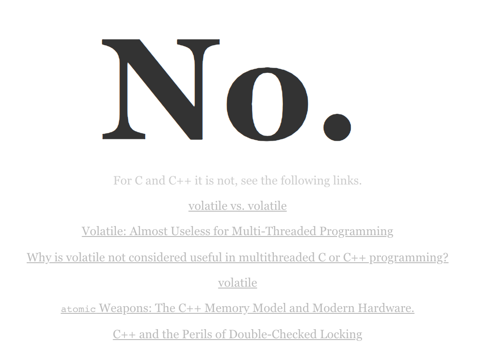
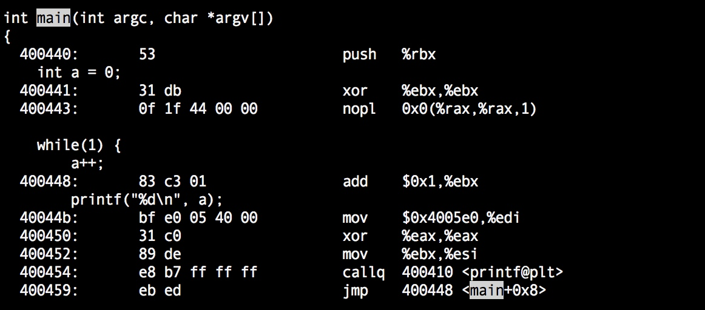
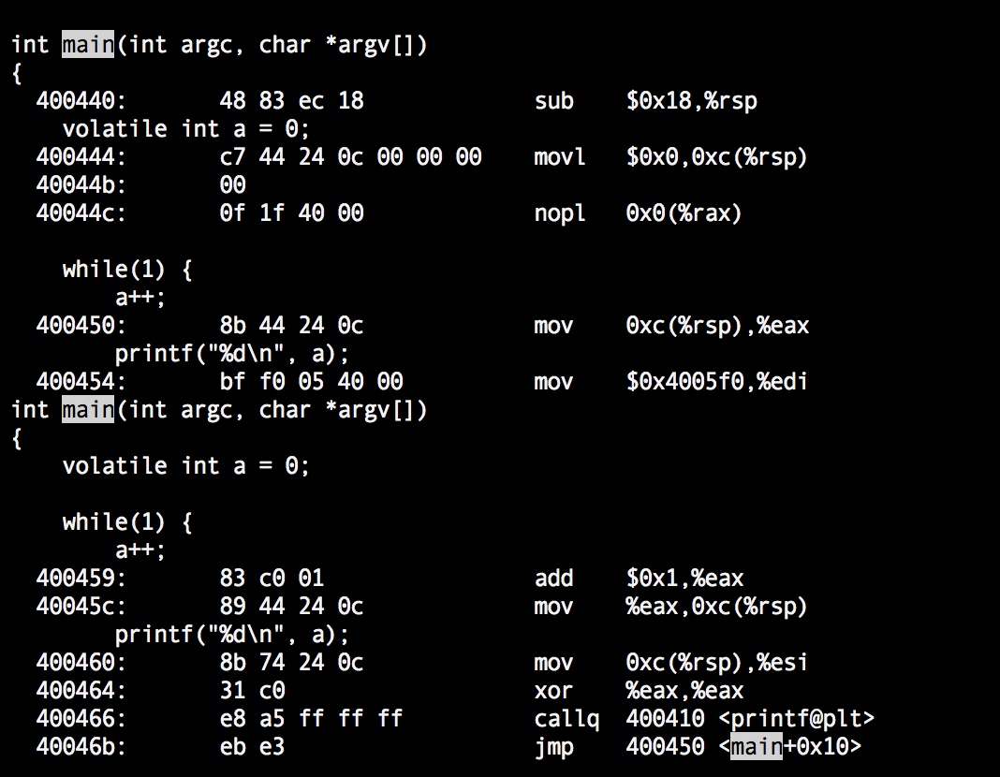

# volatile

volatile字面意思是“**不稳定的、易失的**”，不同的编程语言中存在volatile关键字，也有共同之处，如“**表示程序执行期间可能会被外部的操作修改**”，如被外部IO设备修改或者被其他线程修改等。这只是字面上给我们的一般性认识，然而具体到不同的编程语言中volatile的语义可能相差甚远。

以常见的编程语言C、C++、Java为例，它们都有一个关键字volatile，但是不同语言对volatile的定义却并非完全相同。

- Java中对volatile的定义：

  >8.3.1.4. `volatile` Fields
  >
  >The Java programming language allows threads to access shared variables ([§17.1](https://docs.oracle.com/javase/specs/jls/se7/html/jls-17.html#jls-17.1)). As a rule, to ensure that shared variables are consistently and reliably updated, a thread should ensure that it has exclusive use of such variables by obtaining a lock that, conventionally, enforces mutual exclusion for those shared variables.
  >
  >The Java programming language provides a second mechanism, `volatile` fields, that is more convenient than locking for some purposes.
  >
  >A field may be declared `volatile`, in which case the Java Memory Model ensures that all threads see a consistent value for the variable ([§17.4](https://docs.oracle.com/javase/specs/jls/se7/html/jls-17.html#jls-17.4)).

  Java清晰地表达了这样一个观点，Java内存模型中会保证volatile变量的线程可见性，接触过Java并发编程的开发者应该都清楚，这是一个不争的事实。

- CC++中对volatile的定义：

  为了引起大家对CC++ volatile的重视，这里先贴一个页面“[Is-Volatile-Useful-with-Threads](https://isocpp.org/blog/2018/06/is-volatile-useful-with-threads-isvolatileusefulwiththreads.com)”，网站中简明扼要的告知大家，“Friends don’t let friends use volatile for inter-thread communication in C and C++”。But why？

  

  我们先看下c language specification中对volatile的定义：


volatile一般会要求编译器对**变量修改的内存可见性**做出保证，即在**多处理器、多核**条件下，假如一个全局变量被多个跑在不同处理器或者核心上的线程访问，其中一个线程对变量进行了修改的话，编译器不管如何优化代码应该保证线程对该volatile变量的修改操作对其他线程可见。

## 1 diff btw java\c\c++

在Java中语言规范明确指出了volatile对应的明确语义，即volatile保证内存可见性，遵从happens-before规则阻止处理器指令重排序（volatile语句前后的语句对应的指令不会被指令重排序到volatile之后或者之前）。JVM中JMM存在“**本地内存**”的概念，多个线程对内存中共享变量的访问都是先加载到本地内存，后续写操作再同步回主存。volatile可以保证一个线程的写操作对其他线程立即可见，实现是借助处理器lock指令使各个线程的本地内存中cache的变量失效，各个线程重新从内存加载变量值。

但是在C、C++规范里面并没有明确指出volatile的语义，具体如何处理volatile的工作就交给了编译器来处理。其实gcc中对volatile也是可以保证内存可见性的，其操作方式就是在gcc开优化（如-O2）的时候不对volatile变量做优化，读写volatile变量都是读内存的而非寄存器从而保证了内存可见性。但是gcc并没有对阻止指令重排序做更多操作。

## 2 how gcc handle volatile

这里可以简单的测试一下：

```c
#include <stdio.h>

int main() {
    // volatile int a = 0;
    int a = 0;
    while(1) {
        a++;
        printf("%d\n", a);
    }

    return 0;
}
```

不开优化的话，有没有volatile gcc生成的代码基本是一致的，并没有特殊处理volatile变量。这里我们开```gcc -O2```优化对比下处理的区别。

**1）不加volatile ：```gcc -g -O2 -o main main.c```**



这里重点看下对变量a的操作，xor %ebx,%ebx将寄存器%ebx设为0，也就是将变量a=0存储到了%ebx，nopl不做任何操作，然后循环体里面每次读取a的值都是直接在%ebx+1，加完之后也没有写会内存。假如有个变量是全局多个线程共享的，并且没有加volatile，多个线程访问这个变量的时候就是用的物理线程跑的处理器核心寄存器中的数据，是无法保证内存可见性的。

**2）加volatile：```gcc -g -O2 -o main main.c```**



这里变量a的值首先被设置到了0xc(%rsp)中，nopl空操作，然后a++时是将内存中的值移动到了寄存器%eax中，然后执行%eax+1再写会内存0xc(%rsp)中，while循环中每次循环执行都是先从内存里面取值用完再写会内存，可以保证内存可见性。因此加了volatile之后即便是在多线程环境中也可以保证内存可见性。

## 3 howto

**另外x86平台处理器是典型的强一致性CPU，这也是x86厉害的地方，即便是多处理器、多核情况下也能保证内存变量在多个处理器、多核上的一致性，即便没有volatile修饰也可以保证这一点。我们单纯地从汇编指令看不加volatile好像会有问题，但是x86处理器在架构、指令集设计上可以保证强一致性。**但是为了更好地跨平台，必须也“更加正确”的代码，volatile还是要用的，否则将来代码移植到非x86机器上不就出问题了。

## 4 why mention this

之所以翻出来说这个问题，是因为之前对c、c++里面volatile有误，原因是有篇内核文档（[why the "volatile" class should not be used](http://static.lwn.net/kerneldoc/process/volatile-considered-harmful.html?highlight=volatile)）没有完全看懂，误以为volatile在C、C++中是无效的，其实作者主要强调的是：**在内核、嵌入式编程中，由于硬件平台的复杂性，volatile虽然能够保证内存可见性，但是volatile毕竟不是原子的，不假思索地使用volatile很有可能会带来bug。**

之前并不是很明白作者的意图，看了下stackoverflow上朋友的回答瞬间茅塞顿开，他描述的同时也举了个一个错误使用volatile导致的bug，(stackoverflow volatile issue)[https://stackoverflow.com/questions/27777140/volatile-and-its-harmful-implications/27778390#27778390]。

```c
uint32_t volatile i;

ISR(TIMER0_OVF_vect) {
    ++i;
}

void some_function_in_the_main_loop(void) {
    for(;;) {
        do_something_with(i); // This is thoroughly broken.
    }
}
```

简言之就是do_something_with(i)的函数参数是32位的，但是AVR只有8位寄存器，指令集最多支持一次移动16位数据，所以参数i的传递实际上需要两条move指令。但是在两条move指令之间很可能出现中断会中断两条move指令的连续执行，比如时钟中断到达的时候程序要对变量值+1，这样的话第二条move指令就可能会读取到修改后的值。相当于参数i的高16位、低16位是i修改前后的各一部分，do_something_with()接收到的参数实际上是一个错误的参数，后面的逻辑当然也就出错误了。

## 5 summary

在编程的时候特别是并发程序设计的时候，要考虑下是否有共享变量要保证内存可见性（共享变量一般都要保证），是的话一般要考虑用volatile，然后要看是否要求原子，对应的平台上是否能原生支持该变量类型的原子性操作，如果能则可以用volatile，如果不能那就要考虑用锁来保护。

## 6 还有疑问？

上述how gcc handle volatile部分是否已经让我确定在c、c++里面volatile也可以保证内存可见性呢？仍然心存疑虑！

volatile变量在很多语言中都存在,例如c\cpp以及java中,但是volatile在c\cpp以及java中的行为确实有差别的！

1. java、c、c++中都实现了线程可见性，但是实现线程可见性的方法还是不一样，java中是通过lock指令使得处理器各个核心缓存失效，然后强制从内存读取来实现；c、c++中是通过阻止编译器寄存器相关优化，每次都从内存读取变量值来实现！
2. 在1.中也提到了，java中是通过lock指令来进行处理，相当于创建了内存屏障，建立了happens-before关系，也顺便阻止了屏障前后的指令重排序，但是c、c++中只是强制读取内存而已，所以不能够阻止指令重排序！为此linux kernel里面提到必须通过barrier()来创建内存屏障，以阻止发生相关的指令重排序！

疑问：我有个疑问，c、c++中针对volatile变量进行读写操作，发出的读写指令不会被处理器转换成读写cache吗？这个属于硬件层面的东西，汇编也不能反映实际执行情况！那这样的话gcc的处理方式，还能保证线程可见性吗？

有个大神Dietmar Kühl提到，‘volatile’阻止了对变量的优化，例如对于频繁访问的变量，会阻止编译器对其进行编译时优化，避免将其放入寄存器中（注意是寄存器而不是cpu的cache），业内术语，编译器生成的将变量存入寄存器的操作称为“软件cache”，而将硬件处理的将内存页面缓存到cpu cache的操作称为“硬件cache”，这个点很重要！假如真如这个大神所说，那么在gcc上述处理方式中volatile是不能够保证“线程可见性”了？？？

java中反汇编是可以看到lock指令的，但是gcc生成的汇编没有看到lock相关的指令，因为x86是强一致CPU，我也不确定是不是因为这个原因，gcc直接略掉了lock指令？

先考虑所有平台都不安插lock指令的话，那上述gcc处理中，仅仅是阻止编译器对变量访问方式进行优化，避免-O2优化时将变量存入寄存器，而对cpu cache确实束手无策！也无法保证线程可见性。但是如果在x86平台上，因为x86是强一致CPU，即便上述这么写也不会出现问题。所以现在的问题就是要验证下，在其他非x86平台上，gcc -O2优化时，对volatile的处理是否会安插类似lock相关的是处理器多核cache失效的指令。如果安插了类似指令，问题就解决了，我们也可以得出结论，c、c++中volatile在gcc处理下可以保证线程可见性，反之则不能得到这样的结论！

于是乎，我在这个网站[godbolt.org](https://godbolt.org/)交叉编译测试了一下上面gcc处理的代码，换了几个不同的硬件平台也没发现有生成特定的类似导致cache失效重新加载内存的指令。让我又彻头彻尾地对c、c++中volatile的真实设计“意图”或者作用产生了怀疑。然后，在stack overflow上我又找到了这样一个回答[https://stackoverflow.com/a/12878500](https://stackoverflow.com/a/12878500)，这里回答内容如下，重点内容已加粗显示。

[[Nicol Bolas](https://stackoverflow.com/users/734069/nicol-bolas)](https://stackoverflow.com/users/734069/nicol-bolas)回答中提到：

>What `volatile` tells the compiler is that it can't optimize memory reads from that variable. However, CPU cores have different caches, and most memory writes do not *immediately* go out to main memory. They get stored in that core's local cache, and may be written... *eventually*.**
>
>CPUs have ways to **force cache lines out into memory and to synchronize memory access among different cores**. These memory barriers allow two threads to communicate effectively. Merely reading from memory in one core that was written in another core isn't enough; **the core that wrote the memory needs to issue a barrier,** a**nd the core that's reading it needs to have had that barrier complete** before reading it to actually get the data.
>
>**`volatile` guarantees *none of this*. Volatile works with "hardware, mapped memory and stuff" because the hardware that writes that memory makes sure that the cache issue is taken care of.** If CPU cores issued a memory barrier after every write, you can basically kiss any hope of performance goodbye. So C++11 has specific language saying when constructs are required to issue a barrier.

[Dietmar Kühl](http://stackoverflow.com/users/1120273/dietmar-k%c3%bchl)回答中提到:
The volatile keyword has nothing to do with concurrency in C++ at all! It is used to have the compiler prevented from making use of the previous value, i.e., the compiler will generate code accessing a volatile value every time is accessed in the code. The main purpose are things like memory mapped I/O. **However, use of volatile has no affect on what the CPU does when reading normal memory: If the CPU has no reason to believe that the value changed in memory, e.g., because there is no synchronization directive, it can just use the value from its cache.** To communicate between threads you need some synchronization, e.g., an std::atomic<T>, lock a std::mutex, etc.

结合自己的实际操作、他人的高赞回答，这般看来volatile在c、c++中不能保证内存可见性，就连Linus Torvards也在内核文档中描述volatile时说，建议尽量用memory barrier替换掉volatile，他认为几乎所有可能出现volatile的地方都可能“潜藏了一个bug”！

最后看了个标准：<http://www.open-std.org/jtc1/sc22/wg21/docs/papers/2006/n2016.html>
简而言之，就是c、c++中当然也想提供java中volatile一样的线程可见性、阻止指令重排序，但是考虑到现有代码已经那么多了，突然改变volatile的语义，可能会导致现有代码的诸多问题，所以需要再权衡一下，到底要不要为volatile增加上述语义，所以暂时要不要实现并不明确……

总之，现在我基本持这样的态度，c、c++里面的volatile并不能保证多线程操作时的线程可见性，因为即便volatile阻止了编译器优化，避免将变量加载到寄存器后续读取，它也不能避免处理器cache的影响，线程可见性无法保证。上面也提到了，对于某些外设读写内存，设备驱动考虑了这些cpu cache相关的操作，避免了cpu cache带来的影响，这种情况下volatile表示“易失性变量”是没有问题的。

