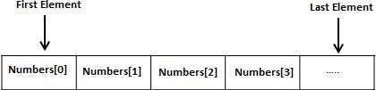
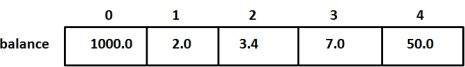

Go programming language provides a data structure called the array, which can **store a fixed-size sequential collection of elements of the same type**. An array is used to store a collection of data, but it is often more useful to think of an array as a collection of variables of the same type.

Instead of declaring individual variables, such as number0, number1, ..., and number99, you declare one array variable such as numbers and use numbers[0], numbers[1], and ..., numbers[99] to represent individual variables. A specific element in an array is accessed by an index.

All arrays consist of contiguous memory locations. The lowest address corresponds to the first element and the highest address to the last element.



# Declaring Arrays

To declare an array in Go, a programmer specifies the type of the elements and the number of elements required by an array as follows −

`var variable_name [SIZE] variable_type`

This is called a single-dimensional array. The arraySize must be an integer constant greater than zero and type can be any valid Go data type. For example, to declare a 10-element array called balance of type float32, use this statement −

`var balance [10] float32`

Here, balance is a variable array that can hold up to 10 float numbers.

# Initializing Arrays

You can initialize array in Go either one by one or using a single statement as follows −

`var balance = [5]float32{1000.0, 2.0, 3.4, 7.0, 50.0}`

The number of values between braces { } can not be larger than the number of elements that we declare for the array between square brackets [ ].

If you omit the size of the array, an array just big enough to hold the initialization is created. Therefore, if you write −

`var balance = []float32{1000.0, 2.0, 3.4, 7.0, 50.0}`

You will create exactly the same array as you did in the previous example. Following is an example to assign a single element of the array −

`balance[4] = 50.0`

The above statement assigns element number 5th in the array with a value of 50.0. All arrays have 0 as the index of their first element which is also called base index and last index of an array will be total size of the array minus 1. Following is the pictorial representation of the same array we discussed above −



>golang里面不能使用零长数组，但是c、c++里面可以，而且在c、c++里面还比较常用，如:
>struct Buffer {
>   int len;
>   char data[0];   // data即数组地址，这里特殊可以理解为char *变量运行时分配后更新data、len
> };
> golang里面并不是说不能这样定义，定义可以，但是运行时分配内存后却无法将内存地址更新到data字段，因为**data [0]byte**是一个数组类型，并不是一个可以任意解释的char *。

# Accessing Array Elements

An element is accessed by indexing the array name. This is done by placing the index of the element within square brackets after the name of the array. For example −

`float32 salary = balance[9]`

The above statement will take 10th element from the array and assign the value to salary variable. Following is an example which will use all the above mentioned three concepts viz. declaration, assignment and accessing arrays −

```go
package main

import "fmt"

func main() {
   var n [10]int /* n is an array of 10 integers */
   var i,j int

   /* initialize elements of array n to 0 */         
   for i = 0; i < 10; i++ {
      n[i] = i + 100 /* set element at location i to i + 100 */
   }
   
   /* output each array element's value */
   for j = 0; j < 10; j++ {
      fmt.Printf("Element[%d] = %d\n", j, n[j] )
   }
}
```

When the above code is compiled and executed, it produces the following result −

```
Element[0] = 100
Element[1] = 101
Element[2] = 102
Element[3] = 103
Element[4] = 104
Element[5] = 105
Element[6] = 106
Element[7] = 107
Element[8] = 108
Element[9] = 109
```

# Go Arrays in Detail

There are important concepts related to array which should be clear to a Go programmer −

| No. | Concept & Description |
| 1 | **Multi-dimensional Array**<br>Go supports multidimensional arrays. The simplest form of a multidimensional array is the two-dimensional array.
| 2 | **Passing arrays to function**<br>You can pass to the function a pointer to an array by specifying the array's name without an index.

>c、c++里面将array作为参数传递给function，array会退化为指针，因此可以看作是引用传值。在golang里面不同，golang里面array不是一种引用类型，属于值传递。
>
>如：
>func main() {
>       nums := [4]int{1,2,3,4}
>       testPassArray(nums)
>       fmt.Println(nums)
>}
>
```go
func testPassArray(nums [4]int) {
	  nums[0] ++
	  nums[1] ++
	  fmt.Println(nums)
}
```
>Output:
>[2 3 3 4]
>[1 2 3 4]

