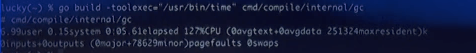
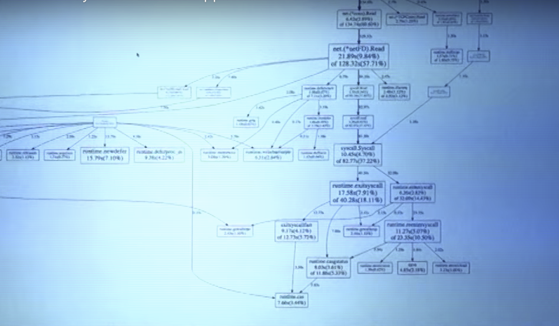

Golang UK Conference 2016 - Dave Cheney - Seven ways to Profile Go Applications

此文源于Dave之前的分享，看完这些方法确实学习到了很多东西，包括profile的工作原理、实践经验。分享中提及的工具有点旧了，有些已经不再维护、更新，如uber官方也已经将go-torch标记为deprecated。

建议后续profile的时候使用google官方提供的工具`pprof`，它除了cpu、memory、block等基础的profile能力外，也提供了flamegraph等能力，也提供了方便易用的web界面，非常好用，使用方式pprof和`go tool pprof`也是一致的。

```bash
go get -u -v github.com/google/pprof
```

当然如果条件允许直接打开浏览器访问`http://ip:port/debug/pprof`更加方便，可以灵活切换不同的采样统计维度。也可以下载trace文件使用`go tool trace ./trace`来进一步分析程序中的执行情况，如goroutine、网络阻塞、同步阻塞、系统调用阻塞、调度器延时等的执行情况。


也可以下载trace文件（上述页面中点击下载，或者`wget http://ip:port/debug/pprof/trace`）使用`go tool trace ./trace`来进一步分析程序中的执行情况，如goroutine、网络阻塞、同步阻塞、系统调用阻塞、调度器延时等的执行情况。


# No.1 time

The first method of profiling any program is `time`.

time is a shell builtin. The format is specified by POSIX.2


GNU come with a time(1) command that is signficantly more powerful than the shell builtin.


BSD also has a /usr/bin/time, which is almost as good.


GNU’s /usr/bin/time supports many flags, the most impressive is -v.


BSD’s /usr/bin/time also supports -v, but it’s less impressive.


# Did you know?

The go tool has the ability to add a prefix to every command it runs.

```bash
go build -toolexec=... github.com/pkg/profile
go test -toolexec=... net/http
```

-toolexec applies to *every* command executed by the `go tool`.

We used this for:

- tool stash, a tool src wrote to check compiler output is byte for byte identical
- android/arm and iOS/arm builds that are built on one machine, and run on another

Further reading:

- go build help

# Why is my build so slow?

Most of you know about `go build -x` shows each command the `go tool` invokes.


`-x` output can be copied and pasted into the shell to run commands manually. But, it’s kind of laborious.

Idea: combine -toolexec and /usr/bin/time to profile the entire build.

Demo:

```bash
go build -toolexec="/usr/bin/time -f '%U %S %C'" cmd/compile/internal/gc #linux
go build -toolexec="/usr/bin/time" cmd/compile/internal/gc #osx
```



Following is an example when building program built based on rpc framework [go-neat](https://github.com/hitzhangjie/goneat-core).


# No.2 GODEBUG

if /usr/bin/time is external, let’s turn to something built into every Go program.

**The Go runtime collects various statistics during the life of your program.**

These stats are always collected, but normally supressed, you can enable their display by setting the `GODEBUG` environment variable.

As a garbage collected language, the performance of Go programs is often determined by their interaction with the garbage collector.

A simple way to obtain a general idea of how hard the garbage collector is working is to enable the output of GC logging.

Demo:

```bash
env GODEBUG=gctrace=1 godoc -http=:8080
```


If the application is running and constantly outputting garbage collecting lines, it’s a fair chance you’re in bad allocation. If it goes slow it is likely that allocations is under control.  

# How does a profiler work?

A profiler runs your program and configures the operating system to interrupt it at regular intervals.

This is done by sending **SIGPROF** to the program being profiled, which suspends and transfers execution to the profiler.

The profiler then grabs the program counters for each executing thread and restarts the program.

**Question: Why is the profile per thread, not per goroutine?**

# Profiling do's and don't's

Before you profile, you must have a stable environment to get repeatable results.

- The machine must be idle — don’t profile on shared hardware, don’t browse the web while waiting for a long benchmark to run.
- Watch out for power saving and thermal scaling.
- Avoid virtual machines and shared cloud hosting, they are too noisy for consistent measurements.
- There is a kernel bug on OS X versions less than EI Capitan, upgrade or avoid profiling on OS X.

If you can afford it, buy dedicated performance test hardware. Rack them, disable all the power management and thermal scaling and never upgrade the software on those machines.

For everyone else, have a before and after sample and run them multiple times to get consistent results.

# No.3 pprof

pprof descends from the Google Performance Tools suite.

pprof profiling is built into the Go runtime.

It comes in two parts:

- **runtime/pprof** package built into every Go program
- **go tool pprof** for investigating profiles.

## CPU profiling

CPU profiling is the most common type of profile.

**When CPU profiling is enabled, the runtime will interrupt itself every 10ms and record the stack trace of the currently running goroutines.**

Once the profile is saved to disk, we can analyse it to determine the hottest code paths.

The more times a function appears in the profile, the more time that code path is taking as a percentage of the total runtime.

## Memory profiling

**Memory profiling records the stack trace when a heap allocation is made**.

Memory profiling, like CPU profiling is sample based. By default memory profiling samples 1 in every 1000 allocations. This rate can be changed.

**Stack allocations are assumed to be free and are not tracked in the memory profile.**

Because of memory profiling is sample based and because it tracks allocations not use, using memory profiling to determine your applications’s overall memory usage is difficult.

## Block profiling

Block profiling is quite unique.

**A block profile is similar to a CPU profile, but it records the amount of time a goroutine spent waiting for a shared resource.**

This can be useful for determining concurrency bottlenecks in your application. Block profiling can show you when a large number of goroutines could make progress, but were blocked.

**Blocking includes:**

- Sending or receiving on a unbuffered channel
- Sending to a full channel, receiving from an empty one
- Trying to Lock a sync.Mutex that is locked by another goroutine

**Block profiling is a very specialised tool, it shouldn’t be used until you believe you have emliminated all your CPU and memory bottlenecks.**

# One profile at a time

Profiling is not free.

Profiling has a moderate, but measurable impact on program performance — especially you increase the memory profile sample rate.

Most tools will not stop you from enabling multiple profiles at once.

If you enable multiple profiles at the same time, they will observe theire own interractions and skew your results.

**Do not enable more than one kind of profile at a time.**

# Microbenchmarks

The easiest way to profile a function is with the testing package.

The testing package has built in support for generating CPU, memory and block goroutines.

- cpuprofile=$FILE, write a CPU profile to \$FILE
- memprofile=$FILE, write a memory profile to \$FILE, -memprofilerate=N （采样率1/N）
- blockprofile=$FILE，write a block profile to \$FILE

Using any of these flags also preserves the binary

```go 
% go test -run=xxx -benchmark=Index/Byte 		
```

Note: use -run=xxx to disable tests, you only want to profile benchmarks.

# Profiling whole programs

testing benchmark is useful for microbenchmarks, but what if you want to profile a complete application?

To profile an application, you could use the runtime/pprof pacakge, but that is fiddly and low level. 

A few years ago I wrote a small package [github.com/pkg/profile](https://github.com/pkg/profile) to make it easier to profile an application.

```go
import "github.com/pkg/profile"

func main() {
  defer profile.Start().Stop()
  ... 
}
```

Demo: show profiling cmd/godoc with pkg/profile.

# No.4 /debug/pprof

If your program runs a webserver you can enable debugging via http.

```go
import _ "net/http/pprof"

func main() {
  log.Println(http.ListenAndserve("localhost:3999", nil))
}
```

Then use the proof tool to look at a 30-second CPU profile:

```go
go tool pprof http://localhost:3999/debug/pprof/profile
```

Or to look at the heap profile:

```go
go tool pprof http://localhost:3999/debug/pprof/heap
```

Or to look at the coroutine blocking profile:

```go
go tool pprof http://localhost:3999/debug/pprof/block
```

# Using pprof

Now that I’ve talked about what pprof can measure, I will talke about how to use pprof to analyse a profile.

pprof should always be invoked with two arguments.

```go
go tool pprof /path/to/your/binary /path/to/your/profile
```

The **binary** argument must be the library that produced this profile.

The **profile** argument must be the profile generated by this library.

**Warning:** Because pprof also supports an online mode while it can fetch profiles from a running application over http, the pprof tool can be invoked without the name of your binary.

```go
go tool pprof /tmp/c.pprof
```

Do not do this, or pprof will report your profile is empty.

Following is some example:

This is a sample cpu profile:


Often this output is hard to understand.

A better way to understand your profile is to visualise it.

```bash
go tool pprof $BINARY /tmp/c.p
Entering interactive mode (type "help" for commands)
(pprof) web
```

Opens a web page with a graphical display of the profile.



I find this method to be superior to the text mode, I strongly recommend you try it.

```bash
seven/profile.svg
```

pprof supports a non interactive form with flags like -svg, -pdf, etc. See `go tool pprof help` for more details.

Further reading: [Profiling Go programs](http://blog.golang.org/profiling-go-programs)

Further reading: [Debugging performance issues in Go programs](https://software.intel.com/en-us/blogs/2014/05/10/debugging-performance-issues-in-go-programs)

**We can visualize memory profiles in the same way.**

```bash
go build -gcflags='-memprofile=/tmp/m.p'
go tool pprof --alloc_objects -svg $(go tool -n compile) /tmp/m.p > alloc_objects.svg
go tool pprof --inuse_objects -svg $(go tool -n compile) /tmp/m.p > inuse_objects.svg
```

The allocation profile reports the location of where every allocation was made.

In use profile reports the location of an allocation that are live at the end of the profile.

**Here is a visualization of a block profile:**

```bash
go test -run=XXX -bench=ClientServer -blockprofile=/tmp/b.p net/http
go tool pprof -svg http.test /tmp/b.p > block.svg
```

#  Framepointers

Go 1.7 has been released and along with a new compiler for amd64, the compiler now enables frame pointers by default.

The frame pointeris a register that always points to the top of the current stack frame.

Framepointers enable tools like gdb(1), and perf(1) to understand the Go call stack.

# No.5 Perf

If you’re a linux user, then perf(1) is a great tool for profiling applications. Now we have frame pointers, perf can profile Go applications.


## perf record

```bash
go build -toolexec="perf record -g -o /tmp/p" cmd/compile/internal/gc
perf report -i /tmp/p
```


# No.6 Flame graph

Flame graphs can consume data from many sources, including pprof (and perf(1)).

Uber have open sourced a tool call go-torch which automates the process, assuming you have the /debug/pprof endpoint, or you can feed it an existing profile.

[github.com/uber/go-torch](https://github.co/uber/go-torch)

Demo:


# No.7 go tool trace

in Go 1.5, Dmitry Vyukov added a new kind of profiling to the runtime: [execution trace profiling](https://golang.org/doc/go1.5#trace_command).

Gives insight into dynamic execution of a program.

Captures with nanosecond precision:

- goroutine creation/start/end
- goroutine blocking/unblocking
- network blocking
- system calls
- GC events

Execution traces are essentially undocumented, see [github/go#16526](https://github.com/golang/go/issues/16526).

Generating a profile (with [CL 25354](https://go-review.googlesource.com/#/c/25354/) applied):

```bash
go build -gcflags="-traceprofile=/tmp/t.p" cmd/compile/internal/gc
```

Viewing the trace:


Demo:

```bash
go tool trace seven/t.p
```


Let’s see goroutine analysis:


Bonus: github.com/pkg/profile (https://github.com/pkg/profile/releases/tag/v1.2.0) supports generating trace profiles.

```bash
defer profile.Start(profile.TraceProfile).Stop()
```

# Conclusion

That’s a lot to consume in 30 minutes.

Different tools give you a different perspective on the performance of your application.

Maybe you don’t need to know always use every one of these tools, but a working knowledge of most will serve you well.

