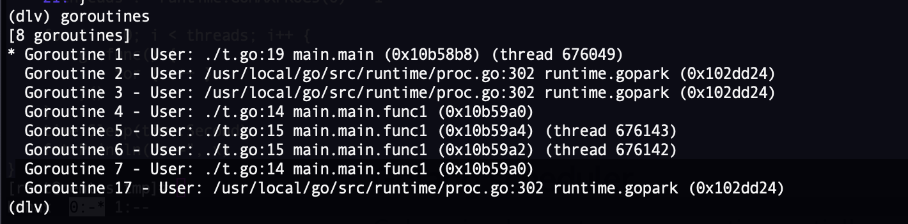

在双核四线程机器上测试，如下代码，程序不会正常执行结束，这也是探索go runtime scheduler的一个好例子：

```go
package main

import "fmt"
import "time"
import "runtime"

func main() {
	var x int
	threads := runtime.GOMAXPROCS(0)
	//threads := runtime.GOMAXPROCS(0) - 1

	for i := 0; i < threads; i++ {
		go func() {
			for {
				x++
			}
		}()
	}
	time.Sleep(time.Second)
	fmt.Println("x =", x)
}
```

这里runtime.GOMAXPROCS(0)返回值为4，dlv调试可以看到也确实创建了4个协程main.main.func1，其中两个正在调度，thread 676143, thread 676142，而另外两个协程则没有分配调度它的线程，即还没有开始调度。也好理解，因为每个func1协程都是在死循环里面执行密集计算，没有让度cpu的时机。



另外main.main这个是main goroutine，它跑在独立的线程thread 676049中。但是因为我们设置的runtime.GOMAXPROCS(0)为默认值4，表示新创建的goroutine可以和main goroutine共享相同的cpu资源P，也就是允许其他goroutine和main goroutine抢占P运行。那func1对应的goroutine占着cpu资源不放，main goroutine也就获得不了可继续调度的机会了。所以上述代码永远不会结束！

如果把threads := GOMAXPROCS(0) - 1，设置为物理核数数减1，那么新创建的协程就不会占满所有的P，main goroutine就可以在空闲的P上获得被调度的机会。程序就可以正常执行结束。