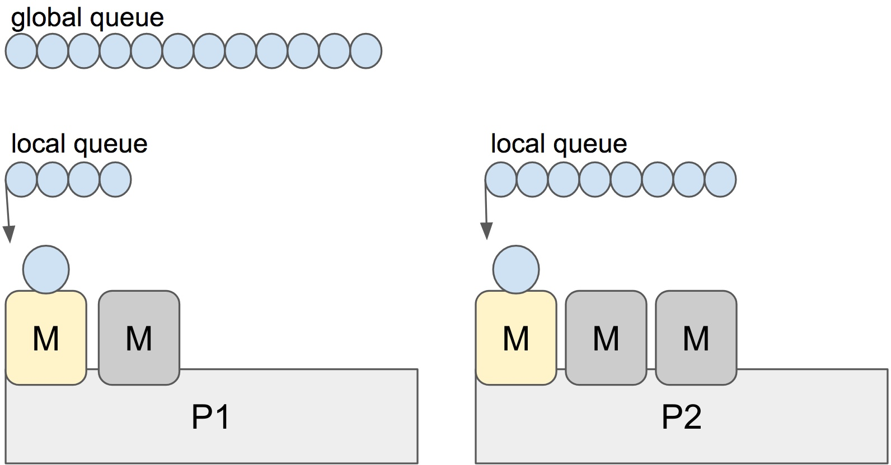

# 1 Go's work-stealing scheduler

Sun, Jul 16, 2017

Go scheduler’s job is to distribute runnable goroutines over multiple worker OS threads that runs on one or more processors. In multi-threaded computation, two paradigms have emerged in scheduling: work sharing and work stealing.

- **Work-sharing**: When a processor generates new threads, it attempts to migrate some of them to the other processors with the hopes of them being utilized by the idle/underutilized processors.
- **Work-stealing**: An underutilized processor actively looks for other processor’s threads and “steal” some.

The migration of threads occurs less frequently with work stealing than with work sharing. When all processors have work to run, no threads are being migrated. And as soon as there is an idle processor, migration is considered.

Go has a work-stealing scheduler since 1.1, contributed by Dmitry Vyukov. This article will go in depth explaining what work-stealing schedulers are and how Go implements one.

## 1.1 Scheduling basics

Go has an M:N scheduler that can also utilize multiple processors. At any time, M goroutines need to be scheduled on N OS threads that runs on at most GOMAXPROCS numbers of processors. Go scheduler uses the following terminology for goroutines, threads and processors:

- G: goroutine
- M: OS thread (machine)
- P: processor

There is a P-specific local and a global goroutine queue. Each M should be assigned to a P. Ps may have no Ms if they are blocked or in a system call. At any time, there are at most GOMAXPROCS number of P. At any time, only one M can run per P. More Ms can be created by the scheduler if required.



Each round of scheduling is simply finding a runnable goroutine and executing it. At each round of scheduling, the search happens in the following order:

```
runtime.schedule() {
    // only 1/61 of the time, check the global runnable queue for a G.
    // if not found, check the local queue.
    // if not found,
    //     try to steal from other Ps.
    //     if not, check the global runnable queue.
    //     if not found, poll network.
}
```

Once a runnable G is found, it is executed until it is blocked.

Note: It looks like the global queue has an advantage over the local queue but checking global queue once a while is crucial to avoid M is only scheduling from the local queue until there are no locally queued goroutines left.

## 1.2 Stealing

When a new G is created or an existing G becomes runnable, it is pushed onto a list of runnable goroutines of current P. When P finishes executing G, it tries to pop a G from own list of runnable goroutines. If the list is now empty, P chooses a random other processor (P) and tries to steal a half of runnable goroutines from its queue.


In the case above, P2 cannot find any runnable goroutines. Therefore, it randomly picks another processor (P1) and steal three goroutines to its own local queue. P2 will be able to run these goroutines and scheduler work will be more fairly distributed between multiple processors.

## 1.3 Spinning threads

The scheduler always wants to distribute as much as runnable goroutines to Ms to utilize the processors but at the same time we need to park excessive work to conserve CPU and power. Contradictory to this, scheduler should also need to be able to scale to high-throughput and CPU intense programs.

Constant preemption is both expensive and is a problem for high-throughput programs if the performance is critical. OS threads shouldn’t frequently hand-off runnable goroutines between each other, because it leads to increased latency. Additional to that in the presence of syscalls, OS threads need to be constantly blocked and unblocked. This is costly and adds a lot of overhead.

In order to minimize the hand-off, Go scheduler implements “spinning threads”. Spinning threads consume a little extra CPU power but they minimize the preemption of the OS threads. A thread is spinning if:

- An M with a P assignment is looking for a runnable goroutine.
- An M without a P assignment is looking for available Ps.
- Scheduler also unparks an additional thread and spins it when it is readying a goroutine if there is an idle P and there are no other spinning threads.

There are at most GOMAXPROCS spinning Ms at any time. When a spinning thread finds work, it takes itself out of spinning state.

Idle threads with a P assignment don’t block if there are idle Ms without a P assignment. When new goroutines are created or an M is being blocked, scheduler ensures that there is at least one spinning M. This ensures that there are no runnable goroutines that can be otherwise running; and avoids excessive M blocking/unblocking.

## 1.4 Conclusion

Go scheduler does a lot to avoid excessive preemption of OS threads by scheduling them to the right and underutilized processors by stealing, as well as implementing “spinning” threads to avoid high occurrence of blocked/unblocked transitions.

Scheduling events can be traced by the [execution tracer](https://golang.org/cmd/trace/). You can investigate what’s going on if you happen to believe you have poor processor utilization.

## References

- [The Go runtime scheduler source](https://github.com/golang/go/blob/master/src/runtime/proc.go)
- [Scalable Go Scheduler design document](https://golang.org/s/go11sched)
- [The Go scheduler by Daniel Morsing](https://morsmachine.dk/go-scheduler)

If you have any suggestions or comments, please ping [@rakyll](https://twitter.com/rakyll).