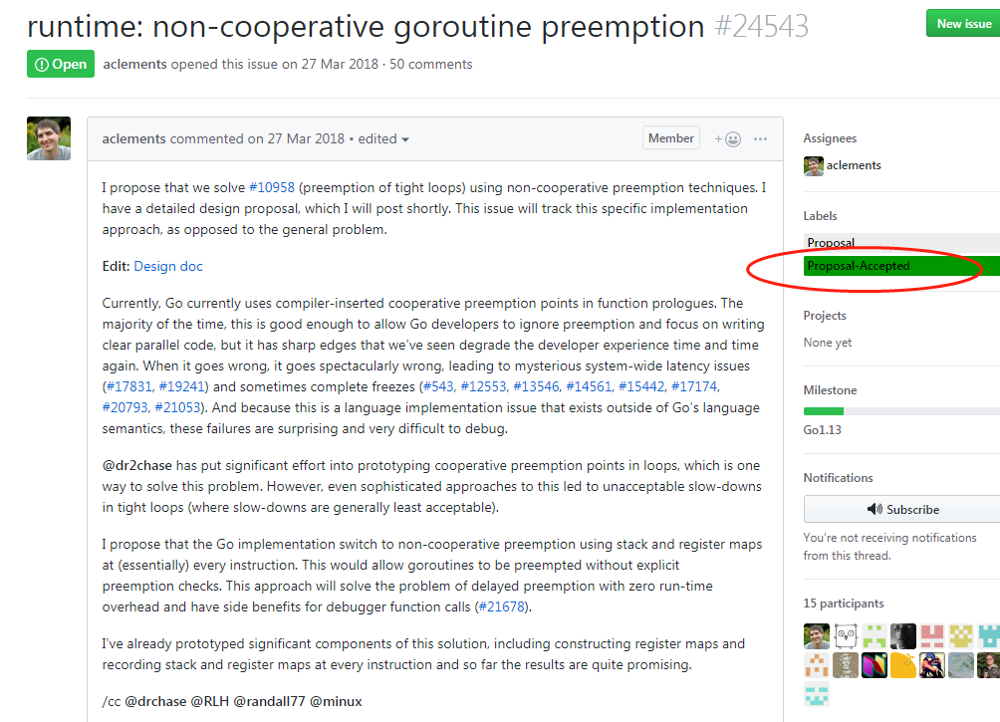

go目前只支持部分抢占式调度，而非绝对的抢占式调度。在详细介绍抢占式调度、非抢占式调度的含义之前，我们先做个简单的对比：

- 指令周期的结束，检查CPU引脚是否有中断请求到达，有则执行对应的中断服务程序！

- 进程什么时候触发调度，系统调用结束返回之前、时钟中断处理返回之前！

- 协程什么时候触发调度，通常一般是网络IO的时候，但是考虑到goroutine，我们还需要更详细点：

  - 系统调用（阻塞+非阻塞，go运行时通过wrapper of system call来通知运行时进行必要的处理）；
  - 网络IO（其实包含在系统调用之中）；
  - sync包下的操作，会挂起协程但是不会挂起线程或者进程，sync.Mutex.Lock()；
  - chan read、write操作，会挂起协程但是不会挂起线程或者进程；
  - time.Sleep(…)操作，会挂起协程但是不会挂起线程或者进程；
  - 进入函数调用开始部分（funciton prologue）会触发对当前goroutine栈帧大小以及执行时间的检测，栈帧超过指定大小，并且执行时间超过10ms则会触发groutine切换。

  以上就是目前goroutine切换的时机，以及与普通中断服务程序、进程切换时机的一个简单介绍、对比。

  

  可能某些程序员会写出这样的程序，比如起了N个goroutine，每个goroutine里面执行for循环，for循环里面只是简单的算术运算i++，没有其他函数调用逻辑，这种情况下就不会触发goroutine的切换，可能会导致后创建的goroutine饿死。

  ```go
  for i:=0; i<10; i++ {
    go func() {
      j ：= 0
      for {
        j++
      }
    }()
  }
  ```

  创建了10个goroutine，每个都在执行计算密集型任务，完全不会让度出CPU给其他协程调用使用，导致goroutine starvation。

  鉴于此，go也提出了自己的优化方案，实现真正的“goroutine抢占式调度”，详情可参加issue [runtime: non-cooperative goroutine preemption](https://github.com/golang/go/issues/24543)。

  

  

  一切东西都是权衡，go不支持抢占式调度就是它的缺陷吗？未必！但是为了更好的推广，并且在不影响go性能的前提下，支持这个只会有益无害！