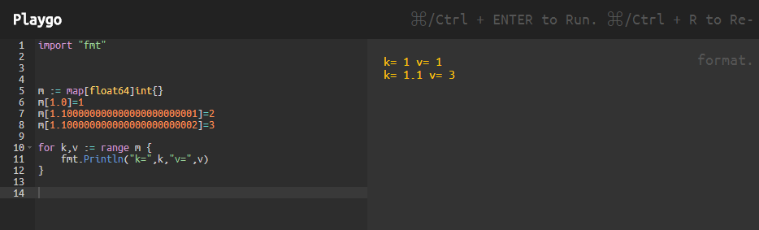

今天遇到个问题，本来是golang里面使用float64作为map key的问题，后面遇到问题发现两个不相同的浮点数作为map的key，竟然只写入了一个，而且值后面的把前面的覆盖了。示例如下：




这里要涉及到几个问题：

- golang如何针对key计算hash的，阅读源码后发现就是有个key *_type，h.key.alg.hash(key)来计算得到hash，看上去也并没有对key做什么预处理（比如截断之类的）所以说既然上述m[1.1….1] == m[1.1….2]，说明计算得到的hash肯定是一样的；

- golang里面利用hash的后5位作为桶索引（bucket索引值），先定位到bucket，然后再根据hash的前8位作为与bucket内部<k,v> entries的hash进行比较找到对应的<k,v> pairs.

  

好，所以仔细思考下就可以确定是浮点数精度导致的，所以接下来我们研究下浮点的精度问题。


```go
package main

import "math/big"
import "fmt"

func main() {
	
	// IEEE 754: double
  //
	// 1bit - sign
	// 11bit - exponent
	// 52bit - fraction
	// max fraction: 4503599627370495
	
  // 超出可表示的最大尾数数字后，继续增加一位尾数进行比较，va == vb？Yes
	va := 0.45035996273704951
	vb := 0.45035996273704953
	
  // 在可表示的最大尾数范围内，修改倒数第二位数字进行比较，va == vb？No
	//va := 0.4503599627370495
	//vb := 0.4503599627370485
	
	if va == vb {
	    fmt.Println(true)
	} else {
	    fmt.Println(false)
	}

  // 使用big包进行比较呢，也不行！
	vv1 := big.NewFloat(va).SetPrec(100)
	vv2 := big.NewFloat(vb).SetPrec(100)

	if v := vv1.Cmp(vv2); v < 0 {
		fmt.Println("less")
	} else if v == 0 {
		fmt.Println("equal")
	} else {
		fmt.Println("larger")
	}

}
```


程序运行结果如下：

```bash
true
equal
```


