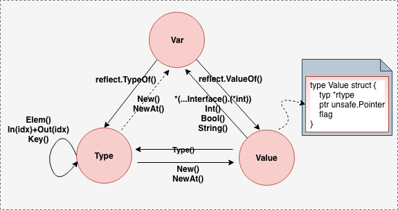

# 1 go反射转换关系

下面是go reflect相关的Variable、reflect.Type、reflect.Value之间的转换关系，三者之间是可以互相转换的。



# 2 go反射api使用

我们结合上述转换图来进行详细说明go reflect api的使用。

## 2.1 Variable & reflect.Type

### 2.1.1 Variable -> reflect.Type

```go
rt := reflect.TypeOf(v)
```

### 2.1.2 reflect.Type -> Variable

从reflect.Type到Variable，即通过反射类型直接构造一个变量出来也是可以的，但是中间转换过程涉及到从reflect.Type到reflect.Value，然后再从reflect.Value解引用得到Variable，因此，上图转换图中采用了虚线的形式。

reflect.New(rt reflect.Type)会创建一个指定类型的变量，并初始化未对应的0值。如下面创建了一个值为0的int变量v0。

```go
v : = 0
rt := reflect.TypeOf(v)
v0 := reflect.New(rt)
fmt.Println(*(v0.Interface().(*int)))
```

reflect.NewAt(rt reflect.Type, ptr unsafe.Pointer)则是用ptr指向的值创建一个变量。

```go
v := 0
rt := reflect.TypeOf(v)
vv := reflect.NewAt(rt, unsafe.Pointer(&v))
fmt.Println(*(vv.Interface().(*int)))
```

reflect.New()\NewAt()返回的都是指向变量的指针，通过这个值可以修改新创建的变量内容。还需要注意的是，reflect.NewAt(rt, ptr)创建的变量，其实与ptr指向的变量是相同的。通过NewAt返回的指针可以对原来变量值进行修改。

```go
*reflect.NewAt(rt, unsafe.Pointer(&v)).Interface().(*int) = 12345
```

难道不能像CC++中那样直接(int \*)(ptr) = 12345吗，还需要先通过反射得到一个变量。go里面unsafe.Pointer是一个类似CC++中void\*类型的指针，也是可以通过\*(\*int)(unsafe.Pointer(ptr))这样的运算来完成赋值的，问题是我们这里描述的反射的情景，我们是要在运行时动态地完成类型判断、赋值，写代码的时候可能还不知道ptr是\*int类型的。

## 2.2 Variable & reflect.Value

### 2.2.1 Variable -> reflect.Value

```go
v := 100
rv := reflect.ValueOf(v)
```

### 2.2.2 reflect.Value -> Variable

首先来看下reflect.Value的定义：

```go
type Value struct {
    rty *rtype
    ptr unsafe.Pointer
    flag
}
```

不管是reflect.Value中是有基本数据类型得来，还是有其他复合类型或者用户自定义类型得来，reflect.Value都是通过指针unsafe.Pointer的形式来引用的。

如果我们知道存的是是简单数据类型，则可以直接通过reflect.Value.Int()/Bool()/String()…来获取变量值。

```go
v := 100
rv := reflect.ValueOf(v)
fmt.Println(v.Int())	// 如果知道是int类型的
fmt.Println(v.Bool())	// 如果知道是bool类型的
fmt.Println(v.String()) // 如果知道是string类型的
```

如果reflect.Value里面存的是比较复杂的类型，没有对应的api直接获取其值，那么可以先通过`reflect.Value.Interface()`来拿到指针，然后再自己根据实际类型解引用拿到变量值。


```go
fmt.Println(*v.Interface().(*int))	// 如果知道是*int类型的
fmt.Println(*v.Interface().(*bool))	// 如果知道*bool类型的
...
```

## 2.3 reflect.Type & reflect.Value

### 2.3.1 reflect.Type -> reflect.Type

```go
v := 100
rt := reflect.TypeOf(v)
rv := rt.Elem()	// 如果rt是容器类型，则返回容器中元素类型
rv = rt.Key()	// 如果rt是map类型，则返回map的key类型
rv = rt.In(0)	// 如果rt是func类型，则返回第一个输入参数类型
rv = rt.Out(0)	// 如果rt是func类型，则返回第一个返回值类型
```

### 2.3.2 reflect.Type -> reflect.Value

```go
v := 100
rt := reflect.TypeOf(v)
rv1 := reflect.New(rt)
rv2 := reflect.NewAt(rt, unsafe.Pointer(&v))
```

### 2.3.2 reflect.Value -> reflect.Type

```go
rt1 := rv1.Type()
rt2 := rv2.Type()
```

# 3 总结

本文总结了go反射中的variable、reflect.Type、reflect.Value之间的关系，以及可能的转换过程，并结合相关的api，详细描述了三者之间的转换操作，为进一步学习go反射相关知识打好基础。


