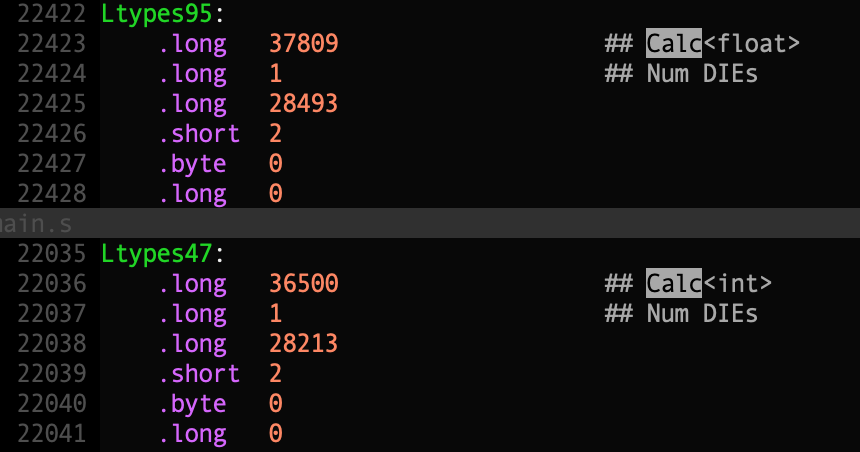

# 1 go反射 vs java范型 vs cpp模板

**Go语言并不支持范型编程**（某些内置函数是支持范型的，但是用户自定义函数不支持范型），但是可以借助reflect来一定程度上弥补这部分能力的缺失，因为要靠运行时计算所以有运行时开销，性能比不上真正的范型实现。

**Java支持真正的“范型”**，泛型编程的好处是，编译时对类型安全性进行检查，并且模板参数可以是任意类型不用做类型转换，既安全又方便。由于是在编译时进行类型检查，并且Java编译器会对类、方法、变量级别的模板参数进行类型擦除（Type Erasure，简单理解就是将模板参数替换成Object类型或者第一个Bound的类型），无运行时开销，比Go借助反射模拟范型性能好，也不用像C++一样拷贝代码引起编译速度下降或者代码尺寸膨胀。点击查看：[Java-Type-Erasure](https://www.baeldung.com/java-type-erasure)。

**C++通过“模板”来支持“范型”编程，之所以加引号，是因为C++不是真正的支持范型编程，模板特例化时编译器其实是生成了一个新类的代码**。C++模板是通过Macro来进行处理的，相当于复制、粘贴了类模板的代码，并替换了模板参数类型。简言之，就是一个高级的Macro处理系统。但是因为拷贝了代码，代码膨胀导致了编译速度下降、文件尺寸增加。

网上有很多相关的讨论，这里举个示例简单总结一下。

## 1.1 C++ 类模板

```c++
#include <iostream>
using namespace std;

template <typename T>
class Calc{
    T t1;
    T t2;
public:
    T Add(T t1, T t2) {
        return t1 + t2;
    }
};

int main() {
    Calc<int> calc_int;
    auto sum_int = calc_int.Add(1, 2);
    cout << "1 + 2 = " << sum_int << endl;
    
    Calc<float> calc_flt;
    auto sum_flt = calc_flt.Add(1.1, 2.2);
    cout << "1.1 + 2.2 = " << sum_flt << endl;
    
    return 0;
}
```

这里其实是创建了两个不同的类，`objdump -dS`可以很清晰地看到至少创建了两个不同的方法`Add(T, T)`，可能会有人认为这是`函数重载中的name mangling`，其实不是，确实是生成了两个不同的类型，这个可以通过DWARF相关信息看出来，首先`g++ -s main.cpp`得到汇编后文件main.s，然后查看该文件内容并搜索Calc，下面两个分别表示`Calc<float>模板实例`以及`Calc<int>模板实例`，二者确实属于两个不同的类型，一个是用Ltypes95来标识，一个是用Ltypes47来标识。



## 1.2 Java范型

Java中范型的实现依赖于Java中的类继承机制、类型擦除、类型转换来实现，最终只会有一个类的示例。

编译时，编译器会对模板参数T进行类型擦除，这里有两种处理的情形：

- 模板参数T，没有绑定一个类型（如`T extends Comparable`），那么类型擦除后，模板参数T会用Object进行替代，同时生成对应的类型转换的代码；
- 模板参数T，有限制类型（如T extends Comparable限定了模板实参必须实现Comparable接口），那么类型擦除后，模板参数T就用这第一个bound的类型Comparable代替，同时生成对应的类型转换代码。

需要注意的是，编译时类型擦除虽然会对源码做一定的调整，某些信息看似丢失了，比如`List<String> lst`被擦除后变为了`List<Object> lst`，在运行时我们依然可以通过反射机制来获取lst的元素类型为String，则是为什么呢？这是因为类型擦除并不是删除所有类型信息，模板实参的信息会以某种形式保存下来，以便反射时使用。

```Java
// 类型擦除前代码
List<String> lst = new ArrayList();
lst.Add("hello");
lst.Add("world");
Iterator it = lst.iterator();
for ; it.hasNext(); {
    String el = it.Next();
}

// 类型擦除后代码
List lst = new ArrayList();			// 模板实参String，擦除为Object
lst.Add("hello");					// hello为String，IS-A Object关系成立
lst.Add("world");                   // ...
Iterator it = lst.iterator();       
for ; it.hasNext(); {
    String el = (String) it.Next(); // 编译器自动插入类型转换的代码
}
```

由此可见，Java的范型实现，既不会像C++那样多创建类导致代码体积膨胀，也不会带来运行时开销，也没有破坏反射依赖的信息。

# 2 go panic/recover vs cpp/java try-catch

错误处理是必须要面对的一个问题，错误又包括编译时、运行时错误，编译时错误可以在编译器处理阶段发现，运行时错误就要依赖语言提供的错误处理机制来捕获，像C++、Java都提供了try-catch的能力，Go里面没有try-catch，但是提供了panic & recover的机制来模拟异常处理。

那么这几种方式的差别是什么呢？

- 控制流执行方式不同
`try { codeblock } catch (ex e1){ handle e1 } catch (ex e2){handle e2}`，只有当codeblock抛出异常且被catch时对应的错误处理代码才会执行，但是panic、recover不同，`defer func() { e := recover ...}()`注册的函数在函数退出阶段一定会执行；

- 异常的传播方式不同
`try-catch`错误处理代码是在catch之后的block进行，如果没有被catch到则会继续向上层抛出异常等上层捕获处理……如果最终没有被catch并处理，则进程挂掉。panic的抛出有别于异常向上抛出的过程，某个goroutine中产生的panic只可以在当前goroutine结束前recover，如果当前goroutine没有recover处理该panic，则进程立即挂掉。

- 异常的处理方式不同
`try-catch`捕获了异常、处理之后依然继续走后续流程，就好像什么都没有发生过一样，但是panic会立即unwind the calling stack并层层返回并直到被recover捕获后，上层调用函数才可以重新恢复向下执行。

这里的分点描述可能有点牵强，主要是表达清楚这个意思。

# 3 go defer vs cpp智能指针 vs java try-catch-finally

## 3.1 资源泄露让人头疼

程序中申请的某些资源需要显示地释放，特别是系统资源，如打开的文件描述符、tcp & udp套接字、动态申请的堆内存等等。即便是说很多遍避免资源泄露的各种方式，开发人员仍然不能很好地避免资源泄露问题。避免资源泄露并不是一个技巧性很强的问题，但是当大家写起代码来被各种业务逻辑冲昏了头的时候，bug就容易趁机而入。

## 3.2 避免资源泄露问题

语言层面如果能够提供某种能力，在资源申请成功、使用之后及时地进行资源释放，那就再好不过了。在深入对比C、C++、Java、Go中如何实现自动释放资源之前，我们先考虑下这个过程中存在那些难点：

- **资源申请成功、正常使用之后，如何判断资源已经使用完毕？**

  以打开的文件描述符为例，fd是int类型变量，文件打开之后在进程的整个生命周期内都是有效的，其实文件访问结束之后就可以认为这个fd可以关闭、释放了；再以动态申请的堆内存为例，堆内存空间也是在进程生命周期内有效的，堆内存是通过指针进行访问的，如果没有任何指针指向这段堆内存区域，可以认为分配的堆内存可以释放掉了；再以申请的lock为例，lock成功之后可以访问临界区了，从临界区退出的那一刻开始，可以认为lock可以释放掉了。

  不同类型的资源，判断是否使用完毕的方式不一样，但有一点可以确认，开发人员清楚资源应该何时释放。

- **开发人员清楚应该何时释放资源，但是语言级别如何提供某种机制避免开发人员疏漏？**

  C并没有提供语言层面的机制来避免资源泄露问题，但是利用gcc提供的C扩展属性也可以做到类似的效果；

  C++提供了智能指针，以malloc动态分配堆内存为例，分配成功返回堆内存指针，用该指针来初始化一个智能指针，并绑定对应的回调方法，当智能指针作用域结束被销毁时，其上绑定的回调方法也会被调用。假如我们将释放堆内存的方法`free(ptr)`注册为智能指针上的回调方法，就可以在分配内存所在的作用域销毁时自动释放堆内存了。

  Java提供了try-catch-finally，在try中申请、使用资源，catch中捕获可能的异常并处理，在finally中进行资源释放。以打开文件为例，在try中打开文件、文件处理结束之后，finally中调用file.close()方法。考虑一种极端情况，我们的文件处理逻辑比较复杂，中间涉及的代码比较多，在编写了各种逻辑处理、异常处理之后，开发人员是否容易遗忘在finally中关闭文件呢？这种可能性还是比较大的。开发人员的习惯一般是遵循就近原则，定义变量的时候都是在使用之前，如果try block结尾处没有明显的文件相关的操作，开发人员可能不会联想到要关闭文件。

- **考虑到开发人员遵循就近原则的习惯，能否在资源申请成功后立即注册一个资源释放的回调方法，在资源使用结束的时候回调这个回调方法？这个方式是比较容易实现的，听起来也比较优雅。**

  Go defer提供了这样的能力，在资源申请成功之后立即注册一个资源释放的方法，选择函数退出阶段作为申请使用结束的时间点，然后回调注册的释放资源的方法最终完成资源的释放。既能够满足程序员“就近使用”的良好作风，也减少了因为遗忘泄露资源的可能，而且代码的可维护性也更好。

  Go defer在某些情况下也可能会带来一定的性能损耗。比如通过lock在保护临界区，在临界区退出之后就可以释放掉lock了，但是呢，defer只有在函数退出阶段才会触发资源的释放操作。这可能会导致锁粒度过大，降低并发处理能力。这一点，开发人员要做好权衡，确定自己选择defer是没有问题的。

## 3.3 不同语言模拟defer

### 3.3.1 模拟defer in C

C本身没有提供defer或者类似defer机制，但是借助gcc扩展也可以实现类似能力。利用gcc提供的扩展属性`__cleanup__`来修饰变量，当变量离开作用域时可以自动调用注册的回调函数。

下面是 [gcc扩展属性``的描述](http://echorand.me/site/notes/articles/c_cleanup/cleanup_attribute_c.html)，感兴趣的可以了解下。其实gcc提供的这种扩展属性比go defer控制力度更细，因为它可以控制的粒度可以细到“**作用域级别**”，而go defer只能将有效范围细到“**函数级别**”。

##### 示例一

 `cleanup_attribute_demo.c`

```c
# include <stdio.h>

/* Demo code showing the usage of the cleanup variable
   attribute. See:http://gcc.gnu.org/onlinedocs/gcc/Variable-Attributes.html
*/

/* cleanup function
   the argument is a int * to accept the address
   to the final value
*/

void clean_up(int *final_value)
{
  printf("Cleaning up\n");
  printf("Final value: %d\n",*final_value);
}

int main(int argc, char **argv)
{
  /* declare cleanup attribute along with initiliazation
     Without the cleanup attribute, this is equivalent 
     to:
     int avar = 1;
  */
  
  int avar __attribute__ ((__cleanup__(clean_up))) = 1;
  avar = 5;

  return 0;
}
```

编译运行：

```bash
$ gcc -Wall cleanup_attribute_demo.c
$ ./a.out
Cleaning up
Final value: 5
```

##### 示例二

```c
/* Demo code showing the usage of the cleanup variable
   attribute. See:http://gcc.gnu.org/onlinedocs/gcc/Variable-Attributes.html
*/

/* Defines two cleanup functions to close and delete a temporary file
   and free a buffer
*/

# include <stdlib.h>
# include <stdio.h>

# define TMP_FILE "/tmp/tmp.file"

void free_buffer(char **buffer)
{
  printf("Freeing buffer\n");
  free(*buffer);
}

void cleanup_file(FILE **fp)
{
  printf("Closing file\n");
  fclose(*fp);

  printf("Deleting the file\n");
  remove(TMP_FILE);
}

int main(int argc, char **argv)
{
  char *buffer __attribute__ ((__cleanup__(free_buffer))) = malloc(20);
  FILE *fp __attribute__ ((__cleanup__(cleanup_file)));

  fp = fopen(TMP_FILE, "w+");
  
  if (fp != NULL)
    fprintf(fp, "%s", "Alinewithnospaces");

  fflush(fp);
  fseek(fp, 0L, SEEK_SET);
  fscanf(fp, "%s", buffer);
  printf("%s\n", buffer);
  
  return 0;
}
```

编译运行：

```bash
Alinewithnospaces
Closing file
Deleting the file
Freeing buffer
```

### 3.3.2 模拟defer in C++

C++中通过智能指针可以用来对defer进行简单模拟，并且其粒度可以控制到作用域级别，而非go defer函数级别。C++模拟实现的defer也是比较优雅地。

```cpp
#include <iostream>
#include <memory>
#include <funtional>

using namespace std;
using defer = shared_ptr<void>;

int main() {
    defer _(nullptr, bind([]{ cout << ", world"; }));
    cout << "hello"
}
```
也可以做去掉bind，直接写lambda表达式。

```cpp
#include <iostream>
#include <memory>

using namespace std;
using defer = shared_ptr<void>;

int main() {
    defer _(nullptr, [](...){ cout << ", world"; });
    cout << "hello"
}
```

上述代码执行时输出：`hello, world`。智能指针变量为_，_在main函数退出时作用域结束，智能指针销毁时会自动调用b绑定的lambda表达式，程序先输出hello，然后再输出world。这里的示例代码近似模拟了go defer。

### 3.3.3 模拟defer in Java

Java中try-catch-finally示例代码，这里就简单以伪代码的形式提供吧：

```java
InputStream fin = null;

try {
    // open file and read
fin = new FileInputStream(...);
    String line = fin.readLine();
    System.out.println(line);
} catch (Exception e) {
    // handle exception
} finally {
    fin.close();
}
```

Java中的这种try-catch-finally的方式，只能算是一种资源释放的方式，不能算作是模拟defer。Java中好像没有提供什么感知到作用域结束或者函数结束并触发回调函数的能力。我没有想出Java中如何优雅地模拟defer。

### 3.3.4 defer in Go

我认为defer in Go是目前各种编程语言里面实现的最为优雅的，简单易用，符合大家使用习惯，代码可读性好。defer in Go使用地如此之广，以致于连举个例子都是多余，这里就省掉示例代码了。


