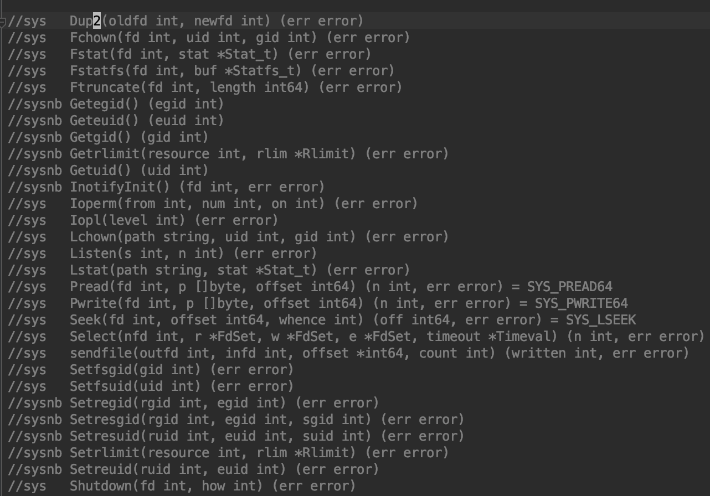
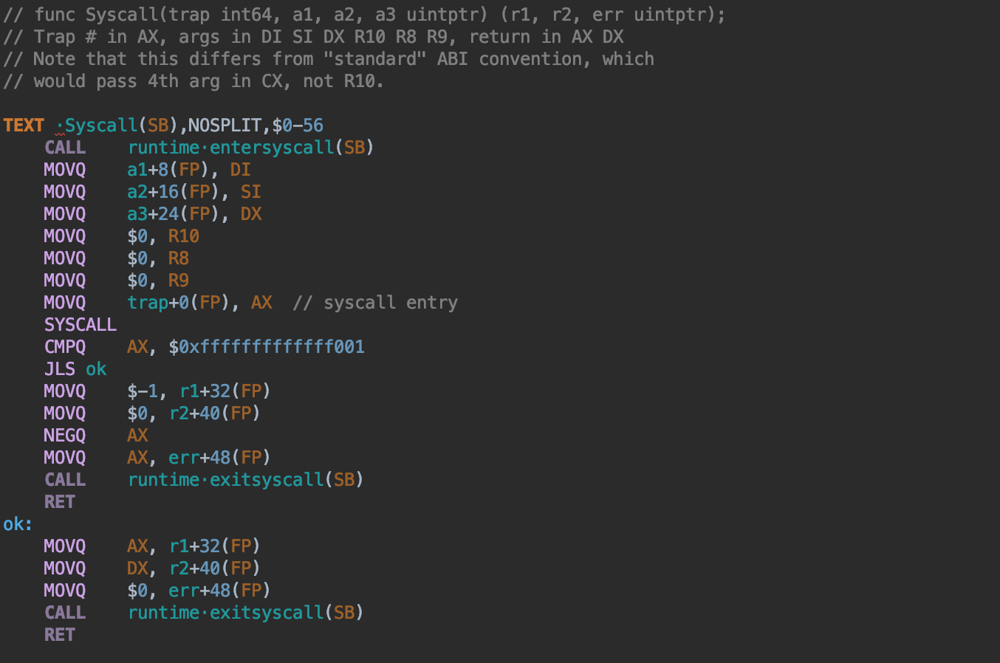
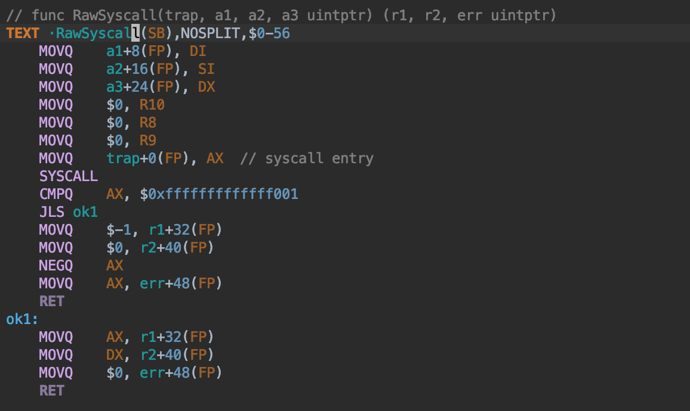
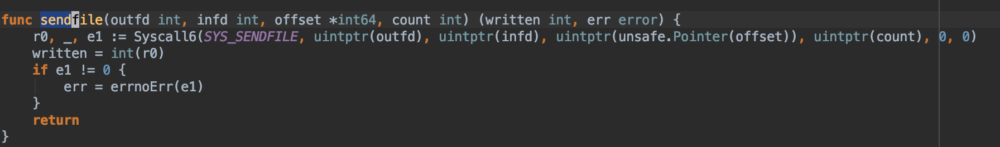
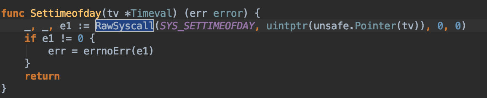
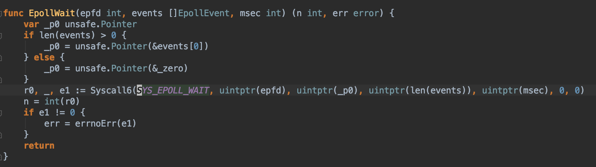

系统调用分为阻塞系统调用、非阻塞系统调用，go里面对这些系统调用有归类整理，详见源文件：

/src/syscall/syscall_linux_amd64.go

如下图所示，sys开头的表示的是阻塞系统调用，会调用Syscall，以sysnb开头的是非阻塞系统调用，会调用RawSyscall，关于Syscall和RawSyscall的区别下面整理。

Syscall定义在asm_linux_amd64.s里面，代码中有runtime.entersyscall(SB)和runtime.exitsyscall(SB)函数调用，这个是与golang运行时进行交互的，用于通知golang运行时我即将发起或者退出一个系统调用。

对于会导致阻塞的系统调用，都要通过Syscall来调用来通知golang运行时，以便golang运行时做处理，如创建新的物理线程调度器其它的goroutine，避免整个进程无线程可调度而最终被sysmon杀死进程。

对于某些非阻塞的系统调用，就不必再与golang运行时交互了，直接调用就可以，这样可以减少两次与golang运行时交互的函数调用开销，这里就掉的是RawSyscall：

网络io操作本来也是阻塞的，但是因为socket fd会被设置为non-blocking，系统调用虽然还是阻塞的系统调用，但是已经不会阻塞调用线程了，所以也无所谓了。

有个脚本mksyscall.pl根据syscall_linux_amd64.go里面定义的系通调用列表，就是第一张图那些带注释的部分，这个pl脚本会负责生成与之相关的系统调用函数，生成在syscall/zsyscall_linux_amd64.go里面。可以找几个有代表性的来看下生成的系统调用函数：

比如sendfile是阻塞的系统调用：

比如settimeofday是非阻塞的系统调用：

epoll相关的epollwait也是阻塞的。
