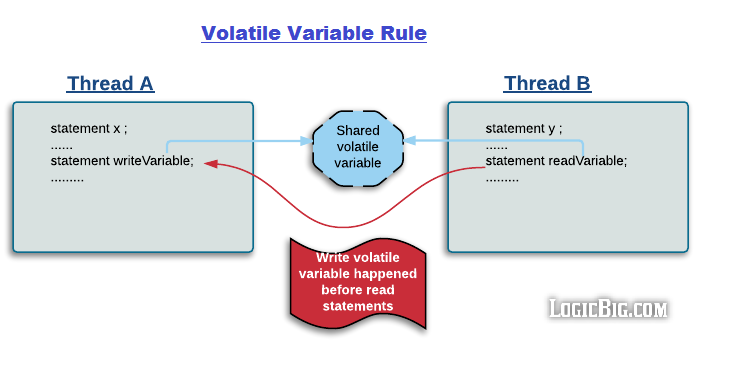

# 1 happens-before关系

## 1.1 什么是happens-before

谈到并发，就涉及到并发任务之间的同步问题，谈到同步问题，就不得不提happens-before关系！happens-before指的是并发任务行为之间的一种约定：任务A的某个动作act-a，与任务B的某个动作act-b，存在着一种“先后关系”，即happens-before关系，可以简单的理解成任务的动作act-a先于B的动作act-b发生。

严格意义上讲，上述理解是不准确的，"*Happens-before relationship is a guarantee that action performed by one thread is visible to another action in different thread.*” happens-before关系强调的是一个并发任务的动作可以被另一个并发任务的动作观测到，即A的动作act-a所作出的程序状态的改变（如修改内存数据等）可以被B的动作act-b执行时观测到（如读取到最新的内存数据）。

java相关的happens-before关系的更多介绍，可以参考：[Understanding Happens-Before Relationship](https://www.logicbig.com/tutorials/core-java-tutorial/java-multi-threading/happens-before.html)。

为了保证线程执行动作Y时可以看到线程执行动作X的结果（不管X、Y是否在同一个线程中执行），必须在X和Y之间建立happens-before关系。如果没有建立X happens-before Y这样的关系，那么JVM可以根据优化规则随意调整指令顺序。happens-before并不只是按照动作的发生时间来对动作进行排序，而且会对内存的read、write动作进行排序。两个线程先后执行对相同内存地址的写操作、读操作，即便两个动作的发生顺序是先写后读，但是后续的读操作并不一定能够读取到新写入的数据，这就是内存一致性错误，要想避免这样的问题，必须在write和read之间建立happens-before关系。

## 1.2 如何建立happens-before

java中建立happens-before关系的规则如下：

- Single thread rule：单线程中按照编程语句出现的先后顺序（program order），每个动作都与后续动作之间存在happens-before关系。

  

- Monitor lock rule：在一个monitor lock上的unlock操作与后续在同一个monitor lock上的acquire操作存在happens-before关系。

  

- Volatile variable rule：一个volatile field的写操作，与后续对同一volatile field的读操作之间存在happens-before关系，对volatile fields的write、read操作，与进入、退出monitors（synchronized对write、read做同步）有相同的内存一致性效果，但是不需要获取、释放monitor lock。

  

- Thread start rule：Thread.start()方法调用，与被启动的线程中执行的后续动作（如run方法体中动作）之间存在happens-before关系。

  

- Thread join rule：线程B执行ThreadB.join()成功返回之前的所有动作（线程B run方法体），与返回之后的所有动作（启动该线程B的线程A的run方法体后续动作）之间存在happens-before关系。如下图所示，线程A中创建线程B并启动，然后调用B.join()等待B结束后再执行A run方法体中的statement 1，B执行的run方法体中动作与A执行的run方法体动作statement 1之间存在happens-before关系。

  

- Transitivity：happens-before规则遵循传递性，即如果A happens-before B，B happens-before C，那么A happens-before C也成立，这个是很显然的。