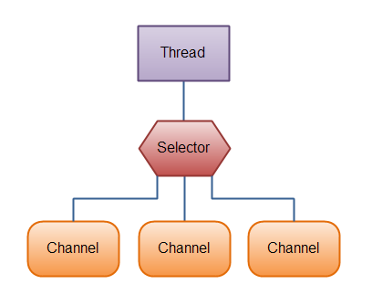
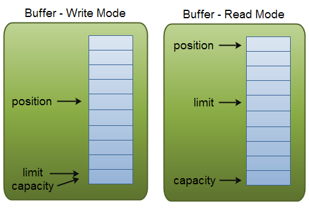
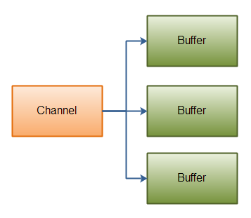
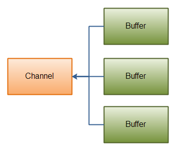
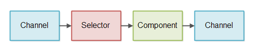
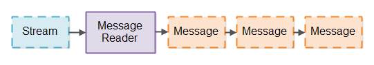
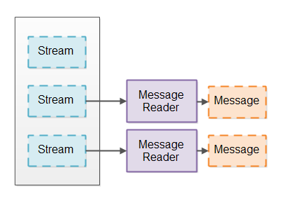
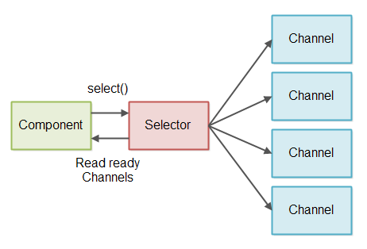

# Java NIO

## 1 前言
Java NIO，意为Java New IO，是一种相对于Java标准IO、网络API的替代方案。从JDK 1.4开始NIO就被引入了进来，它提供了另一种IO处理的方式，这使得Java在IO处理方面向前迈进了一大步。

### NIO Channel & Buffer
在Java标准IO里面，IO处理的对象是字节流或字符流，在NIO里面我们处理的对象是channel和buffer，数据读总是从channel中读入到buffer，输入写总是从buffer写入到channel。

### NIO Non-Blocking IO
Java NIO使得我们可以通过非阻塞的方式执行IO处理，例如一个线程请求从channel中读取数据到buffer的时候，在channel执行数据读取操作到buffer的过程中，线程仍然可以执行其他的处理工作，当数据被读取到buffer中之后，线程再去对数据进行处理。数据写的过程也是与此类似。

>备注：  
其实参考glibc中的pthread用户级线程库实现，可以大致想到这种channel、buffer工作模式的一种大致实现，大不了我多开一个用户线程让其执行channel和buffer之间的数据传输工作，处理完之后给原本请求channel读写数据的用户线程发个信号让其进行数据处理。Linux中的AIO就是这么搞的，可以参考《Linux设备驱动开发》。  
大家所描述的没有底层硬件支持的异步，很多都是指的软件代码执行序上的异步，本质上代码还是在以同步的方式执行，只不过在这些同步技术之上结合一些小佐料起到了类似的异步执行的效果。

### NIO Selector
Java NIO中有Selector（选择器）的概念，一个selector可以对多个channel上的事件进行监听，例如对多个channel上的连接打开、数据到达事件进行监听，因此一个selector可以用于对多个channel上的连接打开、关闭以及读写事件进行监听、处理。
>备注：  
Linux中的selector本质上是基于epoll实现的，因此可以结合epoll来理解selector。  
channel不过是对网络套接字的封装，buffer不过是对接收缓冲、发送缓冲的封装，selector不过是对epollfd的封装，selector对多个channel的监听，不过是epoll在epollfd上EPOLL_CTL_ADD了多个channel对应的fd，并对其上的事件进行必要的监听。selector轮询事件是否发生，本质上也就是epoll_wait轮询注册的多个fd上是否有事件发生。

下面将展开介绍Java NIO是如何工作的。

## 2 概要
Java NIO包括3个核心组件，即channel、buffer、selector。Java NIO里面包括的类不止这几个，但是我个人认为Java NIO API的核心类就这几个，其他的例如Pipe、FileLock子类的都是配合这3个核心组件使用的工具类，所以这里先重点介绍channel、buffer、selector，后面会在独立章节中对其他类进行介绍。

### NIO Channel & Buffer
Java NIO中的所有IO操作几乎都是从一个channel开始的，channel可以看做是对一对套接字的封装，例如一个tcp连接。可以从channel中读取数据到buffer，同样也可以将buffer中的数据写入到channel中，下图展示了channel和buffer的这一关系。  


**Channel大致有如下几种实现：**
- FileChannel
- DatagramChannel
- SocketChannel 
- ServerSocketChannel

其中FileChannel主要用于文件io，DatagramChannel主要用于udp网络通信，SocketChannel用于tcp网络通信，而ServerSocketChannel用于建立tcp连接。

**Buffer大致有如下几种实现：**
- ByteBuffer
- CharBuffer
- DoubleBuffer
- FloatBuffer
- IntBuffer
- LongBuffer
- ShortBuffer

上述多种Buffer的不同之处在于其中存储的数据类型的差异，例如ByteBuffer就是按照字节进行读写，CharBuffer就是按照字符进行读写。Java NIO中还有一种Buffer实现MappedByteBuffer，这种Buffer需要与内存映射文件来配合使用，我们这里暂时先不予介绍。

### NIO Selector
一个selector允许一个单一线程对多个channel上的事件进行处理（Linux平台下的selector实现就是基于epoll），一个单一线程也可以对多个channel进行高效的io处理，例如一个可能会创建很多tcp连接每个tcp连接流量不大的情况下，比如构建一个聊天服务。

下图是一个单线程借助selector来对3个channel进行io处理的示意图。



使用selector对多个channel进行事件处理，类似于epoll中首先要将某些fd上的特定事件在epollfd注册一样，这里也需要先将我们关心的channel上的特定事件在selector中注册，然后就像epoll中调用**epoll_wait**()来等待某个事件发生一样，这里需要调用**selector.select**()方法来等待事件发生，等某个事件发生后再进入后续的事件处理过程，比如收到tcp入连接请求、数据到达事件等。

## 3 NIO Channel
Java NIO中的Channel（通道），与标准IO中的Stream（流）有某些相似之处，但是也有很大不同。
- 同一个channel既可读又可写，而同一个stream要么只可读要么只可写，从命名XXInputStream上也可以看出这个明显的不同；
- channel中的读写操作可以是异步的，标准io中的读写操作都是同步的；
- channel中读写操作总是借助于buffer来完成的，而流可以直接读写；

这里首先给出一个简单的FileChannel的示例程序，让大家对channel、buffer的使用有个大致的了解。

```java
    // 打开文件并获取FileChannel
    RandomAccessFile aFile = new RandomAccessFile("data/nio-data.txt", "rw");
    FileChannel inChannel = aFile.getChannel();

    // 创建一个字节buffer
    ByteBuffer buf = ByteBuffer.allocate(48);

    // 读取文件内容到buffer
    int bytesRead = inChannel.read(buf);
    while (bytesRead != -1) {

      System.out.println("Read " + bytesRead);
      // 切换buffer读写模式，从写到读
      buf.flip();

      // 打印buffer中的内容
      while(buf.hasRemaining()){
          System.out.print((char) buf.get());
      }

      // 清空buffer继续读文件
      buf.clear();
      bytesRead = inChannel.read(buf);
    }

    // 关闭文件
    aFile.close();
```

上面这个示例程序简单介绍了FileChannel & ByteBuffer的使用方式，其他的几个Channel & Buffer实现的使用方式与此有些类似，我们后面再展开。

这里有个比较关键的点是**Buffer的读写模式切换**，例子程序中**buffer一开始处于写模式**，所以我们才能从channel中读取数据存储到buffer中，而后我们想查看buffer中的内容，这个时候首先需要将buffer从写模式切换为读模式，然后才能将其中的内容读取并显示出来。

读者可能要问为什么buffer要切换读写模式，这里先简单说一下，buffer的底层是借助一个数组来实现的，其通过几个比较关键的位置索引变量来跟踪当前读写位置索引**position**、最大可读写位置索引**limit**、最大容量**capacity**，因为只有一个数组，要想支持读写两种模式的同时不致出现混乱，读写操作之前就需要改变上述pos、max、capacity这3个位置索引变量的语义和值，因此要调用**buffer.flip**()方法。

当我们读取了buffer中的数据时，需要调用**buffer.clear**()来清空所有的buffer中数据，或者调用**buffer.compact**()来清空已经读取的数据，没有读取的数据则继续留在buffer中，并且数据会被移动到buffer中数组的起始位置，当我们继续向buffer中写数据时数据会追加在未读取数据的后面。

**总结一下buffer的使用过程，主要包括如下4步：**

1. 写数据到buffer中；
2. 调用buffer.flip()将buffer从写模式切换为读模式；
3. 从buffer中读取出数据；
4. 调用buffer.clear()清空数据或者buffer.compact()清空已读取数据；

>备注：  
这里的flip方法是为了能够正确读取写入模式下写入的数据，调用该方法修改position、limit变量后可以保证这一点。我们不调用这个方法也可以读取数据，但是会读取到错误的数据，切记，Java并不会在我们“忘记”调用flip方法时给出警告或者错误，需要程序开发人员自己来掌控。  
对于写操作也是一样的，调用clear或compact方法可以保证有可用空间来存储即将要写入的数据，当“忘记”调用该方法时也可以写入(buffer未满)，但是浪费了buffer存储空间，只能写入少量数据。  
flip、clear、compact，以及后面见要见到的mark、reset方法，都只是修改影响读写位置的position、limit的值而已，没有什么神秘的。

这么讲可能仍然有点抽象，后面会结合示意图进行进一步描述。

## 4 NIO Buffer
NIO底层是借助一个数组来实现的，使用同一个数组实现了读、写两种不同的操作模式。为了支持读写操作，Buffer实现中提供了3个非常重要的变量**position**、**limit**、**capacity**来跟踪数组的读写指针（实际上是位置索引）。

在不同的操作模式（读、写模式）下，这里的position、limit、capacity拥有不同的语义，如下图所示。



1. 写模式下：
    - position，代表当前可继续写入的位置索引，[0,position)为“已写入数据范围”；
    - limit，代表当前可写入的最大位置索引，limit=capacity，[position,limit)为“可写数据范围”；
    - capacity，代表当前buffer最大容量，；
2. 读模式下：
    - position，代表当前可继续读取的位置索引；
    - limit，代表当前可读取的最大位置索引，[position,limit)为“可读取数据范围”；
    - capacity，代表当前buffer最大容量，[limit,capacity)为“未写入数据范围”；

### 4.1 capacity
capacity代表了buffer的最大容量，其值为“**最多可存储的元素数量**”而非占用的字节数量，这个不难理解，每一种数据类型都使用与之对应的数组来作为存储用的基础设施。

### 4.2 position
写模式下，position初始值为0，然后每写入一个元素到buffer中之后position会+1指向底层数组的下一个存储位置。写模式下position最大值为capacity-1。

当从写模式切换到读模式的时候，position会被重置为0，limit会被重置为写模式下position的值，这样就意味着只可以读取到写模式下写入到数组中的数据而不会访问越界。当读取数据时先读取position位置处的元素，然后position+1指向底层数组的下一个存储位置。

### 4.3 limit
写模式下，limit表示最多可以写入多少个元素，limit=capacity；而在读模式下，limit表示最多可以读取多少个元素，limit=buffer.flip()前写模式下的position。

### 4.4 常用方法
下面对Buffer中常用的方法进行一下简要总结。

#### 4.4.1 创建buffer
allocate方法用于创建一个指定容量的buffer对象，下面分别创建一个48字节容量的ByteBuffer和一个1024字符容量的CharBuffer。

```java
ByteBuffer buf = ByteBuffer.allocate(48);
CharBuffer buf = CharBuffer.allocate(1024);
```

#### 4.4.2 写数据到buffer
向buffer中写入数据，有两种方法，一种是通过channel.read(buffer)来将channel中的数据写入到buffer中，另一种是通过buffer.put(el)方法及其各种变体来将对应类型的元素el写入到buffer中。

```java
int bytesRead = inChannel.read(buf);        // read from channel into buffer.
buf.put(127);                               // ...
```

#### 4.4.3 切换buffer为读模式
buffer.flip()方法将buffer从写模式切换为读模式，调用flip之后将把limit设置为position的值，然后再将position设置为0，使得可以读取[0,limit)范围下的数据，也就是写模式下写入的数据，通过limit的控制避免数组访问越界的可能。

#### 4.4.4 从buffer中读取数据
从buffer中读取数据，也有两种方式，一种是通过channel.write(buffer)将buffer中的数据读取出来写入到channel中，另一种是通过buffer.get()方法及其各种变体来将对应类型的元素读取出来。

```java
int bytesWritten = inChannel.write(buf);    // read from buffer into channel
buf.get();                                  // ...
```

#### 4.4.5 rewind读取索引
buffer.rewind()方法会将读索引变量position重设为0，但是limit保持不变，这样可以重新从头开始读取buffer中的数据。

#### 4.4.6 清空buffer备用
当buffer中的数据读取出来之后，需要清空buffer中的数据用于后续的数据写入操作。

如果确定数据已经读取完毕，这个时候可以调用buffer.clear()方法，这个方法将把position设为0，将limit设置为capacity，这意味着调用了clear方法之后buffer中的所有已存储数据都不在可读，因为已经没有位置变量可以帮助我们读取它们了。

如果数据没有读取完毕，剩下的数据还是希望继续读，但是现在要先写入某些数据，此时可以执行buffer.compact()方法，该方法将把buffer中未读取的数据拷贝到底层数组的前面，并将position设为0，将limit设置为未读取数据的元素数量。

#### 4.4.7 mark & reset
buffer.mark()可以标记当前的position位置，后面当position改变之后可以通过buffer.reset()将position重置为调用mark方法时标记的位置。

这里mark()、reset()在读写模式下都可以使用，mark的实现方式就是通过一个**mark变量**记录下当前的position位置，reset方法就是将position设置为mark记录的值。

为了避免读写模式切换时mark()、reset()被乱用，这里buffer.reset()的时候会首先检查当前的mark值是否有效，如果mark值小于0则认为是一个错误，会抛出异常，那么什么情况下mark值会为负值呢？当执行buffer.flip()操作的时候会将mark值重置为-1，这样就避免了读写模式切换后之前的mark可能被错误reset的情况，避免了可能的访问越界问题。

#### 4.4.8 buffer内容比较
buffer内容比较主要有两个方法，一个是比较两个buffer是否相等buf1.equals(buf2)，如果两个buf的类型相同，并且两个buf中剩余元素数量相同，并且两个buf中剩余的元素在对应position处都equals都返回true，那么这两个buf1.equals(buf2)才会返回true，否则返回false。

buffer内容比较的另一个方法是通过buf1.compareTo(buf2)，当满足以下条件时，认为buf1<buf2，如果两个buf类型相同，并且buf1中的前i-1个元素与buf2中的前i-1个元素对应位置都完全相等，但是buf1中的第i个元素比buf2中的第i个元素小，那么就认为buf1<buf2成立；或者buf1中的所有元素与buf2中对应位置的元素都完全相等，但是buf2还有更多的元素，这个时候也认为buf1<buf2。buf1>buf2的逻辑与之恰好相反，buf1.equals(buf2)的逻辑前面已经提过。
>备注：  
当buf1<buf2时，buf1.compareTo(buf2)会返回一个负数；  
当buf1==buf2时，buf1.compareTo(buf2)会返回0；  
当buf1>buf2时，buf1.compareTo(buf2)会返回一个正数；

## 5 NIO Scatter & Gather
NIO中支持分散读、聚集写，glibc中也提供了类似的库函数，NIO中的分散读指的是从一个channel中读取数据到多个buffer中，聚集写指的是将多个buffer中的数据写入channel中。

当我们需要传输的数据可以分开几个固定部分来处理的时候，分散读、聚集写是非常有用的，例如当我们传输协议数据包的时候，希望将协议包头、协议包体分开，这个时候使用分散读、聚集写就是非常有用的，因为包头往往都是固定尺寸的，从channel中先读取固定数量的字节填满包头对应的buffer，再见剩下的数据读到包体对应的buffer中，这是一个很自然的过程。组包时聚集写也是一样的道理。

### 5.1 Scatter
下面是分散读的一个示意图，图中展示了从一个channel中读取数据写入多个buffer的过程。



对应的示例代码如下所示：

```java
ByteBuffer header = ByteBuffer.allocate(128);
ByteBuffer body   = ByteBuffer.allocate(1024);

ByteBuffer[] bufferArray = { header, body };

channel.read(bufferArray);
```

首先创建了两个buffer，假定包头是固定128字节，包体最大1024字节，然后又创建了一个ByteBuffer数组，并将其作为参数传递给channel.read()方法，read方法会按照bufferArray中的元素顺序依次进行数据写操作，当填充满第一个buffer后就继续写第二个buffer，以此类推。

>注意如果包头尺寸不固定，那么分散读就不是很适用了。

### 5.2 Gather
下面是聚集写的一个示意图，图中展示了从多个buffer中读取数据并写入同一个channel的过程。



对应的示例代码如下所示：

```java
ByteBuffer header = ByteBuffer.allocate(128);
ByteBuffer body   = ByteBuffer.allocate(1024);

ByteBuffer[] bufferArray = { header, body };

channel.write(bufferArray);
```

首先也是创建两个buffer，假定包头是固定128字节，包体最大1024字节，然后用这两个buffer创建一个buffer数组，并作为channel.write()的参数，write方法按照bufferArray中buffer出现顺序依次将其内容写入channel，先将第一个buffer的内容写入到channel，再见第二个buffer内容写入到channel，以此类推。

### 6 NIO Channel间数据传输
在Java NIO中也可以通过一个channel向另一个channel进行数据传输，但是并不是所有的channel实现都支持，这里重点说一下FileChannel，这个类有两个重要方法**transferFrom**(...)和**transferTo**(...)，前者可以从另一个channel读取数据，后者可以将当前channel中的数据写入到另一个channel。

**下面看一个FileChannel.transferFrom(...)的应用示例。**

```java
RandomAccessFile fromFile = new RandomAccessFile("fromFile.txt", "rw");
FileChannel      fromChannel = fromFile.getChannel();

RandomAccessFile toFile = new RandomAccessFile("toFile.txt", "rw");
FileChannel      toChannel = toFile.getChannel();

long position = 0;
long count    = fromChannel.size();

toChannel.transferFrom(fromChannel, position, count);
```

**下面再看一个FileChannel.transferTo(...)的应用示例。**

```java
RandomAccessFile fromFile = new RandomAccessFile("fromFile.txt", "rw");
FileChannel      fromChannel = fromFile.getChannel();

RandomAccessFile toFile = new RandomAccessFile("toFile.txt", "rw");
FileChannel      toChannel = toFile.getChannel();

long position = 0;
long count    = fromChannel.size();

fromChannel.transferTo(position, count, toChannel);
```

FileChannel.transferFrom(...)方法也可以读取其他类型channel中的数据，FileChannel.transferTo(...)方法也可以将FileChannel中的数据写入到其他类型的channel中。

## 7 NIO Selector
NIO中的selector是一个非常关键的组件，可以用它来监视多个多个channel上的io事件，例如入连接请求、数据可读、数据可写等，这意味着可以用一个线程来处理多个channel，可以获得不错的并发处理性能。

### 7.1 为什么使用Selector？
使用selector可以只用一个线程来处理多个channel上的io事件，无须创建多个线程来处理多个channel，减少创建线程的数量可以避免操作系统在多个线程之间进行切换所引入的负载。

既然提到了线程切换所引入的负载，这里就对Java线程调度的内容展开描述一下，介绍一下Java线程、LWP进程、KLT线程之间的关系，也描述一下创建、切换过程中的代价，帮助更好地理解。然后我们再介绍一下面对不同的任务，对于多进程、多线程该如何选择。最后我们再继续介绍这里的selector。

#### 7.1.1 Java线程、LWP进程、KLT线程，它们之间是什么关系？

Linux下Hotspot JVM采用的线程模型是基于“用户级线程+KLT线程”实现的，并且是一对一的，**即一个Java Thread都会映射到一个Linux内核线程，线程调度利用了Linux的线程调度能力**。  
这里有必要提一下Linux内核对线程提供的支持，Linux内核本身是没有什么线程的，其在设计之初就是面向进程的，最开始进程是资源分配的基本单位，也是任务调度的基本单位。但是后面发现进程创建、销毁、切换的开销比较大，如果了解过内核创建进程的实现的话就会明白这里的开销指的都是什么。  
当线程思想开始出现之后，Linux也提供线程支持，**为了支持线程机制，Linux内核中引入了轻量级进程(LWP，Light Weight Process)的概念**，这里的“轻量级”体现在什么地方呢？如果了解过内核创建进程过程中clone及其某些特殊选项的话，就会明白创建轻量级进程比创建一个普通的进程轻量在什么地方了，简言之就是**轻量级进程创建的时候clone允许指定那些资源可以共享父进程的，那些要重新分配，对于共享父进程的只是增加资源对应的引用计数**，这点与fork不同。  
轻量级进程也是进程，那么线程相对于进程有什么区别呢？**线程不是资源分配的基本单位，只是任务调度的基本单位**，对比一下linux 0.11以及2.0.40中struct task_struct结构体的定义就可以感受到任务调度的基本单位从进程变为线程这一过程。在0.11里面task_struct结构体中的tss（任务状态段，保存硬件上下文信息）为struct tss_struct类型，这一类型是面向进程的，而0.2.40里面tss是struct thread_struct类型，这一类型是面向线程的。而不管是普通进程还是轻量级进程，它们的task_struct定义中都包括一个struct thread_struct tss，用于任务调度过程。  
**Linux下的KLT线程其实并不是什么真正的线程，其强调的是一种面向线程的任务切换能力。Java中的线程逻辑上是从属于java进程的，在Linux平台下实现时Java主线程被映射为一个普通的进程，而其他Java线程被映射为系统进程clone出来的轻量级进程LWP，这里clone出来的LWP的tgid（线程组id）与普通进程（父进程）是相同的，因为逻辑上它们从属于同一个线程组。普通进程跟轻量级进程在任务切换时所需要执行的除tss保存、还原之外的附加工作是不一样的，进程的附加工作更重（可能会涉及到虚拟内存等的处理），切换效率更低。**  
任务切换过程中涉及到的内容说起来可能就几个关键点，但是如果想把细节讲清楚，需要结合软硬件变迁的历史、各种可能的情景来描述，请原谅我还掌握的还不够，这里就先点到为止。

讲了这么多，看上去好像是要大肆宣扬使用Java多线程编程，这里不是，只是想到了实现进程、线程所需要付出的代价，多线程确实比多进程更加轻量，但也并非多线程一定比多进程好，要看实际的应用场景。

#### 7.1.2 面对不同任务，多进程、多线程的选择？

我们开发的程序往往可以归为3类：
- 计算密集型（CPU敏感型）
- IO密集型（计算负载小，网络IO多）
- 用户交互型（代码逻辑在计算、网络IO之间切换，非固定偏向某一种）

对于计算密集型的任务，即便开多个Java线程也不会得到很好的并发效果，简言之这个Java线程不会让度CPU，为什么这么说呢？以单CPU单核为例，一个时刻只会调度一个Java线程执行，因为这个线程忙于计算，不会因为阻塞让度CPU（阻塞时内核通常会将对应的LWP设为不可中断等待直到IO完成才会将其设为就绪重新参与进程调度），这样其他的Java线程基本得不到调度的机会，除非该线程对应的LWP时间片到切换到执行其他Java线程的LWP才可以。假如所有的线程都是计算密集型，这样的多线程计算效率要远低于多进程计算！多CPU或者多核情况下，虽然可以通过在其他CPU或者核心调度多个Java线程，但也无济于事！

对于IO密集型的任务，应该开多个Java线程来代替多个进程，IO一般多指网络IO，IO完成需要一定的时间，不可能IO一发起就立即成功结束，所以使用阻塞型IO进程一定会经历阻塞、唤醒的过程。对于阻塞型IO，映射到LWP之后，进入阻塞型系统调用，Linux内核会将LWP状态设置为不可中断等待状态，在IO完成内核重新修改LWP状态为就绪态之前，LWP无法参与进程调度，对应的Java线程也无法执行，这期间CPU就会被让出来供其他LWP选择执行剩余的Java线程，这种情况下多个Java线程可以提高并发效率。

这里可能有人问为什么一个Java线程阻塞了，对应的Java进程却没有阻塞？JVM中Java线程只是维护了线程应有的某些属性信息，并非真正的线程实体，一个Java进程准确地说是一个JVM实例，也不是一个通俗意义上的进程。一个JVM实例实际上包括一个Java主线程对应的普通进程，同时还包括了很多的调度Java线程用的LWP以及用于执行JVM特殊任务（如GC）的LWP。一个Java线程的阻塞，对于其他Java线程不会构成影响。这里选择Java多线程模型比多Java进程模型要好多了，后者更消耗资源，任务调度上也获得不了什么优势。

>备注：  
关于Java线程创建、调度以及多进程、多线程如何选择的内容就先介绍到这里，下面回到本章selector上来。

前面我们提到了在不同的任务下对多进程、多线程的选择，对于IO密集型的任务，其实因为计算时间比较短，绝大部分时间是在执行IO处理，如果我们能够采用IO事件驱动的方式来对IO进行处理的话（比如处理连接建立、读写数据），使用单一线程也可以获得不错的系统吞吐量，也能减轻多线程切换的负载。

下图是一个单线程借助selector对3个channel进行管理的示意图。


### 7.2 创建Selector
通过一个简单的方法调用，就可以创建一个selector对象。

```java
Selector selector = Selector.open();
```

### 7.3 向Selector中注册Channel
要想通过selector来访问channel，首先要将关心的channel及其事件向selector进行注册，注册的方法如下所示。

```java
// 通过selector访问channel，channel必须是非阻塞模式
channel.configureBlocking(false);

// param1, channel必须是可以设置为non-blocking
// param2，关心的事件有4钟，Connect、Accept、Read、Write
SelectionKey key = channel.register(selector, SelectionKey.OP_READ);
```

FileChannel因为无法切换为非阻塞模式，所以无法将其注册到selector，也就无法通过selector对FileChannel进行访问。SocketChannel可以注册到selector，实际上一般多是用selector来处理SocketChannel上的IO事件。

对于channel.register方法的第二个参数，是要注册的感兴趣的事件类型，主要有4种：
- Connect，表示一个SocketChannel连接到另一个server成功；
- Accept，表示一个ServerSocketChannel接收一个入连接请求成功；
- Read，表示channel中有数据到达，可以进行读取；
- Write，表示channel中有空闲位置，可以写入数据；

当channel中发生了上述事件时，我们称该channel上的对应事件就绪，例如Read事件就绪，或者说是Read Ready。

### 7.4 SelectionKey
当我们调用channel.register()时，该函数返回一个SelectionKey对象，通常这个对象可以获取到注册时的channel、selector、感兴趣的事件集合interestingSet、就绪事件集合readySet，以及一个可选的attach对象。

#### 7.4.1 感兴趣事件集合interesting set
下面是一个通过selectionkey来获取注册时提供的interesting set的代码示例。

```java
int interestSet = selectionKey.interestOps();

boolean isInterestedInAccept  = interestSet & SelectionKey.OP_ACCEPT;
boolean isInterestedInConnect = interestSet & SelectionKey.OP_CONNECT;
boolean isInterestedInRead    = interestSet & SelectionKey.OP_READ;
boolean isInterestedInWrite   = interestSet & SelectionKey.OP_WRITE;  
```

#### 7.4.2 就绪事件集合ready set
下面是一个通过selectionkey来获取ready set的代码示例。

```java
int readySet = selectionKey.readyOps();
```

为了测试到底有哪些事件就绪，是connect、accept？还是read、write？还是没有？可以采用与8.4.1总相同的“AND”操作来对对应的事件bit进行测试，以发现到底有哪些事件就绪。另外selectionkey提供了4个方法可以用于测试某个事件是否就绪，这4个方法是：

```java
selectionKey.isAcceptable();
selectionKey.isConnectable();
selectionKey.isReadable();
selectionKey.isWritable();
```

#### 7.4.3 channel + selector
通过selectionkey获取channel、selector是通过对应的getter方法，如下所示：

```java
Channel  channel  = selectionKey.channel();
Selector selector = selectionKey.selector();   
```

#### 7.4.4 attach object
可以通过selectionkey来设置一个attach对象，这个对象可以用来识别一个channel，也可以用于向channel提供附加信息。比如我们可以将channel对应的buffer作为这里的attach对象。设置attach对象、获取attach对象的方法如下所示。

```java
selectionKey.attach(theObject);
Object attachedObj = selectionKey.attachment();
```

注册channel到selector时，如果attach对象已存在，也可在注册的时候指定attach对象。

```java
SelectionKey key = channel.register(selector, SelectionKey.OP_READ, theObject);
```

#### 7.4.5 selector选择事件就绪的Channel
将channel注册到selector之后，可以通过selector中的select方法来选择出事件就绪的channel，以便对其进行处理。

这里的select方法有3个不同的变体：

```java
int select();               // 阻塞在此处直到有感兴趣的channel就绪
int select(long timeout);   // 阻塞在此处最多timeout秒
int selectNow();            // 不阻塞在调用处，没有就绪channel立即返回
```

这几个select方法的返回值表示上一次调用select方法之后又有新事件就绪的channel的数量（类似于epoll的ET_TRIGGER方式）。例如向selector注册了两个channel，第一次调用select时假如有一个channel就绪，那么select返回值为1。假如下次调用select时又有一个channel有时间就绪，那么select返回值为1。假如第一次调用select后的channel就绪事件没有进行处理的话，那么现在就有两个事件就绪的channel等待处理，但是第二次select的时候只返回1而不是2。如果理解epoll的ET_TRIGGER方式的话，这里应该不难理解。

#### 7.4.6 selectedKeys()
一旦select返回，并且确实存在事件就绪的channel的话，可以通过selectedKeys()方法来访问这些就绪的channel并执行相应的处理动作。selectedKeys()返回一个集合，集合中的SelectionKey关联的channel均存在就绪事件。下面是方法selectedKeys()的方法声明。

```java
Set<SelectionKey> selectedKeys = selector.selectedKeys();  
```

由于可能为不同的channel上关联了不同的selectionkey类型（connect、accept、read、write），当我们遍历所有的selectionkey时需要检查对应的selectionkey的类型，以便执行与connect、accept、read、write相对应的处理动作。下面是一个操作示例。

```java
Set<SelectionKey> selectedKeys = selector.selectedKeys();

Iterator<SelectionKey> keyIterator = selectedKeys.iterator();

while(keyIterator.hasNext()) {
    
    SelectionKey key = keyIterator.next();

    // 注意根据不同的事件类型，对key.channel()进行适当的类型转换
    if(key.isAcceptable()) {
        ServerSocketChannel chl = (ServerSocketChannel)key.channel();
        ...
    } else if (key.isConnectable()) {
        SocketChannel chl = (SocketChannel)key.channel();
        ...
    } else if (key.isReadable()) {
        SocketChannel chl = (SocketChannel)key.channel();
        ...
    } else if (key.isWritable()) {
        SocketChannel chl = (SocketChannel)key.channel();
        ...
    }

    // - 需要从selectedKeys集合中手动移除处理完毕的SelectionKey
    // - 下次调用selectedKeys()时若事件就绪，会重新将其加入selectedKeys集合中
    keyIterator.remove();
}
```

#### 7.4.7 wakeup
如果一个线程调用了**selector.select**()方法并且阻塞在这个方法调用处的话，可以通过在另一个线程将其“唤醒”，唤醒的方式就是在这个不同的线程中调用**selector.wakeup**()方法。

假如一个线程调用了wakeup方法，并且当前没有线程因为调用select方法而阻塞在方法调用处的话，那么下次某个线程调用select方法时假如没有事件就绪的channel，这个线程将立即被“唤醒”，即不会阻塞在方法调用处。这与selector的实现细节有关系，这里不过多展开。

#### 7.4.8 close
当我们不再需要使用selector对channel进行处理的时候，可以通过selector.close()方法来关闭selector，该selector将同时使注册的所有的selectionKey实例失效，但是呢，这里的close方法并不会关闭注册时的channel对象，如果不需要对channel进行处理了，需要手动处理channel的关闭操作。

## 8 FileChannel
FileChannel是连接到文件的channel，可以通过FileChannel对文件进行读写，它是标准IO读写文件的另一种替代方案。

FileChannel不能设置为non-blocking模式，只能工作在blocking模式下。

### 8.1 打开一个FileChannel
只能通过文件输入输出流或者RandomAccessFile来打开FileChannel，不能直接打开，下面是通过RandomAccessFile打开FileChannel的示例。

```java
RandomAccessFile aFile     = new RandomAccessFile("data/nio-data.txt", "rw");
FileChannel      inChannel = aFile.getChannel();
```

### 8.2 通过FileChannel读取数据
通过FileChannel读取数据主要分为两步，首先分配一个buffer，然后将channel中的数据读取到并存储到buffer中，下面是一个读取FileChannel的示例。

```java
ByteBuffer buf = ByteBuffer.allocate(48);
int bytesRead = inChannel.read(buf);
```

如果read返回-1，表示EOF，End Of File，即到达了文件末尾。

### 8.3 向FileChannel写入数据
向FileChannel中写数据主要包括下面几步，首先要有一个待写入的数据，然后分配一个buffer并将数据写入buffer中，最后再调用channel.write(buffer)方法将buffer中数据写入channel。下面是一个操作示例。

```java
String newData = "New String to write to file..." + System.currentTimeMillis();

ByteBuffer buf = ByteBuffer.allocate(48);
buf.clear();
buf.put(newData.getBytes());

// buffer一开始为write模式，调用channel.write()之前需要flip切换为读模式
buf.flip();

// 不能保证channel.write()方法一次会读取buffer中多少数据，因此要循环处理
while(buf.hasRemaining()) {
    channel.write(buf);
}
```

### 8.4 关闭FileChannel
当FileChannel使用完毕之后，必须关闭，避免句柄泄露的问题。

```java
channel.close();   
```

### 8.5 FileChannel中文件位置
类似于fseek类的相关操作，FileChannel也提供了在文件中进行位置定位的能力，主要是通过position这几个方法。

```java
long pos = channel.position();      // 获取当前在channel中的位置
channel.position(pos+123);          // 在channel中定位到当前位置之后123偏移量处
```

如果pos+123超过了channel的实际尺寸的话，channel.read(...)的时候将返回-1。

### 8.6 FileChannel Size
获取FileChannel关联的文件的尺寸，可以通过channel.size()方法。

```java
long fileSize = channel.size(); 
```

### 8.7 FileChannel Truncate
如果将文件截断为指定的尺寸，并丢弃超出部分的内容，可以通过channel.truncate(...)方法。

```java
channel.truncate(1024);
```

### 8.8 FileChannel Force
类似于sync操作，FileChannel也提供了将文件在内存中的数据同步到磁盘的操作，即通过channel.force()方法，另外呢，channel.force(true)还可以将文件的元数据信息同步到磁盘，比如将文件权限信息等同步到磁盘。

>备注：  
操作系统一般都是将文件内容读取到指定的缓冲块中，文件元数据信息也是会被加载到i节点对应的缓冲块中，当进程对文件本身进行操作时，为了提高性能，操作系统一般不会立即将文件内容、元数据信息的修改同步到磁盘，而是将改写后的数据存储在这里的缓冲块中（缓冲块其实是内核中的一段特殊内存区域），过一段时间之后，内核会自动将这里的数据同步到磁盘（Linux 0.11中是通过update进程来负责完成缓冲块写回磁盘的工作）。  
但是某些情景下，进程希望立即将某些信息写回磁盘，就可以通过这里的force方法来完成。

## 9 NIO SocketChannel
SocketChannel是对Tcp网络套接字的一种抽象，有两种创建SocketChannel的方式，一种是通过连接到远程的某个Tcp Server来创建一个SocketChannel，一种是通过ServerSocketChannel监听到入连接请求时创建一个SocketChannel。

### 9.1 创建SocketChannel
下面是一个通过连接到Tcp Server来创建SocketChannel的示例：

```java
SocketChannel socketChannel = SocketChannel.open();
socketChannel.connect(new InetSocketAddress("http://jenkov.com", 80));
```

### 9.2 关闭SocketChannel
关闭socketchannel的方式就是调用close方法。

```java
socketChannel.close();
```

>备注：  
资源的释放是非常重要的，我经历过一次因为没有关闭tcp连接导致进程打开的fd达到系统上限，进而导致tcp server拒绝服务的一次事故，直接拖垮了线上机器。

### 9.3 从SocketChannel读取数据
从socketchannel读取数据可以通过channel.read()方法及其变体来操作。

```java
ByteBuffer buf = ByteBuffer.allocate(48);
int bytesRead = socketChannel.read(buf);
```

### 9.4 写数据到SocketChannel
写数据到socketchannel可以通过channel.write()方法及其变体来操作。

```java
String newData = "New String to write to file..." + System.currentTimeMillis();

ByteBuffer buf = ByteBuffer.allocate(48);
buf.clear();
buf.put(newData.getBytes());

buf.flip();

while(buf.hasRemaining()) {
    channel.write(buf);
}
```

### 9.5 Non-blocking模式
可以将socketchannel设置为非阻塞模式，然后以非阻塞的方式来进行connect、read、write操作，当然也可以通过selector基于事件驱动的方式来对channel进行更好地处理。这里先看下非阻塞方式下的connect、read、write。

#### 9.5.1 connect
非阻塞模式下connect调用可能在连接成功建立之前就返回了，为了判断连接是否建立成功，需要通过finishConnect方法来判断连接是否成功建立。

```java
socketChannel.configureBlocking(false);
socketChannel.connect(new InetSocketAddress("http://jenkov.com", 80));

while(! socketChannel.finishConnect() ){
    //wait, or do something else...    
}
```

#### 9.5.2 read
在非阻塞模式下read，可能不会返回任何数据，需要对返回值进行判断，如果返回值>=0都是有效的读状态，应该在循环中继续进行read操作。如果返回值为-1（EOF），表示对端Tcp连接关闭，此时应该关闭channel。这里就不给出代码示例了。

#### 9.5.3 write
在非阻塞模式下write，可能不会立刻写入任何数据，也需要在循环中进行write操作，直到数据全部写入成功。前面已经给出了类似的write示例代码，这里就不再重复给出代码示例了。

>备注：  
也可以通过selector注册多个非阻塞的socketchannel，然后通过selector基于事件驱动的方式来对socketchannel上的io事件进行处理，后面会继续对此进行描述。

## 10 NIO ServerSocketChannel
serversocketchannel可以用于监听入tcp连接请求，并返回建立的tcp连接对应的socketchannel。

下面是一个简单的应用示例。

```java
// 创建一个serversocketchannel
ServerSocketChannel serverSocketChannel = ServerSocketChannel.open();
// 绑定监听端口
serverSocketChannel.socket().bind(new InetSocketAddress(9999));

while(true){
    // 监听tcp入连接请求
    SocketChannel socketChannel = serverSocketChannel.accept();

    //do something with socketChannel...
}

// 关闭serversocketchannel
serverSocketChannel.close();

```

我们也可以使用非阻塞的方式来使用serversocketchannel，如下所示。

```java
ServerSocketChannel serverSocketChannel = ServerSocketChannel.open();

serverSocketChannel.socket().bind(new InetSocketAddress(9999));
// 设置为非阻塞模式
serverSocketChannel.configureBlocking(false);

while(true){
    SocketChannel socketChannel = serverSocketChannel.accept();

    // accept在连接建立之前返回，返回null
    if(socketChannel != null) {
        //do something with socketChannel...
    }
}

serverSocketChannel.close();
```

其实我们也可以将serversocketchannel的accept事件注册到selector，然后用selector使用基于事件驱动的方式来对tcp入连接请求进行处理。后面会进一步进行介绍。

## 11 NIO Non-blocking Server
截止到现在，尽管已经对NIO中的selector、channel、buffer进行了介绍，我们也了解了它们的基本使用方法，但是要想设计一个non-blocking io的server还是有较大的难度的。non-blocking io实现的server相比于blocking io实现的server存在一些很有挑战性的地方，这里将针对这些挑战提出一些解决方法。

从网上找一些关于non-blocking io实现server的方式也是比较困难的，相关的描述也并不是很细致，因此这里的解决方法是根据作者个人的一些工作经验和想法提出的。如果你有好的建议，也可以自己进行实现、测试。

这里的设计思路是围绕着Java NIO来进行的，其实这里的设计思路同样可以用于其他的编程语言中，只要对应的语言提供了类似selector这样的事件驱动IO处理的API即可，比如可以使用c、c++语言来基于epoll实现。

### 11.1 NON-Blocking Server - Github Repo
这里根据本文提供的非阻塞io server的设计思路，作者对其进行了一个实现，项目的源代码也已经托管在了github上，可以从这里下载到：[Non-Blocking IO Server][2]。

### 11.2 NON-Blocking IO Pipelines
非阻塞io流水线模型是通过多个模块构成的职责链来处理非阻塞io，包括非阻塞的read、write操作，下图是一个简化版（只有一个component）的非阻塞io流水线的示意图。



这里的component通过使用一个selector来检查什么时候可以从channel读取数据，然后读取数据之后执行处理生成某些结果信息，并将结果信息输出到channel。

一个流水线模型并不总是既读取数据又写数据，某些情况下可能只会读取数据，某些情况下可能只会写入数据。上图中这个简化版的流水线模型示意图只有一个component，通常一个流水线有多长取决于这个流水线要执行什么样的任务处理。一个非阻塞io流水线也可能会同时读取多个channel中的数据，并不一定是只读一个channel，比如可能读取多个SocketChannel中的数据。对于流水线的输出操作也是一样的情况。上图中的控制流也是简化的，数据读取操作是由component发起的，而不是由channel push消息到selector再发送到component……

### 11.2 NON-Blocking vs Blocking IO Pipelines
这里对非阻塞io流水线模型和阻塞io流水线模型进行一下分析、对比。这两种流水线模型的最大区别在于对channel中数据的读取方式，这里的channel无非也就是读写socket或者file。

如下图所示，io流水线中往往是通过一个Message Reader来读取Stream中的数据，并将数据解析为一个或者多个Message，然后进行再交给其他component进行处理。



对于阻塞型io，这里的Stream可以通过InputStream等类似接口进行数据read操作，read操作将会被阻塞，直到有数据到达read才返回。阻塞型io场景下MessageReader的实现是比较简单的，因为InputStream的read操作直到读取了指定数据量的数据后才会返回，MessageReader不需要处理没有数据到达或者只有部分数据（read读取的数据小于一个完整的Message）到达的特殊情况。

类似地，阻塞型io，这里的MessageWriter实现也比较简单，因为write操作总是将指定数据量的数据写入到OutputStream才会返回，不需要处理没有输入写入或者只写了部分数据的特殊情况。

>备注：  
非阻塞型io需要针对MessageReader可能读取不到数据、读取到部分数据的情况进行处理，也需要对MessageWriter没有写数据或者只写了部分数据的特殊情况进行处理，这涉及到很多细节上的处理，增加了MessageReader、MessageWriter的实现难度。

### 11.3 Blocking IO Pipelines Drawbacks
虽然前面提到阻塞型io流水线便于简化MessageReader、MessageWriter的实现难度，但是阻塞型io流水线也存在比较明显的劣势，这里就对其存在的问题进行简要描述。

**阻塞型io流水线中，对于一个特定的InputStream的数据读取操作，一般要开一个专门的线程进行数据读取操作**，因为如果使用当前线程进行数据读取操作的话将会阻塞当前线程，线程将无法继续执行其他处理。

如果一个server是基于阻塞型io流水线实现，那么每当一个tcp入连接请求到达，server就建一个对应的tcp连接，对于连接上接收到的数据需要执行read操作，那么需要为每个tcp连接创建一个线程专门用于读取其InputStream上的数据。如果server要处理的并发量只是几十上百的话，那么这种设计方式也不会造成什么危害。但是假如server面对的是成百万上千万的并发量的话，这种设计是难以平行扩展的。**在32位系统上，一个Java Thread的线程栈大约占320KB内存，在64位系统上，大约要占用1MB内存，计算一下100w个线程的线程栈总容量，大约为1TB内存**！这还只是线程栈的大小，还没有计算线程需要处理请求所需要的堆空间等的内存空间。

为了减少创建线程的数量，有些解决方案是借助于线程池的方式来避免无限制地创建线程。线程池指定允许创建线程的最小、最大数量。每当有tcp入连接请求到达的时候，主线程创建一个连接，并将这个连接丢到一个阻塞队列中，然后线程池中的线程来从这个阻塞队列中取出要处理的tcp连接，并获取连接对应的InputStream然后进行数据读取操作。这里的设计可以用下面的示意图来表示，图中最左边的多个Stream代表多个tcp连接上的InputStream，将多个Stream组合在一起的方框则代表保存tcp连接的阻塞队列。



但是这种基于线程池来希望避免无限制创建线程的想法也是站不住脚的，因为假如有太多请求比较耗时，长时间占用线程或者数据read、write阻塞线程，更极端一点，很可能线程池中的所有线程都被阻塞了，那么server为了不出现DoS（Denial of Service）那它可能会在线程池继续创建线程的动作以对新的请求进行响应，这一过程将持续到线程池中线程数量达到最大阈值，假如最大值为100w，那么占用内存还是会超过1TB！而如果不继续创建线程，因为线程都阻塞了，也无法继续响应新的请求。

所以，基于阻塞型io流水线的架构可能实现MessageReader、MessageWriter比较简单，但是不利于server的平行扩展，难以有效应对高并发的场景，如果事务处理时间比较长的话，系统吞吐量将会严重下降，甚至于可能会出现拒绝服务。

### 11.4 Basic Non-blocking IO Pipeline Design
前面提到了阻塞型io流水线的优缺点，为了解决阻塞型io流水线的弊端，可以采用非阻塞型io流水线技术提供另一种读取数据的实现方法。

非阻塞型io中可以通过一个MessageReader来读取源自多个stream的数据，前提是要将stream对应的channel设置为非阻塞工作模式。非阻塞io流水线下，MessageReader读取数据操作可能返回0或者正数，如果返回0表示没有读取到数据，如果返回正值，则表示成功读取的数据数量。

某个tcp连接上如果没有数据到达，那么前就不应该分配线程对连接上的数据执行处理。NIO Channel只返回我们关心的事件就绪的channel，然后对channel进行read操作，这样效率还是比较高的。

这种基于非阻塞io流水线模型的示意图如下。



### 11.5 Reading Partial Messages
当从一个SeletableChannel中读取数据时并不清楚读取到的数据是否是一个完整的消息，这里读取到的数据Data Block可能不足一个完整的Message，可能刚好是一个完整的Message，当然也可能包括了一个完整的Message和另一部分或完整或不完整的Message数据，如下图所示。

![Read-Partial-Message]

在处理不完整消息数据的时候面临着两个挑战：
- 如何检测在数据块里面是否包括了一个完整的Message；
- 在完整的Message数据到达之前，对部分到达的数据应该做如何处理；

为了检测消息数据的完整性，需要提供一个Message Reader来检查数据块中是否至少包括一个完整的Message对应的数据。如果这个数据块中包括了一个或者多个完整的Message，这些完整的Message可以发送到流水线中进行后续处理任务。从数据块中检查Message完整性的工作要不停地重复，所以这部分处理要尽可能高效。

当数据块中出现了一个Message的不完整数据，这个数据可能出现在一个或者多个完整Message数据之后，也可能单独出现，在Message的剩余数据到达之前需要将这部分数据先临时保存起来，以便后续数据到达之后将其拼接为一个完整的Message。

检测Message数据完整性和存储Message的不完整数据的工作，都是由Message Reader来完成的，为了避免不同的channel上到达的Message数据混淆在一起，我们为每个channel分配一个单独的Message Reader。Message Reader示意图如下所示。

![Message-Reader]

一旦从selector获取到一个可以进行读操作的channel实例，与之关联的Message Reader就开始工作，从channel中读取数据并将其组装成一个个完整的Message，完整的Message将被丢到流水线执行后续处理工作。

当然了，Message Reader将读取到的数据如何组装成一个个完整的Message，这个是与定义的应用层协议相关的，Message Reader必须要知道Message的格式。如果要将server实现做成一个支持多种协议的，最好能借助Message Reader插件的形式来完成，可以通常Message Reader工厂模式，通过指定具体的配置参数来获取协议对应的Message Reader。

### 11.6 Storing Partial Messages

前面已经指出了存储不完整的Message数据也是Message Reader的工作，这里我们说明一下如何实现Message Reader存储不完整Message数据。

在设计实现方案时有这么两个点需要关注：
- 希望能够尽可能少地拷贝消息，拷贝次数、拷贝数据越多，效率越差；
- 希望能够将属于同一个Message的数据在内存中连续存储，方便解析；

#### 11.6.1 为每个Message Reader分配一个独立的Buffer
很明显，到达的不完整的Message数据需要被临时存储在某种形式的buffer中，最直接的就是每个Message Reader里面开一个buffer来存储。但是这里的buffer多大合适呢？它需要能够存储下最大尺寸的Message，假如这个最大的Message是1MB的话，假如有100w并发访问，一个tcp连接对应一个channel，一个channel对应一个Message Reader，一个Reader对应一个buffer，假如将buffer开到最大Message的尺寸1MB，这个时候大约需要100w\*1MB=1TB的内存，而如果Message尺寸继续增大呢？16MB或者128MB呢？

这种设计方案存在个巨大的缺陷，现实中的内存很难达到这个容量。

#### 11.6.2 容量可调整的Buffers
再想一种方案，我们可以设计一个容量可调整的buffer在Message Reader中使用，这个buffer呢一开始容量比较小，等到有较大的Message到达的时候自动扩展buffer的容量。这样的话每个tcp连接就不会固定占用1MB的buffer了，每个连接仅占用获取下一个完整Message所需要的buffer空间。

实现容量可调整的buffers的实现方法有多种，各有优劣，这里就介绍几个常用的实现方法。

#### 11.6.3 通过“拷贝”操作实现Buffer容量调整
这里的思路是开始的时候设置buffer为一个较小的容量，例如4KB，当一个正在接收的Message大小超过了这个buffer时，假设Message大小为4.1KB，这个时候就申请一个更大的buffer，例如8KB，然后将已经接收的数据从4KB的buffer拷贝到8KB的buffer。

这种方式的优点是，可以保证同一个Message的数据在内存中是连续的，这样解析这个Message的时候就会变得很简单（各个协议字段是挨着的，访问各个协议字段时逻辑更简单）。

这种方式的缺点是，尺寸较大的Message会导致很多的数据拷贝动作。

为了减少数据拷贝的次数，可以对server请求进行抓包分析，如果大多数的请求Message都小于4KB，那么buffer的起始容量可以设置为4KB。再延伸一下，假如后续抓包分析到有些请求Message尺寸会超过4KB，分析后发现这些都是传输的文件，进一步分析发现这些文件大部分都是小于128KB的，那么这个时候可以考虑将128KB设为buffer的调整后尺寸。再延伸一下，假如后续发现也有些请求Message是超过128KB的，但是这些请求并没有明显的模式表明其最大尺寸，这个时候可以指定一个最大阈值，例如256KB，来作为buffer的最大调整尺寸。

通过对server中请求Message的分析后，我们得出了3个不同容量的buffer来实现调整buffer容量的目的，一定程度上减少了数据拷贝的次数。
- 对于小于4KB的Message不需要执行拷贝动作，假如Message都小于4KB，100w连接只需要大约4GB的内存，这个容量还是可接受的（2015年数据）；
- 对于大于4KB小于128KB的Message，之前存储在4KB buffer中的数据需要被拷贝到128KB的buffer中，然后后续到达的数据直接存储到128KB的buffer中即可，因此数据拷贝次数为1；
- 对于大于128KB的Message，其最初是被存储到4KB buffer中的，后面读取的时候发现数据存不下了，就将其拷贝到128KB的buffer中（拷贝了一次），然后后续读取的时候发现128KB的buffer也不够用了，就需要再将其拷贝到MaxKB buffer中（拷贝了一次），后续再到达的数据直接写入MaxKB buffer中，共执行了两次拷贝动作。

考虑到大于4KB的Message是少量的，因此内存占用应该不是太大的问题，数据拷贝次数也应该是可以接受的。

当一个Message被构建成功之后，为接收Message数据所分配的大容量的buffer应该予以释放。这样一来，对应的channel上的Message Reader中的buffer又从最小的4KB buffer开始。这种方式保证了各个连接只占用必要容量的内存，使得可以有更多连接同时执行消息处理任务。

作者曾经实现了一个容量可调整的Array，采用的实现方式与这里的相同，感兴趣的话可以查看一下，链接地址为[Resizable Arrays](http://tutorials.jenkov.com/java-nio/non-blocking-server.html)。教程里面给出了github上托管的repo地址。

#### 11.6.4 通过“追加”操作实现Buffer容量调整
另一种调整buffer容量的方式，我们可以创建这样一个buffer，让它包括多个数组（普通buffer都是只包括一个数组），当我们需要调整buffer容量的时候就再额外申请一个数组并将其加入到这个buffer中，向buffer中写更多数据时就可以写入到新加入的数组中。

这里也可以细分为两种方式。一种是在buffer内部增加一个列表，列表维持一系列数组的引用，当buffer需要扩大容量时，就分配新数组加到这个数组列表里面；另一种是分配一系列的共享同一数组的slices，然后buffer中维持一个列表来记录这些slices。这两种方式类似，但是也确实有点区别，其中第二种方式看上去要更好一点。

通过追加的方式来扩容buffer，这种方式的缺点是数据不是存储在同一个连续的地址空间中，这使得Message的解析工作更加困难，解析器必须对多个数组内的数据进行检查才能确定Message所包含的所有数据。这种方式比较难处理。

#### 11.6.5 TLV编码的Message
一些协议消息Message采用的是TLV格式，TLV即Type、Length、Value。意思是说这样的Message数据首先会存储消息的总长度，这样我们就能立即知道需要分配多少内存空间才能容纳Message的数据。

TLV编码格式使得内存管理更简单了，很容易就知道需要多少内存空间来容纳Message数据，不会向前面说的resize buffer时存在的内存空间浪费的情况。

TLV编码格式的缺点是，我们在Message数据完整到达之前就知道了消息的总长度，并且为其一次性分配了内存空间，这其实又浪费了内存的使用效率。如果有很多的慢速tcp连接，并且它们发送的都是比较大的Message，那么可能会导致Message处理之前就大量占据了内存，很可能导致服务没有足够内存来处理其他事务最后拒绝服务。

解决这个问题可以对Message的消息格式进行一下改进，即让这个Message中的每个字段都编码成TLV格式的，然后一个字段一个字段地来读取，检测长度、分配内存、解析，最后再构建出完整的Message，这样可以避免因为一次性分配全部内存带来的弊端。但是如果字段值确实比较大，仍然会存在类似的内存分配的问题。

再一种解决思路是给待接收的Message设置一个定时器，例如每个Message的接收时间设置为10~15s。当一个Message数据部分到达，剩余数据没有在定时器设置的时间阈值之内到达，那么则当做超时事件处理，Message Reader可以放弃对这个Message的处理，或者直接关闭这个Message Reader对应的channel，服务就可以腾出资源去处理其他事务。这种方式一定程度上可以避免偶然到达的很多比较大的Message，但是仍然会出现服务无响应的情况。恶意的DoS攻击可能会导致服务器的内存被完全耗尽。

TLV编码存在多种不同的变体，按照TLV的定义它应该首先指定类型，然后是长度，再然后是数据本身。也有的TLV编码不这样，比如先指定长度，然后再指定类型，最后是数据本身，这种也称为LTV编码，也就是Length、Type、Value，这仍然是LTV的一种变体。LTV比TLV更有优势，以为它将长度放在最前面，更利于程序感知到Message数据的长度。

TLV编码能让程序尽快感知到Message的长度便于程序为其分配内存，HTTP 1.1之所以采用TLV编码格式也是有这样的考虑。HTTP 2.0里面采用LTV编码格式，完善了HTTP 1.1采用TLV编码所带来的一些问题。作者在设计实现自己的项目[VStack.co project](http://vstack.co/)的时候也是出于同样的考虑而采用了LTV编码。

### 11.7 Writing Partial Messages
在非阻塞IO流水线中写数据也是一个不小的挑战，当我们调用channel.write(buffer)的时候，如果channel是以非阻塞方式工作的，这种情况下我们没办法保证buffer中的数据是否全部写入到channel了，write方法会返回写入的字节数量，通过这个字节数量来跟踪数据到底有没有写、有没有写完。

为了对可能的写出部分Message数据的情况进行更好地管理，我们为每个channel都分配一个Message Writers实例，在每个Message Writer实例内部来跟踪当前正在写的Message已经写出了多少字节，从而判断Message的数据是否已经写完。

某些情况下，可能有多个Message等待被写入到channel中，但是Message Writer不能一次性将所有的Message数据全部写入，因此这里等待被写入到channel中的Message必须“排队”，即我们需要维护一个Message队列，然后将Message Writer按照先进先出的顺序来将队列中的Message写入到channel中。

Message Writer的工作示意图如下所示。

![Message-Writer]

Message Writer之前可能将部分Message的数据写入到了channel中，这种情况下Message Writer需要被定时或者时不时地多调用几次以将同一个Message的剩余数据写入到channel中。

如果有很多的tcp连接，也就意味着很多的channel，也就意味着需要分配很多个Message Writer实例。假设我们要支持100w并发连接请求，意味着要分配100w个Message Writer，检查100w个Message Writer是否可以执行写操作（检查channel是否可写、是否有Message等待写入channel）是非常耗时的。首先可能有很多个Message Writer没有需要写入的Message；另一个，并不是所有的channel都处于数据可写的状态。我们不应该浪费过多时间在无用的操作上面，例如尝试向一个不太可能处于可写状态的channel写入数据。

前面我们提到，可以通过selector来轮询多个channel是否事件就绪，这里当然也可以使用。但是呢，将所有的100w个channel注册到一个selector轮询也是代价比较高的，这样做不仅没必要，也不应该。假如大多数连接都处于空闲状态，现在有100w连接，假设我们将这个100w个channel全部注册到了selector然后使用select()来轮询事件，那么select返回的写操作就绪状态的channel将会非常多（前面已假设了大多数连接处于空闲），这个时候需要逐个检查各个channel上的Message Writer是否有Message等待被写入。

>备注：  
select返回很多事件就绪的channel绝对不是一个好事情，是否IO事件就绪的情景没有进行更细粒度地划分？

这里对IO情景做一个小的优化，我们肯定是要轮询channel是否写就绪，但是什么时候才需要判断channel的状态呢？只有Message Writer有Message要写入的时候才会判断。所以我们需要轮询Message Writer是否有Message要写入channel，如果有的话，我们再将对应的channel注册到selector，然后通过selector检查channel是否写就绪。一旦Message Writer将一个Messag的数据全部写入到了channel，那么当前一次写操作就完成了，这个时候应该将channel从selector中取消注册，等到有Message要写的时候再注册到selector，这样可以避免selector轮询太多没Message要写入的channel所引发的性能下降问题。

总结一下，就是可以概括为两步：
- 当一个Message被写入到的Message Writer的Message队列的时候，将Message Writer对应的channel注册到selector（如果还没有注册的话）；
- 服务空闲的时候通过selector.select()来筛选出写就绪的channel，然后调用对应的Message Writer将当前需要写入的Message数据写入channel。如果Message数据被全部写入，则将channel从selector取消注册。

### 11.8 Putting it All Together
一个非阻塞模式的服务可能需要多次检查接收到的数据是否构成了一个完整的请求Message，进而检查是否收到了多个完整的请求Message，只读取一次数据、检查一次数据是不够的。

类似地，非阻塞模式的服务也需要多次检查同一个Message的全部数据是否全部写出了，同时也需要检查是否还有其他Message要写出。如果检测到有Message数据要写出，那么服务需要检查相关的channel是否写就绪。只在Messge入Message Writer的写队列时检查一次是不够的，因为Message可能会被部分写出，这种情况下需要多次写操作。

最后稍微概括一下，一个非阻塞模式的服务大致需要3个流水线来协作运行：
- 数据读取流水线，对建立起的tcp连接上的请求数据进行读取；
- 事务处理流水线，对已经接收到的完整Message进行事务处理；
- 数据输出流水线，检查是否有Message数据要写出到建立起的连接；

这3个流水线在一个循环体中重复执行，可能有必要对其执行过程进行优化。例如，如果没有Messge等待写出可以选择跳过数据输出流水线的逻辑。或者，如果没有接收到新的完整的Message，也可以跳过事务处理流水线的部分逻辑。

下图是该教程所阐述的一个非阻塞模式下服务的工作过程示意图。

![Full-NIO-Server]

如果看了这里的教程之后依然觉得有些困惑或者感觉有点复杂的话，可以查看一下作者的一个nio server的实现，[github java-nio-server](https://github.com/jjenkov/java-nio-server)。阅读这里的代码将有助于加深自己对java nio server的理解。

这里的java-nio-server的示意图如下所示。

![NIO-Server-Impl]

这里的server实现中主要包括两个线程：
- 线程Accepter Thread用来从ServerSocketChannel中建立连接获取SocketChannel；
- 线程Processor Thread负责从SocketChannel中读取请求并处理，然后将处理结果输出到SocketChannel完成响应过程。Processor Thread线程是在一个循环中执行3条流水线（前面我们提到过有3条流水线），完成请求读取构建请求Message，并对请求Message进行处理得到响应Message，最后将响应Message返回给请求方；

## 12 NIO DatagramChannel
DatagramChannel是对Udp网络套接字的一种抽象。因为UDP是无连接协议，不能像读写SocketChannel一样来操作DatagramChannel，在SocketChannel中我们读取的是请求消息的面向数据块的数据，而在DatagramChannel中我们读取的是用户数据报。说的更准确一点是tcp、udp之间的差异。

### 12.1 打开一个DatagramChannel
下面是如何打开一个DatagramChannel的示例代码。

```java
DatagramChannel channel = DatagramChannel.open();
channel.socket().bind(new InetSocketAddress(9999));
```
示例中我们创建了一个监听本地9999/udp端口的DatagramChannel。

### 12.2 接收数据
下面是如何从一个DatagramChannel接收数据的示例代码。

```java
ByteBuffer buf = ByteBuffer.allocate(48);
buf.clear();

channel.receive(buf);
```

**DatagramChannel.receive**()方法将接收到的用户数据报写入指定的buffer。如果接收到的用户数据报比较大，并且已经超过了接收缓存buffer的大小，那么这里的receive方法会直接丢弃超出的部分，这样buffer中的数据实际上就是不完整的了。

### 12.3 发送数据
下面是如何向一个DatagramChannel发送数据的示例代码。

```java
String newData = "New String to write to file..." + System.currentTimeMillis();
                        
ByteBuffer buf = ByteBuffer.allocate(48);
buf.clear();
buf.put(newData.getBytes());
buf.flip();

int bytesSent = channel.send(buf, new InetSocketAddress("jenkov.com", 80));
```

示例代码中将向站点“jenkov.com”的80/udp端口发送一个字符串，由于目的主机上不存在监听这个端口的服务，所以什么也不会发生。示例代码在发送数据之后也不会收到任何关于用户数据报发送是否成功的通知，因为UDP本身就是不可靠数据传输协议。

### 12.4 连接到特定地址
我们使用DatagramChannel的时候也可以将本地的socket连接到远程某个主机监听的udp socket上。因为UDP是无连接协议，所以这里的connect操作并不会创建一个类似于TCP中的连接，这里的connect操作只是将DatagramChannel的对端地址设置为待connect到的地址，之后这个DatagramChannel就只能接收这个对端peer发送来的用户数据报，而不能接收其它地址发送过来的用户数据报。

>备注：  
Linux C编程时也会碰到类似的问题，“udp socket connect作用”甚至被设置成面试题目。  
关于unconnected、connected udp socket之间的差异性，我特地在网上搜索了一篇文章，这篇文章比较详细地介绍了二者之间的差异性以及各自不同的适用场景，例如dns客户端需要connected udp socket的场景（dns客户端只有一个域名解析主机地址），或者server端需要connect的场景（TFTP），或者二者都需要connect的场景。当然也存在不能使用connected udp socket的情景，这里就不展开说了。   
详细内容可以参考这里的总结，链接地址为[unconnected/connected-udp-socket diff](http://www.masterraghu.com/subjects/np/introduction/unix_network_programming_v1.3/ch08lev1sec11.html)。

好了，下面看一下连接到特定主机地址、端口的示例代码。

```java
channel.connect(new InetSocketAddress("jenkov.com", 80)); 
```

一旦udp socket connect成功之后就可以通过read、write方法来进行数据的读取和写入操作了，此时read、write操作就跟以前在其他channel三的read、write操作很相似了。DatagramChannel不需要保证数据的传输。下面是数据读写的示例代码。

```java
int bytesRead = channel.read(buf);
int bytesWritten = channel.write(buf);
```

## 13 NIO Pipe
Java NIO Pipe是一种两个线程之间的单向数据传输的通道，它包括一个source channel和一个sink channel。读取数据时需要从source channel中读取，写入数据时需要向sink channel中写入。

下图是一个Pipe的工作示意图。

![NIO-Pipe]

### 13.1 创建一个Pipe
可以通过Pipe.open()方法来打开一个Pipe，也就是创建了一个Pipe。

```java
Pipe pipe = Pipe.open();
```

### 13.2 向Pipe中写入数据
写数据到Pipe时，需要将数据写入到Pipe的sink channel。

```java
// 获取Pipe中的sink channel端
Pipe.SinkChannel sinkChannel = pipe.sink();

// 写数据到sink channel
String newData = "New String to write to file..." + System.currentTimeMillis();

ByteBuffer buf = ByteBuffer.allocate(48);
buf.clear();
buf.put(newData.getBytes());

buf.flip();

while(buf.hasRemaining()) {
    sinkChannel.write(buf);
}
```

### 13.3 从Pipe中读取数据
从Pipe读取数据时，需要从Pipe的source channel中进行读取。

```java
// 获取Pipe中的source channel端
Pipe.SourceChannel sourceChannel = pipe.source();

// 从source channel读取数据
ByteBuffer buf = ByteBuffer.allocate(48);

int bytesRead = inChannel.read(buf);
```

## 14 NIO vs IO
学习Java NIO和IO相关API时，先要搞明白什么时候应该选择Java NIO什么时候选择Java IO。这里讲描述一下Java NIO和IO的区别、适用场景，以及它们对软件设计、编码带来的影响。

### 14.1 NIO和IO之间的主要区别
下表中对NIO和IO之间的主要区别进行了总结，本节会详细描述每一个区别。

|        IO         |         NIO         |
|:-----------------:|:-------------------:|
| 面向流（stream）  | 面向数据块（buffer）|
| 阻塞IO            | 非阻塞IO + selector |

### 14.1 Stream Oriented vs Buffer Oriented
NIO和NIO第一个较大不同就是IO是面向流（stream）的，而NIO是面向数据块（buffer）的。什么意思呢？

面向流的IO，从流中一次只可以读取一个字节，如何对读取到的字节进行处理是由程序决定，这些读取到的字节不会被cache到某个地方。这意味着不能在流中前后移动，如果需要在流中实现前后移动的目的的话，需要将流中的数据先cache起来。

面向数据块的NIO与IO有些不同。数据首先被读取到数据块buffer中，然后我们对buffer中的数据进行处理。因为数据已经被cache到buffer中了，我们可以达到前后移动读位置的目的，此外也给我们数据处理时更好的灵活性。当然了，这种方式还是要求我们数据处理前检查是否一个完整的Message到达了或者被全部写出了。

### 14.2 阻塞IO和非阻塞IO
Java IO的流操作是阻塞的，当一个线程执行read、write操作时，线程会被阻塞，知道read、write操作完成才会被唤醒，在唤醒之前线程无法执行其他任何处理。

Java NIO的非阻塞模式使得一个线程执行io处理的时候不会阻塞当前线程到io完成，如果io操作没有完成也会立即返回，例如read操作时没有数据可读就返回读取了0个数据，线程可以执行其他处理然后过段事件之后再继续执行io任务。io相关的api不阻塞线程意味着线程可以在某个channel未就绪时去处理其他channel上的io任务，可以提高并发访问性能。

### 14.3 Selectors
Java NIO中的选择器selector允许一个线程对多个channel上的io事件就绪状态进行监视，例如监视channel上有数据可读、channel上可以写入数据等等。

### 14.4 选择NIO或IO对程序设计的影响
不管是选择NIO还是选择IO都会影响到程序设计，主要包括3点：
- 使用NIO或者IO的相关API；
- 数据出来；
- 处理数据的线程数量；

#### 14.4.1 API Calls
NIO、IO二者对应的API是不同的，NIO多是结合buffer、channel、selector进行操作的，而IO多是基于stream进行操作的。

#### 14.4.2 数据处理
选择NIO和IO，对数据处理的方式也会造成较大影响。

以读取数据为例，当选择IO API时我们一般是从InputStream中或者一个Reader中读取数据。假如有现在这样一个文件：

```java
Name: Anna
Age: 25
Email: anna@mailserver.com
Phone: 1234567890
```

我们一般会像下面这样来处理上述文件内容：

```java
InputStream input = ... ; // get the InputStream from the client socket
BufferedReader reader = new BufferedReader(new InputStreamReader(input));

String nameLine   = reader.readLine();
String ageLine    = reader.readLine();
String emailLine  = reader.readLine();
String phoneLine  = reader.readLine();
```

通过看程序执行到了哪行代码我们就可以判断当前文件处理的进度。例如，当第一个reader.readLine()方法执行结束后，就意味着程序一定是完整地读取完了“Name: Anne”这行，并且这个调用会在完整读取这行数据之后才会返回，这就是我们可以根据程序执行的位置来推测文件处理进度的根本原因。对后面各行数据的处理方式也是一样的。处理逻辑参考下图。

![Java-IO]

一个采用了NIO的程序，其数据处理方式存在一些不同。下面是一个简化版的示例。

```java
ByteBuffer buffer = ByteBuffer.allocate(48);
int bytesRead = inChannel.read(buffer);
```

上面第二行代码是从inChannel中读取数据到buffer，但是当这个inChannel返回时你并不知道这个buffer中到底被写入了多少数据，这使得数据处理变得困难。

设想一下，假如inChannel.read(buffer)返回时buffer中只被写入了半行的数据，例如只写入了“Name: An”，还有几个字符没有写入，那么这种情况下我们是否要处理这种不完整的数据呢？当然不处理了，我们需要等到至少这一行数据完整到达之后才应该对其进行处理，不然解析一个不完整的、无效的数据也没什么用处。

那么我们如何知道buffer中恰好包括了完整的一行数据呢？无法得知。我们只能通过重复地检查来发现buffer中是否包括了至少一行完整的数据（可能是半行、一行、不到两行……）。这使得数据处理逻辑变得有些复杂。下面是一个简单的示例。

```java
ByteBuffer buffer = ByteBuffer.allocate(48);
int bytesRead = inChannel.read(buffer);

// 简化版，认为buffer满为数据处理可以开始的标识
while(! bufferFull(bytesRead) ) {
    bytesRead = inChannel.read(buffer);
}

// 处理数据
processData(buffer);
```

上述简化版示例代码中判断是否满的while(...)执行逻辑示意图如下所示。

![Java-NIO]

#### 14.4.3 总结
NIO使得我们可以借助selector对很多的channel（网络连接或者文件）进行管理，使用的线程数量也少，不足之处在于增加了数据处理的难度，至少比标准IO模式下的数据处理要复杂多了，主要是麻烦在read partial message、write partial message、buffer resize这几个点上。

如果需要同时处理成千上万的连接，这些连接上只是发送很少量的数据，例如一个聊天服务器，这种情境下使用NIO来实现应该能获得更高的性能，因为连接上收发的数据量都比较小，基于NIO来实现的话可以尽量减少r处理ead partial message、write partial message的代价。这种情况下可以采用一个线程管理多个连接的设计思路，这个线程通过selector监视并处理多个连接上的io事件。如下图所示。

![OneThread-MultiConn]

但是假如服务中有不少连接上的流量比较大，比如可能是在传输文件，这种情况下可能使用Java IO来实现会更好一点，因为如果采用NIO的话，这里的大流量连接上的数据处理就会变得更加复杂，因为服务要不停地处理read partial message、write partial message的情况。这种情况下采用一个线程负责建立入连接请求，然后将建立的连接丢给线程池处理的思路比较靠谱。如下图所示。

![OneAcceptorThread-MultiWorkerThread]

## 15 NIO Path
Java NIO 2中增加了一种新的接口，java.nio.file.Path，通过它可以来定义一个绝对路径或者相对路径，这里的路径指的是文件在文件系统中的路径信息。

这部分内容，本人认为并不是特别重要，所以在此不详细展开，只给出简短的示例代码，感兴趣的话可以执行google。

创建一个Path示例。

```java
import java.nio.file.Path;
import java.nio.file.Paths;

public class PathExample {

    public static void main(String[] args) {

        Path path = Paths.get("/home/jakobjenkov/myfile.txt");
    }
}
```

创建一个绝对路径示例。

```java
Path path = Paths.get("/home/jakobjenkov/myfile.txt");
```

创建一个相对路径示例。

```java
Path projects = Paths.get("d:\\data", "projects");
Path file     = Paths.get("d:\\data", "projects\\a-project\\myfile.txt");
```

normalize一个Path，指的是从路径中移除“.”、“..”这样的符号。

```java
String originalPath = "d:\\data\\projects\\a-project\\..\\another-project";

Path path1 = Paths.get(originalPath);
System.out.println("path1 = " + path1);

Path path2 = path1.normalize();
System.out.println("path2 = " + path2);
```

## 16 NIO Files
Java NIO中引入了一个java.nio.file.Files类，它提供了很多的用于文件操作的方法，这里讲对某些常用方法进行介绍，读者朋友如果发现有些想要的功能或者方法这里没有提到，建议查阅一下JavaDoc确认是否支持。

这里的Files类一般是配合java.nio.file.Path来使用的，Path前面因介绍过了，这里不再展开。

### 16.1 检查文件是否存在
通过Files.exist(Path path, new LinkOption[]{...})来检查指定的path是否存在，path可以是文件在文件系统中的绝对路径或者相对路径，因此可以起到检查文件是否存在的目的。示例代码如下。

```java
Path path = Paths.get("data/logging.properties");
boolean pathExists = Files.exists(path, new LinkOption[]{ LinkOption.NOFOLLOW_LINKS});
```

### 16.2 创建目录
创建目录可以通过Files.createDirectory(Path path)来完成，示例代码如下。

```java
Path path = Paths.get("data/subdir");

try {
    Path newDir = Files.createDirectory(path);
} catch(FileAlreadyExistsException e){
    // the directory already exists.
} catch (IOException e) {
    //something else went wrong
    e.printStackTrace();
}
```

### 16.3 文件拷贝
文件拷贝可以通过Files.copy(Path sourcePath, Path destPath)来完成，示例代码如下。

```java
Path sourcePath      = Paths.get("data/logging.properties");
Path destinationPath = Paths.get("data/logging-copy.properties");

try {
    Files.copy(sourcePath, destinationPath);
} catch(FileAlreadyExistsException e) {
    //destination file already exists
} catch (IOException e) {
    //something else went wrong
    e.printStackTrace();
}

```

### 16.4 覆盖文件
通过文件拷贝操作，其实也可以起到覆盖文件的作用，示例代码如下。

```java
// logging.properties和logging-copy.properties均为已经存在的文件
Path sourcePath      = Paths.get("data/logging.properties");
Path destinationPath = Paths.get("data/logging-copy.properties");

try {
    Files.copy(sourcePath, destinationPath, StandardCopyOption.REPLACE_EXISTING);
} catch(FileAlreadyExistsException e) {
    //destination file already exists
} catch (IOException e) {
    //something else went wrong
    e.printStackTrace();
}
```

### 16.5 文件移动
文件移动通过Files.move(Path sourcePath, Path destPath)来实现，示例代码如下。

```java
Path sourcePath      = Paths.get("data/logging-copy.properties");
Path destinationPath = Paths.get("data/subdir/logging-moved.properties");

try {
    Files.move(sourcePath, destinationPath,
    StandardCopyOption.REPLACE_EXISTING);
} catch (IOException e) {
    //moving file failed.
    e.printStackTrace();
}
```

### 16.6 文件删除
文件删除可以通过Files.delete(Path path)来实现，示例代码如下。

```java
Path path = Paths.get("data/subdir/logging-moved.properties");

try {
    Files.delete(path);
} catch (IOException e) {
    //deleting file failed
    e.printStackTrace();
}
```

### 16.7 递归遍历目录
递归遍历目录可以通过Files.walkFileTree(Path dirPath, FileVisitor vistor)来实现，示例代码如下。

```java
// FileVistor声明了遍历时的几个关键函数
public interface FileVisitor {

    public FileVisitResult preVisitDirectory(Path dir, BasicFileAttributes attrs) throws IOException;
    
    public FileVisitResult visitFile(Path file, BasicFileAttributes attrs) throws IOException;
    
    public FileVisitResult visitFileFailed(Path file, IOException exc) throws IOException;
    
    public FileVisitResult postVisitDirectory(Path dir, IOException exc) throws IOException;
}

// 调用walkFileTree时需要传入一个实现了上述接口方法的实例对象，但是有时候没有
// 必要全部自己实现一遍，其实SimpleFileVisitor中已经实现了上述的全部接口，但是
// 在某种情况下可能需要自己实现一个FileVisitor。

// 递归遍历目录
Files.walkFileTree(path, new FileVisitor<Path>() {

    @Override
    public FileVisitResult preVisitDirectory(Path dir, BasicFileAttributes attrs) throws IOException {
        System.out.println("pre visit dir:" + dir);
        return FileVisitResult.CONTINUE;
    }

    @Override
    public FileVisitResult visitFile(Path file, BasicFileAttributes attrs) throws IOException {
        System.out.println("visit file: " + file);
        return FileVisitResult.CONTINUE;
    }

    @Override
    public FileVisitResult visitFileFailed(Path file, IOException exc) throws IOException {
        System.out.println("visit file failed: " + file);
        return FileVisitResult.CONTINUE;
    }

    @Override
    public FileVisitResult postVisitDirectory(Path dir, IOException exc) throws IOException {
        System.out.println("post visit directory: " + dir);
        return FileVisitResult.CONTINUE;
    }
});
```

上述代码不难看懂，这里对FileVisitResult中的枚举变量进行一下说明：
- CONTINUE，继续遍历；
- TERMINATE，停止遍历；
- SKIP_SIBLINGS，继续遍历，遍历的时候跳过当前文件的siblings（兄弟）；
- SKIP__SUBTREE，继续遍历，遍历的时候跳过当前文件的subtree（子树）；

### 16.8 文件搜索
结合Files.walkFileTree()和文件信息比较可以实现文件搜索，示例代码如下。

```java
Path rootPath = Paths.get("data");
String fileToFind = File.separator + "README.txt";

try {
    Files.walkFileTree(rootPath, new SimpleFileVisitor<Path>() {
                  
        @Override
        public FileVisitResult visitFile(Path file, BasicFileAttributes attrs) throws IOException {
            String fileString = file.toAbsolutePath().toString();
            //System.out.println("pathString = " + fileString);
    
            if(fileString.endsWith(fileToFind)){
                System.out.println("file found at path: " + file.toAbsolutePath());
                return FileVisitResult.TERMINATE;
            }
    
            return FileVisitResult.CONTINUE;
        }
    });

} catch(IOException e){

    e.printStackTrace();
}
```

### 16.9 递归删除目录下文件
结合walkFileTree()和delete可以实现递归删除目录下文件，示例代码如下。

```java
Path rootPath = Paths.get("data/to-delete");

try {
    Files.walkFileTree(rootPath, new SimpleFileVisitor<Path>() {

        @Override
        public FileVisitResult visitFile(Path file, BasicFileAttributes attrs) throws IOException {
          System.out.println("delete file: " + file.toString());
          Files.delete(file);
          return FileVisitResult.CONTINUE;
        }
    
        @Override
        public FileVisitResult postVisitDirectory(Path dir, IOException exc) throws IOException {
          Files.delete(dir);
          System.out.println("delete dir: " + dir.toString());
          return FileVisitResult.CONTINUE;
        }
    });

} catch(IOException e){
    e.printStackTrace();
}
```

### 16.10 其他方法
java.nio.file.Files中还包括了很多的非常有用的方法，这里无法一一列举出来，感兴趣的读者可以查看JavaDoc进行了解。

## 17 NIO AsynchronousFileChannel
Java7中增加了AsynchronousFileChannel，使得我们可以异步地读写文件。

### 17.1 创建一个AsynchronousFileChannel
创建异步filechannel的示例代码如下。

```java
Path path = Paths.get("data/test.xml");

AsynchronousFileChannel fileChannel =
    AsynchronousFileChannel.open(path, StandardOpenOption.READ);
```

### 17.2 通过Future对象来异步读取数据
示例代码如下所示。

```java
// 创建一个异步filechannel
AsynchronousFileChannel fileChannel = 
    AsynchronousFileChannel.open(path, StandardOpenOption.READ);

ByteBuffer buffer = ByteBuffer.allocate(1024);
long position = 0;

// 首先通过异步filechannel获取一个Future对象备用
Future<Integer> operation = fileChannel.read(buffer, position);

// 等数据读取完成(阻塞在这里的调用点，但是LWP进程不会阻塞)
while(!operation.isDone());

buffer.flip();
byte[] data = new byte[buffer.limit()];
buffer.get(data);
System.out.println(new String(data));
buffer.clear();
```

### 17.3 异步数据读完成后执行CompletionHandler
示例代码如下所示。

```java
fileChannel.read(buffer, position, buffer, new CompletionHandler<Integer, ByteBuffer>() {
    // 数据读取完成后会执行这个回调函数
    @Override
    public void completed(Integer result, ByteBuffer attachment) {
        System.out.println("result = " + result);

        attachment.flip();
        byte[] data = new byte[attachment.limit()];
        attachment.get(data);
        System.out.println(new String(data));
        attachment.clear();
    }

    @Override
    public void failed(Throwable exc, ByteBuffer attachment) {

    }
});
```

### 17.4 通过Future对象来异步写入数据
示例代码如下所示。

```java
Path path = Paths.get("data/test-write.txt");

// 创建异步filechannel
AsynchronousFileChannel fileChannel = 
    AsynchronousFileChannel.open(path, StandardOpenOption.WRITE);

ByteBuffer buffer = ByteBuffer.allocate(1024);
long position = 0;

buffer.put("test data".getBytes());
buffer.flip();

// 获得Future对象备用
Future<Integer> operation = fileChannel.write(buffer, position);
buffer.clear();

// 阻塞在调用点而非阻塞线程（或LWP进程）
while(!operation.isDone());

System.out.println("Write done");
```

### 17.5 异步写入数据完成后执行CompletionHandler
示例代码如下所示。

```java
Path path = Paths.get("data/test-write.txt");
if(!Files.exists(path)){
    Files.createFile(path);
}

// 创建一个异步filechannel
AsynchronousFileChannel fileChannel = 
    AsynchronousFileChannel.open(path, StandardOpenOption.WRITE);

ByteBuffer buffer = ByteBuffer.allocate(1024);
long position = 0;

buffer.put("test data".getBytes());
buffer.flip();

fileChannel.write(buffer, position, buffer, new CompletionHandler<Integer, ByteBuffer>() {

    // 数据写入完成后执行这里的回调函数
    @Override
    public void completed(Integer result, ByteBuffer attachment) {
        System.out.println("bytes written: " + result);
    }

    // 数据写入失败后执行这里的回调函数
    @Override
    public void failed(Throwable exc, ByteBuffer attachment) {
        System.out.println("Write failed");
        exc.printStackTrace();
    }
});
```

## 参考内容

[1]: http://tutorials.jenkov.com/java-nio/index.html
[2]: https://github.com/jjenkov/java-nio-server

