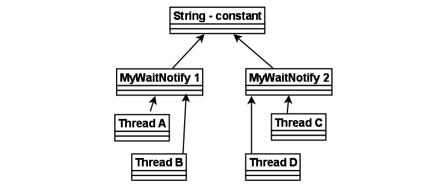

描述了线程与线程之间的通信方式，这里主要讲的是通过信号的方式，wait、notify、notifyAll，以及与之相关的极端情况。值得阅读。

The purpose of thread signaling is to enable threads to send signals to each other. Additionally, thread signaling enables threads to wait for signals from other threads. For instance, a thread B might wait for a signal from thread A indicating that data is ready to be processed.

**1. Signaling via Shared Objects**
A simple way for threads to send signals to each other is by setting the signal values in some shared object variable. Thread A may set the boolean member variable hasDataToProcess to true from inside a synchronized block, and thread B may read the hasDataToProcess member variable, also inside a synchronized block. Here is a simple example of an object that can hold such a signal, and provide methods to set and check it:

```java
public class MySignal{    
    protected boolean hasDataToProcess = false;    
    public synchronized boolean hasDataToProcess(){     
        return this.hasDataToProcess;   
    }    
    public synchronized void setHasDataToProcess(boolean hasData){     
        this.hasDataToProcess = hasData;     
    }  
}
```

Thread A and B must have a reference to a shared MySignal instance for the signaling to work. If thread A and B has references to different MySignal instance, they will not detect each others signals. The data to be processed can be located in a shared buffer separate from the MySignal instance.

**2. Busy Wait**
Thread B which is to process the data is waiting for data to become available for processing. In other words, it is waiting for a signal from thread A which causes `hasDataToProcess()` to return true. Here is the loop that thread B is running in, while waiting for this signal:

```java
protected MySignal sharedSignal = ...  ...  
while(!sharedSignal.hasDataToProcess()){   
    //do nothing... busy waiting 
}
```

Notice how the while loop keeps executing until hasDataToProcess() returns true. This is called busy waiting. The thread is busy while waiting.

**3. wait(), notify() and notifyAll()**
Busy waiting is not a very efficient utilization of the CPU in the computer running the waiting thread, except if the average waiting time is very small. Else, it would be smarter if the waiting thread could somehow sleep or become inactive until it receives the signal it is waiting for.
Java has a builtin wait mechanism that enable threads to become inactive while waiting for signals. The class java.lang.Object defines three methods, wait(), notify(), and notifyAll(), to facilitate this.
A thread that calls wait() on any object becomes inactive until another thread calls notify() on that object. In order to call either wait() or notify the calling thread must first obtain the lock on that object. In other words, the calling thread must call wait() or notify() from inside a synchronized block. Here is a modified version of MySignal called MyWaitNotify that uses wait() and notify().

```java
public class MonitorObject{ 
}  
public class MyWaitNotify{    
	MonitorObject myMonitorObject = new MonitorObject();    
	public void doWait(){     
		synchronized(myMonitorObject){       
			try{         
				myMonitorObject.wait();       
			} catch(InterruptedException e){
				...
			}     
		}   
	}    
	public void doNotify(){     
		synchronized(myMonitorObject){      
        	myMonitorObject.notify();     
        }   
	}
}
```

The waiting thread would call doWait(), and the notifying thread would call doNotify(). When a thread calls notify() on an object, one of the threads waiting on that object are awakened and allowed to execute. There is also a notifyAll() method that will wake all threads waiting on a given object.
**As you can see both the waiting and notifying thread calls wait() and notify() from within a synchronized block. This is mandatory! A thread cannot call wait(), notify() or notifyAll() without holding the lock on the object the method is called on. If it does, an IllegalMonitorStateException is thrown.**
But, how is this possible? Wouldn't the waiting thread keep the lock on the monitor object (myMonitorObject) as long as it is executing inside a synchronized block? Will the waiting thread not block the notifying thread from ever entering the synchronized block in doNotify()? The answer is no. Once a thread calls wait() it releases the lock it holds on the monitor object. This allows other threads to call wait() or notify() too, since these methods must be called from inside a synchronized block.
Once a thread is awakened it cannot exit the wait() call until the thread calling notify() has left its synchronized block. In other words: The awakened thread must reobtain the lock on the monitor object before it can exit the wait() call, because the wait call is nested inside a synchronized block. If multiple threads are awakened using notifyAll() only one awakened thread at a time can exit the wait() method, since each thread must obtain the lock on the monitor object in turn before exiting wait().

**4. Missed Signals**
**如果某个对象obj上没有线程等待，如果在这个对象上调用obj.notfiy或者notifyAll，那么这个通知信号就会被丢弃。**这可能不是一个问题，但是在某些情况下，信号丢失导致等待的线程永远错过这个信号，永远不会被唤醒，因为notify信号已经被丢弃了。

为了避免提前发出的notify信号丢失的问题，导致后续进入waiting状态的线程永久不能被唤醒的情况，我们可以添加一个变量记录是否已经有notify信号被发出，这样即便发生了信号丢失问题，但是由于该变量可以反映出此前是否有notify信号发出过，后续进入waiting状态的线程仍然可以被唤醒。

看下面的示例程序：

```java
public class MyWaitNotify2{    
	MonitorObject myMonitorObject = new MonitorObject();   
	boolean wasSignalled = false;    
	public void doWait(){     
		synchronized(myMonitorObject){       
			if(!wasSignalled){         
				try{           
					myMonitorObject.wait();          
				} catch(InterruptedException e){
					...
				}       
			}       
			//clear signal and continue running.       
			wasSignalled = false;     
		}   
	}    
	public void doNotify(){     
		synchronized(myMonitorObject){       
			wasSignalled = true;       
			myMonitorObject.notify();     
		}   
	} 
}
```


**5. Spurious Wakeups**
**假唤醒，即一个处于waiting状态的线程，可能没有收到notify信号，自己却从wait方法中异常退出来了，被唤醒了，这种情况在某些处理器上偶尔会发生，因此我们通常使用一个spin lock来将wait括起来。下面这个示例程序中也说明了这一点。关于为什么假唤醒的具体原因，可能要在linux内核进程调度、线程调度、cpu中找寻答案了。**

> For inexplicable reasons it is possible for threads to wake up even if notify() and notifyAll() has not been called. This is known as spurious wakeups. Wakeups without any reason.
> If a spurious wakeup occurs in the MyWaitNofity2 class's doWait() method the waiting thread may continue processing without having received a proper signal to do so! This could cause serious problems in your application.
> To guard against spurious wakeups the signal member variable is checked inside a while loop instead of inside an if-statement. Such a while loop is also called a spin lock. The thread awakened spins around until the condition in the spin lock (while loop) becomes false. Here is a modified version of MyWaitNotify2 that shows this:

```java
public class MyWaitNotify3{
	MonitorObject myMonitorObject = new MonitorObject();
	boolean wasSignalled = false;
	public void doWait(){
		synchronized(myMonitorObject){
		while(!wasSignalled){
			try{
				myMonitorObject.wait();     
			} catch(InterruptedException e){
				...
			}
		}
		//clear signal and continue running.
		wasSignalled = false;
	}
    public void doNotify(){     
        synchronized(myMonitorObject){       
            wasSignalled = true;       
            myMonitorObject.notify();     
        }   
    } 
}
```

Notice how the wait() call is now nested inside a while loop instead of an if-statement. If the waiting thread wakes up without having received a signal, the wasSignalled member will still be false, and the while loop will execute once more, causing the awakened thread to go back to waiting.

**6. Multiple Threads Waiting for the Same Signals**
The while loop is also a nice solution if you have multiple threads waiting, which are all awakened using notifyAll(), but only one of them should be allowed to continue. Only one thread at a time will be able to obtain the lock on the monitor object, meaning only one thread can exit the wait() call and clear the wasSignalled flag. Once this thread then exits the synchronized block in the doWait() method, the other threads can exit the wait() call and check the wasSignalled member variable inside the while loop. However, this flag was cleared by the first thread waking up, so the rest of the awakened threads go back to waiting, until the next signal arrives.

Don't call wait() on constant String's or global objects
**不要在常量字符串上调用wait、不要在全局对象上调用wait**
An earlier version of this text had an edition of the MyWaitNotify example class which used a constant string ( "" ) as monitor object. Here is how that example looked:

```java
public class MyWaitNotify{
	String myMonitorObject = "";
	boolean wasSignalled = false;
	public void doWait(){
		synchronized(myMonitorObject){
			while(!wasSignalled){    
				try{
					myMonitorObject.wait();
				} catch(InterruptedException e){
					...
				}       
			}
			//clear signal and continue running.
			wasSignalled = false;
		}
	}
	public void doNotify(){
		synchronized(myMonitorObject){
			wasSignalled = true; 
			myMonitorObject.notify();
		}
	}
}
```

The problem with calling wait() and notify() on the empty string, or any other constant string is, that **the JVM/Compiler internally translates constant strings into the same object**. That means, that even if you have two different MyWaitNotify instances, they both reference the same empty string instance. This also means that threads calling doWait() on the first MyWaitNotify instance risk being awakened by doNotify() calls on the second MyWaitNotify instance.
**线程在第一个对象MyWaitNotify1上调用了dowait方法，但是却会被MyWaitNotify2.doNotify所唤醒。**
The situation is sketched in the diagram below:



Remember, that even if the 4 threads call wait() and notify() on the same shared string instance, the signals from the doWait() and doNotify() calls are stored individually in the two MyWaitNotify instances. A doNotify() call on the MyWaitNotify 1 may wake threads waiting in MyWaitNotify 2, but the signal will only be stored in MyWaitNotify 1.
At first this may not seem like a big problem. After all, if doNotify() is called on the second MyWaitNotify instance all that can really happen is that Thread A and B are awakened by mistake. This awakened thread (A or B) will check its signal in the while loop, and go back to waiting because doNotify() was not called on the first MyWaitNotify instance, in which they are waiting. This situation is equal to a provoked spurious wakeup. Thread A or B awakens without having been signaled. But the code can handle this, so the threads go back to waiting.	
The problem is, that since the doNotify() call only calls notify() and not notifyAll(), only one thread is awakened even if 4 threads are waiting on the same string instance (the empty string). So, if one of the threads A or B is awakened when really the signal was for C or D, the awakened thread (A or B) will check its signal, see that no signal was received, and go back to waiting. Neither C or D wakes up to check the signal they had actually received, so the signal is missed. This situation is equal to the missed signals problem described earlier. C and D were sent a signal but fail to respond to it.
If the doNotify() method had called notifyAll() instead of notify(), all waiting threads had been awakened and checked for signals in turn. Thread A and B would have gone back to waiting, but one of either C or D would have noticed the signal and left the doWait() method call. The other of C and D would go back to waiting, because the thread discovering the signal clears it on the way out of doWait().
You may be tempted then to always call notifyAll() instead notify(), but this is a bad idea performance wise. There is no reason to wake up all threads waiting when only one of them can respond to the signal.
So: Don't use global objects, string constants etc. for wait() / notify() mechanisms. Use an object that is unique to the construct using it. For instance, each MyWaitNotify3 (example from earlier sections) instance has its own MonitorObject instance rather than using the empty string for wait() / notify() calls.