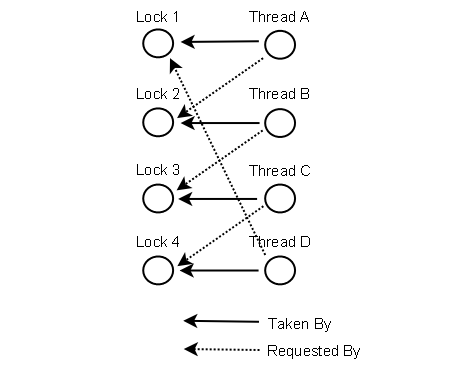

本文先总结了常见的几种导致deadlock的使用场景，然后进一步描述了阻止死锁的方法。

# DeadLock Cases

这里描述了死锁的案例：
1）两个线程申请同样的锁，但是**加锁顺序相反**，引发死锁；
2）多个线程申请的锁不同，但是他们**加锁的顺序构成了环形依赖**，引发死锁；
3）数据库事务中出现死锁；

## Thread Deadlock

A deadlock is when two or more threads are blocked waiting to obtain locks that some of the other threads in the deadlock are holding. **Deadlock can occur when multiple threads need the same locks, at the same time, but obtain them in different order.**
For instance, if thread 1 locks A, and tries to lock B, and thread 2 has already locked B, and tries to lock A, a deadlock arises. Thread 1 can never get B, and thread 2 can never get A. In addition, neither of them will ever know. They will remain blocked on each their object, A and B, forever. This situation is a deadlock.
The situation is illustrated below:

```bash
Thread 1  locks A, waits for B
Thread 2  locks B, waits for A
```

## More Complicated Deadlocks

Deadlock can also include more than two threads. This makes it harder to detect. Here is an example in which four threads have deadlocked:

```bash
Thread 1  locks A, waits for B
Thread 2  locks B, waits for C
Thread 3  locks C, waits for D
Thread 4  locks D, waits for A
```

## Database Deadlocks

A more complicated situation in which deadlocks can occur, is a database transaction. A database transaction may consist of many SQL update requests. When a record is updated during a transaction, that record is locked for updates from other transactions, until the first transaction completes. Each update request within the same transaction may therefore lock some records in the database.

If multiple transactions are running at the same time that need to update the same records, there is a risk of them ending up in a deadlock.

For example

```bash
Transaction 1, request 1, locks record 1 for update
Transaction 2, request 1, locks record 2 for update
Transaction 1, request 2, tries to lock record 2 for update.
Transaction 2, request 2, tries to lock record 1 for update.
```
**Since the locks are taken in different requests, and not all locks needed for a given transaction are known ahead of time, it is hard to detect or prevent deadlocks in database transactions.**

# Prevent DeadLock


**针对死锁的不同情形，提出了解决方案，解决方案1、2、3，应对的死锁场景，由简单到难。**

In some situations it is possible to prevent deadlocks. I'll describe three techniques in this text:

- [Lock Ordering](http://tutorials.jenkov.com/java-concurrency/deadlock-prevention.html#ordering)
- Lock Timeout](http://tutorials.jenkov.com/java-concurrency/deadlock-prevention.html#timeout)
-  [Deadlock Detection](http://tutorials.jenkov.com/java-concurrency/deadlock-prevention.html#detection)

## Lock Ordering

Deadlock occurs when multiple threads need the same locks but obtain them in different order.
If you make sure that all locks are always taken in the same order by any thread, deadlocks cannot occur. Look at this example:

```bash
Thread 1:
 lock A 
 lock B

Thread 2:
  wait for A
  lock C (when A locked)

Thread 3:
  wait for A
  wait for B
  wait for C
```
If a thread, like Thread 3, needs several locks, it must take them in the decided order. It cannot take a lock later in the sequence until it has obtained the earlier locks.

For instance, neither Thread 2 or Thread 3 can lock C until they have locked A first. Since Thread 1 holds lock A, Thread 2 and 3 must first wait until lock A is unlocked. Then they must succeed in locking A, before they can attempt to lock B or C.

Lock ordering is a simple yet effective deadlock prevention mechanism. However, it can only be used if you know about all locks needed ahead of taking any of the locks. This is not always the case.

## Lock Timeout

Another deadlock prevention mechanism is to put a timeout on lock attempts meaning a thread trying to obtain a lock will only try for so long before giving up. **If a thread does not succeed in taking all necessary locks within the given timeout, it will backup, free all locks taken, wait for a random amount of time and then retry**. The random amount of time waited serves to give other threads trying to take the same locks a chance to take all locks, and thus let the application continue running without locking.

Here is an example of two threads trying to take the same two locks in different order, where the threads back up and retry:

```bash
Thread 1 locks A
Thread 2 locks B

Thread 1 attempts to lock B but is blocked
Thread 2 attempts to lock A but is blocked

Thread 1's lock attempt on B times out
Thread 1 backs up and releases A as well
Thread 1 waits randomly (e.g. 257 millis) before retrying.

Thread 2's lock attempt on A times out
Thread 2 backs up and releases B as well
Thread 2 waits randomly (e.g. 43 millis) before retrying.
```
In the above example Thread 2 will retry taking the locks about 200 millis before Thread 1 and will therefore likely succeed at taking both locks. Thread 1 will then wait already trying to take lock A. When Thread 2 finishes, Thread 1 will be able to take both locks too (unless Thread 2 or another thread takes the locks in between).

An issue to keep in mind is, that just because a lock times out it does not necessarily mean that the threads had deadlocked. It could also just mean that the thread holding the lock (causing the other thread to time out) takes a long time to complete its task.

Additionally, if enough threads compete for the same resources they still risk trying to take the threads at the same time again and again, even if timing out and backing up. This may not occur with 2 threads each waiting between 0 and 500 millis before retrying, but with 10 or 20 threads the situation is different. Then the likeliness of two threads waiting the same time before retrying (or close enough to cause problems) is a lot higher.

A problem with the lock timeout mechanism is that it is not possible to set a timeout for entering a synchronized block in Java. You will have to create a custom lock class or use one of the Java 5 concurrency constructs in the java.util.concurrency package. Writing custom locks isn't difficult but it is outside the scope of this text. Later texts in the Java concurrency trails will cover custom locks.

## Deadlock Detection

Deadlock detection is a heavier deadlock prevention mechanism aimed at cases in which lock ordering isn't possible, and lock timeout isn't feasible.

Every time a thread **takes a lock** it is noted in a data structure (map, graph etc.) of threads and locks. Additionally, whenever a thread **requests** a lock this is also noted in this data structure.

**When a thread requests a lock but the request is denied, the thread can traverse the lock graph to check for deadlocks. For instance, if a Thread A requests lock 7 but lock 7 is held by Thread B, then Thread A can check if Thread B has requested any of the locks Thread A holds** (if any). If Thread B has requested so, a deadlock has occurred (Thread A having taken lock 1, requesting lock 7, Thread B having taken lock 7, requesting lock 1).
Of course a deadlock scenario may be a lot more complicated than two threads holding each others locks. Thread A may wait for Thread B, Thread B waits for Thread C, Thread C waits for Thread D, and Thread D waits for Thread A. In order for Thread A to detect a deadlock it must transitively examine all requested locks by Thread B. From Thread B's requested locks Thread A will get to Thread C, and then to Thread D, from which it finds one of the locks Thread A itself is holding. Then it knows a deadlock has occurred.

Below is a **graph of locks taken and requested by 4 threads** (A, B, C and D). A data structure like this that can be used to detect deadlocks.




So what do the threads do if a deadlock is detected?
**One possible action is to release all locks**, backup, wait a random amount of time and then retry. This is similar to the simpler lock timeout mechanism except threads only backup when a deadlock has actually occurred. Not just because their lock requests timed out. However, if a lot of threads are competing for the same locks they may repeatedly end up in a deadlock even if they back up and wait.
A better option is to determine or assign a priority of the threads so that only one (or a few) thread backs up. The rest of the threads continue taking the locks they need as if no deadlock had occurred. If the priority assigned to the threads is fixed, the same threads will always be given higher priority. To avoid this you may assign the priority randomly whenever a deadlock is detected.

