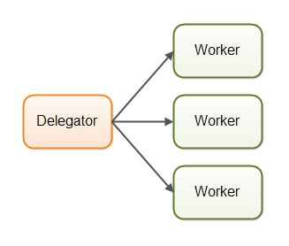
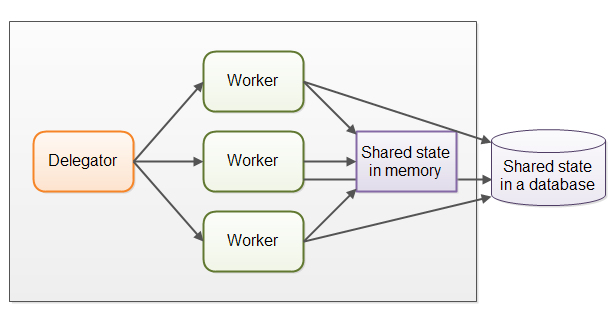
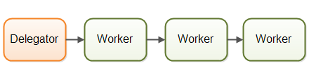
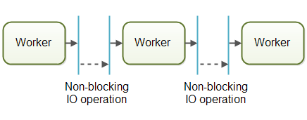
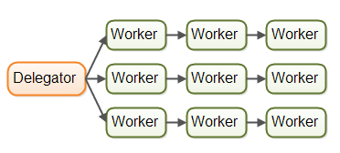
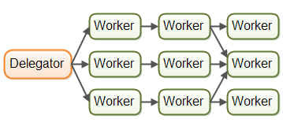
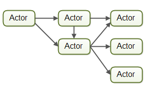
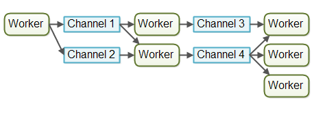

并发系统，可以用不同的并发模型来实现。一个并发模型，指明了系统中的线程如何进行协作来完成任务。不同的并发模型，划分任务的方式也是不同的，线程与线程之间的通信方式也是不同的。本教程将详细介绍截止2015年，业界比较流行的线程模型。

本文中介绍的不同的线程模型，与分布式系统中使用的不同架构类型，是有相似之处的。

在多线程模型中，不同的线程之间可以进行通信；在分布式系统中，运行在不同的主机上的进程之间可以进行通信。在本质上，线程跟进程好似非常相似的。这也是为什么，不同的线程模型，会与分布式系统中的不同的架构具有相似之处。

当然了，分布式系统还存在一些其他的挑战，例如网络失败，远程主机或者进程down掉了等等，但是在一个并发系统中，如果这个并发系统运行在一个比较大型的服务器上，也会遇到潜在的cpu失败，网络失败，磁盘失败等等问题，这些问题发生的可能性虽然比较低，但是理论上是存在的。
因为并发模型与分布式系统架构是相似的，因此它们可以相互借鉴。例如，在并发系统中，多个workers(threads)之间分配work的模型，与分布式系统中的负载均衡，是很相似的。除了这个，在作业日志、作业fail-over、作业幂等性设计等方面也由很多相似之处。

>幂等性：指的是应用程序多次调用服务，最终得到的结果与成功调用一次的结果是一样的。这里描述作业的幂等性设计，表示的是作业不会被重复进行处理。

下面开始介绍并发系统中常见的并发模型。

# 模型1：Parallel Workers

## 介绍

Parallel Workers（并行workers，与流水线workers相对）。第一个并发模型是“并行workers模型”。到达的作业，被分配给不同的workers进行处理。下图是对此并发模型的一个说明。

在“并行workers”并发模型中，作业派遣器，将到达的任务任务分配给不同的workers进行处理，每一个worker完成一个完整的作业。这些workers是并行工作的，对应着在不同的执行线程，可能这些不同的线程会运行在不同的cpu核心上，或者不同的cpu上，也可能是在同一个cpu的同一个核心上。

举个例子，将并行workers并发模型用于汽车制造厂中，就是每一辆汽车装配工作是一个作业，记为job，很多辆汽车被分配给不同的worker进行装配，每一个worker将完成从头至尾的所有的装配工作。当然，workers在装配的时候需要按照装配说明书来，这个说明书是大家共享的（后面将提到状态共享）。

这个模型是当前最常用的编程并发模型，java里面的JUC包中的工具，很多都是建立在这种模型之上的。在JavaEE应用服务器中，你也能够看到这种并行workers并发模型的影子。

## 优点

并行workers模式的优点是，易于理解，为了增强并发系统的并行处理能力，简单地增加worker的数量就可以了。

## 缺点

这种模型表面上看上去非常简单，但是这只是个假象，它有不少缺点，下面将介绍其最最明显的几个缺点。

### Shared State Can Get Complex

并行workers模型中，workers之间可能需要共享某些数据，这些数据可能是存储在内存中，也可能是存储在一个数据库中。下图显示了数据共享增加了该并发模型的复杂程度。该模型实际上并不像表面看上去那么容易实现。

这里的共享的状态，某些情况下可能是像作业队列一样的用于在不同的线程之间进行通信的某种数据结构，也有是类似于共享数据、数据缓存、数据库连接池之类的东西，等等吧，总之就是在多个线程之间可以共享的对象。

一旦在并行workers并发模型中，牵扯到了共享对象，那么问题就会变得复杂。必须保证某个线程对数据的修改，对于其他线程来说是可见的（就是说修改后的数据应该写回主存中，还不是只是将修改反应到执行线程的cpu中的寄存器中，或者cache中）。此外需要在线程之间避免出现竞态条件、死锁，以及其他的数据共享引发的并发问题。
当有多个线程要去竞争访问一个共享数据时，这些线程之间互相等待，它们之间的并行执行的特征就会出现部分丢失的情况，因为它们中的某些被阻塞了。许多并发数据结构都是阻塞型的，就是说在某个时刻，只允许一个或者几个线程对这部分数据结构进行访问，这就会导致数据竞争的出现。如果数据竞争比较严重，就可能会导致代码的串行化执行，这样才能保证对数据的共享访问。当然也失去了某些并行执行的特点，效率会下降。

现代的一些非阻塞并发算法，可以减少数据竞争，并增强性能，但是非阻塞算法是比较难以设计、实现。

Persistent data structure，可持久化的数据结构，是另一种替代方案。可持久化的数据结构，指的是，在对数据结构进行修改时，会自动保留数据结构修改之前的状态。因此如果多个线程正在访问相同的数据结构，其中的某个线程尝试修改它，这个修改数据的线程会获得一个指向新数据结构的指针，但是之前的版本是被保留下来了。所有其他的线程仍然访问的是旧版本的数据结构，这个数据结构的值仍然是以前的，因此称为持久化的数据结构。Scala编程中，提供了几个可持久化的数据结构。

尽管可持久化的数据结构看上去是一个解决并发修改问题的不错的解决方案，但是实际上它并不是真的“不错”。
例如，一个可持久化的链表，我们向其头部添加新元素，添加之后返回新添加的元素的指针，这个指针由于是指向头节点的，所以可以认为是指向链表的。当一个线程对其进行了添加操作之后，其他线程的指针变量指向的却是当前头节点下一个节点开始的链表，它们是看不到现在的新添加的头节点的。即一个线程的修改对其他线程不可见。我们希望其可见。

### Stateless Workers

共享数据，可以被并发系统中的其他线程修改，因此workers必须在是使用某个共享数据之前，重新读取这个共享数据的值，以确保线程使用的数据是最新的，不管数据是在内存中共享，还是在数据中共享，这都是应该做的。一个worker自身不能记录数据的状态（使用之前需要重新读取数据），因此称这里的worder是无状态的worker。带来的问题就是使用之前要读取，效率比较低，尤其是数据在外部数据库中进行存储的情况。

### Job Ordering is Nondeterministic

另一个缺点是作业执行的顺序、完成的顺序与作业提交的顺序是不一致的。没有办法保证哪一个作业限制性，哪一个作业后执行。例如作业B比A提交的早，但是作业B可能被A处理的晚。由于无法预测那个作业先完成，哪个作业后完成，假定在多个作业存在明确的happen-before关系的情景下，就不能根据作业提交顺序来假定作业完成顺序。必须提供额外的措施来保证作业的先后关系，也就是在多个worker之间进行同步。

# 模型2：Assembly Line

## 介绍

Assembly Line（流水线模型，相对于并行workers模型）

第二个并发模型就是流水线模型，这是我的惯用叫法，主要是为了与前面的并行workers模型进行更加鲜明的对比。其他开发人员可能会使用其他术语，例如被动式系统（reactive systems）或者事件驱动的系统（event driven systems），可能与平台有关系。下面是一张图简要的描述了流水线workers并发模型。

这里的workers被组织成类似于企业内的流水线的方式，每一个worker都负责一个完整任务中的某一个部分，当这个部分被完成之后，这个worker将当前剩下的任务继续传递给下一个worker进行处理。每一个worker都是运行在自己的线程空间中，并且，与其他worker线程之间不存在状态的共享。这种模型也常常被称作是不共享的并发模型。

使用了流水线并发模型的系统，通常被设计成使用非阻塞IO的。非阻塞IO，就是说当一个worker启动IO操作的时候，IO操作因为涉及到IO设备与CPU速度不匹配的问题，如果不释放CPU，就会造成对计算资源的浪费。CPU此时做下一个线程的计算任务。当正在进行IO的线程执行完了IO操作之后，那么就可以将当前线程正在处理的对象传递给下一个worker进行处理。通过使用非阻塞IO，IO操作决定了两个workers线程在线程调度时，线程之间的边界。

现实情况下，作业可能不在同一个单一的数据流中进行处理，有可能是多个数据流。一个作业是从几个并行的workers继续向流向下面的workers。现实情况下，可能有多个流水线，或者多个虚拟的流水线，对同一个类型的作业进行处理。

作业在并发处理过程中，可能被传递给不止一个worker。例如，一个作业可能会被传递给一个executor，同时还传递给一个logger进行处理。下面这张图展示了3个流水线，最上面的流水线、最下面的流水线最终汇聚到中间的一条流水线中，在最上面的、最下面的流水线中，我们也看到了第二个worker将作业同时传递给了不同的worker。

真实情况下的流水线可能比这里的描述要更加复杂。

下面是几个属于流水线模型大范畴之内的模型。

## Reactive, Event Driven Systems

使用了流水线并发模型的系统也常常被称作是被动系统，或者事件驱动的系统。系统中的workers对系统中发生的时间进行响应，这里的事件可以是发生在整个世界中的，也可以是由workers发出的。举一个事件的例子，比如接收到一个HTTP请求，或者完成了将一个文件装载到内存的操作。

在写这个教程的时候，已经出现了许多有趣的事件驱动的脚手架，将来会有更多。一些比较流行的有：

- [Vert.x](http://tutorials.jenkov.com/vert.x/index.html)
- Akka
- Node.JS (JavaScript)

个人以为，这里的Vert.x是比较有意思的（特别是对于一个像我这样的做Java/JVM开发的恐龙来说）。

## Actors vs. Channels

Actors模型(参与者模型），Channel模型（通道模型），这2种模型是与流水线模型（或者被动模型/事件驱动模型）相似的一种模型。

在参与者模型中，每一个worker被称作是actor。actors可以直接在它们之间发送消息。消息的发送和处理可以被异步执行。如前所述，actors可以被用于实现一个或者多个作业处理的流水线。下图展示了actor模型。

在通道模型里面，workers不会在彼此之间直接进行通信。它们将消息或者事件推送到不同的channel（通道），然后其他的workers监听channel上的消息到达事件，发送消息的worker不知道是哪一个worker正在监听channel，也不关心后续的处理动作，只是负责将消息发送到channel就可以了。下图展示了channels模型。

截止到写这个教程的时候，在我看来，channel模型可能更加灵活。一个worker不需要关心流水线中的后续的worker何时处理消息、如何处理消息，它只需要知道应该将消息发送到哪一个通道就可以了。监听（JMS Server中的topic的订阅/分发）通道消息到达事件的worker可以取出消息并对其进行处理，然后可以继续将消息传递给后续的通道，并由其他的worker继续进行其他处理。通过这里的通道，降低了workers之间的耦合。

### 优点

**1）No Shared State**
workers之间不存在共享状态的事实，意味着workers的实现不需要考虑因为访问共享状态引起的各种问题。这使得workers的实现相当简单，实现worker的时候，就好像它是一个单线程程序一样。

**2）Stateful Workers**
这里的stateful、stateless与其翻译成有状态的、无状态的，不如翻译成状态稳定的、状态不稳定的，更加容易理解。

在流水线模型中，因为workers知道，不会有其他线程来修改它们正在访问的数据，因此workers都是有状态的。说它有状态，指的是，这些workers可以将它们正在访问的数据保存在内存中，或者写会外部存储中，而在修改、读取、存储的过程中不会涉及到无状态workers需要的额外的同步措施，因此其速度是更快的。

**3）Better Hardware Conformity**
单线程的代码，有一个优势，就是它与底层硬件的工作更加具有一致性。
首先，你可以创建一个优化的数据结构和算法，你可以假定代码在这个数据结构中，或者运行这个算法时，执行在一个单线程模式。

另一点，单线程的有状态的workers能够将数据缓存在内存中，缓存在内存中的数据也可能会被缓存在cpu的cache中，这样数据访问速度有所提升。
Mechanial Sympathy，指的是代码的编写遵从硬件的工作方式，即代码的编写与硬件运行方式协同的意思，我将其称之为硬件一致性，有些开发人员将其称之为硬件协同。不管作者为什么使用这个术语了，自己喜欢哪个用哪个就可以了。

**4）Job Ordering is Possible**
流水线模型可以用于实现一个作业按序处理的并发模型。作业有序，使得我们在指定时刻可以更加合理地推断系统的状态。而且，你可以将所有到达的作业写到日志里面。在系统出现某些故障、崩溃的时候，这些日志可以被使用，用于重建系统之前的健康状态。这些作业相关的日志，可以按照特定的顺序进行写入，这个顺序就是作业被按序处理的顺序。下图是一个通过channel并发模型实现的一个示例。

保证作业序列，并不是那么简单的，但是也是可能的。如果你可以，你可以很大程度上简化一些任务，例如备份、还原数据、复制数据等，这些任务都是通过日志来完成的。

### 缺点

流水线模型的主要缺点是一个作业的执行，是被分散到多个workers中去的，就好像你的一个项目中包含了很多的类一样。因此，当作业被执行的时候，不容易定位哪些代码正在被执行。

写代码也是比较麻烦的。worker的代码，有时被写成是回调函数，代码中嵌套的回调函数太多之后，会严重影响可读性，被开发人员称之为回调地域。回调地域，意味着不仅仅可读性差，当你希望跟踪代码的时候，也是比较困难的。

并行workers模型在写代码的时候要简单一些、跟踪代码的时候也比较简单一些。你可以打开worker代码，从头到尾地阅读，回调地域却要跳来跳去的读，影响可读性。当然了，并行workers模型的代码也会涉及到很多的类，但是代码的可读性、跟踪代码的执行，是比流水线模型要简单很多的。

# 模型3：Functional Parrallelism

## 介绍

功能并行是第3个讨论最多的并发模型。

功能并行的基本思想是，将程序划分成多个不同的功能模块，通过功能模块调用的形式来实现某些具体的处理操作。功能模块可以被看作是agents或者actors，它们之间可以互相发送消息，就像是流水线模型一样，流水线模型也就是指的被动模型或者事件驱动的模型。当一个功能模块调用另一个的时候，就类似于消息的发送。
传递给功能模块的参数值，在功能模块内部得到的实际上是传递的参数值的拷贝，所以接收参数的模块之外，不存在能够操作数据的其他模块。这里的值传递主要是为了避免数据的竞态条件的发生。这使得模块内代码的执行非常像是一个原子类型的操作，每一个模块调用可以被独立地执行。

当每一个模块调用都可以独立执行的时候，每一个模块就可以被分配到不同的cpu上去执行，那就意味着，如果一个算法包含了多个模块，这些不同的模块就可以并行地在多个cpu上执行。

在Java 7里面，我们看到，JUC包中引入了ForkAndJoinPool，它能帮助我们实现功能并行的类似程序。在Java 8里面，有了并行流，可以帮助实现对大集合的并行的迭代。需要注意的是，有些开发人员对ForkAndJoinPool提出了质疑和批评。

功能并行的最困难的部分，在于如何判断出那些功能模块可以并行，那些功能模块不可以并行。在多个cpu之间协调模块的调用会引入额外的开销。因此，为了获得最佳性能，一个work的某个部分，加入被分配给一个功能模块执行，这个功能模块完成的这部分工作，与协调cpu调度相比，应该利大于弊才有功能并行的价值。否则没有必要将程序通过功能并行来实现，那样的话，浪费时间，效果还不一定好。

我的理解是，可以通过使用被动模型、事件驱动模型来获得一个类似于基于功能并行模型建立的并发处理系统。通过事件驱动模型，你可以获得更多的控制，比如什么需要并行，并行度怎么样等等。这是个人理解。

备注：在大型网站架构、网游等等服务器架构设计中，基本上都会采用这种事件驱动的架构设计，例如采用各种消息队列来实现削峰，实现异步处理等等。
此外，将一个任务进行划分，并分配到多个cpu上进行处理，协调多个cpu工作的代价也需要考虑。

# 结语：哪个并发模型更好？

那么，哪一个并发模型更好呢？这个要根据你的使用场景来看。

- 如果系统要处理的作业天然地具有并行的特征，天然是独立的，不可能存在共享状态的问题，那么就可以使用并行workers这个并发模型来实现你的并发系统。
- 很多作业，并不是天然就具有并行的特征的，不是相互独立的。这种情况下，系统使用基于流水线的并发模型来实现你的并发系统就更加合适。

其实，没有必要来自己写代码实现完整的流水线模型，现代的很多平台，例如Vert.x已经为你实现了很多了，大家可以根据情况自己加以选择。