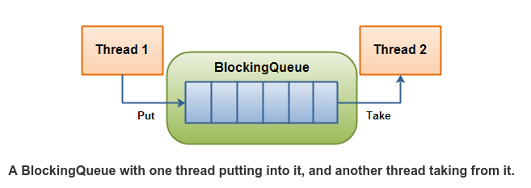

阻塞队列，具有这样的操作特性：
- 如果队列当前为空，线程试图在队列上执行dequeue操作，该线程会阻塞；
- 如果队列当前已满，线程试图在队列上执行enqueue操作，该线程也会阻塞。

在java 5中的juc包中引入了BlockingQueue的实现，虽然没必要自己实现，但是了解一下其实现的原理和细节，还是有必要的。

线程操作BlockingQueue的示意图如下所示：



下面来看下BlockingQueue的实现代码，比较简单：

```java
public class BlockingQueue {
	
	private List queue = new LinkedList();		// 阻塞队列底层存储
	private int  limit = 10;					// 设定阻塞队列容量
	
	public BlockingQueue(int limit){
		this.limit = limit;
	}
	
	public synchronized void enqueue(Object item)  throws InterruptedException  {
		// 队列满时执行入队操作，线程需要等待
		while(this.queue.size() == this.limit) {
			wait();
		}
		// 入队后队列不再为空，需要唤醒因为出队操作处于等待状态的线程
		if(this.queue.size() == 0) {
			this.queue.add(item);
			notifyAll();
			return;
		}
		this.queue.add(item);
	}

	public synchronized Object dequeue()  throws InterruptedException{
		// 队列为空时执行出队操作，线程需要等待
		while(this.queue.size() == 0){
			wait();
		}
		// 出队后队列有空位，需要唤醒因为入队操作处于等待状态的线程
		if(this.queue.size() == this.limit){
			Object obj = this.queue.remove(0);
			notifyAll();
			return obj;
		}
		return this.queue.remove(0);
	}
}
```

注意一下，只有queue.size()==limit或者0的时候，才会执行notifyAll操作，因为只有这两种情况下才会出现阻塞的情况。之前作者在写这个示例的时候，其代码有问题，我对其进行了修改，上面展示的代码是我修改之后的代码。