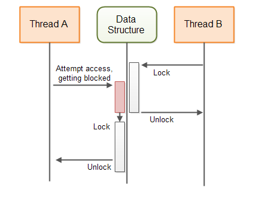
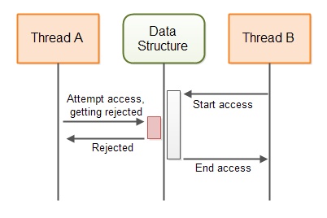

并行上下文中的无锁算法，可以让多个线程在访问共享资源的时候，或者同步协作、通信的时候，不需要阻塞线程。为了更好的理解阻塞并行算法、非阻塞并行算法之间的区别，下面依次对其进行解释。

# Blocking Concurrency Algorithms

一个阻塞算法，指的是这样的算法，算法中可能执行如下2种类型的动作：

A：某个线程请求执行一个动作；
B：为了保证程序的正确、安全执行，需要阻塞一些其他线程，直到A中的动作顺利完成。

有很多算法和并发数据结构，都是阻塞的。例如，juc包中的BlockingQueue接口的不同实现都是阻塞型的数据结构。如果一个线程正往BlockingQueue中插入一个数据，这个队列没有剩余空间的话，插入动作就会被阻塞，直到这个队列有剩余空间容纳新元素。

如下这幅图，展示了一个阻塞算法对共享数据结构的保护行为i：



# Non-blocking Concurrency Algorithms

一个非阻塞并行算法，指的是这样的算法，算法中可能执行如下动作：

A：一个线程请求执行某个动作；
B：通知A中请求执行动作的线程，当前请求的操作无法完成。

java中也包含了一些非阻塞的数据结构，例如AtomicBoolean、AtomicInteger、AtomicLong和AtomicReference等，这些都是非阻塞数据结构的例子。

下图展示了非阻塞算法对共享数据结构的保护行为：



# Non-blocking vs Blocking Algorithms

非阻塞算法与阻塞算法之间的主要区别，在于前面描述的算法行为中的第2条。就是说，它们的区别在于，当某个线程发起的请求不能被执行时算法的行为将如何。阻塞算法将会阻塞其他相关线程，非阻塞算法只是拒绝操作，发送一个操作失败通知。

# Non-blocking Concurrent Data Structures

在一个多线程系统中，线程之间的通信通常是由线程间共享的数据结构来协调的，这些共享的数据结构从简单的普通变量类型，到复杂的像queue、map、stack的数据结构，都有。为了能够使多个线程能够正确地访问数据结构，这些数据结构必须通过合适的并发算法、并发数据结构来加以访问控制、保护。

- 如果一个保护并发数据结构的算法是阻塞的，该算法就是阻塞算法，数据结构就是阻塞的并发数据结构；
- 如果一个保护并发数据结构的算法是非阻塞的，该算法就是非阻塞算法，数据结构就是非阻塞的并发数据结构。

每一种并发数据结构，都有特定的适用的线程通信场景。使用哪一种并发数据结构，可以根据线程间通信的需要进行选择。后面部分，我将介绍非阻塞并发数据结构，并解释它们适用的场景。通过对非阻塞数据结构工作原理的解释，可以帮助你对非阻塞数据结构的设计、实现有一个比较好的理解。

# Volatile Variables

volatile变量可以保证共享变量修改时的线程可见性、阻止指令重排序问题。volatile变量是非阻塞的“数据结构”，volatile变量的写操作是一个原子操作，是不能被中断的，但是volatile变量的read-update-write操作序列不是原子的。因此，多线程操作场景下volatile变量的read-update-write操作序列会导致出现竞态条件。

Java中的volatile变量，每次使用的时候都是从内存中重新读取的，当向一个volatile变量赋值的时候，这个变量的值会立即被写会内存（利用cpu的lock），这个能够确保修改后的变量值，能够立即对运行在其他cpu或者核心上的线程可见，cpu lock指令使得其他cpu的cache失效，并重新从内存中读取数据，这样运行在其他cpu上的线程就会获得内存中的新值，而不是cache中的旧值。这样volatile保证了对变量修改时，对其他线程的可见性。

> 对于C、C++程序而言，gcc开-O2优化时volatile可以阻止编译器对volatile变量的优化，保证每次读取时都直接读取内存中的值，而非CPU cache中的值，这样也就保证了volatile变量的线程可见性。

```java
volatile myVar = 0;
...
int temp = myVar;
temp++;
myVar = temp;
```

First the value of the volatile variable myVar is read from main memory into a temp variable. Then the temp variable is incremented by 1. Then the value of the temp variable is assigned to the volatile myVar variable which means it will be written back to main memory.

首先从主存读取volatile变量myVar的值到temp中，然后temp+1，再将temp的值赋值给myVar重新将值写回主存。如果两个线程并发地执行上述代码，那么最终的结果可能并不是将myVar的值加了2，很可能只加了1。很多人觉得我们应该不会写上面这么挫的代码，真的吗？上述代码等效于`myVar++`，现在还敢说写出的代码一定没问题么？！！

当上述代码执行时，myVar的值被加载到CPU寄存器或者CPU cache中，然后+1，然后CPU寄存器或者cache中的值被重新写回主存。考虑如下两种情景：

**1）The Single Writer Case**

某些情况下只有一个线程会更新共享变量的值、多个线程读取共享变量的值。当只有一个线程执行更新动作时，不管有多少个线程会读取，这种是不会出现竞态条件的，这种情况下直接使用一个volatile变量就足够了！

当有多个线程对共享变量执行read-update-write操作序列的时候会出现竞态条件，如果只有一个线程执行read-update-write操作序列，其他线程都执行read操作的话，也不会出现竞态条件。

Here is a single writer counter which does not use synchronization but is still concurrent:

```java
public class SingleWriterCounter {
	private volatile long count = 0;
	/**
	 * Only one thread may ever call this method,
	 * or it will lead to race conditions.
	 */
	public void inc() {
		this.count++;
	}
	/**
	 * Many reading threads may call this method
	 * @return
	 */
	public long count() {
		return this.count;
	}
}
```


多个线程可以访问相同的counter对象实例，只要保证只有一个线程执行inc()即可，不是说在时刻t只有一个线程执行inc()，是说永远只有一个线程执行inc()，可以有多个线程同时执行count()，这不会出现竞态条件。

 **2）More Advanced Data Structures Based on Volatile Variables**

通过组合多个volatile变量可以创建新的数据结构，其中每个volatile变量保证只有一个线程会对其执行更新动作，但是可以被多个线程读取。通过这样的数据结构，可以实现非阻塞的线程间通信。

Here is a simple double writer counter class that shows how that could look:

```java
public class DoubleWriterCounter {
	private volatile long countA = 0;
	private volatile long countB = 0;
	/**
	 * Only one (and the same from there on) thread may ever call this method,
	 * or it will lead to race conditions.
	 */
	public void incA() {
		this.countA++;
	}
	/**
	 * Only one (and the same from thereon) thread may ever call this method,
	 * or it will lead to race conditions.
	 */
	public void incB() {
		this.countB++;
	}
	/**
	 * Many reading threads may call this method
	 */
	public long countA() {
		return this.countA;
	}
	/**
	 * Many reading threads may call this method
	 */
	public long countB() {
		return this.countB;
	}
}
```

这个DoubleWriterCounter包括两个volatile变量，分别有一对inc()、count()方法，每个volatile变量都只会有一个线程对其执行inc()操作，但是可以有多个线程执行count()方法。这种也不会导致竞态条件的出现。DoubleWriterCounter可以用于两个线程之间的非阻塞通信，这两个count()方法可以用来表示生产、消费的task数量。

The smart reader will recognize that you could have achieved the effect of the DoubleWriterCounter by using two SingleWriterCounter instances. You could even have used more threads andSingleWriterCounter instances if you needed to.

# Optimistic Locking With CAS

使用Compare and Swap（底层是利用cpu的CAS指令支持，同时jvm中增加了数据版本解决cpu中CAS指令的ABA问题），来实现乐观锁，这是一种乐观的同步策略。

比如AtomicInteger.incrementAndGet()操作不停地尝试将当前值+1，但是有可能被拒绝，更新失败，此时会在whilie循环里面一直重CAS操作，直到成功。这种使用spinlock而非synchronized的方式，不会致使欲更新状态的线程出现阻塞现象。

如果有不止一个线程会写同一个共享变量，使用volatile变量是不够的，你需要一些其他的排他性手段来对共享变量进行保护，下面是一个示例：

```java
public class SynchronizedCounter {
	long count = 0;
	
	public void inc() {
		synchronized(this) {
			count++;
		}
	}
	public long count() {
		synchronized(this) {
			return this.count;
		}
	}
}
```

上面我们使用了synchronized来保证线程的排他性访问，但是synchronized是重量级锁，会导致线程阻塞，线程阻塞、唤醒开销都比较大，所以可以优化下，比如使用atomic变量来实现。

```java
import java.util.concurrent.atomic.AtomicLong;

public class AtomicCounter {
	private AtomicLong count = new AtomicLong(0);
	
	public void inc() {
		boolean updated = false;
		// 一直尝试cas，直到成功
		while(!updated){
			long prevCount = this.count.get();
			updated = this.count.compareAndSet(prevCount, prevCount + 1);
		}
	}
	public long count() {
		return this.count.get();
	}
}
```

但是inc()方法中while() {}代码块中的count.get()以及count.compareAndSet()操作序列并不是原子的，意味着假如有两个不同的线程并发执行，很可能他们count.get()返回的值是相同的，并在此基础上分别执行count.compareAndSet()，但是只有一个会成功，另一个会失败，因此并不存在什么竞态条件。

这里的原因在于，count.compareAndSet()方法是原子操作，它将count的当前值与期望值进行比较，如果二者相同，则认为count从上次读取之后没有被其他线程修改过，认为可以更新，这个时候会将其修改为一个新的值。这里的compareAndSet()方法是有CPU指令的CAS直接提供了支持的，因此是不需要同步的，也不需要线程挂起，这节省了线程挂起、唤醒的开销。

**1）Why is it Called Optimistic Locking?**

前面示例中的代码常成为“**乐观锁**”，乐观锁与**传统的锁实现（悲观锁）**不同，悲观锁往往是通过synchronized block或者其他类型的lock实现来对共享内存进行排他性访问，悲观锁会导致线程挂起。

乐观锁可以通过非阻塞的方式让多个线程来创建共享内存的一份拷贝，线程可以对各自的拷贝进行修改，然后尝试写会共享内存。如果没有其他线程对共享内存进行过修改，CAS操作允许线程无阻塞的方式对共享内存进行更新；如果已经有其他线程对共享内存进行了修改呢，线程将不得不重新获取共享内存的值，然后再次尝试CAS。

称之为乐观锁的原因，在于线程可以在它们相对共享内存变量进行修改时去读取一下数据的值，然后以一种乐观的方式去尝试修改共享内存的值，如果成功就成功，如果失败就返回失败，然后继续再次尝试。整个过程中是没有使用过锁的，线程也不会阻塞。

Optimistic locking tends to work best with low to medium contention on the shared memory. If the content is very high on the shared memory, threads will waste a lot of CPU cycles copying and modifying the shared memory only to fail writing the changes back to the shared memory. But, if you have a lot of content on shared memory, you should anyways consider redesigning your code to lower the contention.

**2）Optimistic Locking is Non-blocking**

The optimistic locking mechanism I have shown here is non-blocking. If a thread obtains a copy of the shared memory and gets blocked (for whatever reason) while trying to modify it, no other threads are blocked from accessing the shared memory.

With a traditional lock / unlock paradigm, when a thread locks a lock - that lock remains locked for all other threads until the thread owning the lock unlocks it again. If the thread that locked the lock is blocked somewhere else, that lock remains locked for a very long time - maybe even indefinitely.

# Non-swappable Data Structures

The simple compare-and-swap optimistic locking works for shared data structures where the whole data structure can be swapped (exchanged) with a new data structure in a single compare-and-swap operation. Swapping the whole data structure with a modified copy may not always be possible or feasible, though.

Imagine if the shared data structure is a queue. Each thread trying to either insert or take elements from the queue would have to copy the whole queue and make the desired modifications to the copy. This could be achieved via an AtomicReference. Copy the reference, copy and modify the queue, and try to swap the reference pointed to in the AtomicReference to the newly created queue.

However, a big data structure may require a lot of memory and CPU cycles to copy. This will make your application spend a lot more memory, and waste a lot of time on the copying. This will impact the performance of your application, especially if contention on the data structure is high. Furthermore, the longer time it takes for a thread to copy and modify the data structure, the bigger the probability is that some other thread will have modified the data structure in between. As you know, if another thread has modified the shared data structure since it was copied, all other threads have to restart their copy-modify operations. This will increase the impact on performance and memory consumption even more.

The next section will explain a method to implement non-blocking data structures which can be updated concurrently, not just copied and modified.

# Sharing Intended Modifications

Instead of copying and modifying the whole shared data structure, a thread can share its intended modification of the shared data structure. The process for a thread wanting to make a modification to the shared data structure then becomes:

- Check if another thread has submitted an intended modification to the data structure.
- If no other thread has submitted an intended modification, create an intended modification (represented by an object) and submit that intended modification to the data structure (using a compare-and-swap operation).
- Carry out the modification of the shared data structure.
- Remove the reference to the intended modification to signal to other threads that the intended modification has been carried out.

As you can see, the second step can block other threads from submitting an intended modification. Thus, the second step effectively works as a lock of the shared data structure. If one thread successfully submits an intended modification, no other thread can submit an intended modification until the first intended modification is carried out.

If a thread submits an intended modification and then gets blocked doing some other work, the shared data structure is effectively locked. The shared data structure does not directly block the other threads using the data structure. The other threads can detect that they cannot submit an intended modification and decide to something else. Obviously, we need to fix that.

# Completable Intended Modifications

To avoid that a submitted intended modification can lock the shared data structure, a submitted intended modification object must contain enough information for another thread to complete the modification. Thus, if the thread submitting the intended modification never completes the modification, another thread can complete the modification on its behalf, and keep the shared data structure available for other threads to use.

Here is a diagram illustrating the blueprint of the above described non-blocking algorithm:

The modifications must be carried out as one or more compare-and-swap operations. Thus, if two threads try to complete the intended modification, only one thread will be able to carry out any of the compare-and-swap operations. As soon as a compare-and-swap operation has been completed, further attempts to complete that compare-and-swap operation will fail.

# The A-B-A Problem

The above illustrated algorithm can suffer from the A-B-A problem. The A-B-A problem refers to the situation where a variable is changed from A to B and then back to A again. For another thread it is thus not possible to detect that the variable was indeed changed.

If thread A checks for ongoing updates, copies data and is suspended by the thread scheduler, a thread B may be able to access the shared data structure in the meanwhile. If thread B performs a full update of the data structure, and removes its intended modification, it will look to thread A as if no modification has taken place since it copied the data structure. However, a modification did take place. When thread A continues to perform its update based on its now out-of-date copy of the data structure, the data structure will have thread B's modification undone.

The following diagram illustrates A-B-A problem from the above situation:

#  A-B-A Solutions

A common solution to the A-B-A problem is to not just swap a pointer to an intended modification object, but to combine the pointer with a counter, and swap pointer + counter using a single compare-and-swap operation. This is possible in languages that support pointers like C and C++. Thus, even if the current modification pointer is set back to point to "no ongoing modification", the counter part of the pointer + counter will have been incremented, making the update visible to other threads.

In Java you cannot merge a reference and a counter together into a single variable. Instead Java provides the

**AtomicStampedReference** class which can swap a reference and a stamp atomically using a compare-and-swap operation.

# A Non-blocking Algorithm Template

Below is a code template intended to give you an idea about how non-blocking algorithms are implemented. The template is based on the descriptions given earlier in this tutorial.

NOTE: I am not an expert in non-blocking algorithms, so the template below probably has some errors. Do not base your own non-blocking algorithm implementation on my template. The template is only intended to give you an idea of how the code for a non-blocking algorithm could look. If you want to implement your own non-blocking algorithms, study some real, working non-blocking algorithm implementations first, to learn more about how they are implemented in practice.

```java
import java.util.concurrent.atomic.AtomicBoolean;
import java.util.concurrent.atomic.AtomicStampedReference;

public class NonblockingTemplate {

	public static class IntendedModification {
        public AtomicBoolean completed = new AtomicBoolean(false);
    }
    
    private AtomicStampedReference <IntendedModification> ongoingMod 
        = new AtomicStampedReference <IntendedModification> (null, 0);
    
    //declare the state of the data structure here.
    public void modify() {
        while (!attemptModifyASR())
            ;
    }
    
    public boolean attemptModifyASR() {
    
        boolean modified = false;
    
        IntendedModification currentlyOngoingMod = ongoingMod.getReference();
        int stamp = ongoingMod.getStamp();
    
        if (currentlyOngoingMod == null) {
            //copy data structure state - for use
            //in intended modification
            //prepare intended modification
            IntendedModification newMod = new IntendedModification();
            boolean modSubmitted = ongoingMod.compareAndSet(null, newMod, stamp, stamp + 1);
    
            if (modSubmitted) {
                //complete modification via a series of compare-and-swap operations.
                //note: other threads may assist in completing the compare-and-swap
                // operations, so some CAS may fail
                modified = true;
            }
        } else {
            //attempt to complete ongoing modification, so the data structure is freed up
            //to allow access from this thread.
            modified = false;
        }
    
        return modified;
    }
}
```
# Non-blocking Algorithms are Difficult to Implement

Non-blocking algorithms are hard to design and implement correctly. Before attempting to implement your own non-blocking algorithms, see if there is not someone who has already developed a non-blocking algorithm for your needs.

Java already comes with a few non-blocking implementations (e.g. ConcurrentLinkedQueue) and will most likely get more non-blocking algorithm implementations in future Java versions.

In addition to Java's built-in non-blocking data structures there are also some open source non-blocking data structures you can use. For instance, the LMAX Disrupter (a queue-like data structure), and the non-blocking HashMap from Cliff Click. See my Java concurrency references page for links to more resources.

# The Benefit of Non-blocking Algorithms

There are several benefits of non-blocking algorithms compared to blocking algorithms. This section will describe these benefits.

## Choice

The first benefit of non-blocking algorithms is, that threads are given a choice about what to do when their requested action cannot be performed. Instead of just being blocked, the request thread has a choice about what to do. Sometimes there is nothing a thread can do. In that case it can choose to block or wait itself, thus freeing up the CPU for other tasks. But at least the requesting thread is given a choice.

On a single CPU system perhaps it makes sense to suspend a thread that cannot perform a desired action, and let other threads which can perform their work run on the CPU. But even on a single CPU system blocking algorithms may lead to problems like deadlock, starvation and other concurrency problems.

## No Deadlocks

The second benefit of non-blocking algorithms is, that the suspension of one thread cannot lead to the suspension of other threads. This means that deadlock cannot occur. Two threads cannot be blocked waiting for each other to release a lock they want. Since threads are not blocked when they cannot perform their requested action, they cannot be blocked waiting for each other. Non-blocking algorithms may still result in live lock, where two threads keep attempting some action, but keep being told that it is not possible (because of the actions of the other thread).

## No Thread Suspension

Suspending and reactivating a thread is costly. Yes, the costs of suspension and reactivation has gone down over time as operating systems and thread libraries become more efficient. However, there is still a high price to pay for thread suspension and reactivation.

Whenever a thread is blocked it is suspended, thus incurring the overhead of thread suspension and reactivation. Since threads are not suspended by non-blocking algorithms, this overhead does not occur. This means that the CPUs can potentially spend more time performing actual business logic instead of context switching.

On a multi CPU system blocking algorithms can have more significant impact on the overall performance. A thread running on CPU A can be blocked waiting for a thread running on CPU B. This lowers the level of parallelism the application is capable of achieving. Of course, CPU A could just schedule another thread to run, but suspending and activating threads (context switches) are expensive. The less threads need to be suspended the better.

## Reduced Thread Latency

Latency in this context means the time between a requested action becomes possible and the thread actually performs it. Since threads are not suspended in non-blocking algorithms they do not have to pay the expensive, slow reactivation overhead. That means that when a requested action becomes possible threads can respond faster and thus reduce their response latency.

The non-blocking algorithms often obtain the lower latency by busy-waiting until the requested action becomes possible. Of course, in a system with high thread contention on the non-blocking data structure, CPUs may end up burning a lot of cycles during these busy waits. This is a thing to keep in mind. Non-blocking algorithms may not be the best if your data structure has high thread contention. However, there are often ways do redesign your application to have less thread contention.
