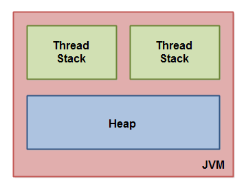
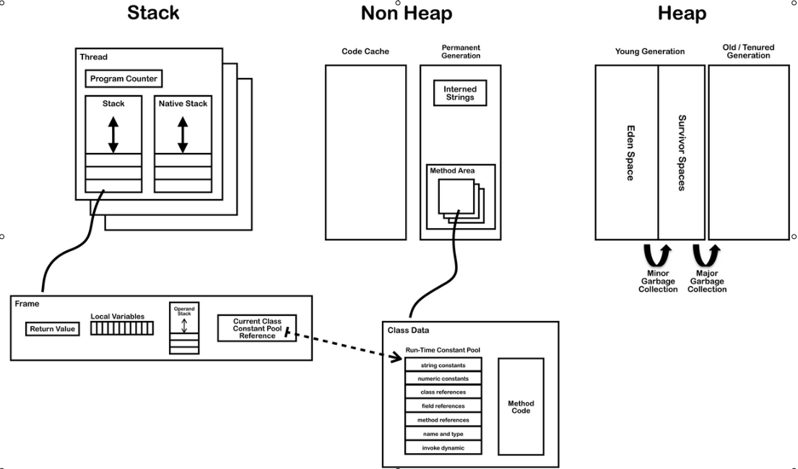
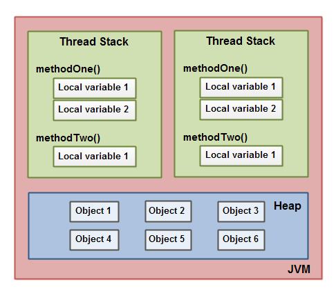
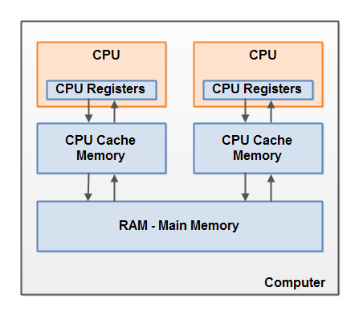
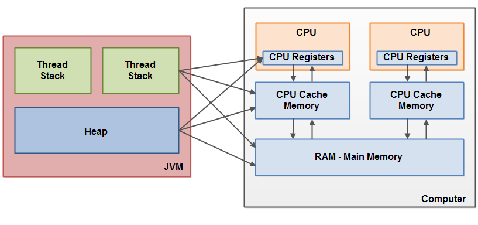
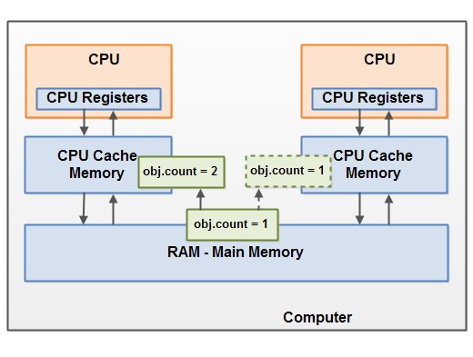

java内存模型指明了java虚拟机如何与计算机内存ram进行协同工作，java虚拟机是整个计算机系统的模型，所以java虚拟机这个模型包含了一个内存模型，也就是java内存模型。

如果你要设计一个可以正确运行的可靠的并发程序，了解java内存模型是非常重要的。java内存模型指明了，不同的线程如何看到、什么时候看到被其他线程修改后的共享变量的新值，以及如何在必要的时候对共享变量的访问进行同步。

# The Internal Java Memory Model

java内存模型将jvm中使用的内存空间分成了两部分，线程共享的堆区、线程私有的栈区。

## JMM内存分区简图

下图展示了java内存模型对内存的分区情况：



## JMM内存分区详图

这里描述的内存分区不是特别完整，更加详细的分区情况如下图所示：



注意深入理解jvm一书中，对内存分区的描述实际上并不准确，这里我重新对java内存模型对内存的分区进行一下描述。

## 线程共享的内存区

### 堆区

堆区为了更好的进行垃圾回收，将其分为两部分，新生代、老年代。新生代、老年代的垃圾回收，是分别进行的，新生代的垃圾回收发生的比较频繁，我们称之为minior gc，老年代的垃圾回收发生的不应该那么频繁，其代价也比较高，我们称之为full gc，或者major gc。

为了更好的进行minor gc，需要对新生代进一步进行细分，可以细分为1个eden区、2个survivor区，这3个区的大小比例为8:1:1，每次对象的创建都是在eden区中进行创建。当eden区空间不足以分配一个对象的时候，就会触发minor gc，即首先将当前存放对象的eden区、survivor区中的对象进行GC Roots链可达性分析，存活下来的对象将被复制（复制算法）到另一个survivor区中进行存储，其他对象占用的内存空间会释放（复制算法，eden+1个survivor被一次释放，这是对Mark-Sweep标记清除算法的改进）。

关于垃圾回收算法，后面再进行详细描述，这里不再说了。

### 非堆区

非堆区内存可以细分为code cache、永久代。永久代中又包括了interned字符串、方法区。
线程私有的部分包括：

- 虚拟机栈，在hotspot虚拟机中，将虚拟机栈和本地方法栈合二为一了。
- 本地方法栈
- 程序计数器，每个线程都有自己的程序计数器，指示线程要执行的下一条指令地址。实际上每个线程上下文中，都记录了自己寄存器状态信息。

### JMM内存分区详解

jvm中运行的每一个线程都有自己的线程栈，称为虚拟机栈。这个虚拟机栈中记录了线程的当前执行点所经历的方法调用调用信息，我们称这里的调用信息为调用栈。当线程执行代码的时候，调用栈会发生某些改变。

线程栈中也包含了每个被执行的方法的局部变量信息。一个线程只可以访问自己的线程栈空间。线程中创建的局部变量对其他线程是不可见的。即使两个线程执行相同的代码，线程创建的局部变量也是在自己的私有的栈空间中创建的。因此，每一个线程都有自己的局部变量版本。

所有的基本类型的局部变量，都是完全存储在线程栈中的，因此对其他因此肯定是不可见的。一个线程可能传递一个基本类型变量的值拷贝，传递给另一个线程，但是不能共享。

堆区中包含了java程序中创建的所有的对象，不管是哪个线程创建的对象，都是在堆区中进行存储。这包括了基本数据类型的wrapper版本，即对应的对象版本，例如int对应的Integer。

下图说明了线程栈中的调用栈和局部变量的情况，还有堆区中对象的存储：



下面对数据在堆、栈上的存储，针对不同情况进行一下说明：

- 一个局部变量，如果是基本数据类型，它一定是在线程栈上存储的；
- 一个局部变量，可能是一个引用类型的变量，它指向了一个对象，这个对象是在堆上存储的，但是这个引用变量，因为是局部变量，所以也是在线程栈上存储的；
- 一个对象，包含了方法信息，如果在方法中包含了局部变量，这些局部变量的创建是在线程执行对应的方法的时候，在栈上创建的；

	> 同一个类的不同对象，每个对象都拥有数据成员的专属副本，而对于方法，所有的对象共用同一副本，怎么做到的呢？这要考虑jvm中对象在内存中的定位方式，hotspot使用的是通过**直接指针**进行定位，每个引用变量直接记录了对象在堆区中的内存位置，可以直接定位到对象，对象中又包含了一个指针，指向类对象Class在方法区中的位置，从而可以通过这个指针直接定位到在类中定义的成员方法，通过这种方式，所有对象共用同一方法副本。

- 一个对象的成员变量，不管该成员变量是什么类型，都是与对象一起都是存储在堆区中的。
- 静态类变量，指的是对象中被static修饰的成员变量，这些成员变量也是存储在堆区中的，但是是与类定义放置在一块的，也就是说是存储在永久代中的。
- 堆区中的对象，如果可以被多个线程访问，这个对象中的成员变量是在堆区中进行存储，前面已经提到过了，但是当多个线程访问这个对象的成员变量时，会在自己的线程中创建该成员变量的专属拷贝。其具体实现是通过java内存模型中指定的几个基本操作来完成的：
  - read操作，从内存中读取指定的对象的成员变量临时存储，比如临时存储到cpu寄存器中或者cache中；
  - load操作，将临时存储的成员变量的值加载到当前线程的线程栈中的对应成员变量中，完成成员变量值拷贝过程；
  - use操作，在使用对象的成员变量的值的时候，使用的是线程栈中的上述拷贝，而不是内存中对象的成员变量本身。当执行赋值操作，例如obj.member = 1;的时候，需要将1写回堆区中的对象，也需要通过几个基本操作来完成的：
  - assign操作，将1写入线程栈中的成员变量的拷贝中；
  - store操作，将线程栈中的成员变量的值临时存储，例如写回寄存器或者cache；
  - write操作，将临时存储的值写回堆区中对应的对象中，完成一个完整的赋值操作；

# Hardware Memory Architecture

现代的内存硬件架构，与java内存模型是有区别的，为了更好地理解java内存模型如何与内存硬件架构协同工作，有必要对内存硬件架构进行适当的了解。下面我们将描述当今比较常用的内存硬件架构，以及java内存模型如何与之协同工作。

## 内存硬件架构

下图描述了一个简化版的内存硬件架构：



现代计算机一般有2个或者多个cpu，有些cpu可能包含了多个核心。拥有多个核心或者多个cpu的计算机系统中，可以并行地执行多个线程。如果只有一个cpu并且只有一个核心，也可以并发地执行多个线程。总之，多核心多cpu给了我们执行多线程程序的能力。

> 通过线程粘滞，还可以为线程指派执行它的cpu，详细信息、实现方式，请参考github中的相关repo，我学习过的一个是，[https://github.com/peter-lawrey/Java-Thread-Affinity.git]https://github.com/peter-lawrey/Java-Thread-Affinity)，感兴趣地可以学习一下。

每一个cpu都包含了一系列的寄存器，这些寄存器就是cpu的片上存储设备，一个是寄存器本身是由D触发器实现的（组成原理中有说明，相对于电容实现的DRAM有巨大的速度优势），一个是片内总线通信速度就是快，比通过系统总线访问存储器快太多。最终结果就是cpu访问寄存器的速度要比访问内存快几个数量级。

每一个cpu还包含了cpu缓存，即cache，cache充当了在内存和cpu寄存器之间的缓冲设备，也是通过D触发器实现的，但是通信方式不是通过片内总线，通信速度稍微低了些，其速度要逊于cpu内部的寄存器。现代cpu包含的cache层，尺寸可能大小不同，有2mb的、3mb的、5mb、7mb的等。cpu访问cache的速度比内存快，但是比寄存器慢。所以，cache主要是充当一个缓冲，利用局部性原理等等，将可能更频繁访问的数据、指令进行缓存，让cpu高速读取。cpu缓存又可以细分为1级、2级、3级缓存。

典型地，当cpu读取内存中数据的时候，首先将其加载到cache中，然后通过cache加载到cpu寄存器中，然后再执行读取的指令或者对读取的数据进行运算；当cpu需要将结果写回内存的时候，它首先将内部寄存器中的结果flush到cache中，然后将cache中的结果写会内存。

为了保证多个cpu中的cache的同步，又包括了多种cache同步算法，这里就不做过多描述了。需要了解的是，**intel的cpu是典型的强一致的cpu，在性能卓越的前提下，还能保证cache一致性**。基于java内存模型，在很多其他类型cpu中可能发生的很多问题，在intel的cpu上都不会发生，比如volatile保证线程可见性的问题，即便没有volatile修饰，intel cpu下也可以保证线程可见性。

# 连接JMM与内存硬件架构

前面曾提及，java内存模型与内存硬件架构之间存在不同，什么不同呢？内存的硬件架构不能够对线程栈和堆进行区分，在硬件层面，线程栈和堆区都是存储在内存中的，线程栈和堆的一部分有时也会出现在cpu的cache中，或者出现在cpu的寄存器中，结合下图理解。



当对象和变量，在计算机的不同存储区域中进行了存储之后，问题就来了，主要的问题是：
- 线程对共享变量的更新操作（写操作），对其他线程的可见性
- 当多个线程读取、检查、写入共享变量时，可能引发竞态条件

下面对这两个问题，分别进行描述。

## Visibility of Shared Objects

Visibility of Shared Objects（共享变量的可见性），如果两个或者多个线程共享相同的对象，如果没有合适的使用volatile或者synchronization的话，一个线程对共享变量的更新操作，可能对其他线程是不可见的。考虑非intel强一致性cpu场景下，我们要写跨平台的代码，所以这个问题必须要理解透彻。

想象一下如下情形，一个共享对象，它存储在内存中，一个正在运行的线程读取了这个共享对象的信息，并将其加载到了cpu cache中。然后它对这个共享对象的信息进行了修改，只要这个cpu cache中的对象信息不被写会内存，对共享对象的修改，对运行在其他cpu上的其他线程而言，是不可见的。原因就是每个cpu有自己的cache，每个运行其他线程的cpu在自己的cache里面都有共享对象的一份专属拷贝。
下图给出了这种情况的一个粗糙的示例。运行在左边cpu上的一个线程拷贝共享对象的信息到了自己的cpu cache中，然后将对象的值从1修改为2。这个线程对共享对象的修改只在左边cpu cache中体现，对右边cpu上运行的线程不可见，右边的cpu cache中对象的值仍然是1。



为了解决这个问题，即对共享变量修改的可见性问题，可以使用java中的volatile关键字。volatile关键字修饰的变量，可以确保这个变量始终是从内存中读取，在被更新的时候，也是立即写回主存。

volatile如何实现这点的呢？volatile本质上是通过cpu的内存屏障来实现的！对一个volatile变量的写操作，cpu会给出一个lock指令，该指令使得当前cpu立即将cache中的信息写入内存中，并通过某种机制通知其他cpu，使其cache失效，并重新读取内存中的信息。

volatile变量除了保证共享变量修改对其线程的可见性之外，还能够禁止指令重排序。例如：

```java
volatile int a = 1;
b=1;
a=2;
c=3;
```

每一条高级语言语句都可能对应了多条机器指令，volatile变量能够阻止cpu对机器指令进行排序，使得a=2这条语句对应的机器指令，一定是出现在b=1对应的所有指令之后，出现在c=3对应的所有指令之前。

**但是intel的cpu是强一致的cpu，在不使用volatile的时候，也可以保证可见性。但是为了兼容性，我们写程序的时候应该使用volatile或者其他同步措施，真正地实现“一次编译、到处运行”的愿景**。

除了使用volatile可以保证可见性之外，还可以通过synchronized、final来实现，synchronized能实现可见性的原因与volatile一样，都是利用了cpu的内存屏障。synchronized修饰的方法或者代码块，会在方法中代码块或者代码块的起始位置插入两条指令，即monitorenter、monitorexit。monitor的底层实现还是基于锁的，因此会涉及到jvm的lock操作、unlock操作，一个线程的unlock操作与另一个线程的lock操作之间形成了一个内存屏障，unlock线程之前的所有修改，对lock线程都是可见的。

> 关于内存屏障相关的详细内容，可以参考jvm、wiki等。

## Race Conditions

Race Conditions（竞态条件），如果两个或者多个线程共享同一个对象，并且不止一个线程对共享对象中的变量进行更新操作，竞态条件就发生了。

设想一下，如果线程a读取了一个共享对象中的成员变量count的值，将其读取到了cpu的cache中，再设想一下，线程b此时也做了相同的事情，将count读取到了另一个cpu的cache中。现在线程a对count执行了+1操作，线程b也执行了+1操作。那么现在这个ocunt变量就会被各+1一次，分别将结果记录在各自cpu的cache中。

如果这些线程按照顺序执行的话，那么变量count的值就会被增加2，内存中的变量值也会是+2之后的。然而，如果这两次+1操作是并发执行的，没有进行适当的同步。不管是a、b中的哪一个线程将+1后的结果写会了主存，其结果都是+1，而不是+2。

下面这张图展示了上面描述的竞态条件问题：


为了解决上面的问题，有人会说为什么不使用volatile变量，使得对count的修改对其他线程立即可见不就完了吗？count++或者count+=1都不是原子性操作，即便volatile确保了对其他线程可见，但是仍然是错误的。从这里也可以看出，volatile只是确保了一个线程对共享变量的修改对其他线程立即可见，但是不能够保证线程安全，如果要实现线程安全，必要的同步措施还是要做的。

这里为了解决上面的问题，我们可以使用一个java中的synchronized代码块。一个同步块，保证了在一个时刻只允许有一个线程进入临界区，同步块，也保证了临界区中的变量会从主存中重新读取。为什么会重新读取呢？前面我们提到volatile、synchronized、final可以实现可见性。synchronized创建了一个monitorenter、monitorexit包围起来的块，这个块本质上也是利用了lock指令使得synchronized中对数据的更新操作，对其他线程立即可见，但是这里的lock指令出现的位置比较隐蔽，需要仔细阅读汇编代码才可以，即monitorexit的时候会有一个跳转指令，后续指令中有lock，大致上是这样的，对细节感兴趣的话，可以自己挖掘。

可以通过如下命令对java程序强制以编译方式运行：
```bash
/usr/java/jdk1.7.0_71/bin/java -Xcomp -XX:+UnlockDiagnosticVMOptions -XX:+PrintAssembly -XX:PrintAssemblyOptions=att $YourJavaMainClassName &> asm.log
```
然后就可以阅读相关的汇编指令了，这里需要安装一个反汇编的插件，hsdis-amd64.so，如何安装请自行google。

