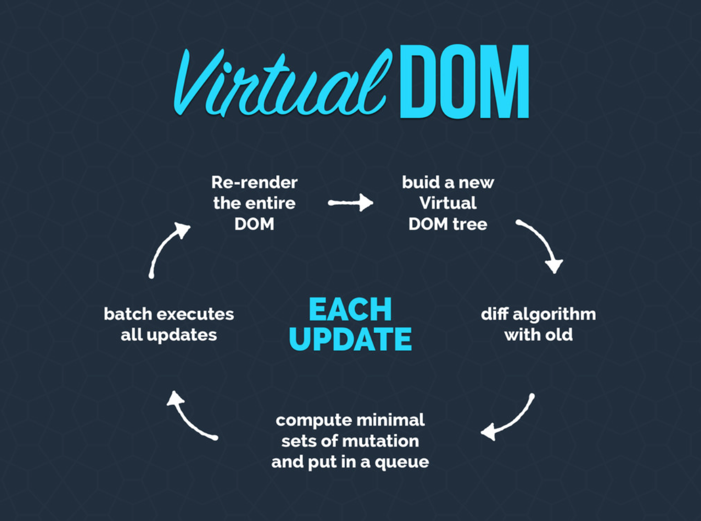

JavaScript速度很快，但是DOM渲染比较慢，如果页面更新，每次都全量渲染DOM tree的话就会比较慢，但是如果每次更新先计算一下到底哪些DOM元素需要更新，然后批量更新、渲染需要更新的元素，就可以大大提升渲染的效率。

下图是采用Virtual DOM技术时页面更新后的操作过程，页面更新之后，首先会将新的DOM tree与老的DOM tree做个比较，计算出需要更新的DOM元素差集，然后批量渲染这些待更新DOM元素，从而实现类似于完整渲染整棵DOM树的过程，效果相同，效率也有很大的提升。

